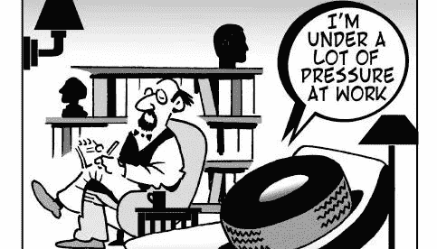

# 你压力太大了吗？！

> 原文：<https://medium.datadriveninvestor.com/are-you-under-too-much-pressure-579c5019bc89?source=collection_archive---------37----------------------->

## 别给自己太大压力了！

我总是给自己很大的压力，让自己在一份新工作或我做的任何事情上立刻成为一名摇滚明星。

这不是任何外部压力，我从来没有遇到过一个老板试图坚持让我在第一天就完成销售，或者让我觉得我就要离开了。

这是一种内在的压力，一种需要证明自己的感觉。

向公司证明他们雇用我的决定是正确的，向我的新老板证明我是一个好的选择，向自己证明这是我的正确选择。

## 工作压力

几乎我遇到过的所有老板都告诉我，他们在我身上“冒了一次险”。一方面，我在面试过程中展示了一些东西，告诉他们我*可能*拥有让我擅长这份工作的难以捉摸的因素，这真是太棒了。但另一方面，这也意味着他们对我有点不确定。因为他们一点都不确定，我觉得有一种不可阻挡的需要来证明我能够并且将会踢屁股在这份工作上。我会为你的公司赚钱。我会努力工作，聪明，有道德。我会让你意识到你雇佣我是多么正确。我现在就去做。

这件事一直困扰着我。我*有*来证明自己，证明老板们是对的！他们需要知道我会在第一周走进门，卖出一些东西，出去参加客户会议，了解当今的行业。

作为一名销售人员，这根本不是一件坏事。从很多方面来说，这是一件很棒的事情，因为在销售中，紧迫感是成功的重要因素。紧迫感是销售保持有趣的原因。当每天都有新的重要紧急请求或项目时，很难感到厌烦。销售是很多东西，但是不枯燥！

紧迫感对于销售来说就像羊毛衫对于罗杰斯先生一样重要。这是工作中最重要的部分之一！也许我脑海中的那个小小的声音告诉我，我现在需要卖掉所有的东西*是什么让我如此擅长我的工作，也是为什么销售成为我 10 年的职业。*

## *创业压力*

*而说到创业，这种内在压力就更大了。*

*我不断给自己施加压力，让自己获得更多的客户，做得更多，找到更多的收入来源，更有创造力，有更多的想法，做得更好。*

*作为一个企业家，每天踢屁股更是个人真实和必要的。*

*我给自己施加了很大的压力去赚更多的钱，尤其是。我的薪水很高，但远远低于我的丈夫，这一直是不安全感的来源，也是我要求自己做得更好的压力。不是因为我很在乎钱，而是因为我担心作为主要的养家糊口的人，他会感到负担和怨恨。*

*有时候压力是好的，因为它让我保持决心和雄心。*

*有时候这种压力是不好的。这会给我压力，让我不知所措。它实际上会 ***阻止*** 我达成目标或发挥创造力。*

## *如何停止*

*一旦我能够清楚地看到我真正给自己施加了多大的压力，以及它有时会如何对我产生负面影响，我就有意识地选择降低压力。*

*我开始提醒自己，如果我一个月少赚一点钱——*我们仍然会 100%没事。**

*然后，我开始梳理我目前实际的客户、任务和职责。事实证明，我基本上承担了所有与家务相关的工作和杂务，因为我对自己是低收入者没有安全感。我丈夫从来没有鼓励过我，也没有强迫过我这样做，这都是我自己的压力。*

*我和我的丈夫，我的生活伴侣谈过了。我解释了这种压力和决心，以及我强烈的压力感。他立刻向我保证他不会感到怨恨，然后开始列出他能做的家务。*

*当然，我非常欣赏他的话，但这并没有消除我个人的压力。然而，他们确实允许我说出我的感受，分享它们，并且有人支持和爱我。一个愿意承担一些任务的人！*

*在几个月的时间里，我每天都提醒自己压力不会有帮助，提醒自己我很好，休息几个小时也没关系，这一点开始被理解。*

*我不用全天候工作。*

*等到早上再回复邮件是可以的。*

*下午休息一下，走出家门也是可以的。*

*慢慢地但肯定地，它在帮助我。*

*压力可以是一件很棒的事情，但是过多的压力会让你瘫痪。*

*你给自己的压力太大了吗？*

*你在捡我放下的东西吗？查看我的故事和自由职业指南， [*“写。获得报酬。重复。”*](https://www.amazon.com/dp/B074LWW67Q) *把成吨的实用信息装进一本短小的书里！我还有一个全新的写作课程，叫做* [*“如何在 3 个月内写完一本书。”*](https://jyssicaschwartz.com/howtowriteabookin3months/)*