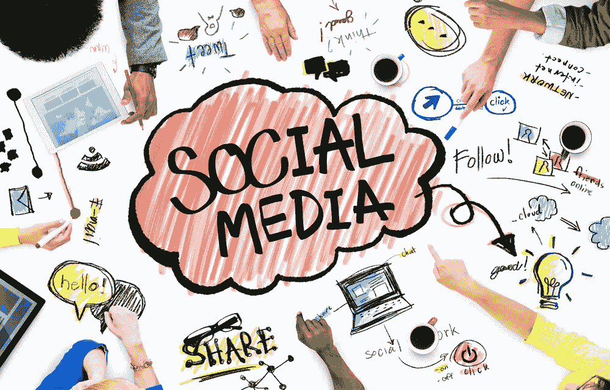
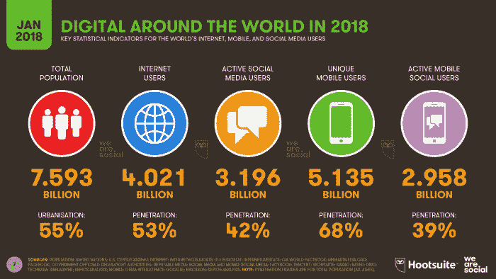

# 你在为你的企业使用最好的社交媒体吗？

> 原文：<https://medium.datadriveninvestor.com/are-you-using-the-best-social-media-for-your-business-7d9b6e16c3a2?source=collection_archive---------36----------------------->

First Published at [Okane Pay](https://okanepay.com)

社交媒体主宰世界！*好吧，也许我夸大其词了*，但是根据 smartinsights.com[的数据](https://www.smartinsights.com/social-media-marketing/social-media-strategy/new-global-social-media-research/)，全球 42%的人口每天都在使用社交媒体。这意味着您的大部分客户可以免费在线联系！

现在，虽然这些是一些强有力的工具，但如果用于错误的受众，它将达不到目的。

大多数成年人使用[脸书](https://www.google.com.br/url?sa=t&rct=j&q=&esrc=s&source=web&cd=1&cad=rja&uact=8&ved=2ahUKEwiz4afjs_TeAhUGDJAKHU6CDAUQFjAAegQIAxAC&url=https%3A%2F%2Fwww.facebook.com%2F&usg=AOvVaw2q27ov2cpCynr72DmuSqEz)和 [Youtube](https://www.youtube.com) ，而年轻人则热衷于 [Snap](https://www.snapchat.com) 和 [Insta](https://www.instagram.com) ！*但是为什么这很重要呢？*因为它会引导你根据自己的受众、服务和产品使用正确的社交媒体。

你想过吗？如果你有这篇文章，它可能不适合你，但如果你没有，请耐心等待，做好笔记。 ❤

在制作你自己的社交媒体鸡尾酒之前，你必须做的第一件事是:*确定你的形象*(你的领导，你的角色，你的观众)！你必须清楚地描述他们是谁，按年龄、性别、地区、文化、教育、经济条件等。

二、*你的产品(或服务)解决什么样的问题？它提供了什么样的解决方案？你的答案会告诉你你的受众在寻找什么，他们是谁。我知道这听起来是显而易见的，但是许多人并没有关注他们必须提供什么，他们的观众在寻找什么，以及在哪里故意找到这样的观众*。**

*没有经验的零售商到处摸黑，没有明确的信息和清晰的语言，希望找到愿意购买他们服务的人。但是，如果他们专注于用他们的语言，在他们最有可能去的地方，直接与他们的受众交流，他们在社交媒体上的营销努力就会取得更好的效果。*

**例如*，你为有蜘蛛静脉问题的人设计了一款医用矫形鞋垫。根据[芝加哥静脉研究所](https://www.chicagoveininstitute.com/varicose-vein-statistics/)，这意味着你的主要观众是 55%的女性，45%的男性和 4000 万 50 岁以上的美国人受其影响。你也许可以在所有的社交媒体平台上提供你的产品，但是你不会在所有的平台上都成功。例如，在 Snapchat 上提供带有浮华滤镜和霓虹字母的功能可能不适合你的产品，因为大多数用户都是没有蜘蛛静脉的青少年。你和脸书在一起会更好。*

> *人类会被快乐或痛苦所感动，一旦你明白你的产品在满足这两种需求中的任何一种时扮演了什么角色，你就可以决定如何以及在哪里做广告。*

*了解你的客户是谁以及他们到底在寻找什么*可以帮助你确定:**

**如何与他们交谈(语言和语气)**

**如何找到他们(位置)**

**如何接触他们(网络和渠道)**

**以及使用什么样的社交媒体！(营销工具)**

> ***“社交媒体以比几乎所有其他营销渠道更低的成本提供了定位能力、覆盖范围和规模。人们整天都在社交媒体上，每天都是如此——人在哪里，品牌就在哪里。”*——RBBcommunication s 首席数字官兼合伙人阿卜杜勒·穆罕默德(Abdul Muhammad)在此前的《商业新闻》每日采访中表示。**

**我选择了目前最受欢迎的 7 个社交媒体来帮助你开始自己的研究，并找到最适合你的业务。**

# ****脸书****

**这是最受欢迎的社交媒体，每月有[22.7 亿](https://www.omnicoreagency.com/facebook-statistics/)用户，450 万企业粉丝页面，17.4 亿移动用户和 14.7 亿桌面用户。*哇！即使在最近所有的丑闻之后，他们仍然保持在所有其他社交媒体的首位。***

**脸书对任何类型的商业来说都是一个很好的平台，因为它有一个 T21 目录，人们可以通过谷歌搜索(和其他引擎)找到你的页面，即使他们没有脸书的账户。人们在寻找信息、电话号码、地址、更新、商店营业时间等方面寻找粉丝页面。他们也开始喜欢这个页面来保持最新的和来自特定公司的新闻。**

**这个平台允许你发布照片、视频、链接等等。它让你可以通过脸书直播、直接信息和先进的付费广告工具进行互动，让你可以根据性别、年龄和地区选择你正在寻找的确切受众。**

**根据 Omnicoreagency.com 的数据，53%的脸书用户是女性，47%是男性。62%的在线老年人年龄在 65 岁以上，其中 72%的人年龄在 50 岁至 64 岁之间。18-29 岁的在线用户中有 88%在脸书，其中 84%在 30-49 岁之间。**

**这是一个相当平衡的社交媒体，这解释了为什么它适合所有类型的企业。**

**Ps: [34%的青少年](https://blog.hootsuite.com/facebook-demographics/)认为脸书是老年人的乐园。(lol)**

**[脸书商业](https://www.googleadservices.com/pagead/aclk?sa=L&ai=DChcSEwjF6cqLqvLeAhWGC5EKHfUzAFAYABAAGgJjZQ&ohost=www.google.com.br&cid=CAESEeD2_6WeXioz-vH2Cq-zKR18&sig=AOD64_05iufmJKwfVj4mjX7lxv-AODnIGQ&q=&ved=2ahUKEwjWvcWLqvLeAhXHhJAKHVGNCoAQ0Qx6BAgGEAE&adurl=)**

# ****推特****

**现在，这个平台是为了简短的更新，评论，公告，但最重要的是与你的追随者和客户直接互动。它允许你通过照片，视频，链接，直接信息，甚至进行投票来帮助你从你的观众那里得到反馈！哦，标签在 twitter 上是一件大事，它像磁铁一样吸引你正在寻找的#潜在客户！(使用正确的方法是关键。)**

**尽管你可以在这个平台上做广告，但大多数人是来互动的，而不仅仅是像脸书那样接收基本信息。在 Twitter 上，人们期待有趣的帖子、最新消息、引用、回复、喜欢、评论和关注者。这是一个了不起的客户服务平台！**

**在 twitter 上，你不能令人厌烦，它必须保持足够的趣味性和吸引力，以保持人们的互动和回访。我最近通过 BusinessNewsDaily.com 的页面看到了温迪的页面，看到一家快餐连锁店在推特上如此受欢迎，我感到震惊。原因是，他们像真人一样与客户互动，讲笑话，做有趣的评论，回答问题，不是作为公司本身，而是作为公司中的一个人。有道理吗？他们有近 300 万粉丝，非常有趣的推文，毫不犹豫地回复客户。*这是天才！温迪抓住了推特的全部意义。***

> **有时候，有些不适合你公司的东西，只要有一点点创意，你就可以把它变成可能！**

**根据 hootsuite.com 的数据，Twitter 拥有超过 3 . 3 亿活跃用户，男女各半，他们很可能是大学或大学学历的千禧一代。**

**[推特业务](https://business.twitter.com/?ref=gl-all-google-b-lf-ao&utm_source=&utm_medium=cpc&utm_campaign=always-on&gclid=Cj0KCQiAxNnfBRDwARIsAJlH29COfjJ3MP7a08x8DuQScgqkFS3p1GQuJg-L9PsOXq1jVpHFKcumE8EaAgf3EALw_wcB)**

# ****Instagram****

**Insta 是一个非常受欢迎的平台，主要专注于高质量的图像和视频，让您以艺术和有吸引力的方式推广服务和产品。这是一个可视化平台，需要创意和吸引人的内容，不一定最适合包含大量文本的公告和更新。然而，一旦你的平台变得受欢迎，有足够多的追随者做所有这些事情可能是好的。**

> **Instagram 是关于时尚、旅游、美食的，有趣的是，它展示了许多自助页面，有引用和积极的内容！还有更多…**

**这个社交媒体让你可以直播，成为社交和吸引新粉丝的绝佳平台。你也可以根据地区通过 Instagram 广告推广你的帖子，接触到你的完美受众。**

**根据 Omnicoreagency.com 的数据，Instagram 每月有 10 亿活跃用户，其中 59%年龄在 18 至 29 岁之间，33%年龄在 30 至 49 岁之间。80%来自美国，68%是女性。**

**[Instagram 业务](https://business.instagram.com)**

# ****领英****

**与这篇文章中提到的其他平台相比，这是一个更“传统”的平台，用于商业联系和网络，拥有超过 5.26 亿用户，其中 56%是男性，44%是女性，70%的用户在美国境外运营。根据[Omnicoreagency.com](https://www.omnicoreagency.com/linkedin-statistics/)的数据，6100 万用户是高层影响者，4000 万用户拥有决策职位，13%是千禧一代。**

**LinkedIn 是一个通过网站和应用程序运营的商业和就业导向平台，主要用于职业网络，包括雇主发布工作和求职者发布简历。**

**每个简介都允许用户发布个人简历和传记，供平台上的联系人和企业网络使用。无论你是个人搜索网络还是企业搜索员工，你都可以与来自四面八方的人联系。LinkedIn 页面让个人和公司看起来合法而专业。**

**它允许您根据规格搜索人员。它还允许您发布文章、照片、视频等。**

**LinkedIn 适用于所有企业，就像脸书一样，即使你选择不使用这个平台进行互动，它也是一个很好的目录。**

**[林克宁商务](https://business.linkedin.com)**

# ****Youtube****

**这都是关于视频分享！视频是根据它获得的赞数和许多评论来评估的。这几乎是一个学习和复习的平台，你需要的任何东西都可以在 Youtube 上找到。我们这个时代的 Youtubers 必须努力提供好的内容。因此，除非你的公司准备好提供有益的内容，否则这可能不适合你。**

**然而，Youtube 广告对公司来说是一个很好的工具，因为它允许你的广告出现在受欢迎的视频和特定的受众身上！**

**根据 Omnicoreagency.com[的数据](https://www.omnicoreagency.com/youtube-statistics/)，每月有 19 亿 35 岁以上和 55 岁以上的用户观看视频，其中 62%是男性，80%在美国以外。**

**[YouTube 业务](https://www.youtube.com/channel/UCwzySbzUWiKqG84jOnbeB1w)**

# ****Pinterest****

**这主要是一种 DIY 类型的社交媒体。有几家公司在 Pinterest 上出售他们的服装和艺术品，然而，它主要关注的是那些创造自己的产品或教别人如何制作自己的产品的人。**

**至少可以说，这是一个拥有梦幻般图像的平台，无论你是在尝试发现新的食谱、家居创意、生活方式信息，还是尝试其他创意！Pinterest 是另一个像 Instagram 一样的视觉和艺术平台，你离开这些平台想要你看到的一切(lol)。如果您的公司符合上述任何一个类别，这将是您的绝佳平台！**

**Pinterest 拥有 2.5 亿月活跃用户，81%为女性，大多是平均年龄在 40 岁左右的千禧一代，50%的用户在美国。**

**[Pinterest 业务](https://business.pinterest.com/en)**

# ****Snapchat****

**这是一个多媒体信息平台。最独特和有趣的功能是，平台上共享的消息、图像和视频会消失，给用户一种更放松的感觉，而无需额外的专业知识。它有著名的狗过滤器和花冠，每天都有新的过滤器。Snap 新鲜，好玩，年轻。**

**这对于那些每天都有有趣内容要分享的公司来说是非常好的，例如，展示世界不同的地方和旅行的想法。也许你从事食品行业，想制作现在非常流行的食品视频。**

**Snapchat 让人们感觉更亲近和亲密，因为能够在行动发生时或在 24 小时内看到图像和视频。**

**[平台](https://www.omnicoreagency.com/snapchat-statistics/)月活跃用户超过 3 亿，34 岁以下占 71%，女性占 70%。**

**[Snapchat 业务](https://forbusiness.snapchat.com)**

****结论:****

**使用社交媒体作为营销工具的最大好处是，它允许你以多种形式免费联系你的受众，而且通常是没有任何麻烦的。当然，你可以付费广告来推广自己，但你也可以自己做，有机地征服你的地盘。**

> **社交媒体让您能够参与、提高知名度、销售、创造商机、维护与现有和潜在客户的关系，并围绕您的服务和产品创建一个强大的社区。最终，你的观众会成为你最好的营销人员，展示你最感兴趣的评论、喜欢和评论！**

**与合适的受众互动是最基本的。社交媒体可以点燃许多潜在的关系，从而在全球范围内产生忠实的客户。这篇文章中提到的所有平台都支持几十种不同的语言，如果你感兴趣，你不必局限于一个特定的地区，你可以通过将你的社交媒体营销与[加密货币](https://blog.winco.io/cryptocurrency-basics-put-simply/)区块链配对来利用这一点，你的[业务](https://blog.goodaudience.com/are-merchants-open-to-accepting-cryptocurrency-8f2a80fab53a)将立即成为一个全球市场。**

**有这么多的信息在那里，我希望这篇文章给你一些想法和工具，帮助你进行自己的研究，并找到人口统计数据，以帮助你使社会媒体对你有利！**

**请在评论中告诉我们你的想法，**

**[奥凯恩薪酬团队](https://okanepay.com)**

# **加入我们的社区:[脸书](https://www.facebook.com/OkanePay-199777494229807/)，[推特](https://twitter.com/OkanePay_)，&，[媒体](https://medium.com/@OkanePay)**

***免责声明:我们的团队努力为您带来加密货币市场的最佳内容，但这仅是我们的观点而非法律建议，可能与其他观点有所不同，因此请不要在没有完成您自己的研究以了解利润可能性和风险的不确定性之前做出任何决定。***