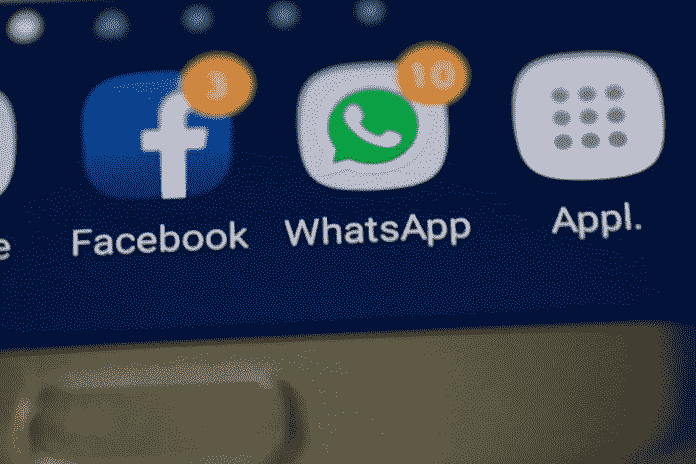

# 你是在转换成本上浪费时间吗？

> 原文：<https://medium.datadriveninvestor.com/are-you-wasting-your-time-on-switching-costs-6e1b12905db7?source=collection_archive---------10----------------------->

Picture Provided by Data Driven Investor

转换成本可能不是一个你熟悉的术语。第一次阅读这些单词可能不会给你哪怕是一丁点儿的理解。有些人会想到改变任何事情所需要的时间:换汽车保险，换房子(搬家)，换伴侣(分手，继续生活？)，等等。但是不，它与转换一个具体的事物没有真正的关系。转换成本与任务之间的转换有关:必须引导和重新引导你的注意力。

如果你读过《深度工作》(Deep Work)这本书，我对这本书不太感兴趣，因为其中一些例子非常矛盾，你可能知道什么是转换成本:它们是与不断不得不重新专注于一项任务相关的时间损失。是的，分心其实是有代价的。让我解释并举例说明:

想象你在工作。你正在为[客户](https://www.datadriveninvestor.com/glossary/client/)写一份报告。这是他们推出产品的基础市场研究。你以前已经写了很多次这种类型的报告，并且知道你并不真的需要所有的注意力来完成它和交付一个好的产品。然而，知道了这一点，你几乎会分心。你的电子邮件是打开的，你的电话是清晰的，你可以感觉到它在嗡嗡作响，或者看到它亮起来。最后，你会抓住几乎每一个分散注意力的机会。一个同事需要帮助？你当然会跳出来帮助他们。只有在完成之后，你才不得不把报告的大部分内容重新读一遍，以了解你已经做了什么，你还需要做什么，以及你最初在做什么！因为你分心了，所以在回到任务上浪费了很多时间。这个时间就是我们所说的转换成本。

 [## 摔倒不是失败。数据驱动的投资者

### 你只有在放弃的时候才会失败。每个英雄都会倒下，我们活着就是为了失败者出现的时刻；上升到…

www.datadriveninvestor.com](https://www.datadriveninvestor.com/2019/01/17/falling-isnt-failing/) 

当你没有完全集中注意力时，转换成本并不适用，因为你知道你不必如此。不，当你真的想要集中注意力，需要 100%的注意力，但又经常被同事、电子邮件、孩子、社交媒体或与生活相关的问题分散注意力时，它们也适用。不管你的精神状态如何，每一次让你把注意力从最初的任务上转移开，然后又不得不把注意力转移回任务上的分心，都被称为转换成本。相信我，分心的代价会很高。

Picture provided by Data Driven Investor

不相信我？让我以我自己为例，就像我写这篇文章一样。我应该能在一小时内写完这篇文章。但我能同时打开电子邮件和 WhatsApp 吗？坏主意。糟糕的主意。特别是如果我的笔记本电脑的音量达到了令人心烦意乱的水平，这意味着每次我听到“乒”的一声，我就会好奇这条信息是什么，思考这条信息会打断我的写作流程，最后甚至可能会检查信息并回复(我不是那种阅读和忽略类型的人)，然后不得不继续写作。

你可能会想:阅读和回复一条信息并不需要那么长时间。不，它没有。但在那之后，我必须重读我刚刚写的最后两三句话，希望仍然知道我在说什么，以及故事的其余部分应该如何发展。如果我这样做了，很好，我“只”浪费了大约 3 分钟的时间。如果我不这样做，那就不太好了，我会浪费至少 5 分钟的时间，如果我真的失去了情节的线索，可能会浪费更多的时间。所以我的转换成本是 5 分钟。

现在想象一下，我对收到的每个“ping”都这样做。不是吹牛，但说到“pings”的数量，我还是很受欢迎的。有很多分散注意力的事情在进行，如果我一小时收到 20 个“pings ”,这是我经常做的，那么这就相当于浪费了大约 60 分钟的时间，因为我在写这篇文章时被分散了注意力，每次都必须重新集中注意力。如果我集中注意力的话，这篇文章应该只花我一个小时，所以我花了双倍的时间来写这篇文章。这太疯狂了。

那么，如何逃避支付这些转换成本呢？通过不分心。这就是问题所在。因为一旦你有了网络连接，注意力分散就会显现出来。

如果你不需要网络，就关掉它。我在用 Word 写，不需要。如果你可以一个小时(或五个小时)不使用手机，把它调成静音，关掉它，或者甚至把它放在一个不同的房间。如果真的很紧急，他们会找到不同的方式联系你。

说到环境，你也可以做一些事情。一个人。有点反社会，但是很有效。你不能让周围的人问你问题，想要你的东西，或者只是用噪音分散你的注意力，或者仅仅是他们的存在。一旦所有这些条件都满足了，你应该能够 100%的付出，并且立刻完成！

有一点必须提到:转换成本不是你放弃一项任务，因为你只是因为疲劳、压力或其他精神或身体限制而无法集中精力。如果你停止工作是因为它毫无进展，似乎是浪费时间，那也没关系。如果你的工作效率不高，也没有紧急的截止日期，这可能是最好的选择。

莫尔·范·登·阿克是华威商学院行为科学专业的博士生。她研究了不同的支付方式，尤其是非接触式和移动支付方式，对我们管理个人财务的影响。在她的“空闲”时间里，她写了一些关于个人理财、行为科学、行为金融和博士生生活的文章，这些都发表在《金钱在头脑》上。通过 DDI，她撰写了关于个人和行为金融的文章，以确保学术界的知识流入主流，并能帮助尽可能多的人！

*原载于 2019 年 12 月 24 日*[*【https://www.datadriveninvestor.com】*](https://www.datadriveninvestor.com/2019/12/24/are-you-wasting-your-time-on-switching-costs/)*。*