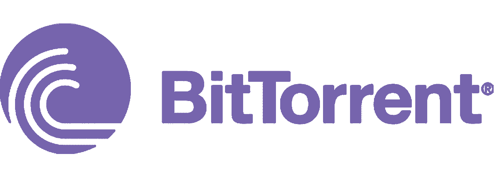
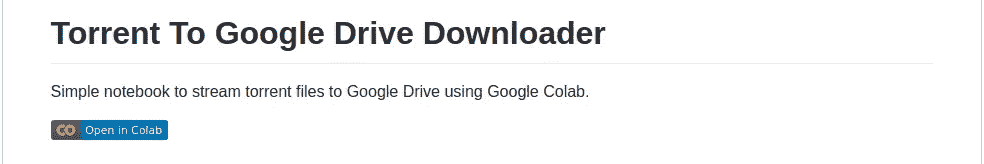
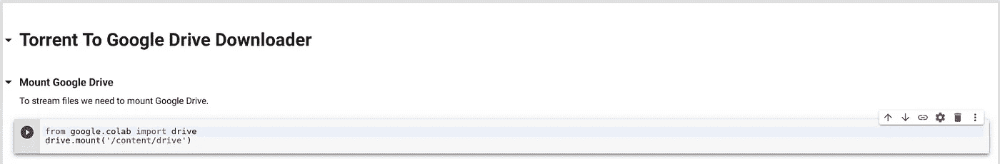
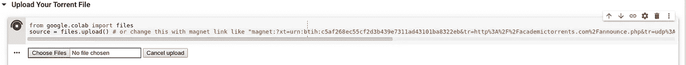
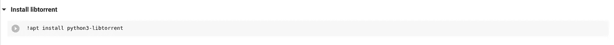
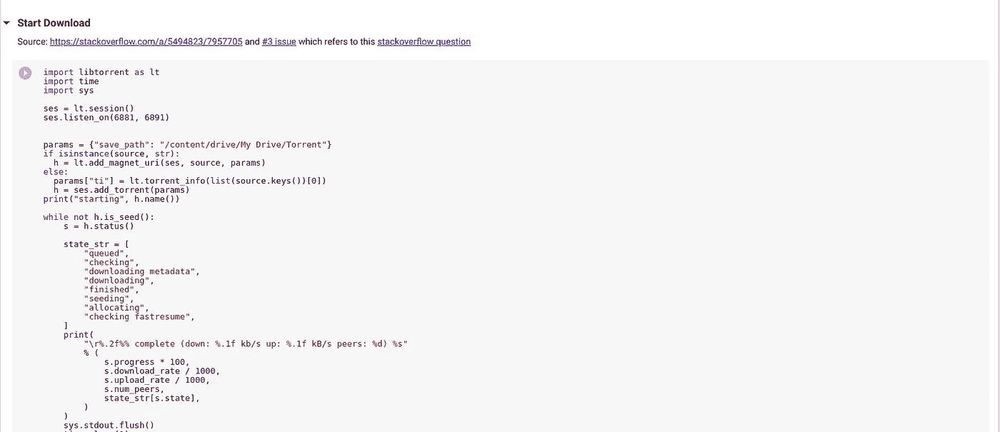

# 你担心种子限制吗？？？

> 原文：<https://medium.datadriveninvestor.com/are-you-worry-about-torrent-restriction-ea9c8a897429?source=collection_archive---------4----------------------->

Source: [https://bestdroidplayer.com/streaming-apps/download-torrents-torrent-websites-torrenting-tools/](https://bestdroidplayer.com/streaming-apps/download-torrents-torrent-websites-torrenting-tools/)

你们中的许多人有一种迷信，认为 torrent 是非法的。你认为这就是你不能通过网络连接在工作场所或教育场所使用它的原因。Torrent 不违法。利用 torrent 做违法的事情是违法的；否则就是合法的。有些文件只在 torrent 中可用，但你无法从受限网络下载这些文件，并且你立即需要这些文件。有时候你会面临这样的问题。在这篇文章中，我们将看看什么是种子以及我们如何在受限制的地方下载种子文件。这是我在 Medium 的第 19 篇文章。

Torrent 是通过 BitTorrent 协议发送文件。BitTorrent 是一个使用文件群集的高效内容分发系统。通常不执行典型对等系统的所有功能，如搜索。为了在 Bit Torrent 中共享一个或一组文件，对等方首先创建一个. Torrent 文件，这是一个小文件。那个。torrent 文件包含关于要共享的文件的元数据，以及关于跟踪器(协调文件分发的计算机)的信息。对等点首先获得一个. torrent 文件，然后连接到指定的跟踪器，跟踪器告诉它们从其他对等点下载文件的片段。

Source: [https://www.myce.com/news/bittorrent-protocol-extension-goes-blockchain-allows-seeders-to-earn-tron-tokens-85182/](https://www.myce.com/news/bittorrent-protocol-extension-goes-blockchain-allows-seeders-to-earn-tron-tokens-85182/)

下载 torrent 有这么多机制。这里我要讲的是云涌机制。所以，我找到了一个在实验室运行的工具。

> “Colaboratory 是一个免费的 Jupyter 笔记本环境，不需要任何设置，完全在云中运行。借助 Colaboratory，您可以编写和执行代码，保存和共享您的分析，以及访问强大的计算资源，所有这些都可以从您的浏览器中免费获得。”谷歌说

在这里，我们将看到如何使用该工具。

转到下面的 [GitHub](https://github.com/FKLC/Torrent-To-Google-Drive-Downloader) Repo，点击 README.md 中写着 Open in Colab 的徽章。

然后一个新的标签将打开，首先你应该安装驱动器点击运行按钮或选择外壳，并按 Ctrl+Enter。

然后你想上传你的种子文件。因此，运行命令或单击 shell 并按 Ctrl+Enter。然后点击按钮，选择文件，选择你的种子文件并上传。

然后你要安装种子库。因此，您希望运行命令或单击 shell 并按 Ctrl+Enter。

然后运行 start Download 命令或单击 shell 并按 Ctrl+Enter。

用于教育目的，不要滥用它。

***感谢您阅读至此。如果你喜欢这篇文章，请分享、评论并发表👏几次(最多 50 次)。。。也许会对某个人有帮助。***

***关注我的***[***Twitter***](https://twitter.com/TheSabesan)***和 Medium 如果你将来对这些更深入、更翔实的文章感兴趣的话！***