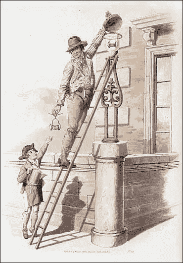

# 领域 4:人的因素

> 原文：<https://medium.datadriveninvestor.com/area4-the-human-factor-efc356065f13?source=collection_archive---------37----------------------->

房间里的大象是自动化的人的因素。我已经在之前的[帖子](https://untrite.com/blog/)中提到了我的立场，但是我想用一整篇文章来讨论这个问题。

我们可以根据自动化的影响范围对其进行分类。*大规模*自动化涵盖了整个角色甚至整个行业。例如，[自动驾驶卡车](https://www.wired.com/story/what-does-teslas-truck-mean-for-truckers/)将最终实现卡车司机工作的自动化。我想未来在好奇心公园里只会有卡车司机。很像点灯人。

The profession of the lamplighters are a thing of the past.

然后是*小规模*自动化。我在 [*Area4 改进*](https://untrite.com/blog/welcome-to-area4-improvement/) 系列重点关注的那种。人们每天重复做的大量工作。单调的东西只会扼杀灵魂。比如洗碗或者洗衣服。在大多数西方社会，洗碗机和洗衣机是标准配置。那些任务已经自动完成了。这很自然，直到你没有拥有它时，我们才意识到这一点。

随着时间的推移，大规模自动化通常会有一个美好的结局:它取代了工作岗位，也创造了新的工作岗位。一些专家开始担心这次[会有所不同，尽管](http://www.nytimes.com/2014/12/16/upshot/as-robots-grow-smarter-american-workers-struggle-to-keep-up.html?module=inline)。

在小规模自动化领域，我认为这总是积极的一步。我们将令人麻木的事情自动化。让人不干的任务。你有没有在早上从床上跳起来，因为今天你最终将重新平衡所有的财务报表和做税？

(我可能会有点不高兴，因为今天我不得不第一次为我的离岸有限公司做这件事。怎么会允许这种事情发生！那么多小时的人类潜力都被浪费在一个无底的痛苦深渊里了！)

通过自动化那些基于规则的重复性任务，我们能够节省大量时间，降低认知负荷。想想你的员工将能够投入创造性思维的所有时间，而不是花费在每周手动生成相同的报告上。

我知道你要说什么。这一直是承诺，但最终，空闲时间只是被重新分配到更平凡的工作中。这就是为什么当我们帮助公司提高效率时，我们总是提供培训和结构，以便更智能地重新调整工作流程。我会在接下来的《Area4》中写这方面的内容。敬请关注。

这篇文章也出现在:[https://untrite.com/blog/area4-the-human-factor/](https://untrite.com/blog/area4-the-human-factor/)