# 使用 Scapy 的 ARP 缓存中毒

> 原文：<https://medium.datadriveninvestor.com/arp-cache-poisoning-using-scapy-d6711ecbe112?source=collection_archive---------0----------------------->

ARP 缓存中毒是在局域网上进行 MITM 攻击的最流行的方式之一。本文将演示如何构建一个 python 程序来毒害目标和网关的 ARP 缓存，以便成功执行 MITM 攻击。

为了构建程序，我们需要经历 ARP 缓存中毒的步骤，然后我会用 Scapy 来演示。为了演示 ARP 中毒，我让攻击者的机器在运行 Kali Linux 的 VirtualBox 上与运行 Windows 的目标机器桥接适配器。两台机器都连接在无线局域网上。

顾名思义，我们将毒害目标的 ARP 缓存。局域网上的每台机器都有自己维护的本地 ARP 表(缓存)。该表由机器收到的不同 ARP 请求的各种 ARP 响应组成。

例如，机器 A (10.0.2.5)想要与机器 B (10.0.2.6)通信。为了进行通信，机器 A 需要机器 b 的 MAC 地址。因此，机器 A 搜索他的 ARP 表(缓存),如果他能找到与 IP 地址 10.0.2.6 相关的 MAC 地址。如果他这样做了，他就可以将数据包发送到机器 B，否则机器 A 将发送 ARP 广播消息。ARP 广播指向 ff:ff:ff:ff:ff:ff:ff。请求消息将通过网络传送到每台机器，询问该机器的 IP 地址是否与 10.0.2.6 匹配。当机器 B 发现 ARP 请求时，它向机器 A(10.0.2.5)发送 ARP 响应，告知其 MAC 地址。机器 A 将其写入本地 ARP 表。

为了毒化它，我们将发送虚假的 ARP 响应，通过**欺骗源 IP 地址**。

现在我们来介绍一下 Scapy。

> Scapy 是一个 Python 程序，使用户能够发送、嗅探、分析和伪造网络数据包。这种能力允许构建能够探测、扫描或攻击网络的工具。

要知道如何安装它，可以去这个[链接](https://scapy.readthedocs.io/en/latest/installation.html)。

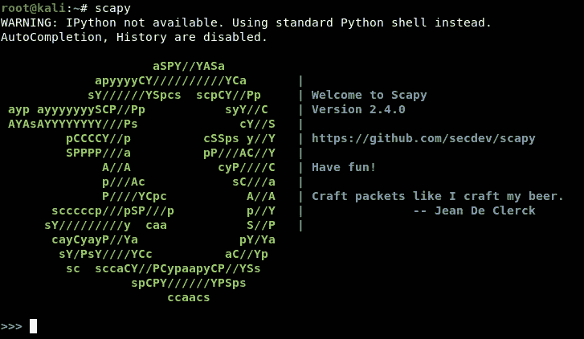

Scapy Interactive Shell

首先，我们先掌握 scapy 的窍门。我们可以使用 Scapy 嗅探、分析和伪造数据包。由于这篇文章将讨论 ARP 中毒，我们将只处理伪造的数据包。

要查看一个层有哪些字段，我们可以使用 *ls()* 函数。

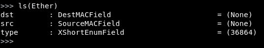

为了创建一个包，我们使用**“/”操作符**将两层附加在一起。

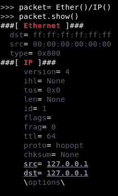

Merged two layers of Ethernet and IP with default values

要发送一个数据包，我们使用命令***【send()】****。*

很简单，对吧？！！

接下来，让我们来看看 **ARP 中毒。**

要查看 Windows 和 Linux 中的 ARP 表，可以使用命令 **arp -a** 。

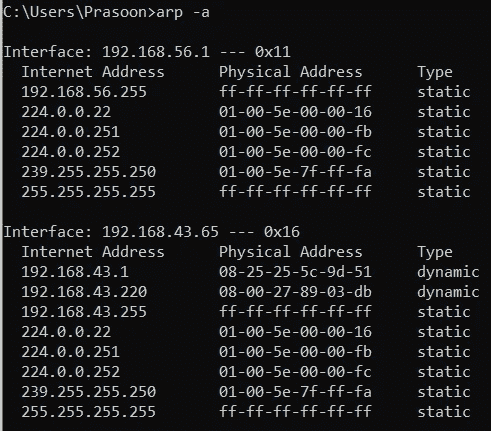

arp -a on Windows

所以我的实验室设置由目标机(192.168.43.65)、攻击者机(192.168.43.220)和网关(192.168.43.1)组成。作为一名攻击者，我将毒害目标和网关，以成功实施 MITM 嗅探攻击。

> **！注意:**确保数据包转发已启用。要启用它，请使用以下命令:**echo 1>/proc/sys/net/IP v4/IP _ forward。**

**第一步:找出目标和网关的 MAC 地址**

为了找到目标和网关的 MAC 地址，我们将为它们发送广播消息。

所以我们设计的 ARP 广播请求 IP 地址= 192.168.43.1(网关)

> **！注意**:在 ARP 层， **hwsrc** 和 **hwdst** 分别代表源和目的的 **MAC 地址，而 **psrc** 和 **pdst** 分别代表源和目的 **IP 地址。****

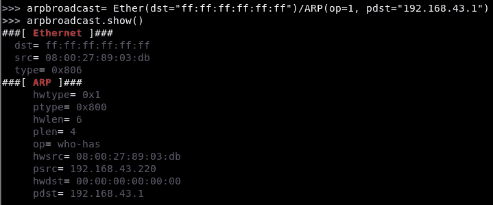

ARP broadcast packet in Scapy

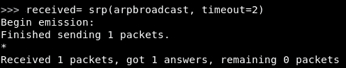

srp() to send the packet and then receive the response packet

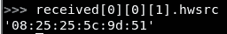

Here is the MAC address of the gateway

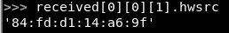

MAC address of the target

同样，我们找出目标的 MAC 地址(192.168.43.65)。

**步骤 2:向目标和网关发送虚假的 ARP 响应数据包。**

对目标的错误 ARP 响应将包含 pdst = ' 192 . 168 . 43 . 65 ' hwd ST = ' 08:25:25:5c:9d:51 '和 psrc= '192.168.43.1 '。默认情况下，该数据包会包含攻击者的 MAC 地址。因此，当目标收到数据包时，它会使用与网关的 IP 地址相关联的恶意 MAC 地址来更新其 ARP 表。为了确保我们的中毒没有被治愈，我们将不得不连续发送 ARP 响应，这将在 python 脚本中完成。

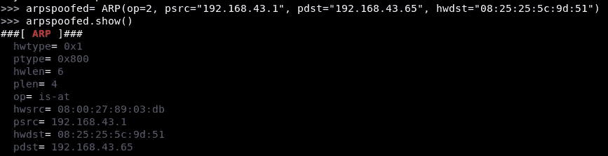

Spoofed packet crafted for 192.168.43.65

由于我们不需要接收数据包作为响应，所以我们将只使用 **send()。**

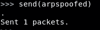

Send the spoofed packet

同样，通过将 psrc 伪装成“192.168.43.65”，为网关(192.165.43.1，84:fd:d1:14:a6:9f)创建一个数据包。

**第三步:一旦攻击完成。记得恢复机器的 ARP 表。**

要恢复 ARP 表，我们必须精心制作原本应该使用的数据包。

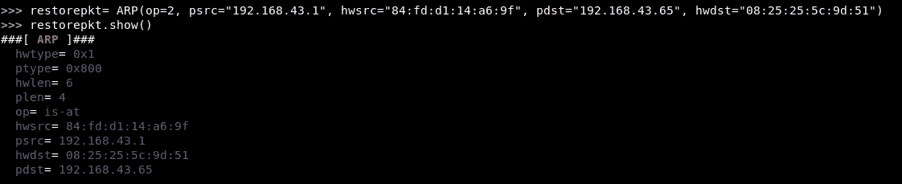

From the gateway to the target

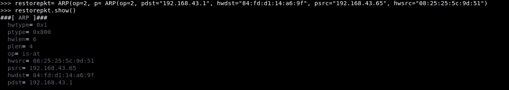

From the target to the gateway

这就是在 Scapy 可以做到的。但这只是为了演示如何使用 scapy。为了自动化整个过程，我开发了一个 python 脚本。python 脚本会将每个步骤转换成一个函数。

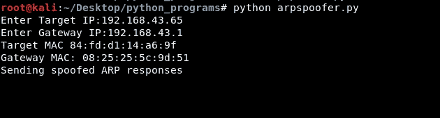

arpspoofer.py uses Python 2.7

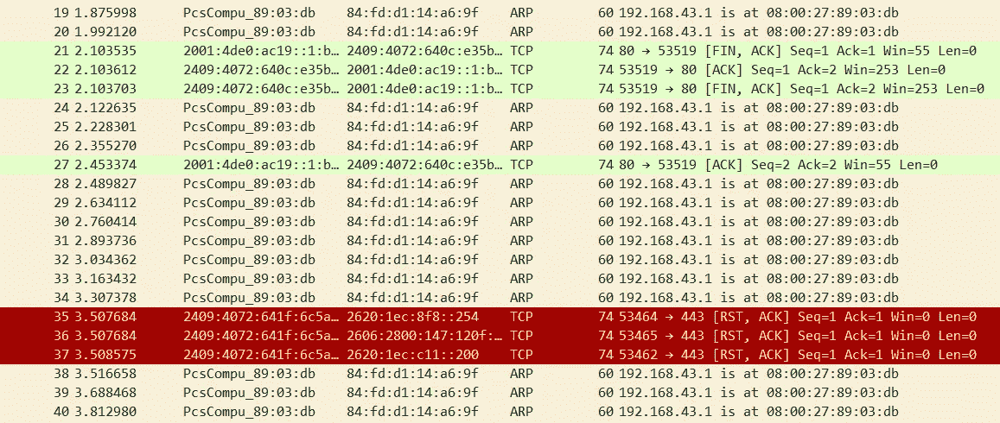

Traffic as seen on the target machine

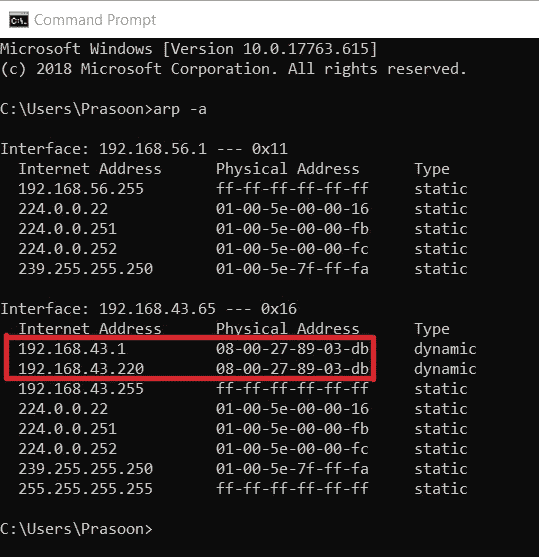

Target’s ARP cache has been poisoned!!

MITM 也在工作，如果在攻击者的机器上使用 **tshark -i <接口> | grep DNS** ，就可以看到目标的 DNS 请求通过。

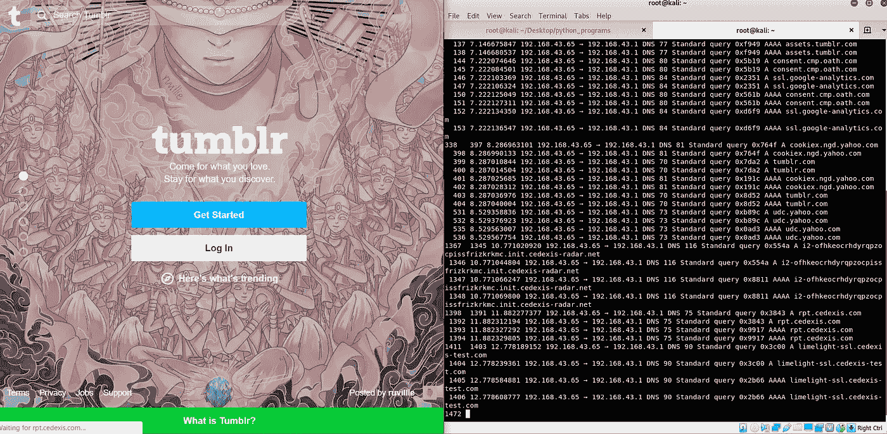

要了解 scapy 还能做哪些很酷的网络安全工作，您可以访问以下链接:

 [## 背包

### 发展中的社交网络

thepacketgeek.com](https://thepacketgeek.com/series/building-network-tools-with-scapy/)  [## 欢迎来到 Scapy 的文档！- Scapy 2.4.3 文档

### 编辑描述

scapy.readthedocs.io](https://scapy.readthedocs.io/en/latest/)