# 增强现实与虚拟现实。

> 原文：<https://medium.datadriveninvestor.com/arround-augmented-reality-versus-virtual-reality-7f243faba004?source=collection_archive---------12----------------------->

## 增强现实

增强现实指的是使用计算机生成的对现实世界环境的解释来提供增强的交互体验，其中这些现实世界的元素主要通过多种感官形式进行增强，如[视觉](https://en.wikipedia.org/wiki/Visual)、[听觉](https://en.wikipedia.org/wiki/Hearing)、[触觉](https://en.wikipedia.org/wiki/Haptic_perception)、[体感](https://en.wikipedia.org/wiki/Somatosensory_system)和[嗅觉](https://en.wikipedia.org/wiki/Olfactory)传感器，以便创建所代表世界的三维印象。要注意的主要事情是，增强现实表面上与实际现实交织在一起，因此给现实世界环境带来数字化的感觉。

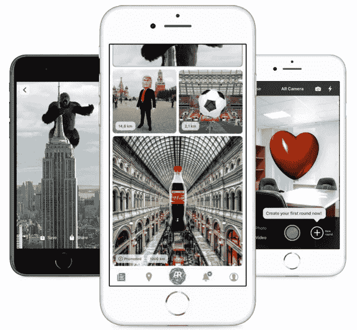

## 虚拟现实

与增强现实相反，虚拟现实也是一种交互式计算机生成的体验，但它是真实世界地平线在模拟复制品中的完整表示，主要包括视觉和听觉反馈形式。虚拟现实技术的进步已经带来了多投影环境以及[虚拟现实头戴式耳机](https://en.wikipedia.org/wiki/Virtual_reality_headset)的利用，这些虚拟现实头戴式耳机大多与物理环境或道具相结合，以便生成模拟用户在虚拟或想象世界中的物理存在的逼真图像、声音和其他感觉。

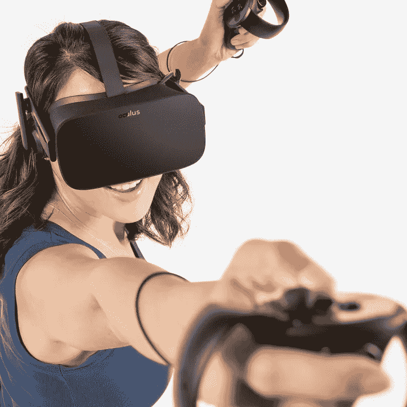

## 增强和虚拟现实技术的优势和使用案例。

增强和虚拟现实系统的应用几乎跨越了生活的所有领域，从军事、电子商务、游戏等等。以下是一些关于虚拟和增强现实用例的笔记。

*   **军事**

作为虚拟现实技术的最早采用者，第一个虚拟现实系统的开发可以追溯到 20 世纪 20 年代末，由 Edward Link 昵称为“Link Trainer”的开发，这是一个为美国军方设计的飞行模拟系统，用于在第二次世界大战期间训练年轻的飞行员。这一研究领域的进一步发展带来了一些创新，如 HMD(头戴式显示器)——用于在查看真实场景时显示地图或热成像数据等战术信息，TAR(战术增强现实)——一种允许集成 GPS 信息和地理注册的技术，HUNTR(平视导航跟踪和记录)——允许地图和导航等实时信息。虚拟和增强现实的出现不仅使飞行员的飞行模拟更加容易，还改善了战斗战术和训练，以及心理不稳定的退伍军人的治疗手段。

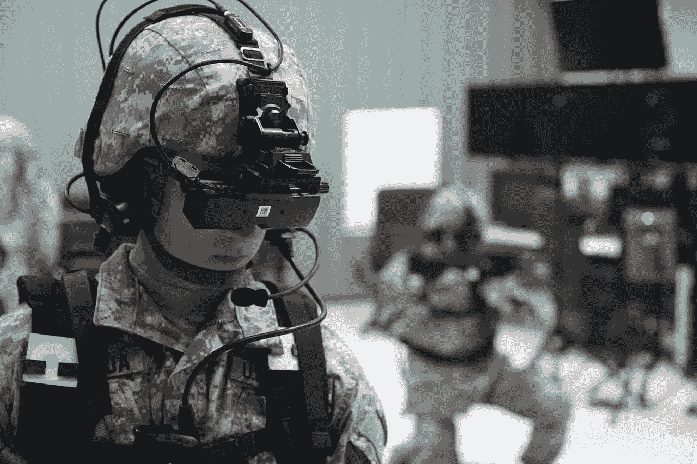

*   **游戏**

除了虚拟现实的军事用例，游戏是虚拟和增强现实进步最活跃和有效的用例，因为专家认为，视频游戏玩家在处理视野等事物的能力以及在记忆中保存数字对象的能力方面远远优于非视频游戏玩家。随着索尼互动娱乐等知名游戏主机制造商的最新发展，他们在 2016 年首次推出了 Playstation VR 耳机。这种创新使游戏玩家能够参与其中；协作和远程 3D 游戏，使用至少三种感觉完全沉浸到游戏中:听觉、视觉和触觉，包括不久的将来的体感和嗅觉，新水平的“运动游戏”,其涉及作为与引人入胜的数字游戏内容交互的输入的剧烈身体活动，希望取代久坐的活动，使用 BCI(脑机接口)和传感技术对游戏者进行更深入和动态的游戏改编， 游戏和其他社会体验中的虚拟现实作为一种感觉运动和认知康复工具，使用更迷人的设置和氛围的桌面游戏的高级水平。

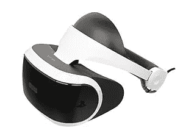

*   **体育健身培训**

当我们对某些体育和健身事件进行实验时，体育世界决不会被排除在外，从而将整个人类生活环境彻底改造成一个增强的或虚拟现实的世界，例如在虚拟现实中向远程观众广播体育事件，如曲棍球、足球、篮球等，受伤后的康复，为远程学生提供成本有效的训练，虚拟教练，个性化训练的地点和时间， 动机通过使用虚拟竞争对手或代理人进行锻炼，重放和分析团队游戏，规划战术和整体战略，从不同角度评估和测试虚拟现实中的战略和战术，在大多数职业体育运动中。

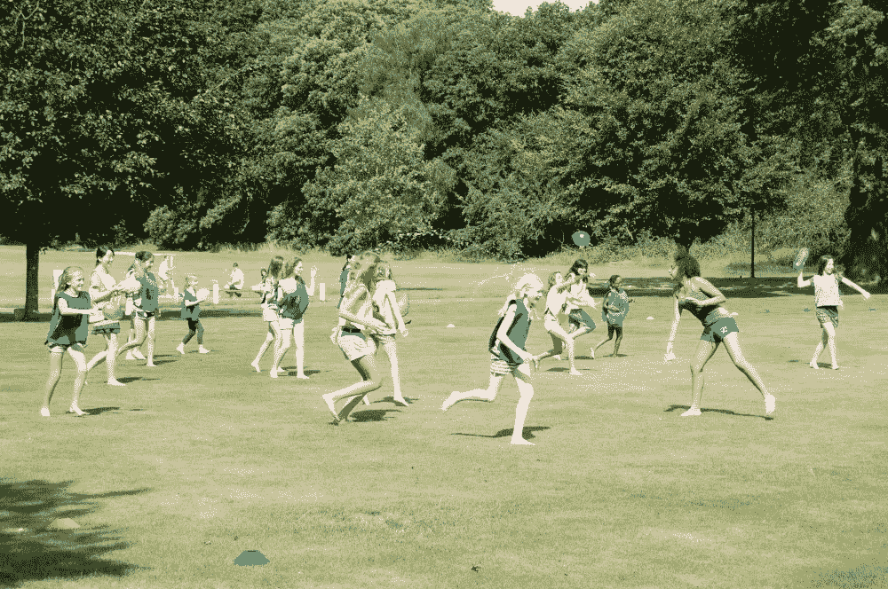

*   **时尚&娱乐**

通过在消费者和产品之间建立更深层次的联系，娱乐和时尚品牌现在将增强现实技术作为一种伟大的营销策略。这可以通过时装商店环境的虚拟模拟来进一步实现，远程访问虚拟博物馆、画廊、展览和剧院，虚拟现实时装秀并使新买家沉浸其中，使用您自己的定制 3D 化身在虚拟现实中在线购物，参与复杂的音乐虚拟现实体验以成为歌手、音乐家或仅仅是普通的听众，到世界著名商店的购物之旅，使用视觉的电影动作完全沉浸， 听觉和触觉(即触觉)界面和模式，模拟化妆体验、营销活动和共享在线体验，探索沉浸式 360°视频和照片，以及沉浸到虚拟现实视频和体验中的辅助内容等。

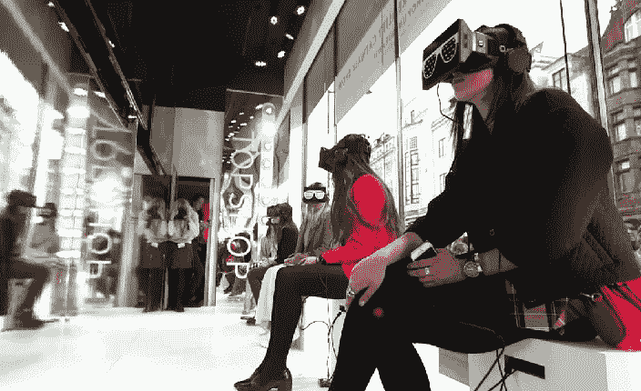

*   **教育**

教师和教育工作者现在可以利用增强现实来加快学生的学习过程。例如，Aurasma 应用程序已经在教室中使用，这样学生就可以通过智能手机或平板电脑查看他们的课程，从而获得更丰富的学习环境，因为这项技术不仅允许学生看到老师，还允许学生实时与大量的人进行互动。此外，学习天文学的学生可能会看到一幅完整的太阳系地图，或者上音乐课的学生可能会在学习演奏乐器时实时看到音符。

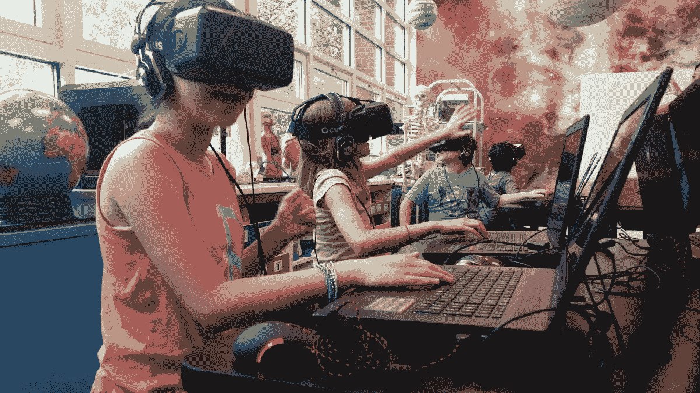

*   **设计**

增强现实还跨越了设计和规划的所有领域，从建筑、工程和整体建筑(道路/建筑)到这些专业人员，让他们能够远程想象和感受他们的工作环境，以便在开发阶段设想他们的最终产品。有了 3 维头戴式耳机，建筑师、工程师以及设计专业人员现在可以走进他们的建筑/设计中，感受一下设计可能是什么样子，如果需要，甚至可以立即进行虚拟修改。城市开发者和规划者也可以在这些增强现实耳机的帮助下建立整个城市布局的模型。基本上，空间关系范围内的所有职业都是增强现实的完美用例。

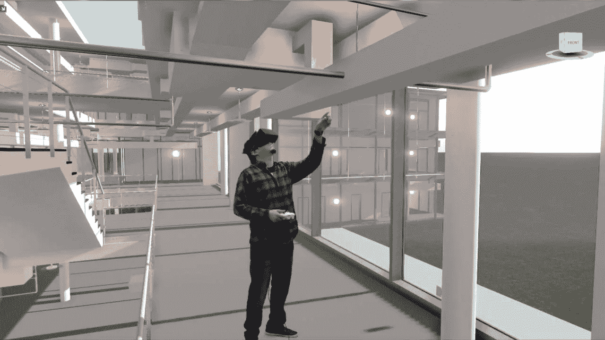

*   **旅游**

在过去的几十年里，旅游业得到了又一次显著的发展，这都要归功于技术的进步，诞生了像猫途鹰这样的评论网站，以及像孤独星球这样的信息网站。但话说回来，增强现实在进步方面存在一个缺口，因为它为旅游品牌和代理商提供了一个巨大的机会，让潜在游客在旅行前获得更加身临其境的体验。想象一下，在你梦想的度假地点(如巴哈马)进行一次虚拟“漫步”，甚至带你的孩子去迪斯尼乐园游玩，或者在巴黎周围悠闲地漫步，看看你可能喜欢在增强现实眼镜上参观哪些博物馆、购物中心或咖啡馆，甚至在预订去这些地方的机票之前。增强现实有望在未来让推销旅行、旅游和度假变得更加容易。

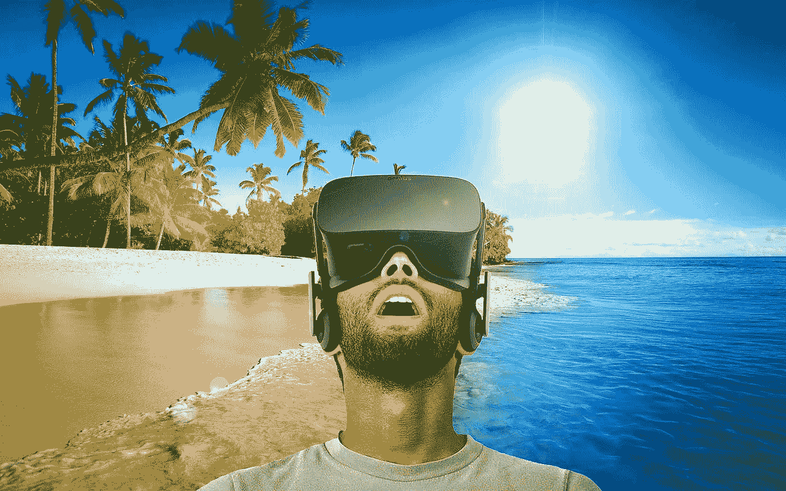

*   **医疗保健**

它也适用于基本上为以下人员服务的保健部门；对患有恐惧症(如害怕飞行和幽闭恐怖症)的患者进行暴露疗法和治疗，对创伤后应激障碍(PTSD)进行治疗，疼痛管理，通过提供对真实患者没有任何风险的练习手段进行外科训练，通过模拟虚拟肢体和练习做各种任务来治疗幻觉性疼痛，使用模拟相亲或工作面试的情况对自闭症患者进行社会认知训练，冥想， 通过允许身体残疾的人使用耳机的眼球跟踪技术在虚拟现实中弹奏钢琴和吉他，使医生能够结合其他方法进行诊断，如 MRI 扫描、远程手术(外科医生在与患者分开的位置进行手术)和模拟复杂的程序，创建操作和培训程序，掌握灾难和紧急情况管理，为残疾人提供机会。

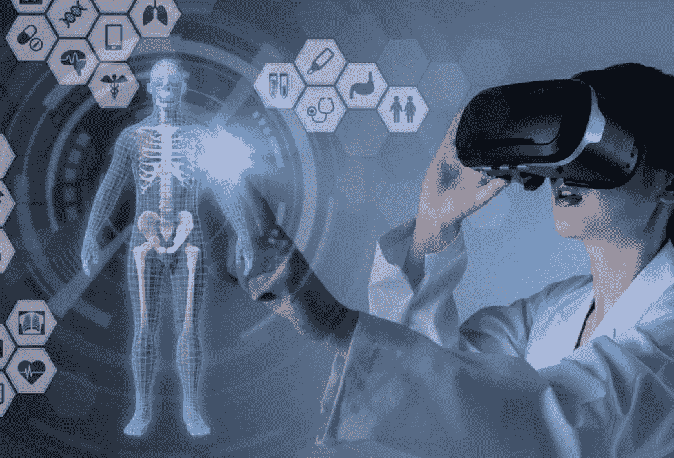

*   **零售&商业物流**

作为增强和虚拟现实世界最显著的进步之一，零售和商业物流正在引领潮流，因为购物者更有可能通过智能手机查看价格和其他产品信息，以便进行比较并做出最佳选择。在制造商方面，增强现实为提高运输、仓储和路线优化等许多商业物流领域的效率和成本节约提供了各种机会。DHL 等大多数运输公司已经采用了增强现实的想法，因为它在一些仓库中使用了智能 AR 眼镜，镜片向工人显示仓库内的最短路线，以找到并挑选需要运输的特定物品。从而为员工提供了更高效的工作方式。

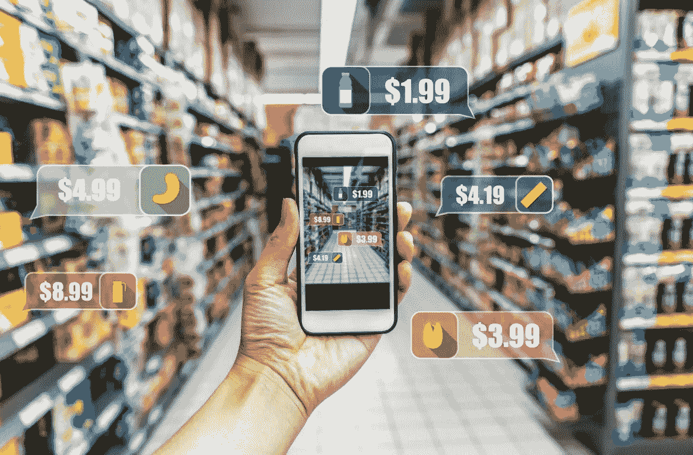

*   **广告和电信**

电信和大众媒体广告也将通过增强现实得到极大的推动，例如具有相对准确位置的真人大小的用户图像的面对面会议系统，使用空间声音、照片般逼真的视频和图片、触觉反馈(触觉)、嗅觉、味觉和动作平台的深度沉浸和/或完全沉浸到虚拟空间中，远程位置的用户之间使用极其丰富的感官形式(例如表情、触觉、视觉、嗅觉、呼吸， 营销和广告活动中令人难以置信的情感故事，虚拟现实社交网络中的高级通信媒体，以创建跨网络共享的沉浸式内容，任何人都可以通过该内容订阅或购买，远程演示，通过触觉交互以及协作进行通信，以帮助管理各种社会文化空间，增强和更具互动性的新闻、新闻制作和视频制作行业的故事讲述。

## 增强现实和虚拟现实的主要区别

如上所述，增强现实和虚拟现实在它们都是计算机生成的体验的意义上是非常相似的，但是在实际意义上它们是不同的，因为增强现实不仅仅是对真实世界环境的模拟，因为它结合了多种感官形态，从而产生了更加增强的体验，这与作为真实世界环境的完全复制品的虚拟现实相反。增强现实体验是真实世界环境中交织的数字球体，在必要时遮蔽真实世界，否则产生计算机化的表示。

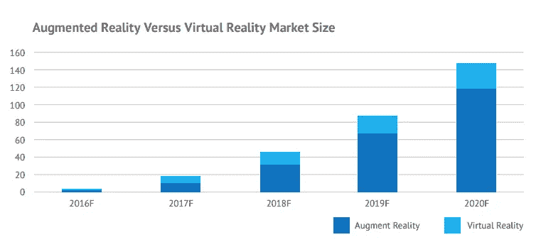

增强现实正在成为科技经济的关键驱动力之一。根据一些估计，AR 市场的总价值预计到 2020 年将达到 1200 亿澳元，到 2025 年将增长到 1980 亿美元。根据 Juniper Research 和 Goldman Sachs 的分析师，增强现实市场将在未来 5 年内增长 20-100 倍，取代其老对手虚拟现实技术。

由于技术的蓬勃发展和后来区块链技术的兴起，ARROUND Platform 是一个位于区块链的分散式增强现实(AR)平台，它为用户提供了一个迷人而又当代的数字场景，以便他们能够实时创建和分享自己的增强现实体验。因为这个平台打算利用增强现实市场的蓬勃发展，并在它完全成熟之前抓住年轻公牛的角。在 ARROUND 生态系统中，广告客户将获得一种信息，他们可以通过增强现实中的创意活动和针对特定受众的有针对性的活动，在对广告客户和消费者都更方便的环境中，与他们的消费者进行交流和互动。

有关该项目的更多信息，您可以关注下面的社交媒体句柄。

👉🏻【https://arround.io/】官网:

*👉🏻**安线程:**[*https://bitcointalk.org/index.php?topic=3014006.0*](https://bitcointalk.org/index.php?topic=3014006.0)*

*👉🏻**推特:**[*https://twitter.com/ArroundPlatform*](https://twitter.com/ArroundPlatform)*

*👉🏻**Reddit:**[*https://www.reddit.com/user/arround_official*](https://www.reddit.com/user/arround_official)*

*👉🏻**电报:**[*https://t.me/ArroundSupport*](https://l.facebook.com/l.php?u=https%3A%2F%2Ft.me%2FArroundSupport&h=AT20BScPLG1HQGX-sd9lM1FNS4fv_mGFWRnvB7T8WSAgHkUAzzk_c0yfEwx-0wIw5ftgDUTx2ayT-DarQF435g1Y3eKsUZfxY0SfAWe7mCdoQLuIzFDmKmDZtm9vENk-9zF0bdFrNwg45BlnLWrhy94ANmxXEwf9-oS4ctoqocEuSFqNZCUD1ZXTt9QUFy1BH7fS-V1NasOGwy7D41gFMIx6kBDismeC227o6pWnUnNMMGkis2tJaEULI2g_HDxqTlX3noqE-Ew9Mv4TUlwyFp07-VtDt0suGHU6332CmCRlUDJ2icI1-t5S217SN0gcBgdBGxtIoOqHvK_Zoiw852lD7VLCofkKdol7LeE5JjHxYjJmW7C0mkUiiQJx3In2lkx370fhQ0NDjHq63JCwy12sN1ybCNvQ461lISk)*

*👉🏻**脸书:**[https://www.facebook.com/ARROUND-2052833448334195/](https://www.facebook.com/ARROUND-2052833448334195/)*

*👉🏻**领英:**[*https://www.linkedin.com/company/arround/*](https://www.linkedin.com/company/arround/)*

*👉🏻**insta gram:**[*https://www.instagram.com/arround_official*](https://www.instagram.com/arround_official)*

*👉🏻**Vkontakte:**[【https://vk.com/public169318445】T21](https://vk.com/public169318445)*

*如果你喜欢你在这里读到的，请随时关注更多加密货币更新；*

**作者的 Bitcointalk:*[*https://www.bitcointalk.org/index.php?action = profileu = 2187995*](https://www.bitcointalk.org/index.php?action=profile;u=2187995)*