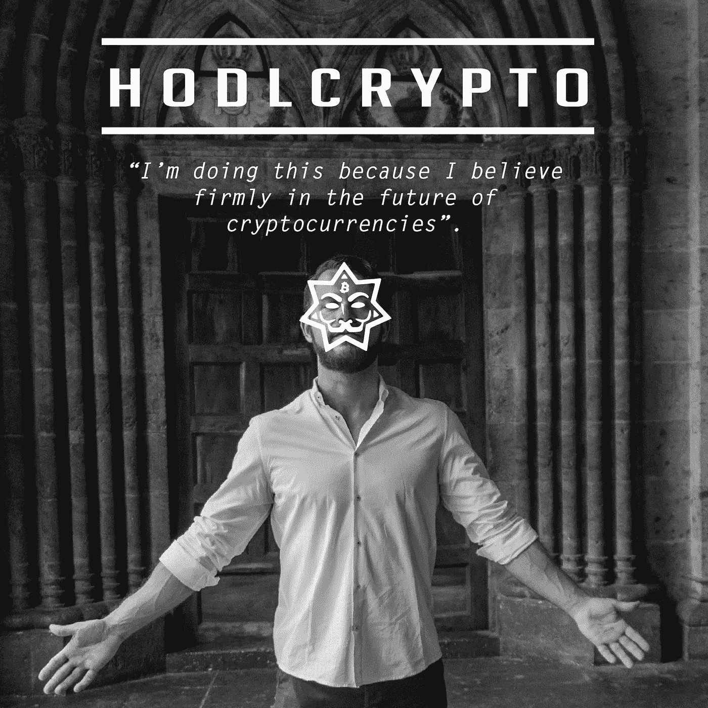
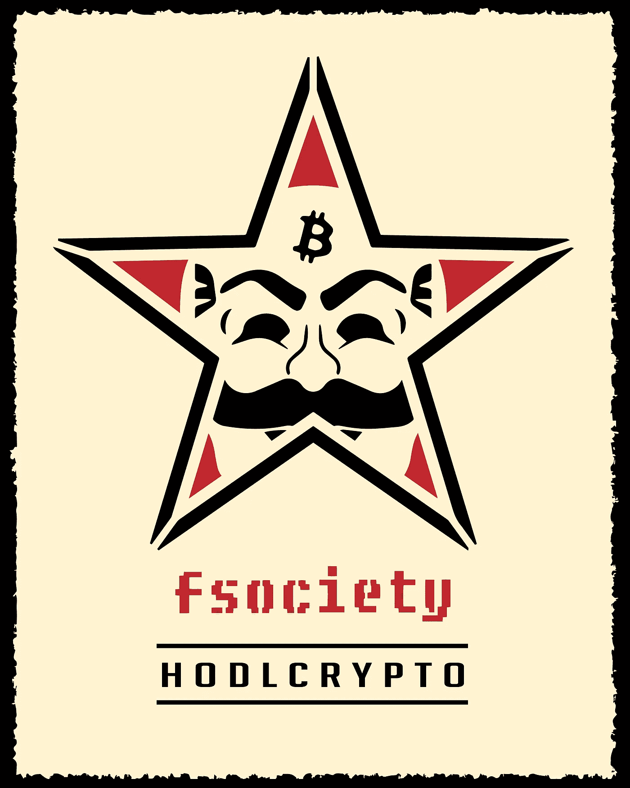
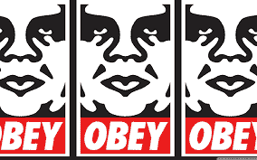
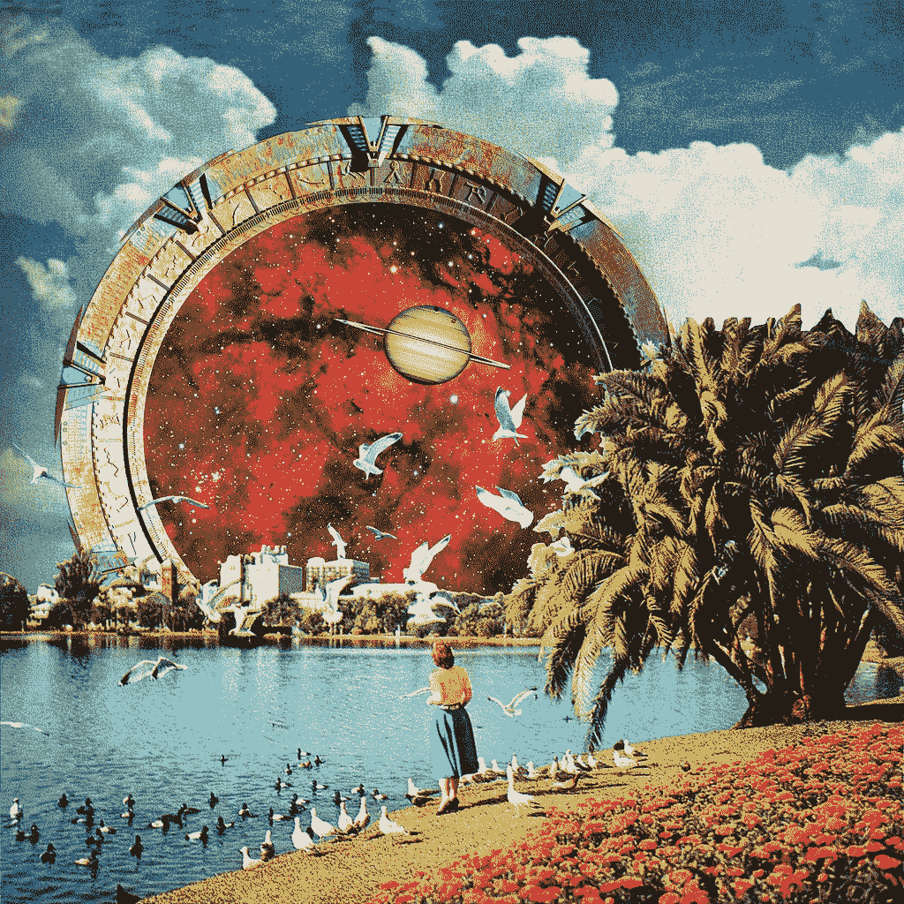
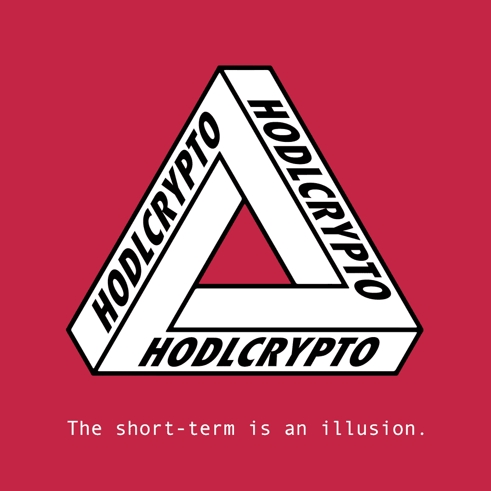
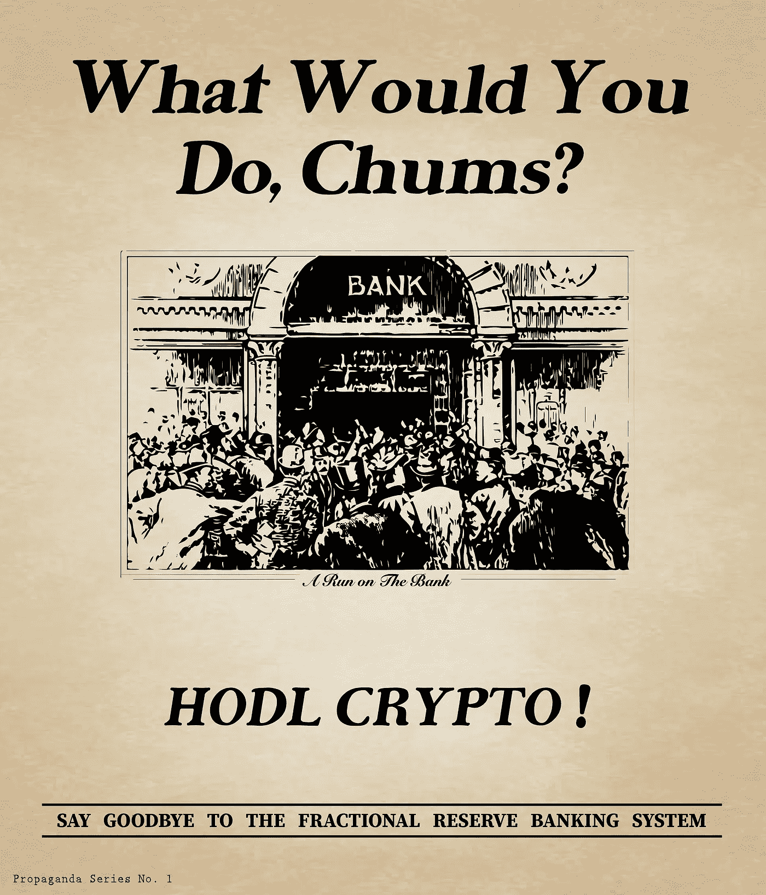
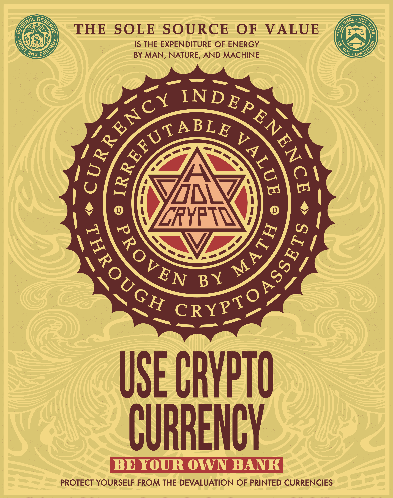
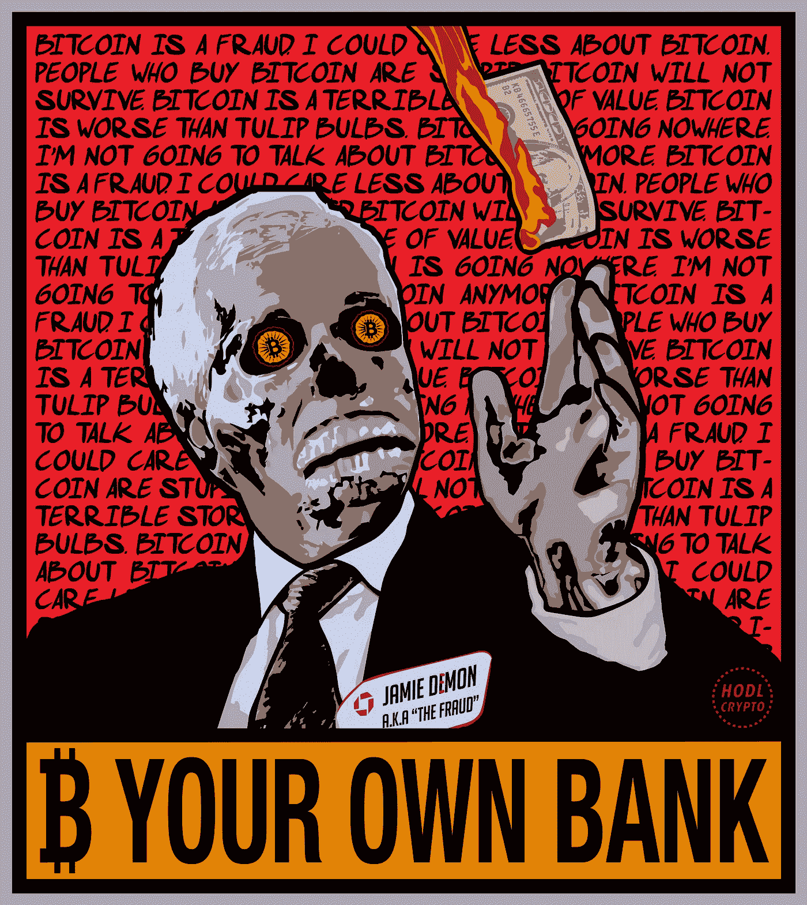
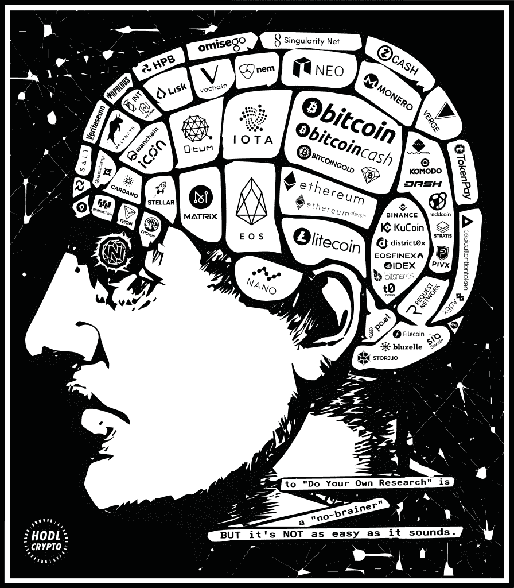

# 艺术、宣传和加密货币:欢迎来到 hodlcrypto 的世界

> 原文：<https://medium.datadriveninvestor.com/art-propaganda-and-cryptocurrencies-welcome-to-the-universe-of-hodlcrypto-377eac70ad88?source=collection_archive---------4----------------------->

Crypto artist, hodlcrypto

> *“他自称是加密货币的倡导者，尽管拥有金融学硕士学位，但他目前的工作只有一个目标:* ***通过艺术让尽可能多的人相信加密货币的潜力。*** *为此，他开发了一个推广加密货币使用的艺术宣传项目，笔名****hodlcrypto****。”*

*西班牙文出版，作者为***，作者为哈维尔·巴斯塔多(*[*【criptobastardo】*](https://twitter.com/criptobastardo)*)。**

**

*[CriptoNoticias](https://www.criptonoticias.com/entrevistas/arte-propaganda-criptomonedas-bienvenidos-universo-hodlcrypto/) 有机会与艺术家 [**路易斯·波莱蒂**](https://www.linkedin.com/in/lpoletti/) 交谈，他说，尽管已经完成了高水平的研究，但他当时研究的任何东西都不是他现在工作的一部分。“这很讽刺，”他说。*

*对他来说，这种培训让他明白，经济体需要央行来保持稳定，而他自己的研究则让他明白，这些机构是“这个世界上邪恶的根源”。*

*他说:“我要说，更重要的是，我学到的一切都让我对比特币的想法敞开了大门。他目前居住在墨西哥的瓜达拉哈拉，在那里定居是为了更好地发展他的加密货币艺术项目。*

*在完全投身于这个加密艺术和宣传项目之前，他开发了一系列类似的设计，但有一个突出的政治主题，名为“[politics](https://www.instagram.com/pololitics/)”:**“我在数字艺术领域的职业生涯和以前的项目专注于政治问题，如媒体操纵**、阴谋和银行系统，”他说，并保证宣传激发的艺术也与他的个性“非常匹配”。*

**

**One of his emblematic designs combines the masks of Guy Fawkes and Fsociety with Bitcoin. (Source: hodlcrypto.)**

> *“作为一名艺术家，重要的是要敢于冒险，不要墨守成规，只要它是真实的。我的艺术，除了是我的作品，还是我的人生项目。我被它吞噬了。我这样做不是为了寻求短期的回报或满足。我这样做是因为我坚信加密货币的未来，如果我将精力投入到这一领域，即使在我死后，其影响仍将存在。”*
> 
> ****路易斯波莱蒂****
> 
> **密码艺术家，又名 hodlcrypto**

*据他称，他于 2015 年**开始使用比特币**，但他的第一笔投资是在 2017 年初。对他来说，[比特币](https://criptonoticias.com/informacion/que-es-bitcoin/)是核心货币，这为目前存在的加密货币项目的多样性开辟了道路。*

*“对我来说，比特币是国王(……)其他所有的硬币和代币**都欠比特币一些东西，因为它创造了区块链，**”他强调说，尽管他也对 IOTA 等其他项目感兴趣，因为物联网的潜力及其与加密货币的关系。*

**

**Power to the people, Decentralize, and Be Your Own Bank (Source: hodlcrypto)**

*此外，[区块链](https://criptonoticias.com/informacion/que-es-tecnologia-contabilidad-distribuida-blockchain/#axzz4dsp6HD2k)技术及其在比特币服务上的操作被证明是成功的，尤其是在中本聪设计的项目实施 9 年之后。关于后者，波莱蒂肯定了他通过艺术作品“不断美化”的东西*

> **“Satoshi 是加密货币运动的匿名之父，他表现出了巨大的远见，他建立了* ***经济激励措施来保护比特币网络*** *(即采矿)，并编写了一个代码，该代码至今已存在 10 年，没有一次成功的攻击。在我看来，是* ***【数字黄金】支撑了所有其他加密货币的价值。****
> 
> *****路易斯波莱蒂*****
> 
> ***Cryptoartist，又名 hodlcrypto***

# **艺术和影响**

****

**Source: Shepard Fairey, Obey**

**这位艺术家说，他的影响是多方面的，从不同知识领域的不同思想家和学者那里汲取精华。**

**因此，他的作品受到了哲学家如[弗里德里希·尼采](https://es.wikipedia.org/wiki/Friedrich_Nietzsche)，宣传家如[爱德华·奈斯](https://es.wikipedia.org/wiki/Edward_Bernays)，语言学家如[诺姆·乔姆斯基](https://es.wikipedia.org/wiki/Noam_Chomsky)，心理学家如[卡尔·荣格](https://es.wikipedia.org/wiki/Carl_Gustav_Jung)，甚至喜剧演员如[乔治·卡林](https://es.wikipedia.org/wiki/George_Carlin)，他们与作家如[乔治·奥威尔](https://es.wikipedia.org/wiki/George_Orwell)、[阿尔多斯·赫胥黎](https://es.wikipedia.org/wiki/Aldous_Huxley)和[安·兰德](https://es.wikipedia.org/wiki/Ayn_Rand)在艺术家的想象中共存。**

**此外，关于**宣传**风格**，他声称使用了** [**谢泼德·费尔雷**](https://www.google.com/search?q=Shepard+Fairey&client=ubuntu&hs=hxX&channel=fs&source=lnms&tbm=isch&sa=X&ved=0ahUKEwiirNKlwrXbAhUNk1kKHVRECuwQ_AUICigB&biw=1301&bih=668) **，又名服从**:“当我概念化图像时，从这些作品中获得的想法总是穿过我的大脑，”波莱蒂说。**

**广告和战争宣传(尤其是第二次世界大战的宣传)，芭芭拉·克鲁格的文字艺术，T2 的俄罗斯海报，T4 的尤金妮亚·萝莉，这些都是他秘密宣传灵感的参考。**

****

**“Eugenia Loli does a great job juxtaposing different images in a way that provokes thought” explained Poletti. Source of the Image: [Eugenia Loli](https://www.flickr.com/photos/eugenia_loli/35721456512) .**

**至于加密货币，他解释说，约翰·迈克菲、查理·李和丹·拉里默是他目前的主要推荐人，使迈克菲有资格成为生态系统的“代言人”。**

**借助所有这些影响，hodlcrypto 构成了一场支持加密货币的积极宣传运动，在这场运动中，对颜色、符号和组成的处理穿插着文字，因为根据波莱蒂的说法，他的灵感“很大一部分”来自书面文字:“我使用文字作为主要的交流工具，图像是补充”，他强调说。**

**“我发现‘HODL’这个词非常通用，除了它能吸引外人的注意。**

****

**“在某种程度上，‘HODL’是我的‘服从’版本，我发现它是为加密货币运动设计的宣传中使用的完美命令，”他说。**

> ***“我的一个主要想法是使用直接语言，并将这些短语与命令‘HODL’或‘HODL 加密’连接起来，以迫使人们面对使用加密货币的问题。此外，它还提醒目前担心短期价格波动的加密货币用户要考虑长远。”***
> 
> *****路易斯·波莱蒂*****

**回想一下，HODL 是起源于比特币社区的一个词，源于“hold”一词的印刷错误，指的是不出售所拥有的加密货币的策略，尽管随着时间的推移价格会有所调整。在他的工作中，它变得与 Fairey 的服从一样重要，成为加密货币的“完美命令”。**

****

**“语言是一种强大的工具，明智地使用它对于唤醒某种情感至关重要。大多数时候，文字是我作品的核心。”资料来源:hodlcrypto。**

**此外，他说他喜欢给吸引人的短语或引语加上自己的想法，使用耸人听闻的标题或口号，有时甚至会把话放到人们嘴里，就像他最近写的一篇提到美国投资者[沃伦·巴菲特称比特币为老鼠药的文章](https://www.criptonoticias.com/opinion/bitcoin-definitivamente-veneno-para-rata-ocupandonos-terceras-opiniones/)。**

****

**美国投资家沃伦·巴菲特的逻辑，他把比特币形容为“老鼠药”。资料来源:hodlcrypto。**

# **你生活的改变和艺术中加密货币的潜力**

**他解释说，比特币改变了他的生活，因为它是一种投资手段，可以放弃他的企业生涯，追求他的两种激情“创造艺术和促进加密货币运动”。波莱蒂说，他不怕冒这个险，因为有些事情“我相信并热衷于做”。**“对我来说，生活就是创造和分享，而不是获取财富，”他说。****

****

**A Run on the Bank (Source: hodlcrypto)**

**他的宣传和行动反映了一种信念，即加密货币有着光明的未来。加密货币的采用和使用的转折点可能来自对银行业金融垄断和央行管理经济的终结的强烈回应。这种可能性值得努力。但是我们需要继续说服更多的反对者“去 HODL”。**

**对他来说，那些参与稳定和生产性经济的人有必要看到加密货币的当前情景，并理解开始使用它们的好处:“这意味着理解央行如何系统地让实物货币贬值，以及区块链技术和分散化网络如何解决这个问题，”他认为。**

> ***“艺术可以用来有效地引导公众对加密货币的关注，并帮助他们了解加密货币及其重要性。这是我主要关注的。”***
> 
> *****波莱蒂*****

**但这不是技术热，也不是势利运动。根据他的说法，加密货币最重要的元素之一是直接和在同行之间交换价值的可能性，这可以促进新经济的出现，以及对世界各地所有艺术家的支持。**

**尽管他对未来和加密货币的潜力有所展望，但这位艺术家也权衡了他的发展所面临的困难。波莱蒂指出了两个主要困难:“第一个是区块链技术的可扩展性，为此我们已经有了世界上最聪明的头脑来解决它。第二是领养。”**

****

**Currency Independence (Source: hodlcrypto)**

**正如他所说，**艺术成为“一种工具，在我看来是必要的和至关重要的”,以鼓励加密货币的采用。正如他解释的那样，人们往往会抵制变化，“如果他们面前没有直接开始使用加密货币的理由，他们就不会这样做。”****

**然而，他澄清说，像委内瑞拉这样的国家可能是一个例外，“由于他们的经济状况，导致人们使用比特币和其他类型的加密货币来逃避通货膨胀的影响，”他说。**

**波莱蒂表示，他使用比特币和其他加密货币，并预测“在未来十年，包括美元在内的所有传统货币都将被加密货币取代”，因为这些工具解决了法定货币的许多问题，并保证旧货币范式的时代几乎结束是“不言而喻的”。**

**从这个意义上说，他说他只剩下一个疑问，它们是分散加密货币还是法定加密货币。“我只剩下一个问题，那就是如果比特币、莱特币、Monero 等去中心化的加密货币。它们将保持在顶端，或者如果全球政府创造和订购中央化的等同于法定货币的加密货币供所有人使用。**

# **加密货币和艺术的新视角**

**但正如艺术是鼓励采用的工具一样，加密货币也在艺术领域产生了变革:“它们创造了一种新的方式来占有可收藏的加密数字艺术，”就像 [CryptoKitties](https://www.criptonoticias.com/etiquetas/cryptokitties/) 的情况一样。此外，他说，目前正在与一个名为“ [Fan Bits](http://www.fanbits.com/) ”的加密收藏品平台合作，粉丝可以在那里获得以太坊街区中独一无二的限量艺术品，这些艺术品是不可能复制的。**

**据他说，他[已经知道了 Pascal Boyart(又名 PBOY)的工作和他收集比特币的系统](https://www.criptonoticias.com/entrevistas/grafitero-parisino-pboy-pocos-anos-automatico-apoyar-artista-local-criptomonedas/)，称赞了他在法国巴黎所做的工作，并补充道**“捐赠系统也非常巧妙”**。**

**他本人将承担一个街头艺术项目，作品面向大众。“我的想法是进行宣传，以这种方式吸引观众的注意力，帮助他们以新的眼光看待加密货币这一主题，这将使他们更有可能开始使用它们。一旦我开始将艺术应用于街头，我会考虑为 PBOY 使用类似的捐赠系统，”他说。**

**“我认为现有加密货币的用户会欣赏促进加密货币运动的艺术，也许他们想捐赠”，他强调说。此外，他还表示，他很快就可以从事[罕见的佩佩艺术](https://www.criptonoticias.com/entretenimiento/rare-pepes-silenciosa-revolucion-activos-digitales-blockchain-bitcoin/)的工作，凸显了与这一运动相关的艺术界的潜力。**

**“稀有佩佩的艺术社区为区块链艺术市场铺平了道路。随着加密货币越来越受欢迎，现在参与加密货币艺术的艺术家将处于最前沿”，他强调说。**

****

**Dimon, Buffet and other traditionally anti-cryptocurrency characters are part of the symbolic arsenal of hodlcrypto.**

**最后，波莱蒂保证“我们正生活在艺术的一个非常重要的时刻”。他补充说:“我相信我属于一代‘战士’，我们正处于挑战和改变旧体制的过程中(……)**

**现在对艺术的兴趣已经达到了新的水平。越来越多的人认为艺术是对新技术及其带来的某些负面因素的一种反应”。**

**波莱蒂在他的设计和作品中强调用户需要自己调查。艺术是传递这一信息的工具。**

****

**DYOR (Source: hodlcrypto)**

**对他来说，尽管当今世界的消费主义性质，艺术仍然继续感动人类，产生真实和真实的感情。“**人们需要身体上和数字世界中的创造性体验，让他们能够与艺术建立联系**，并帮助他们感受一些东西，”他说。**

***原载于 2018 年 6 月 4 日*[*hodlcrypto.co*](https://hodlcrypto.co/art-propaganda-and-cryptocurrencies-welcome-to-the-universe-of-hodlcrypto/)*。***

****