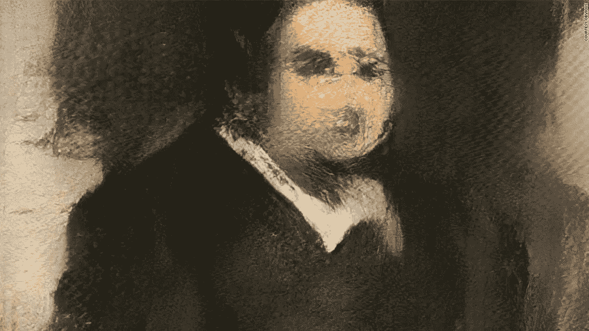

# 巧妙的情报

> 原文：<https://medium.datadriveninvestor.com/artful-intelligence-f00fa2c0dbeb?source=collection_archive---------28----------------------->

不久前，我在 Twitter 上滚动浏览，看到了一个关于艺术品拍卖行佳士得(Christie's)的病毒式故事，该拍卖行以 43.25 万美元的价格售出了第一件人工智能(AI)创作的艺术品。简而言之，这幅作品，或者说是制作这幅作品的算法，是由一个名为“显而易见”的团体创作的，他们是一群对人工智能感兴趣的艺术家。他们的目标是通过机器学习来复制创造力，在机器学习中，算法通过分析大量图片来学习，然后试图基于这些多种来源来重建这些图片。在佳士得售出的这幅画描绘了一个名叫 Edmond Belamy 的虚构人物，他以 18 世纪的肖像风格绘制，佳士得声称这种风格很难由计算机复制，因为人脸的曲率和复杂的细节。你可以在他们的网站上看到更多明显的“实验”——点击链接。> >[http://obvious-art.com/gallery.html](http://obvious-art.com/gallery.html)

Edmond de Belamy, sold at Christie’s, New York, current owner Anonymous, Photo credit @ Obvious (2018)

在使用人工智能创造艺术方面，明显不是一个孤立的例子。机器人画家 E-David 通过它的一只机器手臂自主而真实地创造出非凡的艺术品。在一个视频中，我们看到一个平稳的机械运动，一把刷子浸入颜料中，然后滑到画布上，颜料被准确无误地涂在画布上。机器人停下来，思考，反思它的绘画，以便处理它的下一个动作；在这里刷一下，在那里涂一点颜料，我们就可以看到这幅画的完成。正如你从照片中看到的，e-David 和 Obvious 的作品看起来是“真实的”,因为它们反映了一种你可能只认为可能来自人类创造的艺术品的氛围。

在探索这些人工智能艺术作品的过程中，我开始反思摄影以及它在 19 世纪末和 20 世纪初受到的反应。总的来说，在这段时间里，摄影因其作为艺术媒介的主张而受到了强烈反对。正如丽莎·霍斯特勒所指出的，1888 年第一台柯达相机的推出导致了“一大批周末“快照人”入侵摄影领域”。这种入侵削弱了摄影作为一种艺术形式的主张，因为摄影开始被许多人认为是任何人都可以做的事情；这是一种简单的再现现实的方法，不像真正的艺术那样需要努力、耐心和时间。因此，对一些人来说，照片只是真实生活的快照，它不是“真正的”艺术，它不像“真正的”艺术那样拥有任何形式的光环或情感联系。然而，这并不是每个人的感觉，正如彼得·沃什指出的那样，一些人认为摄影是艺术界的一种关键的新媒体，它可能会改变艺术家、画廊和博物馆对收集、展示和制作艺术品的看法。摄影可以产生现实的“真实”，减少艺术中的人为错误。对这些人来说，摄影是一种非常有价值的艺术形式，也是一种新的媒介，将彻底改变人们对艺术的看法。

回到 Twitter 的故事，我发现了对人工智能作品类似的声音反应；一位推特用户说，对一些人来说，这似乎很“荒谬”，“这不是艺术”，“只有人类才能创造艺术”。其他人似乎印象更深刻；另一位推特用户说，这代表了人类历史上的一个技术里程碑。

像摄影一样，对人工智能创造的艺术品及其真实性似乎有极端的看法。人工智能是一种新的，创新的，对一些人来说，是一种神秘的技术。这种未知的气氛导致人们做出不同的反应。同样，摄影被认为是突然涌入艺术界的未知新技术。自然，一些人对此反应消极，因为这些技术被视为挑战当前艺术传统的现状及其真实性。这并不是说人工智能将对艺术界产生与摄影相同的影响，但这种比较有望强调，对艺术中的新技术产生极端的反应是很自然的。重要的是，摄影和人工智能等新技术引发了我们如何看待和考虑艺术的新讨论。关于摄影作为艺术的讨论带来了照片分离运动等运动，这些运动不仅倡导摄影作为艺术媒介，而且倡导摄影的新技术，从而发展了技术。这样的讨论也引发了对艺术真实性的思考，如何通过光和颜料的技巧来感知眼睛(查看绘画艺术)，以及绘画中摄影技术的渲染(查看乔治亚·奥基夫的纽约绘画)。也许艾的作品有可能挑战我们今天对艺术的看法，或者这只是佳士得的一次出色的营销活动。不管怎样，我们都不应该简单地绕过这个可能是艺术史经典中的关键时刻，而是开始对话。

参考资料:

大卫。(2013).‘大卫机器人绘画’，*维梅奥，*https://vimeo.com/68859229

霍斯特勒，丽莎。(2000).“美国的绘画艺术”，载于*海尔布伦艺术史年表*。纽约大都会艺术博物馆，[http://www.metmuseum.org/toah/hd/pict/hd_pict.htm](http://www.metmuseum.org/toah/hd/pict/hd_pict.htm)

沃尔什彼得。(2007).后摄影博物馆的兴衰:技术和艺术的转变。)*数字文化遗产理论化，*麻省剑桥&伦敦，麻省理工学院出版社