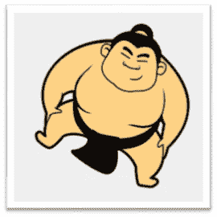
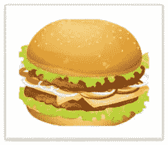
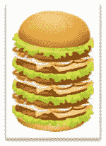

# 人工数据增强

> 原文：<https://medium.datadriveninvestor.com/artificial-data-augmentation-55ccd8503424?source=collection_archive---------6----------------------->

# **简介**

I:把下面的人和食物搭配起来

人们

Teenager and Sumo

汉堡包

One Big Burger and One Small burger

你:相扑要大汉堡，青少年要小汉堡。

I:你为什么要这样搭配，为什么不这样搭配呢？

你:相扑需要摔跤，他需要更多的能量，而大汉堡可以满足他，作为一个青少年，他通常的生活方式小汉堡就足够了

> *“深度神经网络也是如此”*

深度神经网络越大，对数据的需求就越大。如果没有足够的数据来训练神经网络，可能会导致错误的预测。

但是如果，你只有有限的数据，想训练一个神经网络呢？**人工数据增强**的过程。这是一个从现有数据创建合成数据的过程，通过对现有数据进行少量修改来创建从神经网络的角度来看是独特的数据。

# **人工数据增强技术**

当谈到“人工数据增强”时

有很多技术可以探索。值得一提的是…

注意:我们正在考虑图像数据，它也可以外推到视频

# **仿射变换**

1.平移(X 方向、Y 方向、Z 方向)。

2.缩放(放大、缩小)别名缩放。

3.纯粹的。

4.旋转。

# **线性变换**

5.亮度。

6.对比。

7.高斯噪声。

8.降低分辨率(用不同的插值度量调整图像大小)

# **方向转换**

9.水平翻转。

10.垂直翻转。

# **图像过滤器**

11.模糊(平均、高斯、中值)。

12.伸长(垂直和水平)像伸展的图像。

13.形态转换。

14.物体的颜色反转。

# **现实生活场景**

15.相机镜头上的灰尘(导致图像上随机出现暗点)。

16.图像上有多个随机暗点(图像失真)。

17.雾。

18.下雨了。

19.下雪了。

20.空气中的灰尘。

21.季节变化。

22.光反射(导致图像中出现白点)。

23.相机别名图像稳定的抖动(在视频情况下)。

24.频道转换强度。

需要考虑的一点是，并非所有的转换都适用于所有的场景，基于问题环境，不同的转换将适用于不同的场景。

# **结论**

根据可用数据和所需数据，可以使用不同的数据扩充技术创建合成数据。这样做是为了使神经网络适应实时场景，并在更加鲁棒的环境中进行预测，这使得深度神经网络更加强大，预测误差更小。