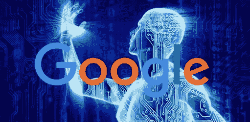
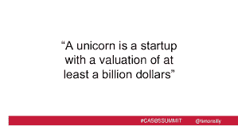
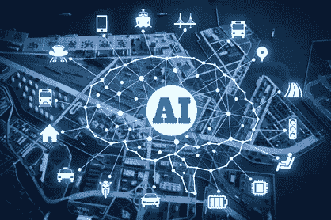
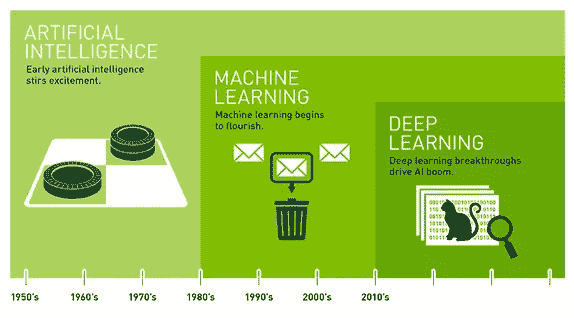
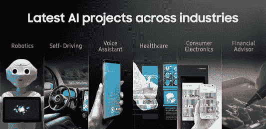

# 人工智能

> 原文：<https://medium.datadriveninvestor.com/artificial-intelligence-6d19a46272cc?source=collection_archive---------2----------------------->

人工智能…我真的应该花时间学习这个吗？

人工智能……这个词获得了太多的关注，而且理由都很充分。它的发展方式让世界敬畏。谷歌和其他主要全球公司将人工智能融入我们日常生活的方式让我们更加舒适和容易，伙计们，这只是开始…

人工智能不仅被跨国公司使用，初创企业也在使用。初创企业的数量正在增长。毕竟我们正处于独角兽时代，这意味着我们显然将看到初创企业的数量呈指数级增长。这意味着我们将看到同样大的增长，人工智能不仅用于编程软件，还用于吸引客户和增加市场价值。

Cute… But not this unicorn

This one!!

鉴于人工智能基本上是我们的世界目前所围绕的，理解人工智能实际上是如何工作的变得很重要，这样我们就可以更好地理解这项有可能永远改变我们生活的技术。

让我们从一个最基本但重要的问题开始…

**什么是人工智能？**

人工智能或 AI 是计算机科学的一个领域，它强调创造像人类一样工作和反应的机器。它基本上是由机器展示的智能，与人类和动物展示的智能形成对比，后者是自然智能(NI)。

在计算机科学中，人工智能研究被定义为对智能代理的研究:任何能够感知其环境并采取行动以最大化其成功实现目标的机会的设备。当机器模仿人类与其他人类思维相关的“认知”功能时，如“学习”和“解决问题”，就应用了人工智能这一术语。

我们知道有两种类型的人工智能，一种是工程师可以将人类智能引入机器或技术(经典人工智能)和/或设计本身可以创造智能的技术(未来人工智能)。疯狂吧？

*好了，现在我们对人工智能有了一个基本的概念，接下来是人工智能如何工作的问题。*

多年来，人工智能开始开发多个子集来进化和产生更好的结果。机器学习是更大的人工智能领域中的一个类别，涉及赋予机器“学习”的能力。这是通过使用算法来实现的，这些算法可以发现模式，并从他们接触到的数据中产生洞察力，以应用于未来的决策和预测，这一过程避免了为每一个可能的行动专门编程的需要。

另一方面，深度学习是机器学习的一个子集:这是最先进的人工智能领域，它使人工智能最接近让机器尽可能像人类一样学习和思考的目标。

我们现在正在开发神经网络(英特尔)。这些都是最清晰、最切实的应用，一旦开发出来，就能带来重大发现。神经网络基本上就像人工智能的大脑，根据它被要求做的功能不断发展。

现在的问题是，为什么我们研究这个很重要？？

*   伙计们，这是未来…随着人工智能带来的大量发展，它很快将成为我们生活的一个主要部分。以下是谷歌最近在 I/O 期间发布的一些[重大公告。这向你展示了人工智能给我们的生活带来了多大的变化。](https://medium.com/heymojo-inc/8-announcements-google-made-at-i-o-and-how-ai-helps-hospitality-businesses-94f3626e31ac)

*   人工智能已经渗透到我们生活的一些主要领域。从网上订餐到买衣服。它已经成为教育系统的一部分。想知道我在说什么吗？

好吧，开个玩笑。

他们还没有完全取代教师，但已经能够更好地帮助教师。

人工智能还被用来帮助医生在疾病发生前进行分析和诊断。

基本上 AI 正在进入我们日常生活的所有领域。那么，理解是什么在这种程度上影响我们的生活难道没有意义吗？

*   如果你打算开一家初创企业，拥有自己的应用程序在当今文化中已经成为一种必需品。应用程序有助于客户轻松快速地访问。

此外，基于算法并拥抱人工智能的公司正成为消费者和寻求投资新创业公司的热门话题。

*   你永远不知道这些信息什么时候会派上用场。随着我们成长在独角兽时代，你会意识到对这方面有基本了解的人是新公司最重要的资产之一。在这个竞争的时代，如果你要成为一个人，你就是一笔资产。公司害怕失去的人。

学习人工智能如何工作和运作有更多的好处，你会在学习的过程中意识到这一点。如果你想立即开始，你可以选择参加在线课程[这里](https://jagdish38.wixsite.com/coremojo)。让未来开始吧！！！

