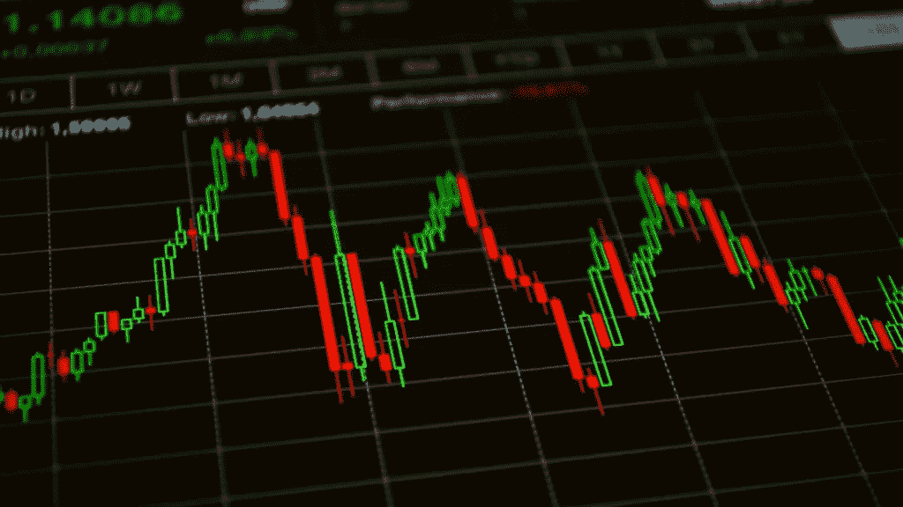
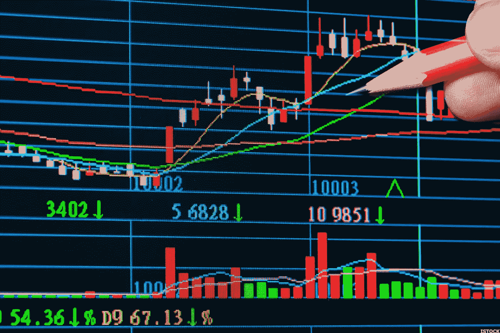
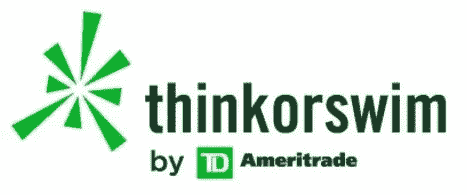
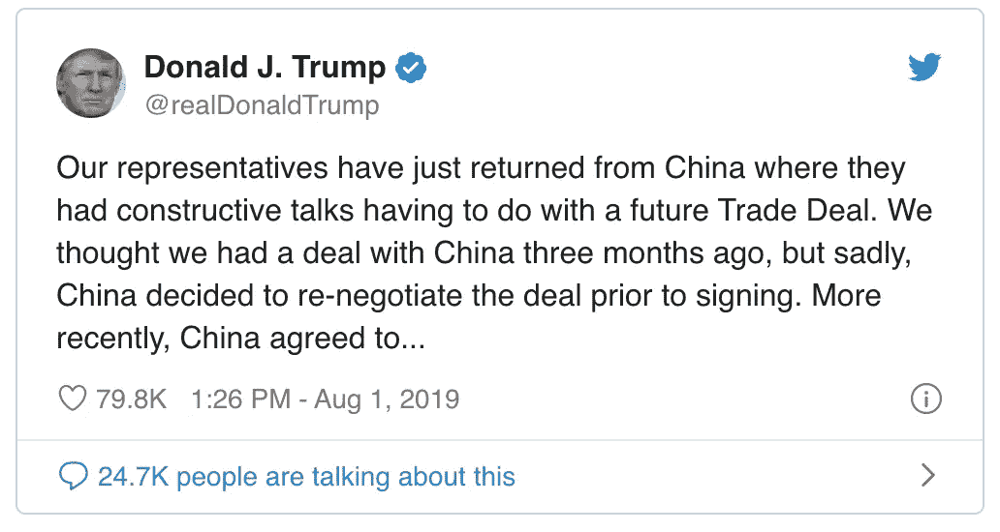
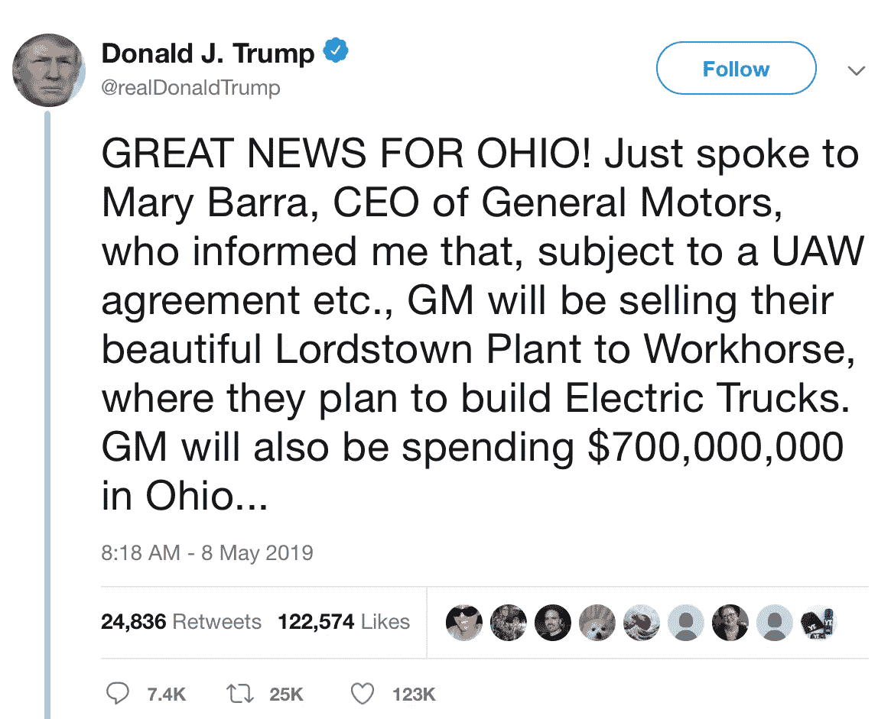
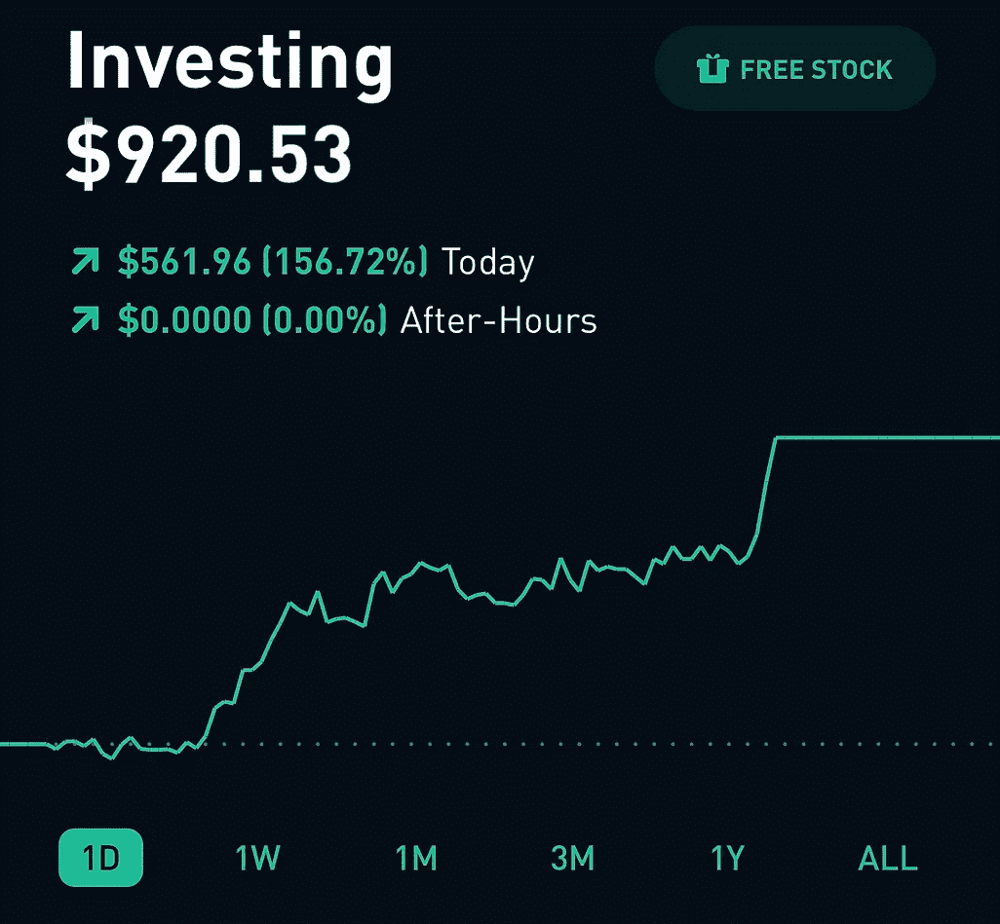
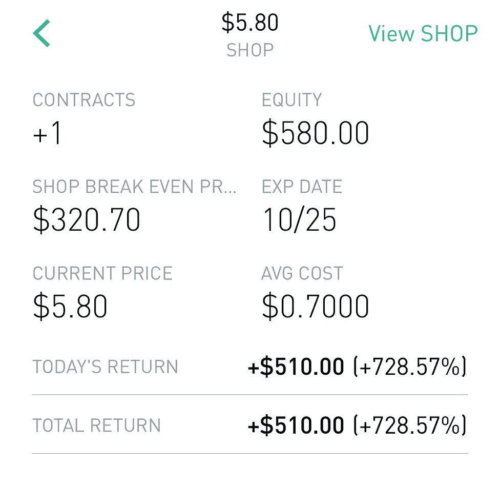
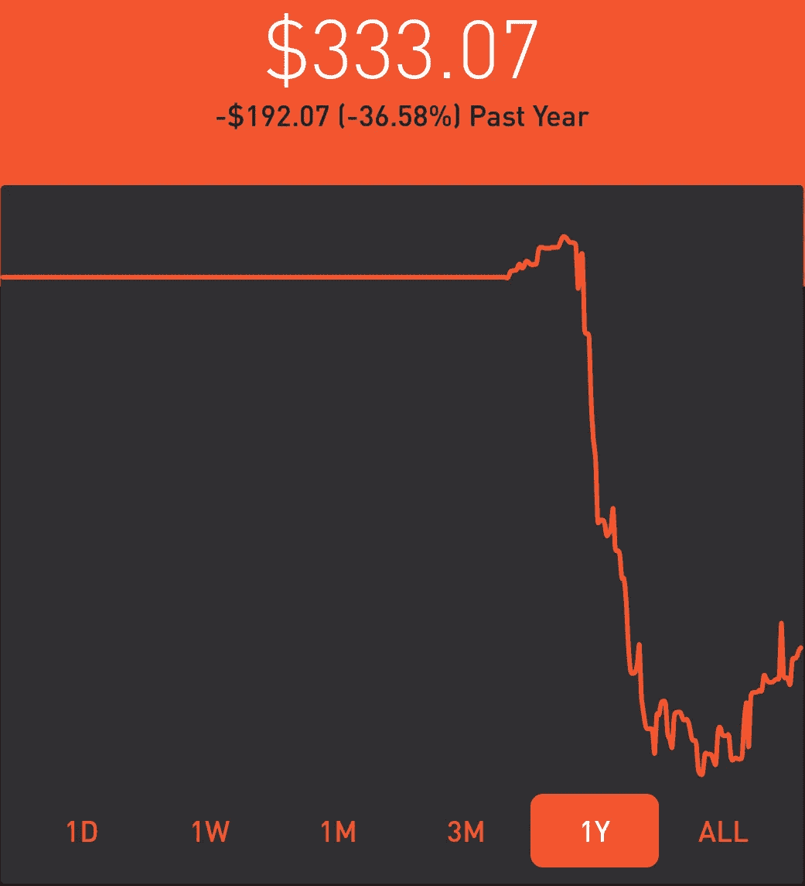
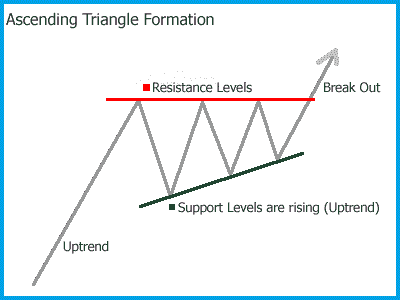
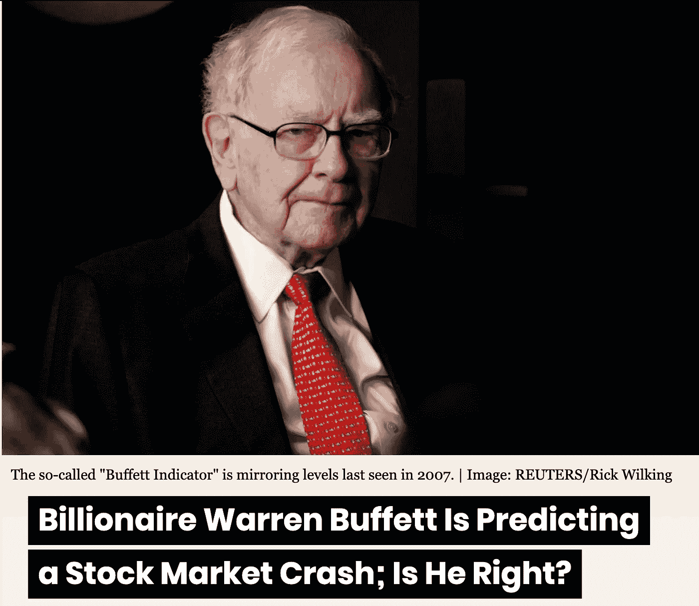

# 人工智能:股票市场的新时代

> 原文：<https://medium.datadriveninvestor.com/artificial-intelligence-a-new-age-in-the-stock-market-991ac08aa11e?source=collection_archive---------1----------------------->

# 什么是股市？

股票市场是一个你可以在任何营业日买卖和交易股票的地方。它由各行各业的公司组成，买卖双方可以在其中协商价格并进行交易。然后，投资者可以在他们之间买卖这些股票，交易所，如纽约证券交易所，跟踪每只上市股票的供求情况。

股份代表公司的所有权，公司被划分为多个单位，允许多人拥有一定比例的业务。

 [## 值得购买的 4 大人工智能股票及其原因|数据驱动型投资者

### 人工智能(AI)在 2019 年继续进入大众意识。通过应用程序…

www.datadriveninvestor.com](https://www.datadriveninvestor.com/2019/03/06/top-4-artificial-intelligence-stocks-to-buy-and-why/) 

# 投资

在熟悉股票如何运作之前，许多人认为投资和交易是一样的，毕竟都涉及到在股市中寻求利润。但是，他们获取利润的手段却完全不同。这种差异可以总结为:**投资是长期的，**而**交易是短期的。**

投资是**积累长期财富的一种方式。当一个人投资一家公司时，他们希望这家公司能在几年甚至几十年的时间内成长。这需要很大的耐心和自律来度过市场的好日子和坏日子。与把钱存在储蓄账户或现金中相比，投资可以多获得数百万美元的退休金。**

*打哈欠*无聊吧。你可能不想在 30 年后赚钱；你现在就想要**。别害怕，因为交易就在这里。**

# **贸易**

****

**交易股票是积累短期财富的一种手段。交易者在几周、几天、几分钟甚至几秒钟内进出股票。想象一下在 30 秒钟内赚到 400 美元…很疯狂吧？嗯，这在交易界也不是闻所未闻。**

**你可能会想，“该死，30 秒内 400 美元。算我一个！”但是**撑住**。我不想打破你的幻想或任何东西，但这首先需要大量的股票分析、经验、计划和资金。**

**“哇，哇，哇……我不想那样做。我只想赚钱。”**

**凭经验我可以告诉你，这是行不通的。就像生活中的其他事情一样，成为一名优秀的交易者需要时间和练习。幸运的是，我们生活在一个什么都有应用的世界。我推荐建立一个 **ThinkOrSwim 纸交易账户来练习**交易。这个应用程序给你假钱，但实时模拟股市，所以你可以随心所欲地练习交易。**

****

**TD Ameritrade’s Brokerage**

**也有许多不同类型的交易。最常见的是黄牛党，日内交易者，和摇摆交易者。**

**黄牛是勇敢的。他们只在交易中做几秒钟的 T4，当你说“等等，什么？”的时候，他们可以进出交易记得我说过，看到有人在 30 秒内赚了 400 美元并不少见，嗯，那些是黄牛。他们在短时间内花了很多钱，寻找股票上涨几美分的机会，这样他们就可以获利。这种交易需要很多知识，因为如果你搞砸了一次，你可能会损失掉你预期的 400 美元。我强烈建议你不要这么做。**

**接下来，我们有日间交易者。这些家伙在白天交易，而且只在白天交易。他们执行日内交易策略，从价格变化中获利。下午 4 点，当市场关闭时，他们的投资组合中没有任何东西，而是在下午 4 点前卖出(T21)。类似于黄牛，这也需要健全的股票知识和分析。**

**最后，我们有摇摆交易者。摇摆交易者和今天的交易者非常相似，除了他们的投资组合中有股票或合约可以隔夜持有。换言之，他们是**日内交易者**。他们可以持有股票/合同几天甚至几周。这需要大量的分析和保证，因为很多事情可能在一夜之间发生，你一般不能在下午 4 点后交易股票。**

**例如，我们……有趣的……总统唐纳德·j·特朗普先生，可以通过一条推特**让市场崩溃或繁荣**。看看下面的推文:**

****

**Donald Trump Tweet on August 1, 2019**

**特朗普的这条推文，或者一些交易员称之为特朗普抛售，导致道琼斯工业平均指数在短短两个交易日内下跌了 3.68%。就背景而言，3.68%相当于 800 多美元。出于这个原因，日内交易者和波段交易者都必须非常小心“特朗普抛售”。**

**相反，特朗普的一些推文可以提振市场。例如，今年 5 月，唐纳德·特朗普(Donald Trump)发出了以下推文:**

****

**在这条推文中，特朗普提到了公司 Workhorse，以及他们如何获得 Lordstown 工厂。同一天，Workhorse 的股价上涨了 250%。显然，特朗普的推文可能对市场非常有益，但也可能非常糟糕，知道如何利用这些推文可以让你赚很多钱。**

**有些人，比如我，即使股市下跌，也可以利用这些推文为 T2 赚钱。**

# **股票预购买卖**

**期权的字典定义是“允许(但不要求)投资者在一定时期内以预定价格购买或出售证券、ETF 甚至指数等基础工具的合同。”让我给你解释一下。**

**期权是一种**合同，赋予买方购买或出售标的资产的权利**，但没有义务。一份期权合约通常代表 100 股股票，要么利润很高，要么亏损很大。**

**然而，如果你知道自己在做什么，期权是非常安全和高利润的。他们允许你在任何时候想卖就卖，并且可以成倍地增加你的投资组合，即使他们开始时只有很少的钱。**

****

**此外，**期权即使在市场下跌时也有效**，这意味着在市场上涨和下跌时都有可能赚钱。**看涨期权**是你在预期股票会上涨时买入的合约，而**看跌期权**是你认为股票会下跌时买入的合约。无论哪种方式，你都可以赚很多钱。**

**让我举一个例子来说明看涨和看跌期权合约是如何运作的。假设我们在看一只股价为 300 美元的股票。假设你认为**股价会上涨**，这意味着你会**买入看涨期权**。你会想买一个价格为 0.70 美元的看涨期权。因此，如果你的 70 美分合约**的价值上升 1 美分，那么你将赚 1 美元**，因为这份**期权合约代表 100 股**。同样，如果合约价格下降 1 美分，你将损失 1 美元。**

**现在假设你有**看跌期权合约**。我们可以使用与上面相同的例子，所以你有一只股票，它的股价是 300 美元，但是这一次，你**预期股价会下跌**，这意味着你会买入看跌期权。你会买一份价值 0.50 美元的看跌合约。因此，如果合约价值上涨 1 美分，意味着股价下跌，那么你将赚 1 美元。**

**看看下面的图片:**

********

**这是我两天前在⬆️的作品集。我从 320 美元开始，通过一个看涨期权合约，我得到了 510 美元的 728%的回报。当我拿到合约的时候，它的价值是 0.70 美元，到那天结束的时候，它的价值是 5.80 美元，这意味着我赚了 510 美元。那天我收了 920 美元。但是等等…不要太兴奋，因为也有一些糟糕的日子，你**可能会损失很多钱**。虽然我没有自己的亏损图片(因为谁会给亏损拍照)，但这和我一周前面临的一个情况差不多。**

****

**交易股票有很多风险，这就是 T4。然而，我们生活在一个科技发展到干扰一切事物的时代，包括股票市场。**

# **技术在哪里？**

**如今，人工智能系统正在使用**深度学习技术来识别人类可能无法识别的股票图表中的模式**。**

**例如，有一个被交易者称为**上升三角形**的常见模式。这种模式表明**股价将上涨**。人类可能无法足够快地识别这种模式，甚至根本注意不到它。但是人工智能系统将能够立即识别这种模式。**

****

**Ascending Triangle Pattern**

**此外，人工智能系统将**使用历史数据来学习市场对过去事件的反应**。基于这些反应，他们可以**学会在未来的市场条件下以更有成效的方式**行动，使他们更加准确和可靠。**

**所以现在你可能会说，“等等，那我们为什么不用人工智能来交易呢？”**

**嗯，今天人工智能在股票市场的最大问题之一是它无法处理极端情况。人工智能系统在正常情况下会很有效率，但一旦发生不寻常的事件，比如经济衰退，它们就会毫无头绪。最近，世界著名投资家沃伦·巴菲特宣布，很快将会出现类似于 2008 年的股市衰退。**

****

**[https://www.ccn.com/billionaire-warren-buffett-predicting-a-stock-market-crash/](https://www.ccn.com/billionaire-warren-buffett-predicting-a-stock-market-crash/)**

**在这种情况下，人工智能系统将毫无头绪，因为它不具备处理股票市场中非自然和非正统变化的能力。如果衰退真的发生了，那么人工智能系统将不知道该做什么，它可能会失去你所有的钱。**

**人工智能在股票市场面临的另一个巨大问题是关于如果系统确实亏损了谁该负责的讨论。如果你选择使用一家金融公司来为你处理投资事宜，而他们使用的是第三方人工智能系统，那么亏损是该公司的责任，还是创建该系统的公司的责任？**

**很明显，股票市场上有太多关于 AI 的问题，现在，我会坚持做我自己的财务决定，**我强烈鼓励你们在不久的将来开始交易或投资。****

# **交易提示:**

*   **在你做任何事情之前，先弄清楚你想做什么类型的股票交易/投资。确保它适合你，而不是你旁边的人。**
*   **开始交易前先练习；不要因为不知道该做什么就直接投入，挥霍掉所有的钱。用 ThinkOrSwim Papermoney 练习用假钱交易。**
*   **学习如何分析图表，识别模式，并利用新闻来预测股票的走势。**
*   **你不会赢得所有的比赛，这并不重要。重要的是你要从错误中吸取教训，并且赢的比输的多。**
*   **不要因为一次交易或投资失败就放弃。赚钱的机会会多很多，丢一个也没关系。**
*   **从小处着手。不要在第一次交易时就花光所有的钱。试着从小交易开始，以减少大量亏损的风险。一次交易应该只花费你投资组合的 5-10%。**
*   **耐心点。我不能告诉你有多少次我过早地退出交易，因为它有一点下降，但后来它以暴涨告终。**

**一定要留下拍手声👏如果你对这篇文章有任何问题或评论，请随时给我发电子邮件。**

** [## 人工智能和动态定价-当今科技巨头的秘密武器|数据驱动的投资者

### 一人一价！价格标签的发明发生在 19 世纪 70 年代，以维护每个人的公平…

www.datadriveninvestor.com](https://www.datadriveninvestor.com/2019/10/12/ai-and-dynamic-pricing-secret-weapon-of-tech-giants-today/)**