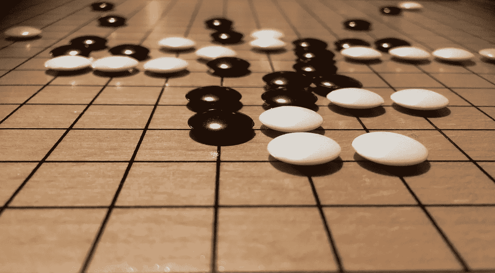

# 人工智能:拯救人类的非技术性指南

> 原文：<https://medium.datadriveninvestor.com/artificial-intelligence-a-non-technical-guide-to-save-humanity-574bd30e3d00?source=collection_archive---------13----------------------->

## 第二章:历史:计算机械和智能(1950)

Image by Jonathan Reichel from Pixabay

虽然人们普遍认为人工智能领域始于 1956 年的达特茅斯人工智能夏季研究项目，但我想让我们的旅程提前一点开始:1950 年。就在那时，五年前帮助盟军赢得第二次世界大战的著名人物艾伦·m·图灵写下了他的论文[计算机械与智能](https://www.csee.umbc.edu/courses/471/papers/turing.pdf)。在书中，他提出了一种测试机器“思考”能力的方法。这篇论文没有给出思维的定义，而是描述了图灵所谓的模仿游戏(2014 年关于图灵的电影以此命名)，后来被称为图灵测试。

## 图灵测试

图灵测试的工作原理是让一个询问者通过文本与一台机器(A)和一个人(B)对话，这两个人对询问者来说都是不可见的。询问者知道他们是 X 和 Y。通过与 X 和 Y 交谈，他必须决定 X 是 A 而 Y 是 B 还是 X 是 B 而 Y 是 A。人们可以想象一个类似的游戏，其中 A 和 B 不是人和机器，而是一个男人和一个女人。“机器能思考吗？”然后可以被一个问题代替，询问者在与机器和人的游戏中是否像在与男人和女人的游戏中一样经常出错。

 [## 人工智能与创造力:作为创意引擎的比根——数据驱动的投资者

### 的确，2018 年可以被视为人工智能创造的创造力全盛时期的开始。当然可以…

www.datadriveninvestor.com](https://www.datadriveninvestor.com/2019/02/13/ai-creativity-biggan-as-a-creative-engine/) 

当然，智力和意识是有争议的话题，图灵测试也受到了不少批评。也许最著名的是，约翰·塞尔认为，人们不能仅仅通过观察机器的行为来确定智力，智力和“模拟”智力是有区别的。他的论点被称为[中文房间](https://web.archive.org/web/20071210043312/http://members.aol.com/NeoNoetics/MindsBrainsPrograms.html)论点，我们稍后将更详细地讨论它。这里的重点是，尽管存在争议，艾伦·图灵确实开创了人工智能领域，除此之外还做了一些重要的事情:将重点放在机器的实际影响上，而不是放在关于其内部工作的模糊定义上。