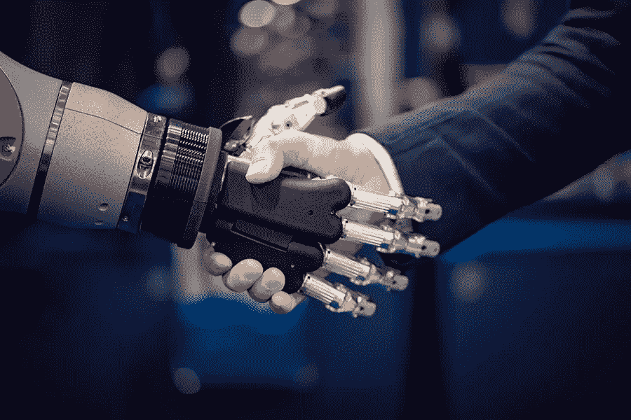

# 人工智能，充满希望的未来还是可怕的结局？

> 原文：<https://medium.datadriveninvestor.com/artificial-intelligence-a-promising-opportunity-or-the-terrifying-end-e2fd7de6808a?source=collection_archive---------6----------------------->

“I’m a man of my word,” said the robot.

每个人都认为未来充满了杰出的进步和有前途的技术。在几年内，这些普遍的进步可能会让自动飞行汽车变得司空见惯。去另一个星球看望你的祖父母会成为周日的例行公事，拥有一个烹饪机器人会比一个意大利主厨更奢侈。这些改善都是人工智能的结果。

斯坦福词典更好地定义了人工智能，它是“制造智能机器，尤其是智能计算机程序的科学和工程”如果你仔细想想，人工智能在几年前就开始了，每次都给我们带来更聪明的创新。例如，我们有 Siri 来帮助和促进智能手机的使用，视频游戏中的机器人，谷歌和特斯拉的自动驾驶汽车。我们在亚马逊上也有购买预测(它预测，如果不是影响，你的需求)和欺诈检测，它分析欺诈的速度比人眨眼还快，准确地说是 40-60 毫秒。

 [## 今年值得关注的人工智能趋势——数据驱动的投资者

### 预计 2019 年人工智能将取得广泛的重大进展。从谷歌搜索到处理复杂的工作，如…

www.datadriveninvestor.com](https://www.datadriveninvestor.com/2019/02/19/artificial-intelligence-trends-to-watch-this-year/) 

虽然人工智能带来了令人难以置信的创新，但它也带来了一个关于其威胁的巨大问题——人工智能代表了一个充满希望的机会还是一种威胁性的进化？回答这个问题相当棘手。众多的期望:智能移动的自动驾驶汽车，帮助医生进行诊断的超级智能医疗助理，以及将会很好地照顾我们的老人的所谓的护理机器人。**尾巴**，恐惧:机器大规模取代人类工人，无人驾驶汽车，种族主义机器人，将使人类过时的超级智能。

我们应该考虑人工智能逐渐导致“机器人启示录”还是蓬勃发展的新机遇？

**深度学习**

然而，在这场进化中令人震惊的新秩序是人工智能的“深度学习”。主要区别在于机器如何自我学习。人们期待它掌权，因为它的超能力比受过伦理教育但仍然有限的大脑强大得多。

深度学习是如何运作的？对于一个识别汽车的程序来说，程序员将向程序“输入”数百万张汽车照片。一旦经过训练，该程序现在可以通过联想识别新图片中的汽车。

的确，是我们人类给了机器力量。当咖啡壶过热时，我们可以拔掉插头。因此，我们应该能够一起控制人工智能的力量，并引导它为我们服务。如果机器的行为导致了我们没有预料到的事情，我们应该能够在任何时候关闭机器。

工作岗位的替换或创造的工作岗位？

然而，主要的担忧是人工智能正在快速创新。我的意思是，我不得不修改这篇研究论文太多次，只是为了让它跟上时代。但显然，这不是问题所在。相关的方面是，在未来，无数的工作将被机器取代。不幸的是，这已经在工厂开始，人工智能将在全球范围内逐步取代人类工人。

据《福布斯》报道，不仅工厂里的工作会消失，像会计师这样的职业也会被一套套算法层压，银行出纳员和电话销售接线员很快会被软件和智能手机应用程序取代，建筑工人会被全天候工作的机器和 3D 打印机取代。这些变化将产生大量失业人员。因此，当涉及到被拒绝的人时，将会有很大的不公平。证明这一点的最好例子是考虑 Whatsapp 和标致这两个组织。Whatsapp 有五十五名受薪员工。它是四年前创建的；它的价值是 190 亿美元。标致拥有超过 10 万名受薪工人，创建于一个多世纪前；它的价值是 120 亿美元。的确，55 名天才工人在 4 年内创造的经济价值比 10 万多名工人在几个世纪内创造的还要多。著名未来学家、麻省理工学院毕业生雷·库兹韦尔(Ray Kurzweil)表示，“2045 年，人工智能将比所有人脑强大十亿倍。”换句话说，他认为，在某种程度上，人工智能的能力可能是 80 亿个大脑加起来的 10 亿倍。

然而，我们不要忘记，人工智能及其算法已经包围了我们多年，而且它们确实取代了乔布斯。与此同时，这在其他地方创造了新的技能和机会。考虑过时的工作，如打字或总机接线员。这些工作不再存在了。现在，想想打字机时代不存在的各种职业:应用程序开发人员、社交媒体经理、优步司机、无人机操作员，甚至博客写手。你能感觉到进化吗？

**教育现在和未来的机遇**

显然，我们需要预测这些快速到来的变化。我认为相关的答案在于教育。我们应该开始逐步改变普及学校的教育体系吗？或者我们应该继续培养伟大的会计师和金融分析师？纵观这一演变，很明显，学校发生了变化；我们从黑板转向了苹果电视，从手写文章转向了打字。虽然这些改进有些革命性，但似乎我们并没有具体制定一个有影响力的教育，将几代人转变为技术社区(未来的唯一社区)中足智多谋的领导者。从历史到今天，初级教育机构一直在教授那些不会把年轻领导人培养成我们这个世界所需要的领导人的科目。即使学校带来了新的策略和方法，他们仍然在教授同样的科目。首先，我们需要采取一种学校制度，在人工智能无法超越我们的领域形成学生。未来学家大师说，人文学科的工作不太可能被人工智能取代。建筑、心理学、精神病学、哲学、文学、人类文化是绝对不会被人工智能赶上的职业。然后，我们必须培养 NBIC 档案中的学习者——纳米技术、生物技术、信息技术和认知科学是教授的主要科目。最后，我们应该创建符合必要的就业市场要求的档案，这样我们才不会过时。如果我们不适应工作中的革新，我们将不再是日益挑剔的就业市场的优秀人才。我们将向现在和未来的几代人传授这三个就业市场要求:1)开发，拥有编码和编程技能的人 2)设计，拥有数字设计和摄影技能的人 3)营销，拥有营销和商业技能的人。这些因素将成为重要的技能，使候选人在多个领域有所不同。

这将使我们人类不会因这场革命而落伍，也不会坐等建设未来的信号。人工智能显然不是一套我们可以把世界塞进去的现成服装，而是一件每个人都应该参与剪裁的定制服装。

**结论**

总而言之，我们应该问自己，弗兰肯斯坦的生物成为人类威胁的神话现在是否正在随着人工智能而成为现实。我坚信我们应该对它的潜力保持乐观，而不是害怕它的威胁。人工智能创新是不可逆的；它们会比我们预期的更早发生。想象一下这样一个世界，在这个世界里，护理机器人将让你有机会在世界的另一端工作时照顾你的老祖父，在这个世界里，机器可以预测灾难并拯救生命。想象一下，一台机器可以通过常规诊断在几秒钟内检测出任何疾病。想象人工智能发挥最大作用。随着教育系统的全球性变化，我们可以实现我们对未来技术的愿景。AI 是一架飞行的飞机，我们需要建造一条建造良好的跑道，让这架飞机安全着陆。

嘿，如果你喜欢读这篇文章，请在 Twitter @Salimeljai 上关注我。如果你有任何问题，随时给我发电子邮件:s.salimeljai@gmail.com。

干杯！