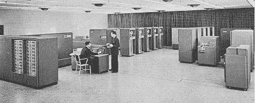

# 人工智能(AI)与 21 世纪的商业

> 原文：<https://medium.datadriveninvestor.com/artificial-intelligence-ai-and-business-in-the-21st-century-84d32bfae553?source=collection_archive---------6----------------------->

## 一个关于人工智能的问题。

所有企业主或首席执行官都应该定期问自己以下问题:我可以利用什么新引进的科学来提高公司的底线，通过提高生产率、降低成本、让公司更环保和最大化效率？

The First Mechanized Assembly Line

亨利·福特是最早提出这个问题的商人之一，他通过将机械化这一相对较新的发明融入到他的行业中来回答这个问题。

在他发明移动装配线之前，汽车是手工制造的。这是非常劳动密集型的，非常依赖于稳定、可靠和健康的劳动力，而且成品价格昂贵。

 [## 今年值得关注的 5 大人工智能趋势|数据驱动的投资者

### 预计 2019 年人工智能将取得广泛的重大进展。从谷歌搜索到处理复杂的工作，如…

www.datadriveninvestor.com](https://www.datadriveninvestor.com/2019/02/19/artificial-intelligence-trends-to-watch-this-year/) 

所有企业主或首席执行官都应该定期问自己以下问题:我可以利用最近引入的哪些科学来提高公司的底线，通过提高生产率、降低成本、让公司更环保和最大限度地提高效率？

这个问题在今天和在 1908 年一样重要。无论你的企业是小型、中型还是大型，通过引入人工智能，企业运营的大多数方面都可以在对资源影响较小的情况下得到改善。就像所有被引入普通用途的新技术一样，无论是在商业还是在日常生活中，该技术的使用越普遍，最终用户的成本就越低。通过广泛使用的同样的价格下降现在正在人工智能行业发生。

Early Personal Computers

今天人工智能的定位可以与个人电脑(PC)的推出相提并论[2]。在 20 世纪 80 年代之前，除了业余爱好者和计算机技术人员之外，个人电脑在中小型企业或主流社会中并不存在，而且当时一般只能以自己动手的套件形式获得。在大规模引进个人电脑之前，计算机是大企业、大学和政府的唯一领域，其形式是由一组职员操作的大型计算机，价值数百万美元。直到微处理器的开发和大规模生产，计算机的尺寸才开始随着价格一起缩小。试着想象一下今天没有电脑也能做生意。人工智能现在处于计算机化刚被引入时的位置。就像 80 年代的个人电脑一样，21 世纪的人工智能正在走向成熟。

Big Data and Artificial Intelligence

大多数人不知道人工智能已经成为他们日常生活的一部分。我们周围有许多使用人工智能的例子，从语音驱动的个人助理，如 Siri 和 Alexa，到银行和其他金融机构使用人工智能来监控欺诈。人工智能是飞机自动驾驶系统不可或缺的一部分，现在正被用于智能家居和建筑的创建。如果你拥有一部智能手机或在社交媒体上，你肯定在与人工智能互动。视频游戏市场是一个巨大且不断增长的行业，从一开始就接受了人工智能。

如果你是一个正在阅读这篇文章的企业主，你需要思考以下问题:人工智能如何让我的企业更有效率、利润更高、资源更少、更安全？如果你是一家实体企业，安全可以被认为是保护数据和专有信息和/或保护你的场所。无论你拥有或管理什么类型的企业，人工智能都可以在许多领域提高效率和安全性。

Predecessors of AI

以客户数据为例。虽然人工智能对于能够获得大量消费者和客户数据的大公司来说是不可或缺的，但对于希望从更少量的信息中得出有意义的结论的小企业来说也是至关重要的。统计回归分析(一种允许检查两个或多个感兴趣变量之间关系的机器学习方法)[3]等高级技术过去对于预算有限的小型企业来说过于昂贵。

人工智能已经使许多分析技术变得负担得起和直观。未能管理数据并将其整合到营销运营中的企业将面临风险。了解谁是你的客户，保持你的数据最新(电子邮件、电话号码、网址、商业地址、购买偏好等)可以在当今竞争激烈的全球商业环境中提供竞争优势。

无论你的企业是大是小，是实体企业还是基于网络的企业，如果你不准备将人工智能融入你的商业模式，你就打算落后。就这么简单。

如果你不能决定人工智能是否适合你的业务，考虑以下人工智能不可或缺的领域；计算机视觉、自然语言处理、方法论、语音、图形、游戏、时间序列、音频、机器人、音乐、计算机代码、推理、知识库和对抗技术。你生意中最好的新伙伴可能就是你友好的邻居人工智能顾问。

**参考文献**

【1】亨利·福特【http://xroads.virginia.edu/~ug02/barnes/hford.html 号

[2]维基百科[https://en.wikipedia.org/wiki/Home_computer](https://en.wikipedia.org/wiki/Home_computer)

[3]商业统计[https://www . practical commerce . com/using-regression-analysis-to-drive-ecommerce-sales](https://www.practicalecommerce.com/using-regression-analysis-to-drive-ecommerce-sales)