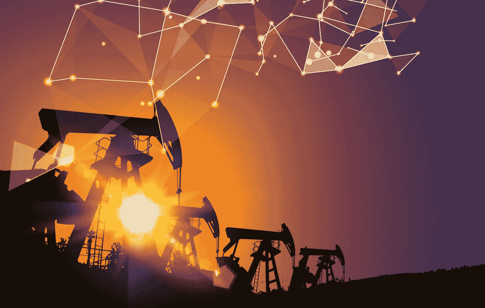

# 人工智能(“AI”)与石油和天然气行业

> 原文：<https://medium.datadriveninvestor.com/artificial-intelligence-ai-and-the-oil-gas-industry-d3f63771d58?source=collection_archive---------11----------------------->

photo via google images

石油，通常被称为*黑金*，是能源领域最有价值的商品；但是，随着对环境问题的日益关注，公司正在积极寻求创新方法来减少对环境的影响。

根据[市场和市场](https://www.marketsandmarkets.com/Market-Reports/artificial-intelligence-oil-gas-market-87246288.html)研究，石油和天然气行业的人工智能( **AI** )预计将从 2017 年到 2022 年增长，到 2022 年达到 28.5 亿美元的市场规模。这一增长得益于大数据技术的采用，通过采用各种预测算法、分析、自动化系统等实现了石油和天然气行业的数字化，北美预计将成为最大的市场。经济学家甚至认为数据是数字时代的石油。

石油有各种成分:**上游**(勘探和生产)**中游**(石油和天然气的拥有、运输和储存)和**下游**(炼油厂)——人工智能可以在每个领域提供帮助，从传感器和软件的进步到管理大量收集的数据。

2016 年，ExxonMobile [与麻省理工学院](https://energyfactor.exxonmobil.com/news/mit-collaboration/)(**MIT**)合作，打造“自主学习、用于海洋探索的潜水机器人。”这些机器人有能力探测海底的自然渗漏。根据国家地理的说法，这些渗漏，或者说*泄漏*，发生在“石油从高压海底岩石中逃逸到水柱中的时候”据估计，北美地表下 60%的石油是由这些渗漏造成的。事实上，加州的圣巴巴拉有世界上最大的渗漏点之一。这些机器人不仅可以帮助保护生态系统，还可以搜索和定位石油资源(油藏)。

其他石油公司如荷兰皇家壳牌(" **Shell** ")正在整合[虚拟辅助](https://www.shell.com/business-customers/lubricants-for-business/news-and-media-releases/2015/artificial-intelligence-powered-service-for-lubricant-customers.html)功能。天然气和新能源业务负责人 Maarten Wetselaar[表示](https://www.wsj.com/articles/silicon-valley-courts-a-wary-oil-patch-1532424600)他“可以想象[壳牌]与数字公司竞争，也可以与数字公司合作。”此外,[华尔街日报](https://www.wsj.com/articles/silicon-valley-courts-a-wary-oil-patch-1532424600)报道称，雪佛龙与微软签署了一项为期七年的协议，存储雪佛龙生成的数据，并允许对其进行实时分析。

为此，首席执行官们将技术颠覆视为*机遇*在[发表观点](https://home.kpmg.com/xx/en/home/insights/2018/09/2018-kpmg-ceo-outlook-oil-and-gas.html):“技术正在颠覆石油和天然气行业的现状。人工智能和机器人解决方案可以帮助我们创建模型，这些模型将更准确地预测行为或结果，如提高钻井平台的安全性，更快地派遣工作人员，甚至在系统故障出现之前就发现它们。美国毕马威(KPMG)能源和自然资源全球部门主管雷吉娜马约尔(Regina Mayor)表示:“这种程度的可预测性会对我们的行业产生深远影响。