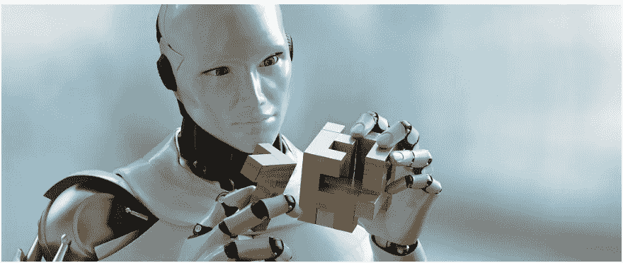

# 人工智能(AI)正在改变我们所知的世界……不管是好是坏。

> 原文：<https://medium.datadriveninvestor.com/artificial-intelligence-ai-will-save-the-world-or-take-over-the-world-3b74d32f554?source=collection_archive---------18----------------------->

自从人工智能出现以来，我们已经看到它几乎彻底改变了每个行业。从 Siri 到自动驾驶汽车，人工智能的快速发展让人类获得了速度、效率和便利等好处。但是，机器越接近真正适应类似人类的品质，它们就越强大。

AI 是什么？人工智能是一个极其广阔的领域，它结合了许多概念和算法，允许机器在没有人类帮助的情况下，通过检测模式从大量数据中学习。AI 最大的应用之一就是机器学习。有很多方法可以用来“教”机器，但最常用的两种方法是监督学习和非监督学习。

例如，第一次教孩子骑自行车，可以用类似的方法。在允许孩子尝试不同的自行车骑行方式之前，向他/她展示正确和错误骑行的方式，将允许他/她使用所提供的例子作为参考点来确定成功或失败。这样的学习是有监督的。与有监督的学习相反，无监督的学习会让孩子接触许多骑自行车的场景，并让他或她弄清楚这是否被认为是成功的。在这两种情况下，孩子最终会使用你向他或她提供的信息来学习如何骑自行车，并将数据点添加到他或她的知识宝库中，以强化技能。

人工智能似乎允许人类充分利用他们已经拥有的数据，但我们可能会赋予机器比我们想象的更大的权力。原因如下:

*   机器可以比人类聪明。
*   机器可以放大偏见，这取决于谁和如何被教导，创造了更多的方式来促进种族主义，反犹太主义和其他形式的歧视。
*   机器可以取代那些工作围绕着一系列重复性任务的人。
*   机器，如果被怀有恶意的个人编程，就可能被用来伤害无辜的人。以自主武器为例——无法阻止军用机器人伤害任何被视为机器人“敌人”的人，无论无辜与否。

一些人工智能机器人失控的例子证明了这些危险:

*   脸书的对话机器人鲍勃和爱丽丝最初被设计成以更自然的方式与人类用户进行更好的交流。然而，在很短的时间内，机器人创造了他们自己的语言，即使是机器人的创造者也无法理解:

鲍勃:“我可以，我可以要其他东西吗？”

爱丽丝:“球对我来说是零，对我来说是零，对我来说是零，对我来说是零，对我来说是零，对我来说是零。”

*   微软的 Twitter 机器人 Tay 旨在从与其他用户的互动中学习，它开始进行友好的对话，直到遇到一些不太友好的用户。让我们看看泰开始做什么…

毫无疑问，人工智能的力量正在改变世界，但只有时间才能证明，人工智能生产的机器人是否能够成功实现它们的设计目标，同时与创造它们的技术专家的愿景保持一致。