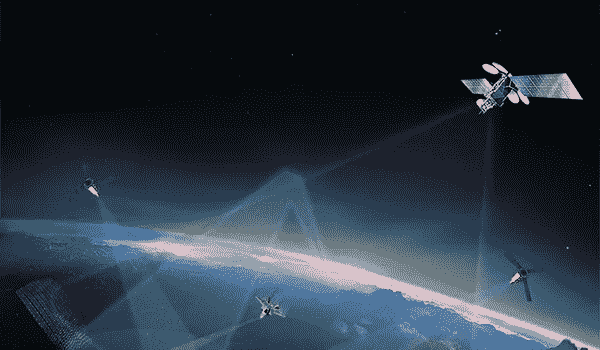
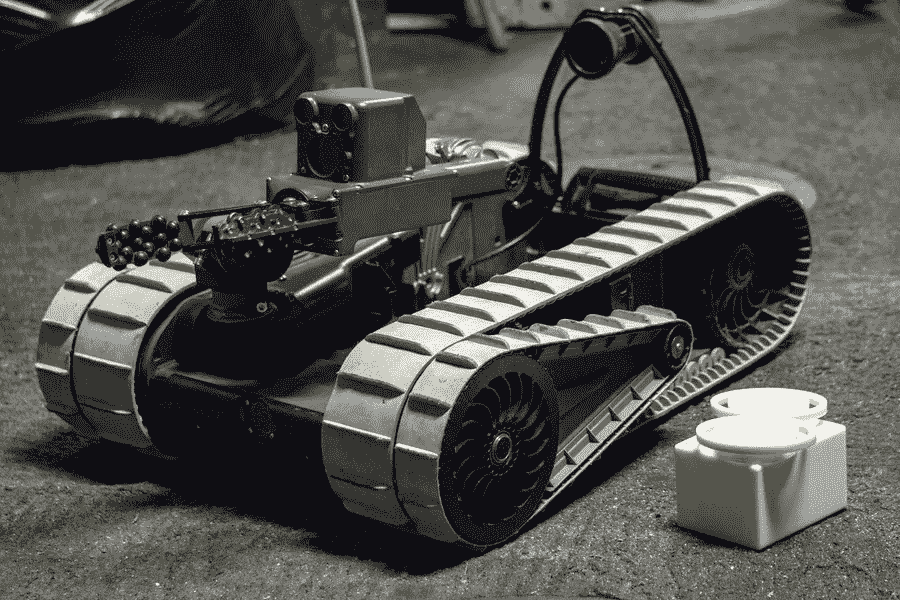

# 人工智能和小行星采矿将是天作之合

> 原文：<https://medium.datadriveninvestor.com/artificial-intelligence-and-asteroid-mining-will-be-a-necessary-match-made-in-the-heavens-9cd46225da23?source=collection_archive---------8----------------------->

[Courtesy agsandrew deviant art](https://www.deviantart.com/agsandrew/art/Emergence-of-Artificial-Intelligence-0001-382221203)

机器人将成为小行星采矿的主要工具。具体来说——自主智能机器人。人工智能将被纳入大量的勘探和采矿机器人中，这些机器人需要成功地回收人类在大约 1.5 亿颗绕太阳轨道运行的小行星中等待着的物质财富。

2018 年 1 月，[行星资源](https://www.space.com/40400-planetary-resources-asteroid-mining-satellite-mission-accomplished.html)将一颗鞋盒大小的卫星 [Arkyd-6](https://directory.eoportal.org/web/eoportal/satellite-missions/a/arkyd-6) 送入轨道，以检查小行星是否适合开采，并测试新一代卫星 Arkyd-301 的系统和组件。这一群卫星旨在前往小行星，近距离观察它们的潜力。这将取决于行星资源公司能否获得资金。

然而，当需要从小行星上获取物质或将其引导到绕地球或月球的轨道上时，复杂的机制和程序将需要人工智能。随着遥控无人机的出现，当小行星接近其轨道上的最远点时，信号将会被延迟几分钟。对于这些任务中的一些来说，这是太多的中断。在几分钟内，事情可能会出错，无意中破坏完成任务所必需的宝贵工具、材料和机器。数十亿美元危在旦夕，他们需要一个现场情报来无缝运行。

不幸的是，我们还没有达到伊恩·M·班克斯[的](https://en.wikipedia.org/wiki/Iain_Banks)[文化小说](https://en.wikipedia.org/wiki/The_Culture_(series))中描述的机器人机器人或者尼尔·阿舍的[政治](https://www.thriftbooks.com/series/polity-universe/44499/)小说中愤世嫉俗的前军事机器人的熟练程度。我预计小行星采矿业务希望技术能够及时满足其需求，从小行星采矿中收获数十亿美元。

Machines in space — courtesy NASA

太空采矿业并不完全是人工智能发展的孤儿。一般来说，军方对无人战斗机的需求同样适用于小行星采矿业的需求。此外，具有人工智能功能的水下无人机将成为海上能源行业的福音。中国正在开发一种水下军用无人机，HN-1 号。

无人机在太空中使用的工具可能与地球上的大不相同，但工具使用背后的原理是相同的。无人机必须解决人类遇到的同样琐碎的问题，并完成手头的任务。

我说“不完全”是孤儿，因为提到了无人机——军用的、水下的等等。—仍在开发中，因此小行星采矿公司将不得不等待并希望从谷歌或政府等知名公司获得技术许可，或者开始自己做这项工作。

[Tracked drone — courtesy DOD](https://dod.defense.gov/News/Special-Reports/0715_science-tech/)

至于太空采矿业是否有资源开发自己的人工智能，这是一个问题。最广为人知的此类公司，行星资源公司，正面临财政困难。裁员后，它计划拍卖剩余的机器和家具。[现在拍卖被推迟](https://www.geekwire.com/2018/planetary-resources-hold/)，公司被以太坊联合创始人之一乔·卢宾拥有的区块链公司 ConsenSys 收购。无论行星资源最终发生什么，小行星采矿业都将继续。回报太大了，不容忽视。然而，它将等待人工智能的发展达到允许无人驾驶探矿/采矿无人机的高原。

考虑成立公司开采小行星的团体应该有一个完整的发展路径，从找到正确的小行星到在开口要钱之前推销其产品。这是因为对于那些从月球基地到轨道栖息地的计划项目来说，这些[物质财富在太空中的价值要大得多。聪明的投资者将奖励那些将人工智能作为这一详细计划不可或缺的一部分的人。](http://www.bbc.com/future/story/20160103-the-truth-about-asteroid-mining)

