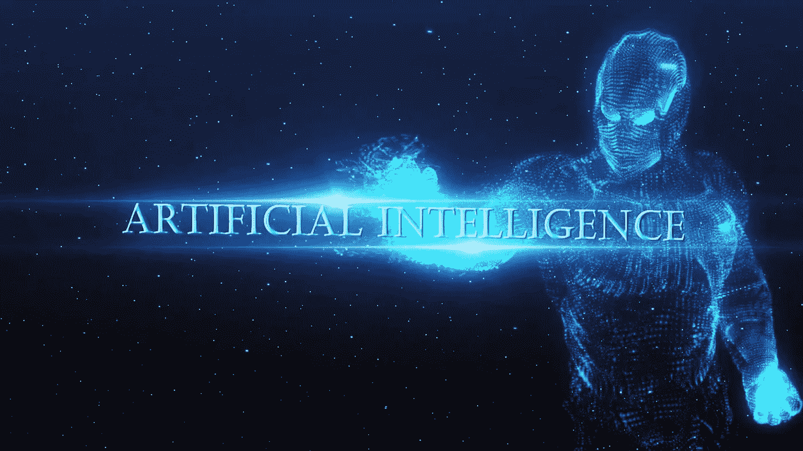
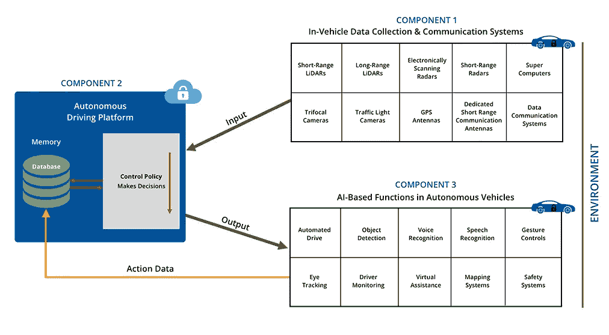

# 人工智能和自动驾驶汽车

> 原文：<https://medium.datadriveninvestor.com/artificial-intelligence-and-autonomous-vehicles-ae877feb6cd2?source=collection_archive---------0----------------------->

人工智能(AI)已经席卷了汽车行业，推动了第 4 级和第 5 级自动驾驶汽车的发展。你认为为什么人工智能现在变得如此受欢迎，尽管它从 20 世纪 50 年代就已经存在了？简单地说，人工智能爆炸背后的原因是我们今天可以获得的海量数据。在互联设备和服务的帮助下，我们能够收集每个行业的数据，从而推动人工智能革命。在努力快速改进传感器和摄像头以生成自动驾驶汽车数据的同时，英伟达在 2017 年 10 月推出了其第一台人工智能计算机，以实现深度学习、计算机视觉和并行计算算法。人工智能已经成为自动驾驶技术的一个重要组成部分，了解它在自动驾驶和联网汽车中的工作方式非常重要。

## 什么是人工智能？

计算机科学家约翰·麦卡锡在 1955 年创造了“人工智能”这个术语。人工智能被定义为计算机程序或机器思考、学习和决策的能力。一般来说，这个术语的意思是[，一台模仿人类认知的机器](https://simple.wikipedia.org/wiki/Artificial_intelligence)。有了人工智能，我们可以让计算机程序和机器做人类做的事情。我们向这些程序和机器输入大量数据，对这些数据进行分析和处理，最终进行逻辑思考并执行人类行动。自动化重复性人类任务的过程只是人工智能的冰山一角，医疗诊断设备和自动驾驶汽车已经实现了人工智能，其目标是拯救人类生命。

## 人工智能在汽车领域的发展

汽车人工智能市场报告称，预计 2017 年其价值[为 7.83 亿美元，预计到 2025 年将接近 1.1 亿美元，CAGR 约为 38.5%](https://www.marketsandmarkets.com/PressReleases/automotive-artificial-intelligence.asp) 。IHS Markit [预测](http://news.ihsmarkit.com/press-release/artificial-intelligence-systems-autonomous-driving-rise-ihs-says)到 2025 年，新车基于人工智能系统的安装率[将上升 109%，相比之下，2015 年的采用率为 8](http://news.ihsmarkit.com/press-release/artificial-intelligence-systems-autonomous-driving-rise-ihs-says)。基于人工智能的系统将成为新车辆的标准，尤其是在这两类车辆中:

1.  信息娱乐人机界面，包括语音识别和手势识别、眼球追踪和驾驶员监控、虚拟辅助和自然语言界面。
2.  高级驾驶辅助系统(ADAS)和自动驾驶汽车，包括基于摄像头的机器视觉系统、基于雷达的检测单元、驾驶员状况评估和传感器融合引擎控制单元(ECU)。

深度学习技术是一种实现机器学习(实现人工智能的一种方法)的技术，预计将成为汽车人工智能市场中最大和发展最快的技术。它目前正被用于自动驾驶汽车中的语音识别、语音搜索、推荐引擎、情感分析、图像识别和运动检测。

## AI 在自动驾驶汽车中是如何工作的？

如今，人工智能已经成为一个热门词汇，但它在自动驾驶汽车中实际上是如何工作的？

让我们首先从人类的角度来看，驾驶汽车时使用视觉和声音等感官功能来观察道路和道路上的其他汽车。当我们在红灯前停下来或者等待行人过马路时，我们正在用我们的记忆来做出这些快速的决定。多年的驾驶经验使我们习惯于寻找我们在路上经常遇到的小事——它可能是去办公室的一条更好的路线，或者只是路上的一个大颠簸。

我们正在建造自动驾驶汽车，但我们希望它们能像人类司机一样驾驶。这意味着我们需要为这些车辆提供人类用来驾驶车辆的感觉功能、认知功能(记忆、逻辑思维、决策和学习)和执行能力。在过去的几年中，汽车行业一直在不断发展，以实现这一目标。

根据 Gartner 的预测，到 2020 年，[2.5 亿辆汽车](https://www.computerworld.com/article/3083426/car-tech/heres-how-ai-is-about-to-make-your-car-really-smart.html)将通过各种 V2X(车对物通信)系统相互连接，并与周围的基础设施相连。随着输入 IVI(车载信息娱乐)单元或远程信息处理系统的信息量的增长，车辆不仅能够捕捉和共享内部系统状态和位置数据，还能够实时捕捉和共享周围环境的变化。自动驾驶汽车配备了摄像头、传感器和通信系统，使汽车能够生成大量数据，当应用人工智能时，汽车能够像人类司机一样看、听、思考和决策。

## 自动驾驶汽车中的人工智能感知动作循环

当自动驾驶汽车从其周围环境中生成数据并将其输入智能代理时，就会创建一个重复的循环，称为感知动作循环，智能代理反过来做出决策，并使自动驾驶汽车在相同的环境中执行特定的动作。下图说明了自动驾驶汽车中的数据流:

[*图 1:自动驾驶汽车中的 AI 感知动作循环*](https://movimentogroup.com/wp-content/uploads/2018/02/AI-Autonomous-Vehicles.jpg)

让我们将这一过程分为三个主要部分:

**组件 1:车载数据采集&通信系统**

自动驾驶汽车配备了大量的传感器、雷达和摄像头，可以生成大量的环境数据。所有这些构成了[数字传感器](http://www.aptiv.com/media/article/2018/01/07/the-autonomous-driving-platform-how-will-cars-actually-drive-themselves)，通过它，自动驾驶汽车可以看到、听到和感受道路、道路基础设施、其他车辆和道路上/附近的所有其他物体，就像人类驾驶员在驾驶时会注意道路一样。这些数据随后由超级计算机处理，数据通信系统用于将有价值的信息(输入)安全地传输到自动驾驶云平台。自主车辆首先将驾驶环境和/或特定驾驶情况传送给自主驾驶平台。

**组件 2:自动驾驶平台(云)**

云中的自动驾驶平台包含一个智能代理，它使[利用人工智能算法做出有意义的决策](https://www.theengineer.co.uk/ai-autonomous-cars/)。它充当自动驾驶汽车的控制策略或大脑。这个智能代理还连接到一个数据库，该数据库充当存储过去驾驶经验的存储器。这些数据以及通过自动驾驶汽车和周围环境获得的实时输入信息有助于智能代理做出准确的驾驶决策。自主车辆现在确切地知道在这种驾驶环境和/或特定驾驶情况下该做什么。

**组件 3:自动驾驶汽车中基于人工智能的功能**

基于智能代理做出的决策，自主车辆能够检测道路上的物体，在没有人工干预的情况下在交通中行驶，并安全到达目的地。自动驾驶汽车还配备了基于人工智能的功能系统，如语音和语音识别、[手势控制](http://bestride.com/news/technology/tech-what-are-vehicle-gesture-controls-and-how-do-they-work)、眼球跟踪和其他驾驶监控系统、虚拟辅助、[地图和安全系统](https://www.nvidia.com/en-us/self-driving-cars/drive-px/)等等。这些功能也是基于自动驾驶平台中的智能代理做出的决策来执行的。这些系统旨在为客户提供出色的用户体验，并确保他们在路上的安全。每次乘坐产生的驾驶体验被记录并存储在数据库中，以帮助智能代理在未来做出更准确的决策。

这个数据循环被称为感知行动循环，它会重复发生。感知动作循环发生的次数越多，智能代理就变得越智能，从而提高决策的准确性，尤其是在复杂的驾驶情况下。联网车辆的数量越多，记录的驾驶体验的数量就越多，使智能代理能够根据多辆自动驾驶车辆生成的数据做出决策。这意味着，并不是每辆自动驾驶汽车都必须经历复杂的驾驶情况，才能真正理解它。

人工智能，尤其是[神经网络](https://spectrum.ieee.org/computing/embedded-systems/bringing-big-neural-networks-to-selfdriving-cars-smartphones-and-drones)和[深度学习](https://devblogs.nvidia.com/deep-learning-automated-driving-matlab/)，已经成为让自动驾驶汽车正常安全运行的绝对必需品。[人工智能正在引领第五级自动驾驶汽车的推出，这种汽车将不需要方向盘、加速器或刹车。](https://www.theverge.com/2017/10/10/16449416/nvidia-pegasus-self-driving-car-ai-robotaxi)

*   *免责声明:本文表达的观点和意见仅代表我个人，不代表任何其他人或公司。所有内容都受版权保护。*