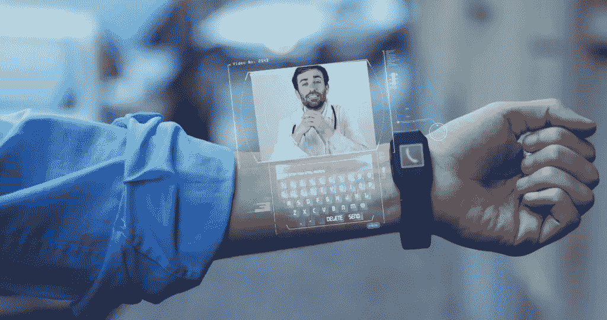

# 人工智能和深度学习正在改变我们的生活方式

> 原文：<https://medium.datadriveninvestor.com/artificial-intelligence-and-deep-learning-are-changing-how-we-live-our-lives-52c120d79218?source=collection_archive---------19----------------------->

## 人工智能和深度学习正在渗透到我们生活的方方面面——一直到家庭的新成员——Alexa、谷歌助手、Siri 和 Cortana

Source: pixabay.com

人工智能——本质上是让计算机变得智能的科学——正被添加到我们生活的几乎每一个方面；运输行业、工厂、供应链、医疗保健、政府——一直到家庭中的新成员，很快就是机器人——Alexa、谷歌助手、Siri 和 Cortana。人工智能机器学习的一个子类被称为深度学习。深度学习实现了机器学习的许多实际应用，以某种方式分解任务，使机器辅助不仅更有可能，而且更有可能。尽管目前有整整 85%的高管认为人工智能技术和深度学习可以帮助他们的公司获得显著的竞争优势，但只有大约 10%的人实际上在使用这项技术。

## **人工智能如何影响交通、工厂和医疗行业**

在运输行业，人工智能可以帮助解决可预测模式受到交通、事故或人为错误等因素影响的问题。具体而言，人工智能将改善公共安全，协助企业决策，实现自动驾驶汽车，并预测对运输业务产生重大影响的交通模式。根据一份 [P & S 市场研究报告](https://globenewswire.com/news-release/2018/05/17/1507941/0/en/Artificial-Intelligence-in-Transportation-Market-to-Reach-3-5-Billion-by-2023-P-S-Market-Research.html)，到 2023 年，全球运输市场对人工智能的采用预计将达到 35 亿美元，主要来自自动驾驶汽车和对降低运输运营成本的关注。

就工厂和人工智能而言，机器人已经占据了工厂车间一段时间，然而今天，工厂机器人不再仅仅执行单调的机械任务，而是工厂已经与人工智能虚拟现实联系在一起。人工智能对制造业至关重要，从实时设备维护到智能供应链，到新商业模式和虚拟设计的创造。虽然人工智能机器已经可以看到人眼看不到的东西，但下一步将这些图像发送给人类以做出必要的判断和纠正，也将很快移交给机器。

在医学界，人工智能现在能够进行临床诊断，甚至提出治疗建议。远程医疗，使用人工智能通过互联网从任何距离提供临床医疗保健，是医疗人工智能的一个目标，这将使所有人都更容易获得和负担得起医疗保健。人工智能将有可能用于药物发现、患者风险分析、诊断、医院管理甚至患者生活方式监测。

在这些领域中的每一个领域，人工智能和机器学习都将显著改变企业瞄准消费者的方式。你已经在互联网上跟随你的广告中看到了。想象一下，有一天，Alexa、谷歌助手、Siri 或 Cortana 将通过扫描你带回家的产品上的二维码来了解你的购物习惯，然后能够告诉你哪家杂货店将是你口袋里最好的，不仅是你购物清单上的常规商品，还可以根据里程数、当前的交通状况和天气来判断。

亚马逊已经在西雅图和芝加哥的 Go 商店中使用人工智能来简化零售流程。使用计算机视觉、深度学习算法和传感器融合，就像你在自动驾驶汽车中发现的一样，亚马逊正在改变零售业的面貌。随着时间的推移，这项技术将进入你的家庭。

## 人工智能和深度学习在创建个性化营销活动中的意义

提高营销活动的有效性-人类并不总是能够像机器一样识别联系和模式，这使得人类更难预测用户行为和购买趋势。跨行业实施的人工智能现在可以使用机器学习来分析数据，然后使用这些数据来瞄准特定的受众。

●改善客户体验——聊天机器人几乎是当前商业互动中的一个主要部分。这些聊天机器人回答问题，解决问题，甚至帮助客户根据他们的历史和偏好选择产品。

●允许关键绩效指标和分析更全面、更准确地衡量客户增长目标和收入目标。

●动态定价策略——动态定价策略允许企业更快地对供求波动做出反应。例如，易贝和亚马逊目前每天“调整”价格，使用复杂的算法来评估客户忠诚度，然后相应地改变价格。

●有针对性的营销——在这一点上，有针对性需要对人口统计和内容进行分析，从而产生广告投放。“旧的”定位方法几乎完全专注于人口统计，而人工智能则基于意图来定位客户——例如，市场上特定的人是为了什么，以及基于此，他或她接下来会做什么。

●人工智能生成的内容——对于人工智能和机器学习来说，这是一个相对较新的领域，目前只有几家公司提供基本的内容生成工具，可以将数字数据快速转换为连贯的内容。

●内容和活动个性化——亚马逊和网飞都使用考虑特定客户行为的算法，通过折扣和优惠重新吸引客户。机器学习允许为每个客户群定制不同的广告活动。这种个性化反过来会赢得客户的忠诚度。

●将长期利益与当前需求相结合，以提高营销效果。

●监控媒体存在——人工智能可以帮助公司跟踪和衡量品牌曝光率，无论是在社交媒体、电视、活动还是商业广告上。

●教育程度越来越高的营销过程——尽管营销一直包括数据的使用，但许多广告活动继续涉及营销人员的有根据的猜测。人工智能和机器学习的发展使得数据驱动的营销活动更加可行，这种营销活动考虑到了每个人的习惯、欲望、活动和购买偏好。

## 人工智能和深度学习将带领我们走向何方

人工智能和机器学习包括亚马逊的产品推荐功能，以及谷歌新的智能显示活动。通过确定向哪个客户提供哪个销售优惠、计划和激励来优化营销。亚马逊最近宣布成立一家新的医疗保健公司，该公司将利用技术以更简单的方式和更合理的成本为患者提供高质量的医疗保健。亚马逊正在模拟其与这家医疗保健公司相关的人工智能决策，此前其他科技巨头已经在中国试用员工医疗保健软件多年。

谷歌多年来一直是深度学习的冠军，因为当深度学习投入工作时，数据科学家能够破解困难、具有挑战性的案件，如自然语言生成、语音和图像识别。2012 年，谷歌宣布了其被称为谷歌大脑的神经网络，旨在模拟人类的认知过程，从那时起，该公司一直处于人工智能技术的前沿。

[刚刚在多伦多举行的深度学习峰会](https://www.re-work.co/)和 AI for Government 峰会(2018 年 11 月)展示了一系列令人难以置信的演讲者、公司和独特的学习机会。和杰出的思想家们在一起的那几天真是太棒了。

**多伦多深度学习峰会的几点启示:**

> 问:有什么事是你希望年轻时就知道的？答:在 1986 年，我希望我知道这东西会有用！有那么多人说这是胡说八道。我希望我能告诉他们,"你等着瞧。"但是那样说是很愚蠢的，因为这似乎是不可能的。我希望我现在知道的是，大脑是否使用反向传播！
> 杰弗里·辛顿，多伦多大学教授

*当你在飞机上听到“有一个技术难题”时，飞行员会进行更技术性的谈话，地勤人员可能会进行更细致入微的讨论。这是否意味着所有缔约方的可解释性应该相同？可能不会，我们不想用过于技术性的解释让乘客恐慌。* —莎拉·胡克，谷歌大脑

> 从原始数据到可操作的临床见解，国家医疗保健，微软加拿大
> *大规模基因组数据的端到端分析既复杂又昂贵。该研讨会解释了微软和 data bricks Genomics 统一分析平台如何简化将原始测序数据转化为可操作见解的过程。“当你确定基因组的哪一部分起作用时，你就可以找到治疗或预防的方法。”*

如果你有机会去参加一个人工智能——深度学习活动——不要错过。走吧。这就像在周末观看 SyFy 频道上所有你喜欢的电影/节目，但要好得多；对未来的真实一瞥。[https://www.re-work.co/events](https://www.re-work.co/events)

你现在能看到吗？你两岁的孩子开始用 Alexa 玩换装游戏，家庭照片开始包括你的家庭机器人，这只是时间问题。我现在就宣布。一个全新的服装和配饰行业，为我们的家庭机器人伴侣服务。

原载于 [Blockdelta.io 人工智能与深度学习……](https://www.blockdelta.io/artificial-intelligence-and-deep-learning-are-changing-how-we-live-our-lives/)

奥黛丽·奈斯比特

[螺旋营销&公关](http://www.spinspirational.com)

[奥黛丽·奈斯比特在领英上](https://www.linkedin.com/in/audrey-nesbitt-0388a52a/)

[@ audreynesbit 11 在推特上](https://twitter.com/AudreyNesbitt11)

Source: [Matan Segev](https://www.pexels.com/@matan-segev-188280) pexels.com