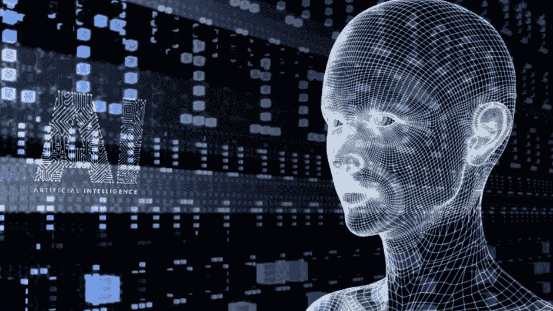
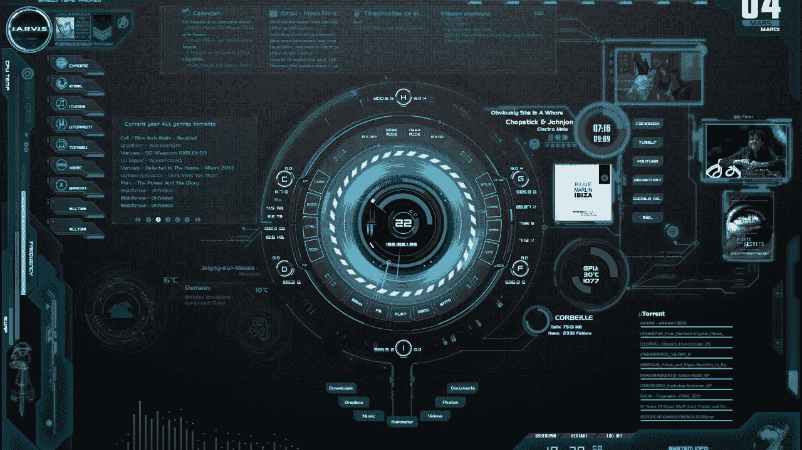
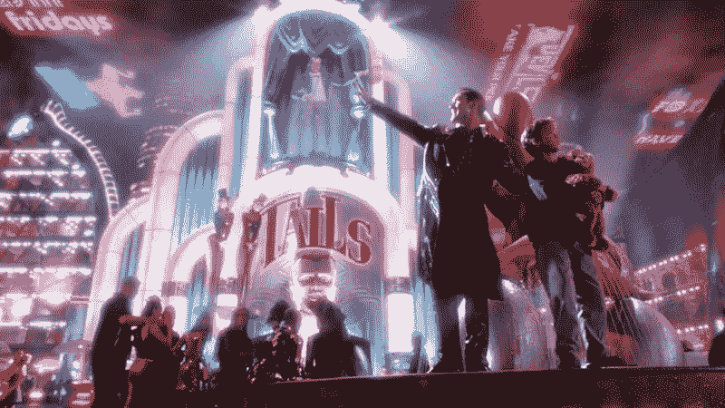

# 人工智能及其在视频创作中的进展

> 原文：<https://medium.datadriveninvestor.com/artificial-intelligence-and-its-advancement-in-video-creation-fa2455bae7c9?source=collection_archive---------8----------------------->

人工智能(AI)现在参与智能视频创作，并已经能够影响商业。通过人工智能，用户现在能够拍摄和编辑视频。这也为该领域带来了大量的就业机会。

由于其感知、推理、行动和适应的能力，人工智能突然成为视频创作市场最重要的技术之一和最受欢迎的工具；也因为自动化在各种商业实践中的普及。

许多初创公司投资人工智能，将视频创作作为主要目标。例子包括在网飞和 YouTube 等各种视频交付平台中采用和部署人工智能。两家公司都投资了人工智能，只是为了让观看视频的体验更具吸引力和革命性。

> 让我们更了解人工智能和视频创作。

**人工智能简介**

人工智能使机器能够从经验中学习，识别新的输入和模式，并执行类似人类的任务。人工智能包括不同的领域，如机器人学、[机器学习](https://www.koenig-solutions.com/mcsa-machine-learning-training.aspx)和自动驾驶汽车的开发。

**人工智能和视频**

人工智能已经能够处理生产和分销过程的许多方面。它现在能够在线拍摄、编辑、选择和分享剪辑。

人工智能允许创建更多定制或个性化的视频，从而提高参与度。

**拍摄**

人工智能在无人机的帮助下为自动化拍摄铺平了道路。无人机能够在静止悬停在空中或躲避飞行中的障碍物时将主体保持在框架中。这样做不需要任何人为干预或指导。

有些无人机具有一些最显著的功能，如识别手势并做出反应，跟踪和拍摄主题，并在返回基地时选择最佳路线。这项技术很快也会嵌入到其他类型的相机中。

流行无人机的一个例子是 DJI Phantom 4 Pro 无人机。它提供的显著特征包括多方向传感器，以便避开障碍物和具有不同自动化水平的各种飞行模式。

另一个即将推出的解决方案是 SoloShot，它也是全自动的。它需要一个人随身携带一个小设备，使相机能够单独聚焦在主体上，并将它们保持在帧中。这个设备也将在未来几年得到改进和发展，并将用于各种目的，例如让玩家保持专注。

**视频编辑**

人工智能实现了自动视频编辑。照相机现在可以在没有人工指令的情况下自行运转。相机现在能够选择重要的时刻，并相应地编辑视频。例如 GoPro 开发的一款名为 Quikstories 的智能手机应用程序，可以快速制作经过编辑和共享的视频，以及提供自动编辑工具的 SoloShot。

**分享视频**

人工智能还在监控视频在网上的分享方式。品牌越来越倾向于视频广告，因为它会影响消费者的接触范围。

我们经常在 YouTube 等网站上看到有问题的视频内容。这种类型的问题目前正在人工智能或机器学习的帮助下处理，这使得视频分析成为可能。这样也能保证品牌安全。

**结论**

人工智能的这些含义通过使视频制作更快、更容易，帮助了很多企业。这最终也有助于降低成本。

例如，自动编辑公司活动的视频，或者自动跟踪会议中四处游荡的发言人。

这项技术也被证明是视频编辑和制作团队的福音。它使专业人员能够更多地关注艺术方面，而不是被许多人认为是相当枯燥和机械的工作的编辑。

虽然[人工智能](https://www.koenig-solutions.com/introduction-to-artificial-intelligence.aspx)的能力非常有益，但这并不意味着这些技术可以接管人类提供的工作或情感。很明显，我们从这些方法中得到了很多帮助，但最终结果还是掌握在我们手中。