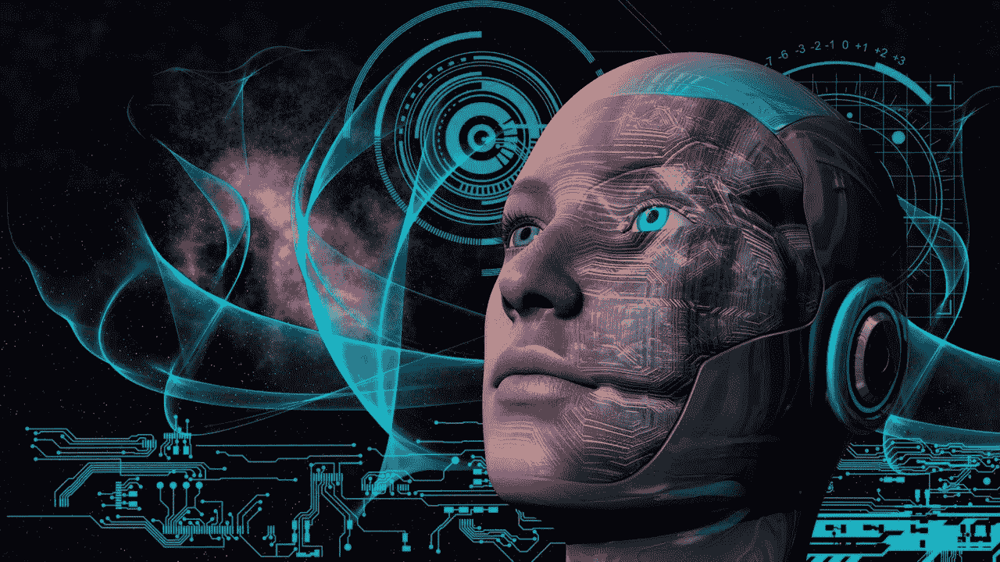

# 人工智能和我们的经济和技术奇点

> 原文：<https://medium.datadriveninvestor.com/artificial-intelligence-and-our-economic-and-technology-singularity-d72a549c1f8e?source=collection_archive---------13----------------------->

istockphoto.com

首先，我想提一下两位作家，他们写了两本以上的畅销书。

卡卢姆·刘升是一本最著名的书《经济奇点:人工智能和资本主义之死》的作者。他是写人工智能(AI)及其技术的最令人印象深刻的作者之一。刘升为自己的观点辩护说，未来几十年人类可能不再为金钱而工作，或者情况会更糟；人们将会失去几乎所有的工作。我们的经济将完全改变自己，就像今天已经发生的那样。他的观察与今天的企业家一致。我们假设在未来的 15 年里，大约 800 万个工作岗位将会消失(其中 500 万个将会被机器人取代)，只有 200 万个新的工作岗位会出现，但是我们还不知道这些新的工作岗位会是什么。当它们发生时，我们会解决这个问题。

马丁·福特是《纽约时报》上发表的许多文章的作者，也是人工智能和机器人领域及其对人类就业、经济和社会影响的专家。他的畅销书《机器人的崛起:技术和失业未来的威胁》触及了破坏性的新经济和创新。

为了更好地理解这个话题，我还推荐以下三本书:

*   物联网(麻省理工学院出版社基本知识系列)，塞缪尔·格林加德
*   物联网:智能电视、智能汽车、智能家居和智能城市如何改变世界，迈克尔·米勒
*   无声的智能-物联网，丹尼尔·凯尔默莱特，丹尼尔·奥博多夫斯基

我会试着解释一些事实，这些事实表明我们正在接近未来几十年人类进化的最大变化。我不想引起恐慌，但我想用不同的评论开始一场辩论。我相信这些评论将有助于我们思考如何影响我们的未来，以及如何帮助最年轻的人生存下来。也许我们现在就要进行历史上第一次改变未来的尝试。我们总是自发地这样做，但我相信我们可以有意识地这样做。可以吗？

首先，我们要了解人类的创新。人类从石头、火和社会中发明了工具和武器，至今已有约 500 万年。每天这些时间没有发生什么重要的事情。然后人类在大约 6000 年前发明了铜时代，4000 年前发明了青铜时代，2000 年前发明了铁器时代。此后，创新开始成倍增长，每天都与前一天不同。

我们大多数人甚至无法想象指数增长意味着什么。刘升描述了一个很好的例子。让我们想象一下，有人把一滴水扔在足球场中央。他投掷水滴的方式是每分钟水滴的数量都呈指数增长。在第一分钟，他扔了一滴，第二分钟扔了两滴，第三分钟扔了 4 滴，第四分钟扔了 8 滴，第五分钟扔了 16 滴，等等。他需要多少时间来填满体育场？49 分钟。但令人惊讶的是，45 分钟后，体育场只有 7%的满座率。坐在上层座位的游客将平静地观察正在发生的事情。在接下来的 4 分钟里，他们会被淹死。因此，我们可以预计在未来的 5 到 15 年内会发生类似的但不那么壮观的事件。但是我们仍然可以期待一些不愉快的变化。

机器和其他东西会更快地偷走我们的工作。人类的日常工作将首先消失，并且已经在消失，其他职业将紧随其后:从秘书、医生、律师、金融家、教师等等。在这种情况下，我们预期经济奇点。这是我们可以达到 70%或 80%失业率的点。最好不要想这个。退休制度将崩溃，经济将几乎完全停止，人们将处于压力之下，骚乱将开始，企业家将停止活动，城市将衰败，食品和药品将缺乏，贫富差距将超越所有界限，技术精英将出现，中产阶级将消失，而且已经在消失。

如果政治家们意识到这一点，他们就会发明一种普遍的基本收入，这种收入不会是真正的收入，但会是生存资金。我们只能期待最好的结果。

这些天的事实是，如果我们减少工人的数量，我们总是可以增加公司的实现。原因是自动化。这对公司有利，但对员工不利。1995 年至 2002 年间，几乎有 2200 万美国工人失去了劳动密集型行业的工作，但这一时期的实现增长了约 30%(马丁·福特)。类似的情况正在发达国家发生，而腐败正在发展中国家蔓延。

因此，公司老板应该问问自己，如果人们没钱，谁会买他们的产品和服务。我深信，这就是为什么经济奇点不仅仅是工人的问题；反过来说，主要是雇主的问题。

一种解决方案是制造商和服务提供商提供接近 0 美元的价格(克里斯·安德森，免费)。想想今天的免费送货。如果你装满了集装箱，你可以降低每件产品的价格，以至于可以限制在几美分，也就是将近 0 美元。

我们的经济一直在变化。人类经济是以有买有卖的股票交易为基础的。让我们假设人类的主要任务被机器人代替了。机器人可以工作和销售，但他们不需要购买。他们可以全天候工作，不需要睡觉，不需要吃饭，不需要灯，他们需要的一切就是一些电。

现在想想年轻人。他们找不到工作，所以他们被迫通过创业经济来实现他们的未来。每天，创业公司的数量都在增长，它们为经济的变化做出了贡献。这些贡献导致了用机器代替人类的工作。我们可以很容易地说，机器正在窃取我们的工作。

刘升预测，到 2050 年或 2060 年有可能提高这一界限。在这种情况下，AI 将占据所有人类的工作，将自己发展成为一种人们无法识别的东西，并离开人类。今天出生的孩子会达到这个。

这个事件有个名字:技术奇点。

在写这篇文章的时候，我想起了 25 年前我是如何开始我的工作的。我写了一个剪报代码，我的算法首先替换了一个秘书，然后是一个带着三个孩子的年轻女人。我当时年轻，没有注意到这一切。我问他们老板为什么解雇他们。他们纠正我说那不是他们的老板，是一台电脑。直到现在我才意识到到底发生了什么。

以及现在正在发生的事情。

马特加斯·马鲁西格

**参考文献**

卡勒姆·刘升，《经济奇点:人工智能和资本主义之死》，Kindle 版

马丁·福特，《机器人的崛起:技术和失业未来的威胁》，Kindle 版

这里最初发表[的](https://www.linkedin.com/pulse/artificial-intelligence-our-economic-technology-matjaz-marussig/)。