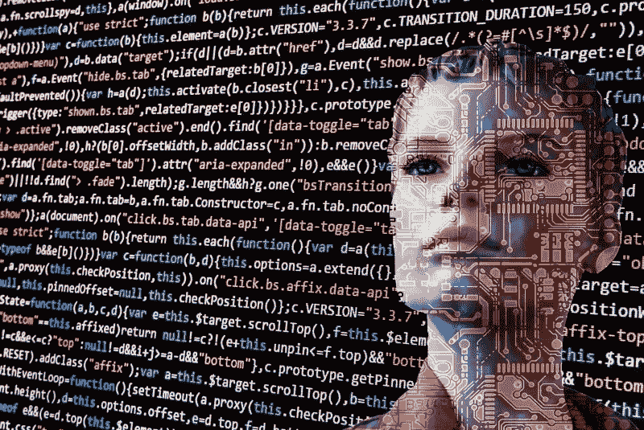

# 人工智能和政治:两个不同的世界？

> 原文：<https://medium.datadriveninvestor.com/artificial-intelligence-and-politics-two-different-worlds-c6022c526beb?source=collection_archive---------12----------------------->

在电影《我，机器人》中，受艾萨克·阿西莫夫小说的启发，一个人工智能设备得出结论，为了在社区中受到保护，人们必须将他们的自由交给一群机器人。在 17 世纪，霍布斯远没有想到社会的自动化，他在《利维坦》中提出了类似的论点(“人对人是狼”)，这是专制主义对他那个时代的自由主义思想的回应。

在这个人工智能时代，我通常带着兴趣、好奇，有时甚至怀疑阅读有关交易未来的报道和猜测。

众所周知，技术已经不再仅仅取代机械活动，而是将重点放在许多其他迄今为止由智力开发的活动上。新闻一直在报道今天的机器如何写文章、分析法律索赔或进行医疗诊断，以及其他功能。甚至，在创造性的层面上，它已经用人工制作的音乐或艺术进行了实验。

然而，政治领域和政治家的职业似乎不受这种变化的影响。

很好奇。这种冷漠发生在大城市变得更加智能的同时:在商业营销的方式下，我们的手机开始接收按照我们的用户/公民档案、按照我们的地区或按照我们的日常活动分割的政府信息。

此外，在许多城市，有训练有素的聊天机器人，可以更容易地在医院轮流，查看交通违规的历史，请求修理破损的人行道，甚至通过社交网络投票表决公民提案。此外，通过分布在城市各处的传感器，收集了大量的数据，这些数据可以成为理解社会及其生境的运作的关键投入，以便规划未来的行动。

使用人工智能工具处理这些海量信息无疑将有利于政治家、官员和顾问进行准备、分析和决策。

但是，我们走得更远。政治决策可以自动化吗？

想象一个奇怪的图灵测试。在公众舆论中的形象下降之前，一个软件分析各种变量，并向政治家建议减税以扭转局势。他执行它。谁会注意到这个双重命令的存在呢？

诚然，如今存在关于人工智能软件编程偏见的辩论(从某些聊天机器人的大男子主义刻板印象到有争议的人员选择过滤器)，政治自动化将引发诸如“一台机器不可能无视编程者的偏见”之类的思考。

但是，如果我们达到了这样一种技术发展水平，即机器的决策不再模仿，而是与人类智能竞争，那么有什么理由可以避免它干预政治世界呢？只需要定义干预政治家职业的变量，然后将它们形式化，以便将它们转化为算法。

太好了……问题，最大的问题，是定义如此复杂现象的关键绩效指标，人类力量、紧张局势、冲突和心理，其决定标志着社会的进程和数百万人的生活。

给政治家的职业下定义是如此之难，以至于考虑将其形式化可能会成为一个永无止境的讨论:政治的目标是什么？权力？共同利益？社会福利？民主？自由？所有迷人但抽象的概念，其算法翻译只有在科幻小说和文学作品中才有可能，与“我，机器人”的预测一样，都不是很令人鼓舞。

这些死胡同可能证明了政治有太多的人的成分，这种成分没有被简化为大数据的管理，因此属于一个对 AI 和自动化的创造者来说仍然不可理解的世界。