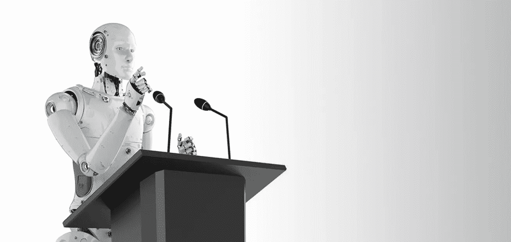

# 人工智能与公共关系的未来

> 原文：<https://medium.datadriveninvestor.com/artificial-intelligence-and-the-future-of-pr-62355f399eb?source=collection_archive---------6----------------------->

从 Alexa 到谷歌地图，我们每天无时无刻不在使用 AI。AI 对通信行业和市场营销产生了巨大的影响。然而，这篇文章将强调[人工智能](https://www.focaloid.com/services/artificial-intelligence)对公关的未来意味着什么。

**什么是人工智能？**
人工智能是旨在让机器变得聪明的工具、技术和算法的集合。它们的工作效率比人类更高。在其核心，人工智能需要大量的数据，并采用迭代处理和详细的算法。它从数据中存在的固定模式中学习。你可以将人工智能视为一个总括术语，其中也包括机器学习。

**AI 在公关中的未来**
说到公关，人工智能技术可以做很多事情，包括:

***** 帮助生成数据驱动的内容
***** 解决危机管理
***** 预见媒体趋势

你一定想知道公关机构如何在日常运作中利用人工智能？好吧，让我们以谷歌为例。谷歌利用人工智能来提高人们的表现，帮助他们实现目标，同时节省时间，这些时间可以用于其他创造性的事业。因此，作为一名公关专业人士，你也可以聪明地使用 AI 来执行常规任务。

人工智能在公共关系中的应用公共关系专业人士对人工智能的应用有一种缓慢但稳定的方式。PR pro 可以通过以下方式实现 AI 的诸多好处:

数据驱动的公关活动
人工智能被编程为梳理海量数据，并找出最终能够导致成功活动的特征。有了人工智能的机器学习和自动化，公关人员不再需要猜测。相反，他们的决定是基于事实和见解。除了以更快的速度做事，人工智能还允许公关专业人士做出数据驱动的决定，如评估开始活动的最佳时间，在哪里部署，聘请哪些博客作者等等。

自动化日常任务人工智能技术自动化了不需要太多创造力的重复性任务。一种称为机器人流程自动化(RPA)的人工智能可以帮助 business pro 实现各种操作的自动化。它有助于许多任务的执行，包括安排日历、创建会议记录、设置截止日期和发送跟进。最终，自动化节省了时间和资源，他们可以投入到其他项目中。

***亦读:***

*   [为什么让 RPA 接管您的业务流程？](https://www.focaloid.com/blog/why-let-rpa-take-over-your-business-processes)
*   【2019 年 RPA 趋势

**情绪分析与危机管理**
面对现实吧。为任何危机做好准备至关重要。事实上，今天的网络危机可以像疾病一样迅速蔓延到全球。这就是为什么公关专业人士应该使用人工智能技术进行危机管理和情绪分析。人工智能扫描过多的元素，并预测可能导致失败的严重威胁。通过自然语言处理，人工智能甚至可以理解人类的情感，从而可以用于情感分析。通过这种方式，人工智能技术允许公关专业人员意识到各种音调、词汇和语言环境之间的差异。这使得公关公司能够发起一场能够应对负面情况的活动。

在未来，公关机构将别无选择，只能拥抱人工智能，以便更好地控制公关业务。

***本文原载于我们的*** [***公司博客***](https://www.focaloid.com/blog) ***。***

# AI # PR #人工智能