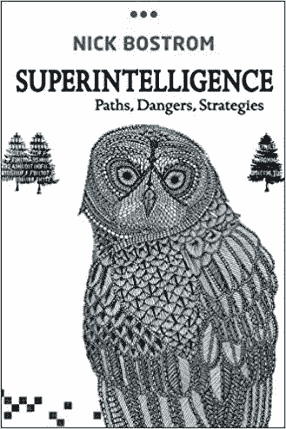
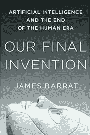
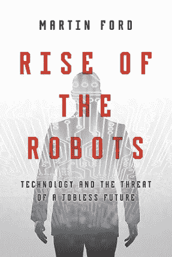
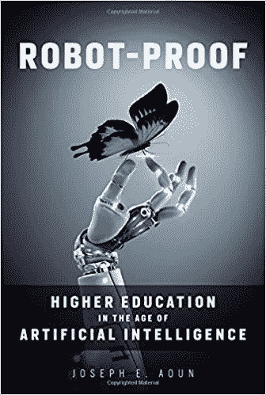
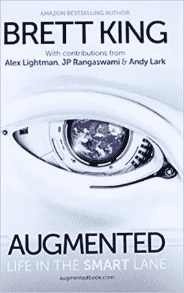
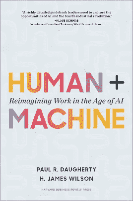
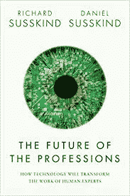

# 人工智能及其在工作世界中的作用

> 原文：<https://medium.datadriveninvestor.com/artificial-intelligence-and-the-role-it-will-play-in-the-world-of-work-75e43304ac4f?source=collection_archive---------8----------------------->

25/05/2018

人工智能和机器学习这些天似乎提出了更多的问题，而不是答案，因为随着这项技术扩展到生活的更多角落，许多人现在正在讨论人工智能提出的伦理挑战。

*在 La Fosse Associates，我们定期召集数据科学家、工程师以及数据和分析领域的工作人员讨论一系列主题，从无人驾驶汽车和智能城市，到深度学习代码演练和贝叶斯学习黑客马拉松。我们最近的活动深入研究了人工智能的世界，以及它将如何影响工作世界。*

*以下是他们在人工智能驱动的未来工作中需要考虑的要点。*

# 人工智能时代的工作

这些天你不用找很远就能发现[耸人听闻的关于威胁人工智能的危言耸听](http://www.wired.co.uk/article/elon-musk-artificial-intelligence-scaremongering)。好战的机器人、大规模失业和社会混乱占据了头条新闻。然而，与此同时，越来越多的实用主义和研究驱动的文献关注人工智能现在和未来可能更现实的影响。以此为指导，我们深入研究了该主题的一些关键问题。首先，我们可以做些什么来为人工智能给工作场所带来的变化做准备？

人类从未与比自己更聪明的实体打交道。谨慎，如果不是彻底的恐惧，似乎是合理的。但无论你是乐观主义者还是悲观主义者，当谈到人工智能时，它成为日常生活的一部分只是时间问题。具有讽刺意味的是，该小组同意，那些对裁员最免疫的人是那些最快接受人工智能的人，而不是抵制变革的人。

Alexa、谷歌助手和 Siri 等产品已经通过智能手机渗透到我们的生活中。这些个人助理的快速发展能力和我们对便携式设备越来越多的依赖意味着移动设备可能会成为首批 100%渗透人工智能的平台之一。在无人驾驶汽车出现之前，大多数人都会有个人数字代理。

对许多人来说，人工智能不会对他们的工作构成直接威胁，但它肯定会改变人们的工作方式。减少管理或日程安排的时间，将更多的时间放在你角色的核心活动上，希望能让你更有效率。技术也可以把我们从日复一日的苦差事中解放出来，因为重复性和卑微的工作已经自动化了。

一些人预测我们的虚拟助手将变得如此先进，以至于他们最终将被视为同龄人，一个群体中受尊敬的成员，我们在谈话和会议中将其作为建议和信息的来源。即使是创意产业，你可能认为它不会受到干扰，也可以使用数字助理来生成设计和艺术品，同时由一个人担任策展人并选择最好的作品。

目前面临最大威胁的工作是那些主要由行政或重复性任务组成的工作。该组织的一名成员将超市中自助结账柜台的推出作为类比，认为随着技术的进步，许多这类角色将变得多余。然而，如果你曾经使用过这种收银机，你就会知道它并不是全自动的(至少现在还不是)。人类需要监控、维护、照看和重新训练这些系统。展望未来，编码可能成为人类文化的一个基本组成部分，但是我们的教育系统适应得够快吗？

或者也可能是，在一个由 AI 主导的世界里，同理心、创造力、判断力和批判性思维将成为最有价值的人类技能。因此，虽然人工智能可以比放射科医生更准确地从医学成像中识别肿瘤，但人类更有能力解释结果，为患者提供咨询和安慰。人工智能可以处理一般的客户服务查询，但人类代理更适合同情不满的客户。

随着一些工作的消失，新的工作将会出现。人类将在处理和解释人工智能的决定以及监控和处理异常方面发挥关键作用，在这些情况下，机器做出的决定需要被推翻(有没有尝试过把自己的包带到自助结账柜台？).虽然我们还不清楚人工智能将如何影响工作世界，但我们可以假设的是，大多数与人工智能并列的人类工作还没有想到。

好消息是，如果你感兴趣，有很多人在研究这个。企业、政府和学者都在认真对待这个问题，因此不缺少关于预期和如何准备的进一步阅读:

尼克·博斯特罗姆——超级智能
人类从未与比自己更智能的实体打交道，如果创造出这样一个实体，会发生什么？

**詹姆斯·巴拉特——我们最后的发明**
超过某一点，人工智能就不再需要我们了。它本身将能够发明，这对人类意味着什么？

像脸书和 YouTube 这样的公司可能只需要几名员工就能实现巨大的估值，但是我们这些不够幸运或不够聪明的人将会有什么样的命运呢？

**Joseph Aoun —机器人证明**
高等教育需要如何适应迎合 AI 时代？未来需要的技能会是什么。

**Brett King——Augmented，Life in the Smart Lane** 你准备好适应了吗？因为如果历史证明了什么，你没有太多的选择。

保罗·多赫尔蒂和 H·詹姆士·威尔森——人类+机器
“人类+机器”为我们在人工智能的新时代取得成功提供了一个管理剧本。

理查德·萨斯金德和丹尼尔·萨斯金德——预测当今职业的衰落——我们既不需要也不希望医生、教师、会计师、建筑师、神职人员、顾问、律师和其他许多人像 20 世纪那样工作。

有什么要补充的吗？不要犹豫，在下面评论，鼓掌或与我的同事 Barty Isola 取得联系，加入对话。

*原载于*[*www.lafosse.com*](https://www.lafosse.com/articles/the-future-of-work-in-the-age-of-artificial-intelligence-81452510514)*。*

0207 932 2091 |[barty.isola@lafosse.com](mailto:barty.isola@lafosse.com)|[领英](https://www.linkedin.com/in/barty-isola-0a64618b)