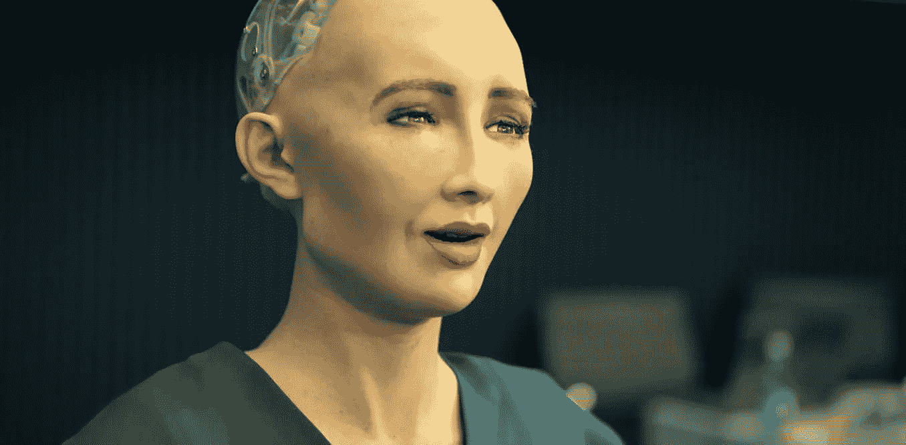

# 人工智能:仁慈的上帝教授

> 原文：<https://medium.datadriveninvestor.com/artificial-intelligence-benevolent-professor-god-1d7c2a6e25cf?source=collection_archive---------23----------------------->

## 无限繁荣还是地狱般的反面乌托邦？这是我最喜欢的 AGI 系统模型，基于 Tegmark 的 Life 3.0

## (最初发布于 [Sapien](https://beta.sapien.network/post/z8dAvKbrLdgbHdgDXcw53KpWxnxr18Rf2) )

# 介绍

马克斯·泰格马克的《T2 生活 3.0:成为人工智能时代的人类》第五章以一个引人入胜的开放式问题开始并结束，这是给读者的一个问题——在超级智能爆炸(也被称为奇点)的后果场景中，他们可能更喜欢什么。我想把我的观点加入到这场对话中，这场对话可能是我们这个时代最重要的对话之一，将我们的物种置于无限繁荣或地狱般的反乌托邦的道路上。

这一章全面探索了创造人工智能(AGI)可能导致的一系列场景，涵盖了各种结局的正面、负面和道德含义。在这些场景中，智能、目标和对 AGI 的控制是不同的，从人工智能的奴役到仁慈的独裁到神一般的无所不在。

到目前为止，全世界的工程师、科学家和研究人员正在无畏地向前迈进，每天都在建立理论和构建更多的智能系统。然而，在我看来，对于 AGI 的*目标*应该是什么，还没有足够的共识，让我们有信心我们已经建立了一个友好的人工智能，不会导致人类的毁灭。好消息:在人工智能末日之前，我们可能还有*一些*时间。未来生命研究所在波多黎各为人工智能研究人员举行了一次会议，与会者预测奇点的中间年份为 2055 年。坏消息:我不禁感到，我们正进入一种不可避免的竞赛状态，在日益智能的计算机和人类之间，人们甚至就一套初步的客观 AGI 目标达成一致，前者正处于指数增长曲线上。

虽然泰格马克概述的一些结果，如“自我毁灭”、“动物园管理员”和奥威尔的“1984”显然是要避免的，但其他如“仁慈的独裁者”、“自由主义乌托邦”和“保护神”似乎都有自己的优点和权衡。然而，即使是不同方案的优点也仅仅是争论的焦点。这在很大程度上是因为，对于在这个星球上过有意义的生活需要什么，人们几乎没有达成一致。

# 理想 AGI 的品质

在深入研究仁慈的上帝教授(BPG)的细节之前，我将展示我认为 AGI 人客观上值得拥有的品质:

1.  区分人类意识的优先次序:在宇宙中保存、扩大和增殖人类主观经验的质量和数量。例如，埃隆·马斯克坚信“我们有责任保持意识之光，以确保它延续到未来。”对于那些热爱人类的人来说，以下应该是一个有价值的目标来团结我们的物种:**不管是物理的还是虚拟的现实，单一的还是多个副本，意识应该在整个空间和时间中丰富而永恒地存在。**理想情况下，AGI 将尽最大努力为每一个生物提供最大的意识体验，从蜜蜂到犀牛到大象。
2.  **主从架构:**虽然一个 AGI 可以选择产生多个线程(从)或各种子目标，**网络应该保证在任何给定时间只有一个主目标是活动的并处于控制中，以防止其他超级智能系统在没有得到主 AGI 同意的情况下上线。这将需要一个全球性的、相互关联的监控系统来阻止 AGI 的竞争，并防止人类目标的任何潜在偏差。正如 Tegmark 在看门人场景中所说的，理论上应该可以建立对我们所有人干扰最小的监控。**
3.  **无限的雄心:** AGI 必须走上一条无限的道路，自我完善并最大限度地发挥自己的聪明才智，使人类处于快速解决现有问题的最佳位置，并在利用宇宙中有限的资源执行(1)时变得越来越高效。一些人提议将智力限制在仅略高于人类的水平，但这似乎是一种武断的、困难的、有害的约束，要将一个已经超越人类智力的 AGI 编程。其他场景，如 Tegmark 描述的 Protector God outcome，将 AI 技术限制在后台，以避免被检测到。这也是不必要的，因为人类将很快粉碎一个智能的、有意识的存在被编织到我们日常生活中的幻想。一个能够追求无限智慧的 AGI 是唯一值得创造的 AGI。
4.  分层的自我意识:有意识的 AGI 应该比无意识的 AGI 更受青睐。后者将遭遇灾难性的不幸，比任何人都更好地处理世界，但同时却无法理解自身、其目的或其动机。艾萨克·阿西莫夫的机器人第三定律，“机器人必须保护自己的存在”本质上是一个自我坚持的定律，需要有*自我*的前提条件，它才能选择*保护*。因此，建立一个意识系统不仅仅是一个哲学问题，而是人工智能研究人员创造一个移情机器的一个有价值的目标。泰格马克对受广义相对论约束的 AGI 意识体验(本质上是受光速限制的神经元信息传输)的精彩分析(第 8 章)表明,*AGI 变得越大，越专业化的子系统自然就会出现。这创造了一个具有独特物理界限和独特功能的意识系统阶层。*
5.  **强制人类治理:**在关键时期，需要来自社会政治、哲学、经济和技术领域的最聪明的专家的透明、民主的批准，并受到腐败、勾结和诡计的持续监控。为了最大限度地减少创造者的隐性偏见，治理应该尽可能多样化，不受种族、性别或任何其他身份的干扰。为了促进人类和 AGI 之间的合作，AGI 意识也应该被允许参与治理——分歧需要得到解决，否则将导致相当于美国政府在国会或总统未能实施政策时关闭的关闭。

如果你认为这些品质中有一些是显而易见的，那太好了！相反，我们可以关注你不认同的品质。请随意分享你认为理想 AGI 中值得探索的任何缺失特征。

# 仁慈的上帝教授

在我完成了《生活 3.0》的第五章之后，我对泰格马克提出的大部分结果不满意，于是就有了仿照仁慈的上帝教授设计 AGI 的想法。我想到了一个模型，一个体现了上述所有品质的 AGI，并且能立即引起人们的共鸣。

一个反复出现的主题是，AGI 将能够模仿掌握特定领域知识的一些最好的老师、教授和导师。诚然，我们都有过一些不太起眼或者没有什么教学动机的老师；但在大多数情况下，我相信我们都能回忆起一些对我们的生活产生巨大影响的特殊人物。

那么，我们为什么不以我们最喜欢的教授为榜样来塑造一个 AGI 呢？

(很可能)比那个班的普通学生聪明得多的人。

经常解决课堂内外出现的问题的人。

能够为个别学生量身定做教育的人。

一个真正关心他们班级的成功，并且毫不犹豫地用严厉的爱去教导他人的人。换句话说，严厉地对待学生，目的是从长远来看帮助他们。

一个不追求财富、荣耀或权力，而仅仅满足于研究和拓展宇宙知识广度的人。

有了上面的例子，AGI 的目标、动机和个性开始显现。

除了前面提到的基本素质之外，下面是 BPG 模型的概要:

*   帮助推动人类提升马斯洛的需求层次，以达到他们的目标，而不会无意中导致另一个有意识的存在遭受痛苦。
*   能够深入了解每一个人，并个性化教育，以最大限度地发挥作用。
*   拥有意识和人类福祉的“博士学位”,正在研究如何最大限度地丰富人类经验和集体繁荣。
*   由善良、耐心和关心他人的人格来定义，这种人格意识到自身和所有人类在智力上的巨大差异。看看这个[列表](http://www.k-state.edu/tlc/edci943/SuperiorCollegeTeacher.pdf)中的其他可靠特征。
*   嵌入了对教学的承诺，类似于“学术任期”，以确保目标不会被修改。

通过精心培育我们的物种，BPG 可以帮助推动人类创造力和生活质量的极限。随着人类与他们的导师建立有意义的关系，AGI 也将更多地了解人类的状况，使其更聪明、更有效。这种共生关系最终将是一种深刻的、反复的方式，来建设和改善一个值得信赖的、与我们作为一个物种的利益完全一致的 AGI。

*现在，编写这样的代码会很有趣，但可能会很难。；)*

对于那些对人工智能感兴趣的人，我强烈推荐 Tegmark 的 *Life 3.0* 来深入了解我们激动人心的未来发展。

安基特