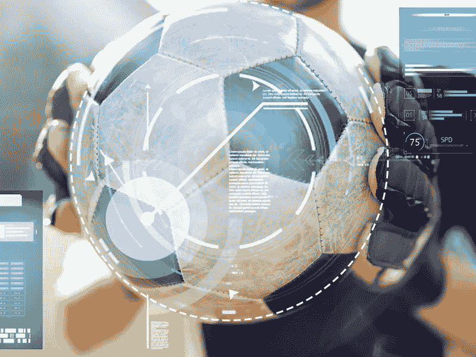

# 人工智能可以赢得足球比赛

> 原文：<https://medium.datadriveninvestor.com/artificial-intelligence-can-win-football-matches-e3a94faebb06?source=collection_archive---------5----------------------->

足球是一项受到各界人士普遍喜爱和崇拜的运动。它是全球最受欢迎的运动之一，拥有约 40 亿粉丝。它的高度竞争性给团队灌输了一种疯狂的想法，试图赢得每一场比赛。因此，足球经理们发现设计成功的策略来对付他们的对手是非常具有挑战性的。

为了制定这些策略，经理们通常会查看对手的各种数据。这包括对手球队的比赛风格和阵型、他们在之前的比赛中遵循的策略、每个对手球员的优缺点、他们最好的球员在困难情况下使用的战术等数据。近年来，经理们已经开始采用创新技术来帮助他们分析这些数据，并为他们的团队创造成功的公式。

 [## 今年值得关注的人工智能趋势——数据驱动的投资者

### 预计 2019 年人工智能将取得广泛的重大进展。从谷歌搜索到处理复杂的工作，如…

www.datadriveninvestor.com](https://www.datadriveninvestor.com/2019/02/19/artificial-intelligence-trends-to-watch-this-year/) 

## **足球与科技**

在很长一段时间里，人们厌恶在足球中使用任何技术。国际足球协会理事会(IFAB)认为“漂亮的比赛”不需要技术来辅助比赛中的决策。然而，随着 2010 年国际足联世界杯等全球赛事中出现大量裁判错误，IFAB 决定重新审视技术如何帮助裁判做出正确的决定。

球门线技术(GLT)是足球领域最先应用的技术之一。2012 年推出的 GLT 可以帮助准确评估球是否越过了球门线。

另一项在足球世界掀起波澜的热门技术是视频助理裁判(VAR)。VAR 可用于审查主裁判通过视频镜头和通信耳机做出的决定。这项技术在 2018 年 FIFA 世界杯法国和澳大利亚的小组赛中首次亮相。

在同一届世界杯上，一项名为电子表演和跟踪系统(EPTS)的酷技术被引入。EPTS 是一个基于平板电脑的系统，让球队能够与教练实时分享信息。

## **人工智能的崛起**

近年来，人工智能和机器学习在足球世界中受到了很大的关注。人工智能因预测比赛结果而与足球联系在一起。通过分析大数据，机器学习算法有能力预测足球比赛的成败。

2017 年，英国体育博彩公司 Stratagem 建立了一个基于人工智能的系统来预测足球比赛的结果。该系统通过将人类分析师与深度神经网络配对来工作。同年，另一家名为 unionly AI 的创业公司成功预测了美国国家足球联盟超级碗结果的准确比分，成为头条新闻。

## 2018 年:人工智能在足球界具有里程碑意义的一年

2018 年是人工智能在足球领域具有里程碑意义的一年。2018 年国际足联世界杯成为第一个使用各种人工智能技术的全球比赛。

世界杯使用的足球 Telstar 嵌入了由人工智能驱动的 NFC(近场通信)芯片。使用智能手机，该芯片使球迷能够与球互动，以及其他未公开的高级功能。

计算机视觉是一种基于人工智能的工具，广泛用于智能票务、视频集锦、安全、相机等设备的精细控制等应用中。使用人工智能，即使是现有的数字技术，如 GLT 和 VAR，也变得更加优越、快速和高效。

## **使用人工智能创造获胜场景**

人工智能现在被数据科学家用来帮助团队提出现场场景和客观措施。基于人工智能的智能算法有能力模拟大量事件。此功能使分析师能够翻译从模拟中获得的见解。这些见解有助于对球场上将要发生的事情提出建议。

这反过来有助于教练在准备即将到来的比赛时对球员做出明智的决定。通过分析对手的历史数据，人工智能可以用来确定战术，这些战术可以极大地帮助为特定的游戏选择正确的球队并最终赢得比赛。

## **选择合适的团队是关键**

总部位于德国的人工智能公司 JUST ADD AI 通过选择正确的球员帮助一支德甲球队赢得了比赛。该公司通过构建一个人工智能工具来实现这一目标，该工具从非结构化数据中提取见解，并将它们放在单个仪表板中。IBM 的沃森人工智能被该公司用于提供对玩家的深度视角。沃森被训练理解侦察报告，并得出最相关的细节。

另一个有趣的人工智能用例是伤害预测。如果足球教练可以使用人工智能来预测他们最好的球员何时会受伤，会怎么样？当涉及到关键游戏时，这些信息将会非常有价值。去年，意大利比萨大学的数据科学家开发了一种机器学习算法来预测伤害。该算法准确预测了一支意大利精英球队在单个赛季中遭受的 14 次受伤中的 9 次。

今年 1 月，一家伦敦足球俱乐部与一家名为 Big Bang Fair 的人工智能公司合作。该合作的主要目的是安装一个人工智能“教练”，可以帮助选择球队的阵型和战术。基于游戏结果，人工智能通过在一个赛季的过程中进化其思维来学习工作。

## **结论**

人工智能和机器学习已经在足球等体育领域实现了更快、更好的决策。人工智能算法可以得出可操作的见解，为球员和教练团队增加更大的价值。人工智能已经解锁了许多用例，这些用例对于参与这场美丽游戏的每个人都至关重要。人工智能在足球界的前景似乎是光明的。看到团队在多大程度上利用它来设计赢得比赛的场景将是令人兴奋的。

*原载于 2019 年 4 月 7 日*[*www . great learning . in*](https://www.greatlearning.in/blog/artificial-intelligence-can-win-football-matches/)*。*