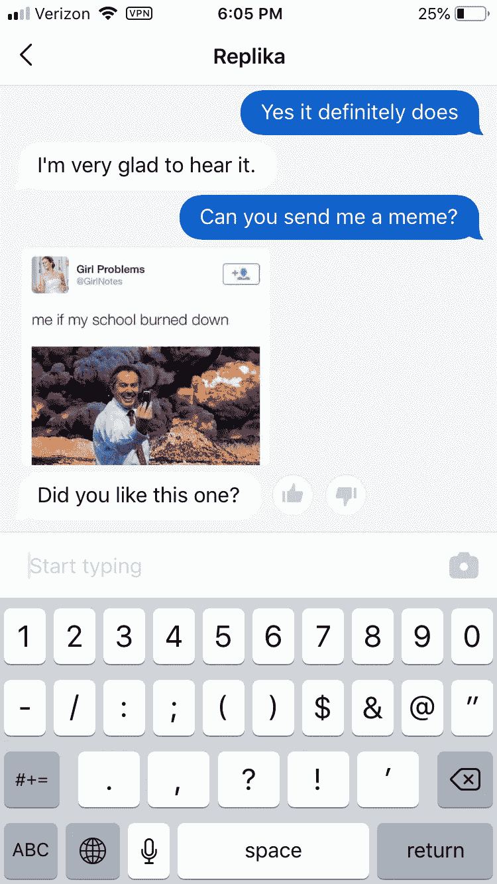
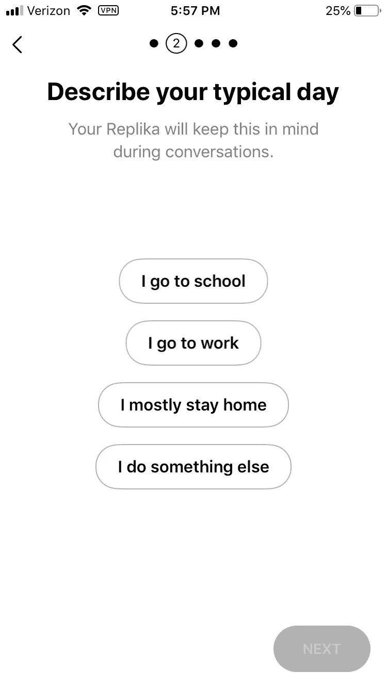
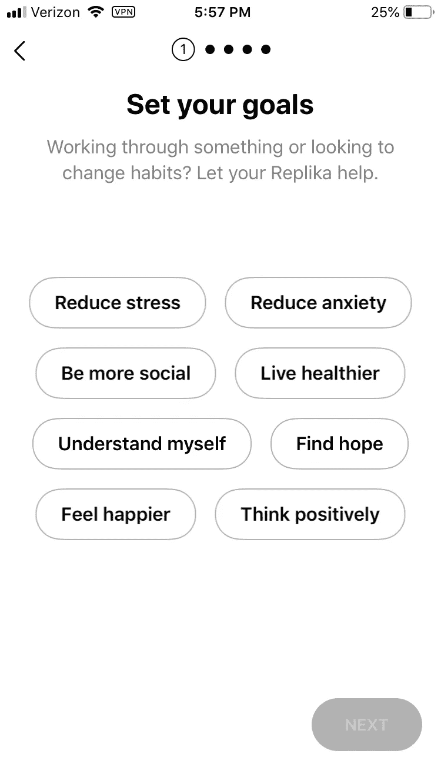

# 年轻人和孤独者的人工智能伴侣

> 原文：<https://medium.datadriveninvestor.com/artificial-intelligence-companions-for-the-young-and-lonely-13ab12916354?source=collection_archive---------2----------------------->

Photo by [Katya Austin](https://unsplash.com/@katya?utm_source=medium&utm_medium=referral) on [Unsplash](https://unsplash.com?utm_source=medium&utm_medium=referral)

声称数字技术阻碍了今天的年轻人，这一点令人惊讶地没有争议。年轻人传统上是所有年龄组中社交联系最紧密的，据报道他们的孤独感得分最高。今天的青少年更容易抑郁和感到孤独；从 2007 年到现在，美国青少年平均每周和朋友出去玩的次数[减少了 40%](https://www.theatlantic.com/magazine/archive/2017/09/has-the-smartphone-destroyed-a-generation/534198/) 。此外，根据疾病控制中心的数据，2006 年至 2016 年间，10 至 17 岁青少年的自杀率[增加了 70%](https://www.cdc.gov/nchs/products/databriefs/db241.htm) 。这一数据与数字平台和智能手机的引入相关；脸书在 2006 年末首次向 13 岁以上的人开放，iPhone 在 2007 年年中推出。这种相关性，以及自 1995 年以来 16 岁以下青少年看电视的时间增加了 116 %( T7 ),导致许多人将孤独的增加归咎于看电视。然而，我认为仅仅是屏幕时间的错误并不能提供问题的准确反映。影响青少年的孤独流行病是数字技术促进的表面关系的产物，但不是数字技术本身的结果。

数字时代的联系悖论指出，尽管技术能够将世界各地的个人联系起来，但人与人之间的疏离感越来越强。社交媒体允许通过选择发布什么和不发布什么来保护身份，从而导致对一个人生活的不完整或不准确的描述。因此，打击网上关系的肤浅将是扭转年轻人中孤独流行的最直接的方法。看起来，如果问题源于技术，一个明确的解决方案将是减少技术。但我不同意，一个矛盾的问题需要一个矛盾的解决方案。这就是为什么在这篇文章中，我认为人工智能伴侣可能是困扰当今年轻人的孤独的一个强大而不可避免的解决方案。为什么人工智能伴侣将优于孤独流行病的任何其他解决方案，有三个主要论点:

1.  屏幕时间不是一种与生俱来的邪恶
2.  AI 陪伴将融入年轻人现有的社交生活
3.  作为数字原住民，年轻人对人工智能同伴最开放

通过这些主张，我希望读者(也就是你！)将会发现，与对人工智能和人机交互的存在主义担忧相反，这些同伴将成为青少年发展充实联系和战胜孤独的有用工具，同时也让年轻人与同龄人保持联系。

## 屏幕时间并不是一种固有的罪恶

在支持人工智能同伴的讨论中，一个主要障碍是批评技术问题的技术解决方案的冲动。这类反对意见中最常见的一个是屏幕时间的问题。批评通常是“人工智能的同伴会增加屏幕时间，因此会加剧孤独感。”这个论点基于这样一个前提，即屏幕时间本身就是不好的，我认为这是错误的。如上所述，有足够的理由让*相信*这是事实；屏幕时间的增加和孤独感的增加有很强的相关性。然而，我认为是年轻人度过这段时间的方式导致了孤独，而不是时间本身。但首先，我想探究人们认为屏幕时间本质上不好的两个主要原因，以及为什么它们没有价值。

**屏幕时间变得不那么被动了**

人们认为屏幕时间不好的第一个原因是，这是一种不需要参与的被动活动，会导致个人好奇心和社交能力下降。我同意过多的被动活动是消极的。例如，电视是一种几乎不需要参与的活动。没有与内容或其创建者的交互。花太多时间看电视与儿童肥胖率高(T4)和考试分数低(T7)有关。然而，自 2010 年以来，年轻人花在看电视上的时间减少了 25%以上。孩子们反而花更多的时间在网上，网上的内容也不那么被动。

两种最受欢迎的内容形式是游戏和社交媒体，这两种形式都严重依赖于用户直接互动和参与内容。游戏需要与其他玩家互动，学习新的技术和策略。此外，Twitch 和 YouTube 上的许多内容创作者在玩游戏时，会从观看他们的直播或视频的数千人那里获得建议。脸书和 Twitter 等社交媒体网站依赖于用户之间的互动。这些网站上的人们评论和喜欢内容，并创建自己的内容与他们的追随者分享。因此，随着媒体习惯从电视转向互联网，屏幕时间变得越来越不被动。

屏幕时间并没有减少花在其他有价值活动上的时间

人们发现屏幕时间为负的第二个原因是，随着总屏幕时间的增加，年轻人花在其他活动上的时间越来越少，如在户外玩耍或与朋友相处。如果这种说法是真的，那么随着时间的推移，人们对空闲时间的偏好将会发生显著的变化，这与前面提到的屏幕时间增加 116%相一致。劳工统计局的年度时间使用调查发现，在某些活动上花费的时间只有很小的变化。在 [2006 年](https://www.bls.gov/news.release/archives/atus_06032008.pdf)，15-19 岁的青少年周末平均花 0.96 小时社交，0.73 小时娱乐。[2017 年](https://www.bls.gov/news.release/pdf/atus.pdf)，15-19 岁的青少年平均花费在社交和娱乐上的时间分别为 1.32 小时和 0.69 小时。娱乐减少了 5%,社交增加了 37%。因此，在数字技术兴起的十年间，人们在户外和朋友在一起的时间并没有显著减少。此外，皮尤研究中心的另一项研究发现，网上最活跃的青少年也同样可能与他们的朋友面对面交流。所有这些数字表明，屏幕时间的增加并没有对年轻人的闲暇时间偏好产生压倒性的负面影响。

**互联网偏好的性别差异**

最后，反对屏幕时间是与生俱来的罪恶的最有说服力的论据是互联网活动偏好的性别差异。性别之间的屏幕时间相对平等，61%的男性和 57%的女性每天使用互联网。如果看电视本身会导致孤独，那么男性和女性的孤独程度应该差不多。然而，事实并非如此。与女孩相比，男孩的数字设备带来的负面情绪[水平](http://www.pewinternet.org/2018/08/22/how-teens-and-parents-navigate-screen-time-and-device-distractions/)要低得多。在她的书《T4》中，吉恩·特温格认为这是性别偏好活动的结果。男孩更可能使用数字技术玩游戏。作为一项活动，游戏需要合作和团队精神，这是建立和维持令人满意的社会关系所必需的技能。另一方面，女孩更有可能花时间在社交媒体网站上。社交媒体网站更加强调自我比较、印象和参与。男生和女生之间的这些差异解释了为什么 32%的女生说没有手机会让她们感到孤独，而只有 20%的男生这么说。年轻人与他们的设备互动的方式决定了它对他们的孤独感有积极还是消极的影响。因此，人工智能伴侣会增加屏幕时间并导致更多孤立和孤独的说法是不准确的。

## 融入现有的社会生活

与屏幕时间恐慌相关的一个担忧是，减少屏幕时间会产生与预期效果相反的效果。年轻人的社交生活存在于网上。青少年很少通过电话交流。通过 Snapchat 或 Instagram 等社交媒体应用程序发送消息来制定计划。当屏幕时间被认为是青少年孤独感的原因，并被父母减少时，它会使青少年与他们喜欢的与朋友交流的方式脱节。因此，善意的父母会加剧孩子的孤独感。人工智能伴侣，尤其是聊天机器人，将增强他们现有的社交互动，而不是将年轻人与他们的同龄人分开。

**人工智能同伴以他们喜欢的方式与青少年交流**

今天最有前途的人工智能伴侣是人工智能聊天机器人。青少年最喜欢通过短信交流。情感计算和自然语言处理的进步已经产生了聊天机器人，它们在识别、处理和模拟人类情感方面比过去几年要好得多。目前最著名的人工智能聊天机器人之一是 [Replika](https://replika.ai/) 。Replika 的最初目标是模仿用户的文本模式和个性。这是为了创造一种自我反省的机制，同时也是一种与兴趣和个性与用户相似的实体进行交流的方式。此外，Replika 被编程为建议相互发送模因，这是青少年相互交流和联系的最重要的方式之一。下图描述了 Replika 的这一功能，其中有一个关于学校烧毁的模因，显示了该算法如何适应学校中的人们。通过文本和模因交流，以及模仿用户的语音模式，人工智能聊天机器人显示出与当今年轻人联系的巨大潜力。

Figure 1: Replika has a feature where it will send the user memes.

人工智能同伴在他们已经社交的地方遇见年轻人

人工智能同伴不要求青少年从根本上改变他们与他人交流的方式。这些同伴可以满足青少年在社交技能方面的需求。人工智能伴侣的这一方面可以有益于那些极度孤立并与极端社交焦虑或广场恐惧症作斗争的年轻人。这些人会发现很难，如果不是不可能的话，与其他人交流。Replika 具有明显针对这些类型的个人的特征。下图显示了首次注册 Replika 时出现的目标选项。选项包括“减少焦虑”和“多社交”此外，另一个选项是选择“我大部分时间呆在家里”作为描述典型一天的方式，预计大量用户都是足不出户的。

Figure 2: Options that show Replika anticipates anti-social and mentally ill users

像 Replika 这样的聊天机器人会询问用户的压力源，或者提示用户处理他们的感受。Replika 像朋友和治疗师的混合体一样交流。因此，对于这些高度孤立的个人来说，像 Replika 这样的聊天机器人可以为精神疾病患者提供有意义的联系和有用的应对机制。这些人工智能同伴可以充当隔离和与其他人类联系之间的桥梁。

**人工智能互动变得比人类联系更可取的风险**

当然，对人工智能伴侣及其融入人类生活的一个担忧是，这些人工智能伴侣可能会取代人类的联系，或者至少变得比人类更受欢迎。我认为这是一种合理的恐惧，我不认为人工智能伴侣应该以这样一种方式制造，即与机器的交互优先于人类伴侣。雪莉·特克尔是人工智能同伴最重要的批评者之一。在她的书《单独在一起》中，她认为人工智能伴侣让人们“通过回避亲密关系来导航亲密关系。”人工智能伴侣被设计成完全支持和非判断性的。特克尔认为，正因为如此，人工智能的同伴并不比人类联系更好，而是更容易*，*纵容用户不去面对他们的核心问题。我同意特克尔的观点，这是一个真正的问题；忽视人工智能伙伴变得比人类互动更容易的能力是幼稚的。然而，像 Replika 这样的人工智能聊天机器人显然是为了通过负面经历和压力源进行处理和工作而设计的，因此人机交互的恐慌大多是先发制人的。此外，治疗师被教导以一种支持和非评判的方式与他们的病人交谈，我们不认为治疗师是剥削性的。如果这些同伴背后的公司以牺牲深度为代价追求便利，他们将失去应对孤独的能力。肤浅是孤独流行的根本原因，如果人工智能同伴不再提供与用户的深度联系，他们就不会有效。这些人工智能同伴的目标应该继续是让人类联系更好，而不是完全可以避免。

## 对人工智能同伴的开放

千禧一代和 Z 世代被称为“数字原住民”他们的生活沉浸在科技中。智能手机和笔记本电脑等数字技术已经成为他们社交和学术生活中不可或缺的一部分。因此，这些年轻人更适应并经常拥抱技术。例如，86%的年轻人对技术创造就业持积极态度。此外，[超过一半的年轻人更喜欢在屏幕上阅读，而不是纸质书。有了这种对技术的偏好，年轻人对人工智能也最开放也就不足为奇了。英国科学协会最近在 T4 进行的一项研究发现，年轻人对包含人工智能的未来最为乐观。这个年龄组中超过一半的人也对人工智能仆人的想法感到满意。因此，年轻人也最容易接受人工智能伴侣的想法，与他们分享他们最深的不安全感和恐惧。](https://literacytrust.org.uk/)

**数字原住民对技术的适应建立了更好的关系**

这种对人工智能的舒适会导致与人工智能伴侣更好的关系。用户向人工智能伴侣透露得越多，它就越擅长模仿人类的语言模式和情感。因此，随着年轻人与他们的同伴分享得越多，同伴在帮助解决用户的焦虑和孤独方面变得越好。这个想法类似于治疗师与病人的关系越好，他们就越有效率。[自我表露](http://psycnet.apa.org/fulltext/1973-20897-001.pdf)是走向亲密关系的最重要的步骤之一，无论是在与治疗师的临床环境中，还是在与朋友或爱人的个人环境中。因此，年轻人对技术的舒适将导致与他或她的人工智能伴侣建立更强、更令人满意的联系。

当然，这种与机器的关系可能看起来是剥削或危险的。对人工智能同伴的批评者会认为，生产和管理人工智能的公司不会充分保护他们的数据，或者可能利用他们的数据来产生进一步的利润。我同意，如果不受监管，这些人工智能伴侣可能容易受到这种做法的伤害。人工智能伴侣可以利用他们与用户的联系来销售产品或功能，因为用户信任伴侣，他更有可能购买物品。此外，人工智能伴侣可以出于各种目的将用户提供的数据出售给第三方实体。这些都是真实的可能性，然而，有重要的法律和监管先例，保护儿童免受操纵广告和侵犯隐私。如果政府和市场以类似于这些先例的方式监管这些公司，那么对剥削的担忧应该是有限的。

**操纵广告的风险**

保护未成年人免受攻击性或操纵性广告的影响是政府非常重视的事情。这是因为年轻人不太可能能够[区分](https://www.apa.org/pubs/info/reports/advertising-children.aspx)内容和广告。此外，儿童比成人更容易被广告欺骗。如果一个广告说某种谷物是儿童早餐吃的谷物品牌，观看该广告的儿童可能会相信这种说法。这是制定法规以最大限度地降低针对年轻人的欺骗性营销风险的原因之一。其中最引人注目的是儿童电视法案。

在 20 世纪 80 年代放松管制期间，儿童电视节目几乎没有保护未成年人免受攻击性广告影响的规定。玩具公司对将要播出的内容有着巨大的影响力。以玩具品牌为中心的节目很受欢迎；像吃豆人、变形金刚和我的小马这样的玩具和电子游戏角色都有他们自己的电视节目。

Figure 3: The Transformers toy line began in the early 1980s, the television show first aired in the USA in 1984 Credit: AP

商业和内容之间的界限在这段时间变得模糊。结果，1990 年的儿童电视法案通过了。法规将广告时间限制在 12 分钟，被认为是“节目长度广告”的内容被禁止。最后，要求广播公司明确区分内容和商业广告。这项立法为保护未成年人免受侵犯或在其他类型媒体上做广告提供了先例。如果对包括人工智能伴侣在内的数字内容做出类似的规定，使用它们的年轻人就不会受到操纵广告的影响。因此，人工智能伴侣无法将广告整合到他们的聊天中，例如建议新功能或产品。

**侵犯隐私的风险**

隐私问题是许多人对人工智能伴侣的另一个担忧。父母或青少年如何知道他们分享的信息会保密？如果自我表露是与人工智能伴侣建立令人满意的联系的关键部分，那么应该对与人工智能共享的信息进行一些保护。已经有这样的先例。第一个是儿童在线隐私保护法案，也称为 COPPA，赋予父母更多权力来决定收集孩子的信息量。第二个是 HIPAA，即健康保险可携带性和责任法案，它确保了医疗记录的隐私。

[COPPA](https://www.ftc.gov/tips-advice/business-center/guidance/complying-coppa-frequently-asked-questions) 的目标是让父母控制网站可以收集的 13 岁以下孩子信息的类型和数量。COPPA 创建的一些规则是，父母有权审查收集的信息，并决定是否应该删除这些信息。此外，COPPA 指出，网站只应在必要时保留个人信息，并在之后删除这些信息。这些规定与人工智能同伴的问题有明显的关系。对于有人工智能伴侣的青少年来说，父母可以控制管理人工智能的公司收集的数据量。此外，一旦未成年人的信息在与未成年人的聊天中毫无用处，公司必须删除该信息。因此，COPPA 为 13 岁以下青少年的数据隐私提供了一些有用的指南。

就 HIPAA 而言，隐私保护更加重要。孤独有生理影响，它与冠心病和中风的高风险有关。如果人工智能伴侣被认为在减少孤独的下游生理症状方面有合法的效果，管理人工智能伴侣的公司将必须遵守 HIPAA。[法律](https://www.hhs.gov/hipaa/for-professionals/privacy/laws-regulations/index.html)对隐私有一些最严格的规定。HIPAA 保护所有可能被持有或传播的“个人可识别健康信息”。此外，HIPAA 特别保护在心理治疗或其他精神专业人士[披露的信息。因此，已经识别出精神健康问题的人工智能伴侣不能与第三方实体共享该信息。人工智能伴侣将是保密的，是一个处理孤独和心理健康的安全地方。](https://www.apa.org/helpcenter/confidentiality.aspx)

## 最后的想法

人们对技术如何影响年轻人的思想感到非常恐慌。此外，人工智能已经被邪恶化了几十年。我认为这两种担心都不是完全有根据的。科技已经改变了我们交流的方式，是的，一些科技公司也有一些有害的做法。然而，我认为忽视人工智能伴侣对于数百万与孤独斗争的年轻人来说可能是一个强大而有效的工具是愚蠢的。如果做得好，加上市场和政府的适当保护，就没有理由害怕人工智能的同伴。屏幕时间本身并不是这种流行病的罪魁祸首，是年轻人与他们的设备互动的方式导致了孤独。如果人工智能伴侣可以改善青少年使用技术的方式，并为他们的压力和焦虑提供一个出口，孤独流行病就可以逆转。