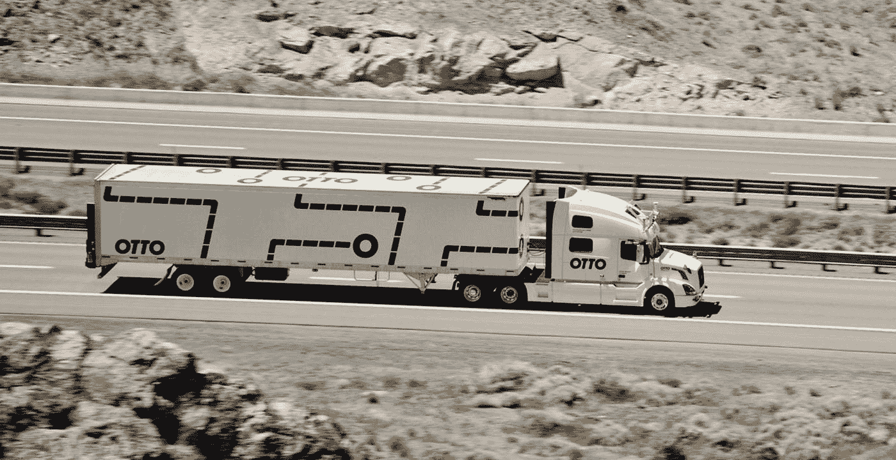
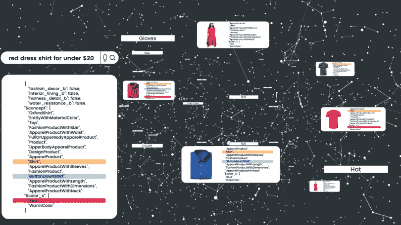

# 人工智能:创造还是夺走你的工作？

> 原文：<https://medium.datadriveninvestor.com/artificial-intelligence-creates-or-takes-your-job-479253322e5c?source=collection_archive---------13----------------------->

*专家怎么说未来的职业，一切都那么糟糕？*

*为什么他们相信一个人很快就会失业？*

科学家、商人和记者声称，当前的第四次工业革命将在人工智能领域带来如此多的新发现，很快许多职业将失去工作。但是，这是真的吗？

一个 AI 取代一个人需要多久？可能吗？

在给定的主题中，我们将考虑人工智能开发的两种选择:

1.AI 抢饭碗。

2.人工智能创造就业机会。

**人工智能取代多比**

**2030 年前 100 种职业…**

英国公司 Selaton 正在研究人工智能，并声称人工智能今天的发展速度比最初预想的要快，这意味着许多职业将被留在过去，机器人将取代它。

> [DDI 编辑推荐——人类无需申请:人工智能时代的财富和工作指南，作者杰瑞·卡普兰](http://go.datadriveninvestor.com/daib11/matf)

根据牛津大学和牛津马丁学院的研究，美国 47%的工作可以在未来 20 年内完全自动化。普华永道分析师也有类似的看法，根据他们的估计，未来 15 年美国 38%的工作岗位可以被机器人和人工智能取代。

谁创造了机器人？

**奥托**

奥托是由前谷歌员工创建的。在成功启动自动驾驶卡车项目后，2016 年 8 月，该公司被来自优步的投资者收购。

该项目的主要想法是创造能够取代长途司机的人工智能，或者至少部分实现卡车管理的机器人化。

该公司报告称，在美国大约 2-3 年后，超过 170 万名卡车司机将能够取代机器人。当然，业务不会仅限于货运。大约 3%的美国劳动者现在在不同的岗位上做司机。这意味着，如果公司继续试验车辆机器人化，数百万个工作岗位将面临减少的风险。

事实上，运输的话题让所有领先的汽车公司都感到担忧。特别是戴姆勒、宝马、福特、本田、丰田、特斯拉公司、卡玛斯等。

**亚马逊**

亚马逊是电商 AI 之王。无论是该公司对购买哪些产品的建议，还是抓取、分类和运送产品的仓库机器人，还是为网站本身提供动力的网络服务，亚马逊在其流程的几乎每一步都使用了人工智能。

其中一个引人注目的人工智能解决方案是亚马逊基于用户之前的评论和喜欢的产品推荐。这些算法在很多年前就已经被公司使用，但是经常被改进。

此外，亚马逊最大的履行中心之一，占地 855，000 平方英尺，展示了由人工智能驱动的新机器人。

实现这些机器人的主要目的是与官方网站和 hubs & spoke 建立在线连接，以立即开始包装购买的员工。换句话说，当有人在网上购物时，每个机器人都会自动采取行动。每个机器人都有自己的功能，例如，一个机器人找到物品并将其带到机器人场地边缘的工作站，在那里，一名工人将取出有问题的物品，并将其放在传送带上，另一名工人将将其装箱。在线门户网站上每天都有数以百万计的购买发生，这给中枢&辐条带来了很大的压力。对于亚马逊来说，创建自动化的订单流程非常重要。对于亚马逊来说，每一秒都很重要，这是一个很好的解决方案。

**人工智能让工作岗位增加 250 万倍……**

然而，我们可以观看人工智能实现的案例，其中相反的人工智能创造就业机会。Gartner 进行了关于人工智能的研究，根据结果，人工智能实际上创造了更多的就业机会，而不是摧毁它们。他们断言，到 2025 年，人工智能将增加 200 多万个工作岗位。什么样的工作？它将包括更多的软件工程师，训练人工智能识别物体，人类活动和许多其他新的专业和职业。例如，伏特技术和社交媒体正在创造新的工作、职业和场所。也不同于以前的职业。

**伏特科技**

Volt 技术基于区块链技术，结合智能合同，将消除参与者之间对中央系统的依赖，从而显著降低客户的交付价格。

另一方面，信差和快递公司会有更高的收入。伏特不仅保证信使获得更高的收入，而且伏特消除了我和技术上的限制，允许任何人和每个人使用该系统。

这使得更多的信使，包括退休人员、兼职人员或那些想要第二份工作的人积极参与进来。

此外，订单匹配系统还可以通过根据首选运输方式沿交付半径向上发送的信使来实现。没有帐号和信使职位的限制，只要愿意，每个人都可以成为信使。

**社交媒体**

许多人会同意，社交媒体页面开始创造新的职业，如博客作者、有影响力的人、MSS 专家等等。数百万人创建了自己的账户，每天向不同的主题上传独特的内容。他们是医生、金融家、律师、交易员、推销员、美容博主，许多其他职业开始成为大型社交媒体页面的一部分。

所有这些社交媒体页面，包括脸书、Instagram 和 Youtube，都已经在使用人工智能。脸书首席执行官马克·扎克伯格多次指出人工智能是他的社交网络缺陷的解决方案。值得一提的是，谷歌是一家在日常服务中使用人工智能排名第一的公司，而 Twitter 则是在使用人工智能消灭巨魔后变得出名的。

社交媒体页面将世界各地的人们联系在一起，并让任何有创造力并愿意分享经验的人出名。这就是为什么数百万人创建帐户并开始赚钱。

这是开始在他们的公司中实施人工智能技术的公司的小名单。

艾不仅没有离开工作场所，反而创造了更多的工作岗位！通过分析人工智能的发展以及新技术在不同领域的应用，我们了解到人工智能让人们有更多的机会以更独立、更健康的方式生活，并在工作时间内做更多令人愉快的事情。

如果你想知道你的职业被 AI 取代的概率有多大，那就去通过测试环节:[https://willrobotstakemyjob.com/](https://willrobotstakemyjob.com/)，通过百分之多少来了解有完全自动化的威胁！！！

把你的结果写在评论里吧！

参考:[https://www . bebee . com/producer/@ larryboyer/artificial-intelligence-will-it-kill-it-kill-you-job-or-let-you-live-the-dream](https://www.bebee.com/producer/@larryboyer/artificial-intelligence-will-it-kill-your-job-or-let-you-live-the-dream)