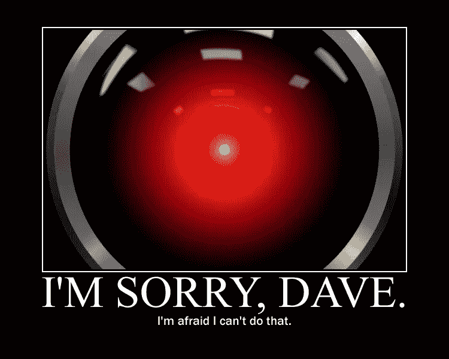

# 人工智能被揭穿——人工智能到底是什么？

> 原文：<https://medium.datadriveninvestor.com/artificial-intelligence-debunked-what-is-a-i-really-2944ecc2cc53?source=collection_archive---------31----------------------->

我相信你读过这样的句子:“*当我们开始教机器如何理解人类时，* [*AI*](https://lana-labs.com/en/glossary/artificial-intelligence/) *正在学习和进化。几年前，人工智能还仅仅存在于科幻小说中。理解人类的机器？智能的、进化的计算机？所有这些听起来都像是遥远的未来——对一些人来说令人兴奋，但对另一些人来说也令人恐惧。*

然而，如果我们相信当前的营销宣传，未来显然就在眼前。即使远离人机交互， [*物联网*](https://lana-labs.com/en/the-internet-of-events-big-data/) 也是现实。我们每天都读到智能家居和家用物品相互“交谈”。

*Alex Garland’s “Ex Machina” (2014) is one of the latest depictions of learning machines. (© Universal Pictures)*

# 那我们是生活在科幻世界吗？

嗯，不。你看，虽然这些事情听起来很神奇，但很多都是一厢情愿的想法，或者过于简单化。这项技术与斯皮尔伯格的著名电影[同名也没什么帮助，这部电影讲述的是机器人，无论从哪方面来说，机器人都在思考和感知人类。大多数对我们当今人工智能技术的误解都来自过于热切的营销人员。](https://www.imdb.com/title/tt0212720/)

我应该知道。我是其中之一。

你应该宣传的技术越抽象，我们就越倾向于象征、隐喻和寓言。然而，虽然这使外行人更容易理解困难的概念，但也容易产生误解。

# 所以人工智能只是一个神话？

也不是。技术是真实的，但它似乎有点被误解，有时甚至是故意的沟通错误。抱歉，半机械人还不是个东西。(尽管这正是乔装打扮的电子人会说的话……)

任何宣传智能系统或产品的公司要么是在撒谎，要么是他们不了解自己的技术。至少如果我们按照对“智力”的共同理解:思考和推理的能力，甚至可能是创造性的学习。

*“You think I’m a Replicant, don’t you, Mr. Deckard?” (© Warner Bros.)*

如果这是真的，那么 Siri 或 Alexa 如何回答我的任何问题呢？我听到你说。有效的观点。答案相当无聊:他们实际上不会对你的问题进行思考，不会以人类的方式。这些系统所做的任何事情都是由它们的开发者编程的。

人工智能让我们能够做到的是，不必将每一个可以想到的问答配对都编程到机器中。相反，我们向它输入规则和命令，将任何类型的问题与适当的响应联系起来。一种算法读取你的输入，并将其翻译成系统能够理解的信息。某些触发器——同样由开发人员定义——然后调用特定的输出。顺便说一下，这些触发因素可以采取各种各样的形式，包括文本和图像，甚至是口语——人工智能在这里完成了非凡的翻译壮举。

> 输入:“Siri，柏林(触发 2)今天(触发 3)天气(触发 1)如何？”
> 
> 输出:*在【时间 3】*的【位置 2】中寻找【特性 1】。

任何响应都是预先定义的。这个系统不做任何形式的创造性工作。没错，一些系统能够[学习](https://lana-labs.com/en/glossary/machine-learning/)模式和新行为，但即使这样也只能在创造者设定的框架内发生。

# 我很困惑:为什么所有关于人工智能的炒作？

虽然我们可能还无法模拟《T4 2001:太空漫游》中的智能计算机系统 HAL(我们可能会因此变得更好)，但人工智能作为一项技术仍然非常强大。

在其核心，人工智能使系统能够执行否则不可能由人类预编程的命令，因为覆盖每种上下文需要大量的代码。模式识别也是一个非常有价值的工具，因为它可以在多个复杂的输入和理想的输出之间建立精确的联系。把 AI 想象成一个拥有无限手臂的普通木偶，而不是会思考和感觉的木偶匹诺曹。

是的，它不像有些人说的那么性感。但肯定是有用的。

# 这在实践中看起来如何？

你问得真有趣！我们自己的软件[**LANA Process Mining**](https://lana-labs.com/en/lana-process-mining/)恰好由一个[智能算法](https://lana-labs.com/en/look-behind-the-curtain-of-process-analysis/)支持。有了这个，LANA 就能确定你的[业务流程](https://lana-labs.com/en/glossary/business-process/)中任何不必要偏差的根本原因。

## 想亲自尝试人工智能驱动的业务转型吗？

[**预定 LANA 产品试玩！**](https://lana-labs.com/en/demo/)

*原载于 2019 年 1 月 28 日*[*【lana-labs.com】*](https://lana-labs.com/en/artificial-intelligence-debunked/)*。*

相关故事:

 [## 用 7 个步骤解释深度学习

### 和猫一起

medium.com](https://medium.com/datadriveninvestor/deep-learning-explained-in-7-steps-9ae09471721a)