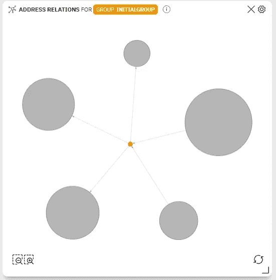
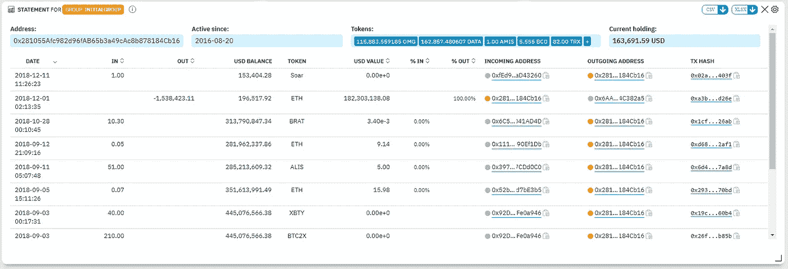

# 用于高级区块链调查的人工智能

> 原文：<https://medium.datadriveninvestor.com/artificial-intelligence-for-advanced-blockchain-investigations-1fb028a3ffbe?source=collection_archive---------6----------------------->

B 锁链和人工智能配合的很漂亮。虽然前者适用于存储和验证各种记录，但后者在分析大块数据、定义模式和促进决策方面更胜一筹。

 [## 挑战你对人工智能和社会的看法的 4 本书——数据驱动的投资者

### 深度学习、像人类一样思考的机器人、人工智能、神经网络——这些技术引发了…

go.datadriveninvestor.com](http://go.datadriveninvestor.com/4AI1) 

这两者的结合对区块链分析部门尤其有利。例如，它可以自动完成繁重的手工工作，而目前需要手工工作来解释从主要的区块链探险者那里提取的无数数据。与区块链相关的人工智能的其他好处包括模式检测、高级统计和智能标记/警报系统。

# 人工智能促进的区块链分析:模式检测

现有钱包浏览器的局限性之一是它们提供了源区块链数据，但没有进一步的解释。这告诉我们什么，除非我们准备手工工作，以了解某个地址是如何表现的。进一步的谷歌搜索和/或 Excel 处理是必要的，因为需要挖掘到一个单独的标签中的每个相关地址。然后就是出错的概率(毕竟我们都是人)。

人工智能可以通过使用算法来促进区块链分析，而不仅仅是一个地址或与其相关的小范围交易。人工智能可以深入到任何需要的方向。分析的结果可以揭示人眼看不到的联系。

**Address Relations** widget ([ORS CryptoHound](http://c-hound.ai))

> 区块链的人工智能可以非常有效地应用于模式检测领域。如上图所示，气泡用于直观地传达所搜索的地址如何与其他地址交互，以及哪些关系值得人类调查人员进一步分析。

# 人工智能促进的区块链分析:高级统计和交易信号

机器长期以来一直用于全球金融领域，以每天生成大量数据而闻名。随着高频交易的爆发，这一点尤其明显，通过这种交易，算法被训练来代替人类做出即时的买入或卖出决定。据信，这种做法构成了如今华尔街 90%的交易量。

人工智能和机器学习有望同样适合密码市场。在高波动性的情况下，其快速准确的算法驱动决策可能成为成功交易的关键。此外，加密交易员可以使用自然语言处理(NLP)来实时跟踪重要的加密新闻，如监管打击或熊市。

**ROI** widget ([ORS CryptoHound](http://c-hound.ai))

> 人工智能的一个应用可能是一个投资回报(ROI)小工具，它可以获取一个选定区块链地址的全部交易历史，并显示与其资产相关的损益动态。这超越了历史价值的简单记录，为更快的决策奠定了基础，有可能演变为完全自动化，类似于华尔街使用的高频算法。

# 人工智能辅助的区块链分析:标记/警报系统

银行和其他金融机构通常使用一套规则来标记可疑账户或活动。作为一项规则，有一些触发因素，如每笔交易超过预设的资金限额，或定期从标记为可疑的来源收到资金。这些操作是自动进行的，直到需要做出高层次的具体决策，如冻结账户或撤销交易。

类似的方法可以应用于加密货币。例如，任何与加密诈骗相关的现有证据都可以收集在一个数据库中。这可以用于启动人工智能来识别和防止欺诈活动。如果收集了足够多的数据，机器可以轻松有效地检测出人眼不总是明显的异常模式。

**Statement** widget ([ORS CryptoHound](http://c-hound.ai))

> 这可以通过使用记录所有日期、余额、代币和进出移动的声明小部件来实现。基于这些数据，可以探索钱包在选定时间段内的行为，并将其用于检测任何可疑活动。随着人工智能算法的进一步发展，收集的数据可以自动标记任何可疑的加密移动。

# 结束语

人工智能是一种通用技术，可以为区块链的应用带来实质性的好处。特别是，它可以通过用智能算法替代手动例程来增强区块链分析的当前状态。如果收集了足够的数据，机器学习可以将金融界的最佳实践带到加密货币市场。

此外，它可以检测出即使是最谨慎的调查者也注意不到的模式。由于基于算法的快速决策，人工智能有可能实现自动化加密交易。

最后，智能机器可以成为一种真正不可或缺的工具，以最公正的方式检测甚至阻止可疑的区块链活动。