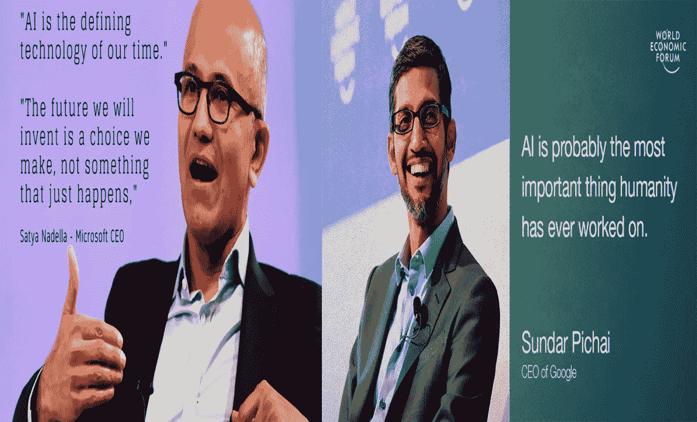
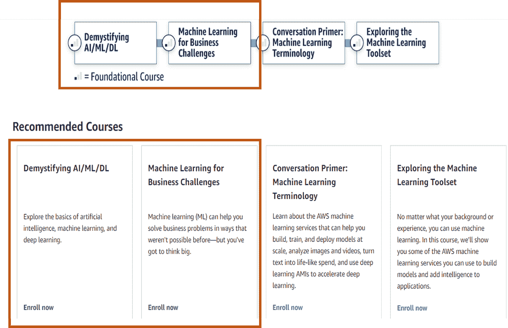
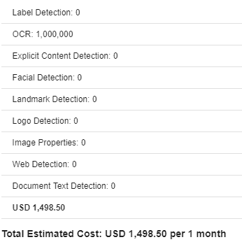

# 面向首席执行官和商业领袖的人工智能

> 原文：<https://medium.datadriveninvestor.com/artificial-intelligence-for-c-suite-and-business-leaders-b9b025fe456e?source=collection_archive---------3----------------------->



Source: Google Images

上周，我碰巧遇到了我的一位前客户，就像数据领域的任何两个人一样，我们的谈话指向了人工智能。长话短说，他问我的问题是

*   、曹、首席信息官或业务负责人如何深入浅出地理解 AI/ML？
*   企业领导者如何识别和鉴定 ML 问题？
*   虽然他们有一个称职的团队运行数据和人工智能功能，但他们如何用他们的语言交谈并理解他们的术语？

[](https://www.datadriveninvestor.com/2019/02/13/ai-creativity-biggan-as-a-creative-engine/) [## 人工智能与创意:作为创意引擎的 BigGAN |数据驱动的投资者

### 的确，2018 年可以被视为人工智能创造的创造力全盛时期的开始。当然可以…

www.datadriveninvestor.com](https://www.datadriveninvestor.com/2019/02/13/ai-creativity-biggan-as-a-creative-engine/) 

我在需要了解人工智能的高管名单上添加了额外的角色。你可能猜对了，CEO 兼 CFO。现在，我的前客户怀疑首席执行官/首席财务官是否有必要了解人工智能，但以下是我的理由

通常，首席执行官或首席财务官很容易将人工智能计划传递给首席数据或信息官或数字官。但这里有一些令人信服的理由让首席执行官/首席财务官意识到人工智能

*   首席执行官更接近于改变业务和竞争对手的格局，理解人工智能的适用性可以帮助他们重塑业务优先级

> 接受数据和分析的公司将定义业务的未来

*   它可以帮助他们在正确的用例中优先投资，并将人工智能置于其业务的核心
*   CDO/首席信息官/首席行政官(CDAIO)在大多数情况下从技术角度思考问题，可能不是探测业务趋势的最佳人选。此外，需要推动 CDAIO 从投资回报的角度来看待人工智能计划
*   对于一个非常复杂的问题，有一个更简单有效的解决方案。一些 CDAIO 对自己动手的好奇心可能会推迟洞察。将在本文后面的内容中详细介绍
*   最后也是最重要的一个人工智能可以通过扩展业务流程，优化运营成本，增加收入贡献和货币化数据资产来塑造组织 P&L。没有人比首席执行官/首席财务官更能推动这些计划取得成功

> 在这个数据经济中，每个公司都有必要成为人工智能公司

本文的前提是提供资源，帮助首席执行官(CEO、CFO、CDAIO)和业务领导(营销、风险、欺诈、供应链等)了解人工智能领域的各种术语和热门词汇，并帮助围绕识别和限定用例建立思维

让我们开始吧。这里强调的内容将是 6 到 7 个小时的阅读或观看，不涉及技术细节，同时了解技术上的可能性

```
The information I am sharing below are completely free but quality 
resources that will help get intution on AI, application of AI and on how to frame an AI problem
```

下面是 Jason Mayes 的一个令人惊叹的机器学习 101 演示。这种丰富的图形可视化涵盖了

*   什么是 ML 和 ML 的类型？
*   它是如何工作的？
*   如何使用它？

一旦你完成了上面的演示(如果你想深入了解细节，不要错过演示的注释部分的链接)，请查看下面突出显示的亚马逊决策者机器学习模块的 2 个模块

[](https://aws.amazon.com/training/learning-paths/machine-learning/decision-maker/) [## 机器学习-决策者路径

### 揭开机器学习、人工智能和深度学习的神秘面纱这条道路是为商业人士设计的…

aws.amazon.com](https://aws.amazon.com/training/learning-paths/machine-learning/decision-maker/) 

有些内容会重复之前演示中的内容，完全没问题。再看一遍。我突出显示了您需要重点关注的 2 个模块，跳过剩余的 2 个模块



一旦你理解了 AI/ML，它的适用性和如何识别 AI 问题。看看微软关于在你的企业中建立人工智能就绪文化的模块

[](https://docs.microsoft.com/en-us/learn/paths/foster-ai-ready-culture/) [## 探索在你的企业中培养人工智能文化的方法——学习

### 在此学习路径中，您将听到微软高层管理人员介绍一个框架来推动以下关键变化…

docs.microsoft.com](https://docs.microsoft.com/en-us/learn/paths/foster-ai-ready-culture/) 

最后一个，浏览一下 Google ML 关于问题框架的速成课程。不需要花太多时间。这只是给谷歌如何识别人工智能解决好问题的直觉

[](https://developers.google.com/machine-learning/problem-framing/) [## 简介|机器学习问题框架介绍|谷歌开发者

### 欢迎来到机器学习问题框架介绍！本课程帮助您构建机器学习(ML)…

developers.google.com](https://developers.google.com/machine-learning/problem-framing/) 

从资源的角度来看就是这样。现在，我将把重点放在我之前关于“非常复杂问题的简单而有效的解决方案”的对话上。在向人工智能项目投入资金之前，理解这一点非常重要

让我用例子来告诉你。你有一个庞大的呼叫中心运营，这是招致相当高的成本。您希望减少通话量或通话时长，以降低运营成本

达到你的目标的第一件事是找出客户为什么给你打电话，你也想了解他们在电话中花更多时间在哪里。是等待时间、代理无法快速解决还是复杂的信息检索过程

您意识到您没有为每个呼叫捕获的详细笔记，并且您想要将存储的语音呼叫转换为文本。你的技术团队来告诉你，我们将使用开源软件将语音转换成文本

人工智能领导者需要理解的一件事是，从语音中获得准确文本的复杂性是乏味的，需要长时间的培训和调整开源框架。即使开源软件训练有素，你可能也不会获得高水平的准确性。这是一个复杂问题的例子，领先的云提供商已经解决了这个问题，他们将其服务公开为 API，可以基于按需付费模式使用。

这使得该组织能够以更快的速度加快人工智能计划。对于自然语言处理/理解、图像、翻译、地图、OCR 等，也存在类似的 API 和服务。

了解这些服务可以让人们在考虑优先级、时间表、投资回报率和长期愿景的情况下，判断哪种方法适合人工智能计划

另一个例子是在保险业，您可能需要从文档中提取细节来解决索赔。现在，使用开源的定制构建在某些情况下不会像一些云 API 那样准确。对于定制版本，持续的实施和维护成本也会很高。但是有了云 API，即使你每个月有一百万个文档要处理，你每个月的花费也不会超过 1500 美元



对于一个技术团队来说，在实现一个用例的过程中，寻找更简单、更经济、更可靠的解决方案是非常重要的

这些 API 可能不是在所有情况下都是完美的。针对您的用例快速尝试一下，并决定购买 v/s building。

> 对于技术领导者来说，一个警告是确保团队专注于解决业务问题，而不是爱上技术，使业务问题成为技术问题

我要讲的最后一个问题是，首席执行官和业务领导如何识别并优先考虑能产生长期业务价值的用例。

人工智能项目的规模和预算很难确定，因为其结果不确定，实验时间可能比实际计算的时间长，与业务流程集成的复杂性，培训部署偏差等。这使得人工智能项目难以预算和衡量投资回报

为了应对上述挑战，我创建了“人工智能价值实现框架”来计算人工智能项目的投资回报率。这个框架的细节可以在下面的链接中找到，模板也可以在开放域中为任何人和每个人使用

[](https://www.linkedin.com/pulse/prioritizing-artificial-intelligence-use-cases-roi-part-srinivasan/) [## 对人工智能用例进行优先级排序——计算投资回报(ROI)——第 2 部分

### 这篇文章是我之前关于识别和区分 AI 用例的文章的延续。在之前的帖子中，我们…

www.linkedin.com](https://www.linkedin.com/pulse/prioritizing-artificial-intelligence-use-cases-roi-part-srinivasan/) 

下面是文章的第 1 部分，设置 ROI 计算和模板链接的上下文。下载投资回报模板，根据您组织的需求进行定制

 [## 识别和区分人工智能用例的优先级——第 1 部分

### 作为技术人员，我们被如此多的宣传所包围，以至于我们倾向于忽视我们周围的现实。

www.linkedin.com](https://www.linkedin.com/pulse/identifying-prioritizing-artificial-intelligence-use-cases-srivatsan/) [](https://github.com/srivatsan88/AI-Value-Realization-Framework) [## srivatsan 88/AI-价值实现-框架

### 这个存储库包含了我在 LinkedIn 上发表的关于识别和区分人为因素的文章的支持工件…

github.com](https://github.com/srivatsan88/AI-Value-Realization-Framework) 

我在下面的附录部分放了一些可选的阅读材料，主要是为了理解为什么人工智能项目会失败，以及数据策略对于成功的人工智能策略的重要性

如果你正在寻找如何建立人工智能组织的信息，请在 LinkedIn([https://www.linkedin.com/in/srivatsan-srinivasan-b8131b/](https://www.linkedin.com/in/srivatsan-srinivasan-b8131b/))上联系或关注我，以获得我未来文章的通知

**附录:**

[](https://www.linkedin.com/pulse/top-reasons-why-artificial-intelligence-projects-fail-srinivasan/) [## 人工智能项目失败的主要原因

### 这篇文章综合自我的 LinkedIn 帖子，包含了我的 LinkedIn 同事在……

www.linkedin.com](https://www.linkedin.com/pulse/top-reasons-why-artificial-intelligence-projects-fail-srinivasan/) 

[https://www . LinkedIn . com/pulse/think-data-first-before-be-ai-srivatsan-srinivasan/](https://www.linkedin.com/pulse/think-data-first-before-being-ai-srivatsan-srinivasan/)