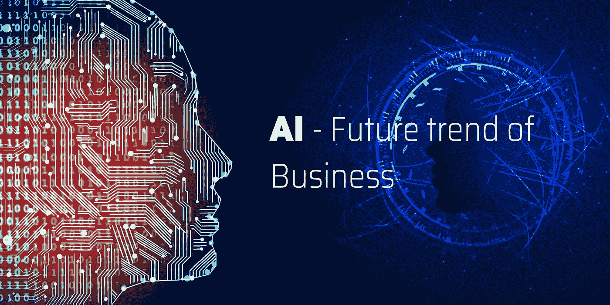

# 人工智能——商业的未来

> 原文：<https://medium.datadriveninvestor.com/artificial-intelligence-future-of-business-d5107108dcfd?source=collection_archive---------6----------------------->

[商业](https://www.2basetechnologies.com/)中常用的竞争工具之一是人工智能(AI)。有很多公司正在讨论它的利弊。从数据分析到提出预测性建议，再到为客户提供自动聊天机器人[服务](https://www.2basetechnologies.com/services)，商业领袖们觉得人工智能和深度学习已经成为一种必不可少的工具。

在我看来，人工智能不是你的企业应该从远处观看的东西。不管你是一个新兴企业还是一个已经达到财富 500 强的企业，积极探索人工智能优势的必要性是巨大的。

*人工智能(AI)加入了其他领先和新兴技术，如* [*大数据*](https://www.2basetechnologies.com/services/bigdata) *、云计算和机器学习*

如果你仍然怀疑或不相信人工智能可以处理越来越多的任务，想想 IBM 的沃森 2011 年在节目 Jeopardy 中的精彩表现。你甚至可以考虑在个人生活中使用人工智能服务和设备的各种场景。比如智能助手[应用](https://www.2basetechnologies.com/services/mobile-application-development-company)和苹果的 Siri 或者亚马逊的 Alexa 这样的设备或者装置。此外，不要忘记你在网上看到的其他人工智能超级应用程序，如你在驾驶时使用的 GPS 应用程序。

**你的竞争对手可能会如何使用人工智能？**

现在，你不能直接打电话或问你的竞争对手他们将如何使用人工智能，或者他们计划如何在他们的公司使用人工智能。嗯，这不是路的尽头，因为你有互联网找到一种或另一种方式。例如，你可以尝试在线搜索“威瑞森如何使用人工智能？”，您将获得与该公司如何利用人工智能提供服务相关的翔实数据。

不要忘记查看你的竞争对手的网站和社交媒体(主要是脸书和 LinkedIn)。在这里，你可以浏览新闻稿、博客和新闻报道。有时，你可能不得不走老路，获取年度报告、时事通讯或过去一年的任何其他文献的硬拷贝，这些在网上是找不到的。

此外，做这些专题，你需要撒一个更大的网，用行业搜索来搜索，比如“有线网络机构如何使用人工智能”，“互联网服务机构如何使用人工智能”等等。在这里，你最好进行更全面的搜索。除了这些搜索，你一定不能忘记现实生活中的其他(IRL)和其他种类的非数字渠道。

有时你可能会被邀请参加一个行业活动，在这种情况下，一定要留意与人工智能相关的会议。在这些会议中，在人工智能专家之间进行互动或站着或坐着。最重要的是，你可以阅读一些与人工智能相关的书籍，但它们可能至少已经过时 5 到 14 个月了。此外，你可能认识某些竞争对手或一个顺从且见多识广的人，带他们出去吃午餐，向他们请教。

**思考&计划人工智能如何有利于你的业务**

如上所述，你真的需要研究，基于这种研究，你必须创建一个列表，并框定人工智能将能够为你的业务以及与你的行业和规模相关的公司做什么。你可能会发现不同的关键领域，比如-

■必须了解深度学习、机器学习、认知计算和自然语言处理等人工智能技术。你需要知道这些技术是什么，这些技术适用的各种任务和数据将有助于你更好地理解人工智能。你也将能够理解各种目标的限制和要求。

■人工智能所做的处理。你必须对人工智能的处理方式有一个合理的理解，比如语音识别和图像，包括预测分析。现在，这会让你对人工智能的用途有一个大致的了解，不仅是在商业领域，甚至是在教育、政府、科学和其他研究领域，等等。

**列出你需要的衍生品清单**

为了列出人工智能的必要性或好处，

■首先，想一想你想要的福利是什么。无论是提高生产力还是员工或获得更快的工作流程。它甚至可以提高产品生产率，降低成本。

■瞄准你想要的时间框架。完成后，您必须根据实施时间、估计的成本、收益或风险以及总体价值来确定给定列表的优先级。

■与此同时，你需要选择一两个较小的任务来检查人工智能是否适合你的业务。在这里，它可能是一个更大任务的一小部分。确保你从一个非业务关键的任务开始，甚至从一个非面向客户的任务开始。

**人工智能——值得关注的未来趋势**

尽管与计算机科学相关的人工智能可以追溯到 20 世纪 50 年代，但只是在过去的十年里，各种类型的人工智能才开始为各种类型和规模的公司所用。使这成为可能的因素是持续的价格或硬件性能改进、先进的人工智能技术和云计算。此外，物联网、大数据、语音和图像识别等计算趋势为人工智能创造了更多的目标点。