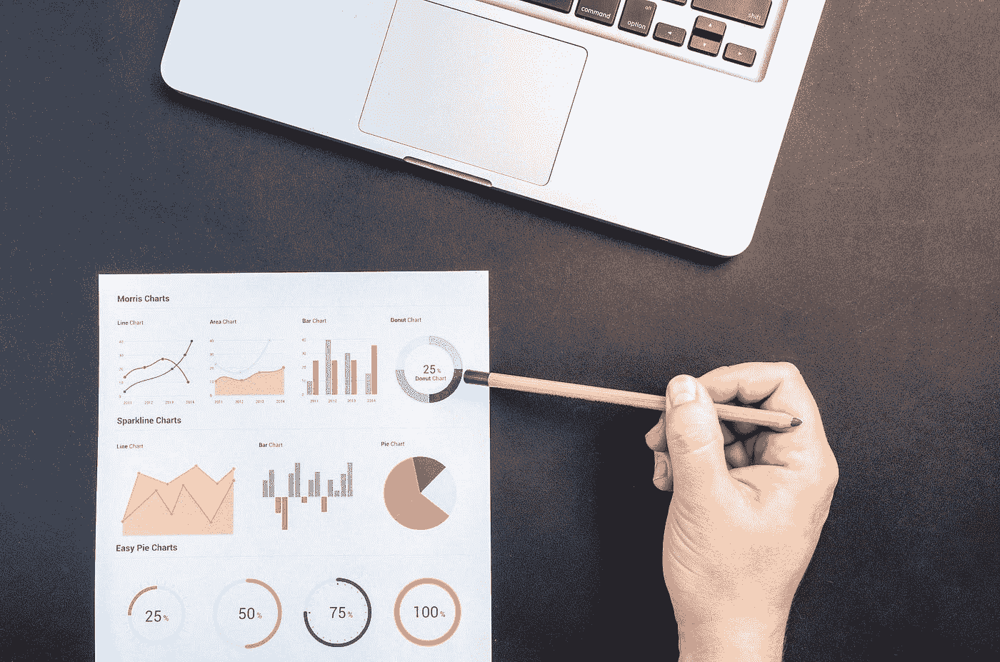

# 人工智能:炒作？还是改变代理人来塑造未来？

> 原文：<https://medium.datadriveninvestor.com/artificial-intelligence-hype-or-change-agent-to-shape-future-d543e17cdf71?source=collection_archive---------6----------------------->

Photo Credit: Seattle Chinese Times

当时，一台计算机重达 30 多吨，占用 1800 平方英尺的空间，使用 18000 个真空管和 200 千瓦的电力，所有这些使人类能够在一秒钟内计算 5000 次加法、357 次乘法和 38 次除法。顺便说一下，没有内存也没有存储。

我没有偏见，ENIAC 是当时的超级计算机。但我更想知道的是，从那台巨型计算机到最近推出的英特尔 Movidius，一个拇指大小的驱动器，具有像人类一样思考的能力，以及另一个 8.8 毫米宽的芯片，可以为无人驾驶飞机提供动力，这些无人驾驶飞机可以跟随他们的主人，了解深度，避免障碍，并在空间中确定自己的方向，所有这些都是靠自己，科学取得了巨大的进步。

在过去的几年里，有无数的技术吹嘘自己带来了颠覆，但真正在我们的日常生活中做到这一点的，仍然是最高出价者最喜欢的马是人工智能，或称 AI。所以，我想做的就是写一点关于人工智能的东西。

# AI 是什么？

人工智能是机器像天才人类一样看、思考、学习和行动的能力。毫无疑问，这些机器更快、更有效、更可靠。今天的人工智能可以识别人脸，与人交谈，识别图像中的物体，根据声音认证用户，预测拥挤的公共场所的可疑活动，等等。你猜怎么着？所有这一切都有可能以一种人们难以理解的速度和规模实现。

Photo Credit: Pexels

根据一项研究，人工智能预计到 2025 年将达到价值 1900 亿美元的市场(MarketsandMarkets)，到 2022 年将产生超过 3.9 万亿美元的商业价值(Gartner)。毫不奇怪，有无数创业公司和世界 500 强公司决心从 AI 中获得最大收益。

# AI 是如何工作的？

用非常简单的语言来说，AI 背后有一台电脑。无论大小。它首先通过传感器或人类输入来了解情况。例如，如果你想训练一台电脑自动检测一只猫，你必须向它展示许多猫。在此之后，计算机处理信息，并试图预测下一次的结果。然后，训练这台计算机或计算机本身的人/工程师重复大量信息，直到达到期望的结果精度。虽然整个过程并不像听起来那么简单，但要知道，训练信息量越大，效果越好。这意味着，你可能需要 10 万张猫图像才能达到 80%的准确率。

# 一些使用案例:

AI 在我们身边不断被使用。您可能会想到的几个例子是:

1.  虚拟数字助理——苹果 Siri、亚马逊 Alexa、谷歌助理
2.  亚马逊上的“经常一起购买”建议
3.  无人驾驶汽车
4.  聊天机器人
5.  情绪识别，了解客户情绪
6.  零售店中的自动化顾客客流量计数

这些只是许多人经常听说的几个使用案例。但人工智能的范围不仅限于这些，还涉及怀孕管理、人类基因分析、智能安全系统、无收银员结账、预测性飞机引擎维护等等。

# 谁应该注意？

Photo Credit: Pexels

所有人。人工智能将对几乎每一个行业产生影响，一些行业将立即受到影响，而另一些行业将最终受到影响。医疗保健、汽车、零售、农业、客户服务、制造、每个人。每个部门——从人力资源部、运营部、市场部、销售部等等。不管你是谁，它明天将成为你生活的一部分，并将使今天的技术过时，就像过去移动电话对固定电话的影响一样。

# 会发生什么？

据说 AI 抢走了很多工作。在我看来，不会。但在这方面，有一件事肯定会做到，那就是，它会震撼人们，而且会很好地震撼他们。这将迫使他们走出舒适区，学习新技能，做最困难的事情——接受改变。只要记住计算机进入我们生活的日子。每个人都有同样的恐惧。但是，他们创造了更多的就业机会。然而，在学会计算机之后，整整一代人都走了，好像他们的生活取决于它。今天也是如此。

我们生活在如此激动人心的时代，离光明的未来只有一步之遥。让我们尽力而为吧。