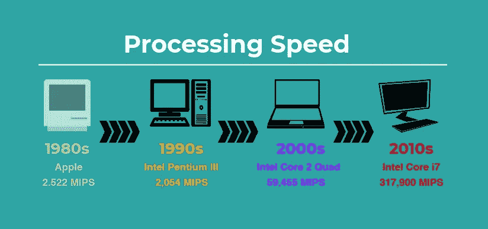
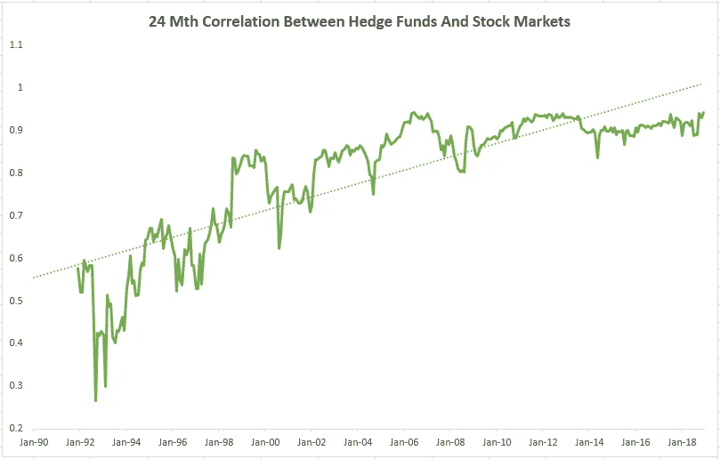
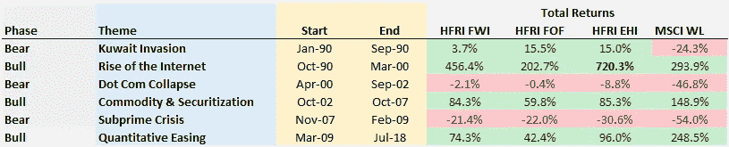
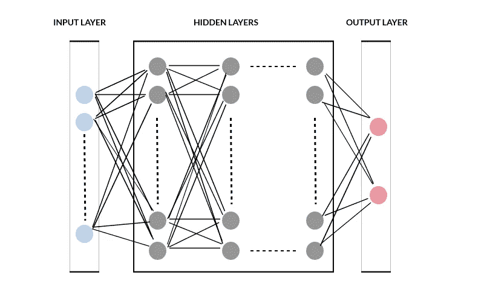
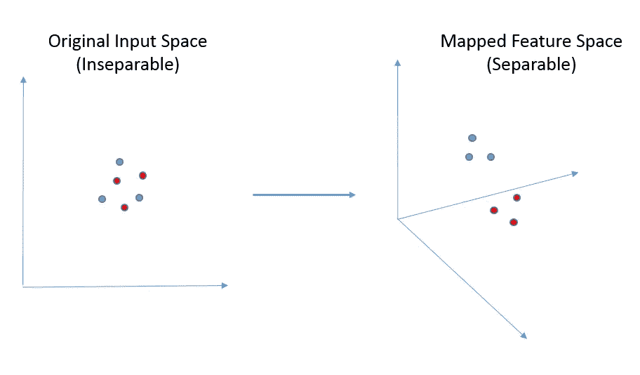

# 人工智能——炒作还是真实交易——投资缓存

> 原文：<https://medium.datadriveninvestor.com/artificial-intelligence-hype-or-the-real-deal-investment-cache-3b0adfbcb192?source=collection_archive---------7----------------------->

人工智能(AI)近年来在对冲基金界获得了前所未有的关注。然而，AI 并不是一个新的角色。事实上，它的根源可以追溯到 20 世纪 40 年代，当时沃伦·麦卡洛克和 T2·沃尔特·皮茨首次引入了神经网络。

今天，它在从识别图像、语音、自然语言处理到机器人等应用中得到了广泛应用。同样，使用人工智能技术进行交易或投资也不是什么新想法。但是在早期的尝试中，它并没有取得很大的成功。那么，为什么每个人都对再次使用人工智能进行投资如此兴奋呢？从我自己的角度来看，我将此归因于技术进步和不断变化的市场动态。

 [## 值得购买的 4 大人工智能股票及其原因——数据驱动型投资者

### 人工智能(AI)在 2019 年继续进入大众意识。通过应用程序…

www.datadriveninvestor.com](https://www.datadriveninvestor.com/2019/03/06/top-4-artificial-intelligence-stocks-to-buy-and-why/) 

# 快速的技术进步

**更快的加工速度**

这些年来，我们的技术突飞猛进。我第一次接触个人电脑是一台 8 位苹果电脑，配有运行 MS DOS 的单色 CRT 显示器。后来出现了配备更强大的英特尔处理器的机器。有 16 位的 286 系列，紧接着是 32 位的 386 和 486 系列。当我在大学的时候，我用的是一台运行在 32 位英特尔奔腾处理器上的机器，它比 8 位的苹果快几百倍。

我记得为我的论文用 C 语言从头开始编写我的第一个神经网络。当时，我想让计算机识别说话的人。在学术术语中，我们称之为自动说话人识别。那是怎么做到的呢？在没有进入复杂细节的情况下，我从字面上向神经网络输入了来自每个说话者的数千个经过处理的语音样本，以反复训练它。你可以拿一个小学生为拼写考试而学习做比较。为了记住这些单词，他一遍又一遍地写，直到记下为止。

那么训练一个神经网络需要多长时间呢？非常长。但我想这部分是由于我当时笨拙的编程技巧。我会将机器设置为在早上训练，结果只会在晚饭前后出来。相比之下，我们现在可以使用开源的 AI Python 包，在我们的 PC 上用几行代码在几分钟内训练一个神经网络。

*CPU Processing Speed in Million Instructions Per Second (MIPS)*

**更大的数据存储能力**

数据存储能力的提高是巨大的。从 80 年代流行的容量只有 360 千字节的 5.25 英寸软盘，到今天几乎无限的云存储，我们确实走过了漫长的道路。甚至今天的个人台式机也配备了从几百千兆字节到几兆兆字节的最先进而又负担得起的硬盘驱动器。一个 1tb 就足以存储 5000 只股票超过 30 年的 1 分钟 OHLC(开盘-盘高-盘低-收盘)价格数据。如果我们上升到机构级别，在那里我们捕获更精细的分辨率数据，我们可以谈论 Pb 级。事实上，用不了多久，exabyte、zettabyte 和 yottabyte 就会成为普通人的新常态。

**数据的指数级增长**

信息的数字化和互联网的普及带来了数据的爆炸式增长。您的手机、电脑、传感器和许多其他数字设备已经成为数据收集的关键点。根据[IDC 2018 年的报告](https://www.seagate.com/files/www-content/our-story/trends/files/idc-seagate-dataage-whitepaper.pdf)，我们的世界目前拥有 33 吉字节的数据，预计到 2025 年将快速增长到 175 吉字节。这些数据包括从网络上抓取的数据、商业活动交易、调查结果、社交媒体帖子等等。它们可以是非结构化的格式，如 HTML、视频剪辑、声音文件、图像等。这些被称为替代数据。

随着公司寻求将这些替代数据货币化，更多的替代数据将变得容易获得，其中一些可能对投资有用。因此，我们不再局限于传统的结构化市场数据，如价格、订单流、经济和资产负债表数据。只要你付得起钱，现在盘子里有大量的选择。

# 不断变化的市场

**恶化的性能和阿尔法**

除了技术推动因素，资产管理行业也越来越迫切地需要研究如何利用人工智能的潜力。特别是，对冲基金经理面临着迄今最具挑战性的时期。随着竞争加剧，传统的投资阿尔法正在减少。1997 年，大约有 4500 家对冲基金管理着总价值不到 3000 亿美元的资产。如今，有超过 10，000 家对冲基金持有约 3 万亿美元的总资产【来源:[巴克莱对冲](https://www.barclayhedge.com/solutions/assets-under-management/hedge-fund-assets-under-management/hedge-fund-industry/)】。

全球央行在 2008 年金融危机中出手干预后，加剧了对冲基金的长期困境。他们推出了规模空前的大规模刺激计划。这让市场偏离了轨道，改写了规则，改变了行为。在迄今为止的整整 10 年里，波动性大幅下降，股市似乎不可战胜。2009 年至 2018 年间，MSCI World 实现了令人印象深刻的 12%年化回报率。另一方面，HFRI 基金加权指数(对冲基金代理)与区区 5%的年化回报率相比就相形见绌了。如今，鉴于对冲基金收取的费用，痛斥它们表现不佳的文章并不缺乏。

**对冲基金与市场的相关性正在增加**

对对冲基金来说，与传统市场的低相关性和提供重要的多样化收益是一个关键卖点。毕竟，对冲基金被称为另类投资是有原因的。但是这些特征也正在消失。自 1990 年以来，对冲基金和股市回报之间的相关性一直在稳步上升。24 个月的相关性从 90 年代的低于 0.5 到今天的高于 0.9。

不像早期的低迷时期，对冲基金提供了显著的表现，他们在最近一段时间提供了较少的价值。下面是摘自早先一篇关于[对冲基金与股票市场](https://investmentcache.com/which-is-a-better-investment-hedge-funds-vs-equity-market/)的帖子的表格。它显示了各种对冲基金指数在 MSCI World 亏损超过 20%期间的表现。在 90 年代早期和 2000 年初的低迷时期，对冲基金总体上获利或持平。但在 2008 年的熊市中，它损失了大量资金，尽管仍低于市场水平。

*HFRI FWI (Fund Weighted Index), HFRI FOF (Fund of Funds), HFRI EHI (Equity Hedge Index), MSCI WL (World) Table Source:* [*Which Is A Better Investment — Hedge Funds Vs Equity Market*](https://investmentcache.com/which-is-a-better-investment-hedge-funds-vs-equity-market/)

**对冲基金正在削减旧策略**

许多投资策略不再像过去那样奏效了。趋势跟踪是 Winton Capital 等老牌机构长期以来的主要策略，在 2008 年表现出色，但现在已经失宠了。最近几年，趋势跟踪者被突然出现的剧烈市场抛售和同样凶猛的反弹搞得焦头烂额。随着快速的信息流和快速反应的市场，较慢的趋势策略似乎无法跟上。2018 年，Winton 宣布决定将趋势跟踪策略的风险敞口削减至 25%【来源: [Winton Capital](https://www.winton.com/davids-views/july-2018/wintons-david-harding-on-turning-away-from-trend-following-risk-net) 】。就在最近，文艺复兴科技也紧随其后，在文艺复兴机构多元化阿尔法(RIDA)基金中减少了对趋势策略的配置。

这些策略会永远过时吗？将来会不会卷土重来？那是任何人的猜测。我确实认为，这些决定在一定程度上是出于商业动机，而不是纯粹的投资驱动。无论如何，只有时间才能证明这个决定是否正确。但与此同时，有一场战斗要打，对冲基金正转向人工智能和替代数据，寻找新的阿尔法来源。

# 神经网络

有许多不同的方法来构建机器智能。但是最被广泛谈论和最接近模拟我们大脑的，也许是神经网络。在神经网络中，有不同的变体。我正在看的是多层感知器(MLPs)。这就是人们可能称之为深度学习的一种形式——一个在 90 年代不存在的时髦词，尽管 MLP 已经在使用了。在这个框架中，我们的大脑被建模为相互连接的神经元层。请参见下面的通用图表。

输入层包括用户输入网络的可观察数据。隐藏层是魔术发生的地方，输出层是结果。这是一个非常通用的设置，可以以不同的方式使用。例如，您可以将市场数据输入网络，并让它预测下一个时间点的股票指数价格。或者，你可能只对股票指数的走向感兴趣。则具有二进制值 0 或 1 的输出，其中 1 表示向上，否则 0 就足够了。在这两种情况下，你只需要一个输出神经元。

**神经网络监督学习**

一个神经网络开始就像一个什么都不知道的新生。在它有任何用处之前，它必须学习。说到机器学习，有各种各样的方法。我们可以让它自己(在无人监督的情况下)找出一组模式和关联，或者我们可以教它(在有人监督的情况下)。出于预测的目的，我们倾向于依赖监督的方法。

我们如何教一个神经网络？这个概念很简单，不需要钻研数学。我们准备一组训练数据，向系统显示每个输入的期望输出。我们可以一个一个地输入数据，一批一批地输入数据，或者一次输入全部数据。系统不会在第一次尝试中就做对。但是它将通过基于误差函数调整神经元的连接权重来学习。这个误差函数集体地测量了它的预测与期望的结果有多远。最终目标是将该误差函数降至最低。当整个训练集被输入时，我们就完成了一个训练周期，或者通常被人工智能从业者称为一个纪元。然后，这个学习过程被重复数百或数千次，直到误差函数稳定到最小。

训练完神经网络之后，就该把它所学的东西付诸实践了。为了做到这一点，我们在它从未见过但我们知道其输出的数据上测试它。这给了我们一个真实世界性能的代理。如果符合要求，我们将使用实时数据运行模型，然后将其部署到生产中。

# 神经网络与常规模型有何不同？

好吧，预测神经网络学习。但最终，它解决的还是拟合问题。是什么让它与多因素线性回归模型如此不同呢？毕竟，对冲基金一直在使用这种模型对股票进行评分和排名。有几个显著的区别。

**神经网络导出并规定其自身的功能**

一个关键的区别是，在传统模型中，我们规定了所使用的函数。因此，我们一开始就限制了输入与输出(如果有的话)应该如何相关的范围。例如，线性多因子回归模型假设因子及其输出具有线性关联。这使得我们可以很容易地理解模型和解释结果。但是如果这种关系是非线性的，那么这种模型就不合适。

当涉及到市场和投资时，我们经常不能确定一个清晰的关系。大多数时候，我们只是做假设，并使用数学上容易处理的东西来达到我们的目的。但是，为什么我们需要把自己封闭起来，只尝试那些我们能够很容易解释的事情呢？我想每个人都同意，我们还有很多不知道的。因此，如果你没有解决方案，为什么不让别人接手呢？

神经网络自己学习并发现输入和输出之间的关联。它通过训练过程得到嵌入在隐藏层中的自己的函数。通过为神经元设置适当的激活函数，神经网络可以整体解决复杂的非线性问题。但是观察和理解这个隐藏层通常是不切实际的。这也是为什么神经网络被认为是黑盒。

**神经网络将输入映射到单独的特征空间**

数据驱动的预测分析包括对过去进行概括拟合。从数学上来说，这在高维空间中更容易。我们知道我们可以很容易地用一条线来拟合 2 维空间中的 2 个点。然而，我们无法精确拟合 3 个点，除非它们沿着同一条线运行，或者我们使用非线性函数。但是，如果我们引入第三维，那么我们可以定义一个平面，捕捉所有 3 个点。如果有更多的点，那么一个超平面将完成这项工作。简而言之，你拥有的维度或自由度越多，就越容易拟合。这是理论上可以做到的，但注意，将这种结果推向极端是不可取的，因为它会导致过度拟合和不可用的模型。

传统模型的功能决定了它的固定维度。例如，双因素线性回归模型适用于三维环境。神经网络没有这样的限制。因为它可以将原始输入映射(线性或非线性)到隐藏层中的单独特征空间。例如，通过设置一个神经元多于输入的隐藏层，神经网络可以将维度扩展到多维空间来执行其任务。但是像现实世界中经常发生的那样，过多的输入也是不切实际的。除了现有的许多降维技术，神经网络也可以用于提取代表原始较大数据集的低维特征。

# 人工智能是我们投资的圣杯答案吗？

有了如此强大的技术和大量未开发的数据，这是否意味着我们终于可以确定投资的圣杯方法了？虽然我同意人工智能有重大进展，但我不认为我们离它很近，我也不相信我们能找到它。但是，在像国际象棋这样的智力游戏中，机器不是已经打败了顶尖的人类吗？是的，但是生活中的许多事情不仅仅是一盘棋。

金融市场远比一盘棋复杂得多

1996 年，IBM 的人工智能机器[深蓝](https://en.wikipedia.org/wiki/Deep_Blue_(chess_computer))击败国际象棋世界冠军加里·卡斯帕罗夫，震惊世界。然后在 2016 年，谷歌的 [AlphaGo](https://en.wikipedia.org/wiki/AlphaGo) 在一场更复杂的围棋比赛中，决定性地击败了世界知名职业棋手 Lee Sedol。这些确实是值得庆祝的重要里程碑。但是，与金融市场相比，象棋问题的规模可以比作宇宙中的一颗星星。这两个游戏都是有限空间中结构良好的问题。一切都是关于你和你的对手，一切都暴露无遗，除了他的想法。每一步都很重要。在任何时间点，您都可以完全了解发生了什么。你知道棋子的当前位置，你自己和对手的移动顺序。最重要的是，这是一个回合制游戏。该你了，该我了。在这之间，没有惊喜。

另一方面，金融市场是一头混乱的巨兽。可能每天都有数以亿计的参与者。没人等你。每时每刻都有新的信息传来。没有人拥有所有的碎片。没有人完全理解每一部分是如何塑造市场的。每个人都有自己的解释，并有能力采取不同的行动。与一盘多少会保持几个世纪或更久的棋局不同，金融市场在不断进化、扩张和改写其规则。

**短数据历史和未知值**

你的最终产品只会和你喂给它的东西一样好。深度学习等人工智能实现需要大量高质量的数据。就我个人而言，我还没有测试出可供选择的数据集。但是也有一些可以预见的挑战。替代数据是新的，可能没有这么长的历史。此外，对于要在实际系统中部署的此类数据，它需要完整、结构化、准确并及时交付。即使它符合这些标准，其预测价值的问题仍然存在。在它被广泛试用和测试之前，没有人能宣称它的功效。事实上，很有可能新的替代数据集的买家和卖家都不知道它到底能为他们做什么。

**过度装修和垃圾**

把一个强大的工具放在坏人手里，它会被滥用。随着越来越多的数据、能力和复杂的算法唾手可得，我们很容易将尽可能多的东西投入到神经网络中。我们几乎可以不费吹灰之力就把某样东西敲掉。在此之后，我们可以惊叹于一个可怕的解决方案适合几乎每一个单一的输出在过去。就在我们认为世界掌握在我们手中的时候，完美的模型在现实世界中悲惨地失败了。为什么？因为我们刚刚安装了包括噪音在内的所有东西。想象一下，如果 90%以上的数据一开始就是噪音。这可以通过在神经网络的设计和使用验证和测试集的数据准备中采用良好的实践来避免。

另一种尝试是向神经网络输入各种数据排列和组合，以期找到有用的东西。总的来说，我对这种方法没有异议。毕竟，利用机器来帮助我们跳出思维定势有什么错？但是，当不涉及人类帖子分析，而我们仅仅依赖经验统计数据时，我们可能会以基于巧合关系的模型告终，这些模型注定会失败。任何结果都可能是暂时的。公平地说，我必须承认我不能一开始就排除关系。也许我只是有偏见或者无知。但我总是保持警惕和怀疑，例如，当人们开始将他们的市场预测与天体运动联系起来时。

**更多的投入不一定意味着更好的表现**

为了建立好的模型，我们希望我们的输入与输出有很高的相关性。然而，我们不希望我们的输入彼此高度相关。虽然神经网络能够解决相关性，但它不能增加数据集的信息价值，超过其固有的价值。因此，当大量不同的输入数据都高度相关时，就没有什么意义了。这无助于改进模型。例如，我们可以根据一个人的身高来猜测他的年龄。但是进一步告诉我们他的体重并不能提供比身高更多的信息。所以它不太可能让我们的猜测更准确。在我们的案例中，替代数据是否为传统市场数据提供了任何显著的附加值仍不清楚。

# 结论

那么，今天机器能接管投资经理吗？我们不要自欺欺人了。人工智能和人类的认知不一样。我们无法复制我们不完全了解的东西。它是一个基于多学科基础的研究领域，如计算机科学、神经科学、数学、统计学等。它依靠纯粹的计算能力来让机器模仿特定的人类行为或决策。但是为了让一切工作，每个机器和模型背后都有一个人类建筑师。

不过，我同意，机器智能的进步和替代数据的出现为对冲基金带来了新的机遇。但是我们不要操之过急，过于兴奋。这些都被所有的商业营销和媒体夸大了。鉴于对冲基金的隐秘性，我们无论如何也不知道他们到底在用它做什么。也许在人工智能的外表背后，一些人正在做的仍然是具有适应能力的老式线性回归，只不过是移动时间窗口。

在这个阶段，我们只能说潜力是存在的。与此同时，让我们保持开放和观察，或者我们可以加入争论并为自己尝试一下。

*原载于 2019 年 4 月 20 日*[*【https://investmentcache.com】*](https://investmentcache.com/artificial-intelligence-hype-or-the-real-deal/)*。*