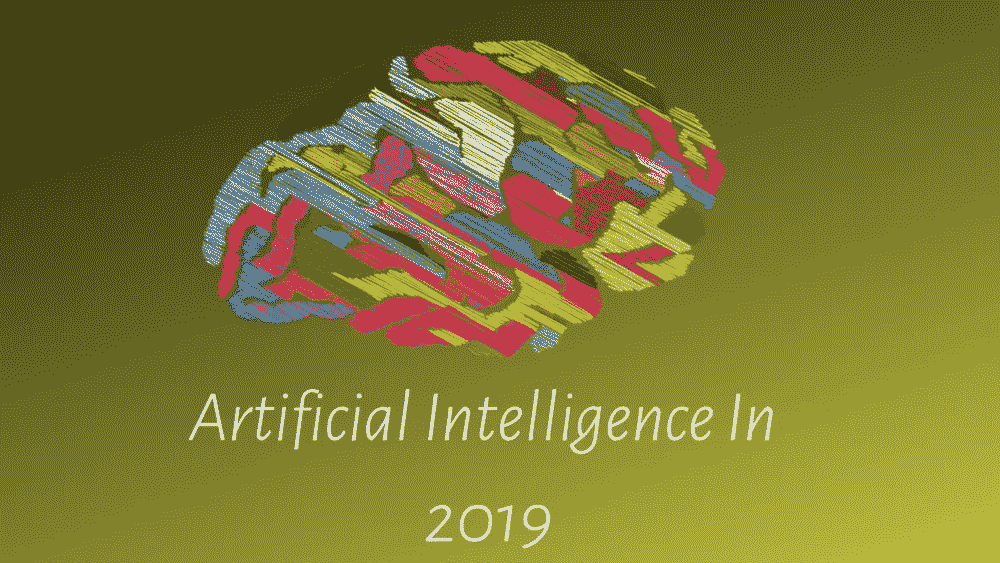

# 2019 年的人工智能

> 原文：<https://medium.datadriveninvestor.com/artificial-intelligence-in-2019-73a4696d2f30?source=collection_archive---------23----------------------->

2018 年，人工智能、机器学习和数据科学的进步出现了巨大的飞跃。虽然长期以来一直存在并广为人知，但随着其广泛的工业用途，这些技术在 2018 年真正加快了步伐。

在这篇文章中，我们将看到人工智能如何在 2018 年立足，以及它将如何在 2019 年表现和改变世界。

# 人工智能及其发展方向

人工智能可以同时让我们兴奋和恐惧。毕竟，当埃隆马斯克谈到人工智能可能带来的威胁时，人们不得不怀疑它将是我们的朋友还是敌人。

围绕人工智能的炒作越来越多，而且似乎不会很快消失。因此，让我们看看人工智能是如何在现实世界中使用的，以及普通人每天是如何与它互动的，无论是有意还是无意。

# 1.车辆

这是目前世界上最有争议的话题之一。由人工智能驱动的自动驾驶汽车和自动化车辆似乎无法从人们的视线中消失。

我的意思是，谁能忘记围绕埃隆·马斯克和他的电动汽车公司特斯拉的所有戏剧，特斯拉是由人工智能驱动的自动驾驶汽车。埃隆·马斯克(Elon Musk)也有点令人震惊和矛盾，他公开表示自己对人工智能有多么恐惧，他自己也是人工智能的一个大雇主。

虽然特斯拉是因为人工智能而备受瞩目的汽车公司之一，但肯定不是唯一的一家。其他一些大公司也在非常广泛地研究自动驾驶汽车。只是他们对此不太开放，也没有向公众推出人工智能驱动的自动驾驶汽车。

如果你想知道人工智能驱动的 [**汽车行业**](https://abcnews.go.com/beta-story-container/US/companies-working-driverless-car-technology/story?id=53872985) 的主要参与者，你可以看看这里的**。**

# **2.机器人学**

**人们经常猜测，与机器人技术相结合的人工智能自动化将会夺走人类的工作。2018 年，我们观察了机器人和人工智能在工业工作场所的应用情况。**

**甚至丰田制造厂也使用了人工智能和机器人技术。你可以在这里 看看这个视频 [**。但是正如我们到目前为止所看到的，最有可能发生的是机器人实际上在做重复性的工作。这让人类实际上专注于在这些地方更重要的工作。**](https://youtu.be/rt65167tZlQ)**

**那么，自动化机器人是在夺走工作，还是在创造更有价值的工作，这些工作需要人类更好的技能。如果完成一项工作需要更好的技能，那么工作的质量就会提高，工作的质量也会提高。**

**这听起来可能有点牵强，但看起来人工智能和机器人技术最终可能会创造更多的就业机会。更重要的是，它有助于使教育和技能市场成为一个更好、更具竞争力的领域，这最终会让我们受益。**

**毕竟，人工智能的改善也意味着更多人工智能工程师的雇佣，每家公司都希望只雇佣这些工程师中的佼佼者。**

**就机器人使用的人工智能而言，2019 年肯定会是非常令人瞩目和激动人心的一年。**

# **3.卫生保健**

**当人工智能触及如此多的领域时，它也被用于医疗保健行业就不足为奇了。**

**在医疗保健行业，数据可能非常庞大。人工智能可以很容易地帮助处理如此大的数据。但这还不是全部。病人诊断，管理病人的报告和他们以前的记录，以及管理账单，所有这些都可以由人工智能在医疗保健中执行。**

**根据**Marketsandmarkets.com 的数据，**2018 年，医疗保健领域的人工智能价值预计为 21 亿美元，预计到 2025 年将达到 361 亿美元。仅考虑医疗保健行业，这是一个巨大的数字。试着想象一下当所有其他领域都被考虑在内时的估计。你可以在这里 阅读[的完整报道。](https://www.marketsandmarkets.com/PressReleases/artificial-intelligence-healthcare.asp)**

**也有人推测，医疗保健中的人工智能可以降低医疗保健成本，这毕竟是一件好事。虽然这些报告还不能具体说明，但这仍然是最有可能的。关于这是如何发生的完整分析，你可以阅读这篇文章 。**

# **4.人工智能驱动的语音助手**

**每个人都喜欢一个可以全天候回答我们的问题、安排我们的会议、列出购物清单、为我们设置提醒，有时甚至可以讲个笑话的私人助理。听起来对一个人来说要求太高了。**

**随着人工智能语音助手的出现，即使是普通人也在享受上述奢侈品。亚马逊 Alexa 和谷歌 Home 是目前使用最广泛的语音助手。甚至一些网站上使用的聊天机器人也可以归为同一类。毕竟他们也是 AI 供电的。**

**越来越多的人使用他们的声音来完成一些常见的任务，比如设置提醒、闹钟和在线搜索。随着智能手机和此类语音助手变得更加实惠，这种所谓的免提体验将在 2019 年取得巨大增长。**

**语音助手增长的一个主要领域是医疗保健行业。这些助手可以通过语音帮助老年人和残疾人完成一些非常基本但重要的任务。这可以从为他们提供来自世界各地的新闻到提醒他们按时服药。这是人工智能如何进入医疗保健行业的又一个例子。**

# **结论**

**尽管人工智能在现实世界中有更多的用途，但以上是我们将在 2019 年及以后观察到最大增长和影响的领域。希望这些影响对人类更有利，而不是有害。**

**在评论区分享和建议你对人工智能及其未来的想法。如果你喜欢这篇文章，那就分享吧，你可以随时 [**联系**](https://debuggercafe.com/contact-us/) 我 [**这里**](https://debuggercafe.com/contact-us/) 。**

**标签: [AI](https://debuggercafe.com/tag/ai/) ，[人工智能](https://debuggercafe.com/tag/artificial-inteliigence/)，[机器人](https://debuggercafe.com/tag/robotics/)，[科技，新闻](https://debuggercafe.com/tag/technology-and-news/)**

***原载于 2019 年 1 月 13 日*[*debuggercafe.com*](https://debuggercafe.com/artificial-intelligencene-in-2019/)T22。**