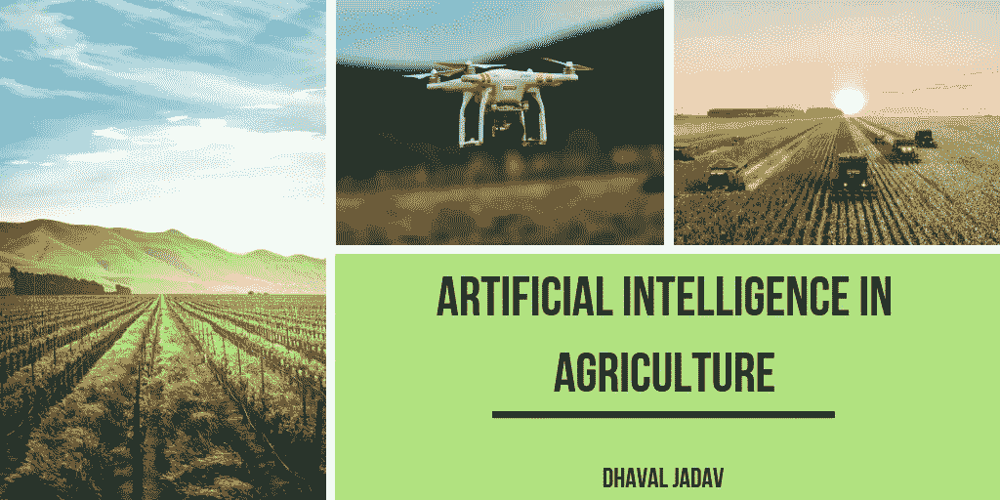

# 农业中的人工智能

> 原文：<https://medium.datadriveninvestor.com/artificial-intelligence-in-agriculture-62f71f8f6ae6?source=collection_archive---------1----------------------->

人工智能(AI)的世界正在迅速崛起，因为它进入了许多不同的行业。从制造业到汽车，你可能会看到人工智能被用于许多不同的目的；随着时间的推移，你只会看到更多。人工智能正在进入的最有趣的行业之一是农业。农业是一个主要产业，是我国经济基础的重要组成部分。根据美国环境保护署(EPA)的数据，农业每年为美国经济贡献近 3300 亿美元的收入。随着气候的变化和人口的增加，人工智能正在成为一项技术创新，正在提高和保护美国的作物产量。以下是人工智能对农业做出贡献的一些主要方式。

**机器人**

人工智能公司正在集中精力开发能够轻松处理多种农业任务的自主机器人。这些机器人能够以比人类工人更快的速度和更高的产量收割庄稼。这些机器人旨在帮助采摘和包装作物，同时应对农业劳动力中的其他挑战。此外，农业机器人有能力保护农作物免受有害杂草的侵害，这些有害杂草可能会对旨在消灭它们的除草剂产生抗药性。

**基于图像的作物/土壤健康洞察**

许多农场正在利用无人机技术提供高质量的成像，这有助于监控作物，同时扫描和分析田地以收集必要的农业数据。这种成像技术还可以帮助识别作物及其进展，包括它们的健康状况，以及确定它们的准备状态。例如，这些图像可以为农民提供确定他们的作物成熟程度的能力，以及他们是否以及何时可以收获。此外，成像技术可以帮助整体田间管理，提供实时估计，确定特定作物可能需要更多水、肥料、土壤或农药的位置。机器学习也用于提供作物或土壤健康的分析。创新的人工智能和机器学习公司开发了使用机器学习的技术，为农民和劳动者提供关于他们土壤优缺点的见解。这样做的目的是防止和消除坏的作物，增加健康作物生长的潜力。

**精准农业**

精准农业使用人工智能来产生精确和可控的技术，这些技术有助于提供关于水和养分管理、最佳收获和种植时间以及作物轮作的正确时间的指导和理解。这些流程使农业更加高效，甚至可以根据特定作物在市场上的成本和利润预测其投资回报率。

虽然人工智能不会消除人类农民的工作，但它肯定会改善他们的流程，为他们提供更有效的方式来生产、收获和销售基本作物。

这篇文章最初发表于[dhavaljadavalliantgroup.com](http://dhavaljadavalliantgroup.com/artificial-intelligence-in-agriculture/)