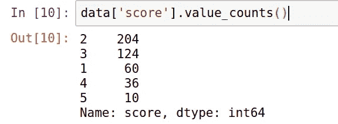
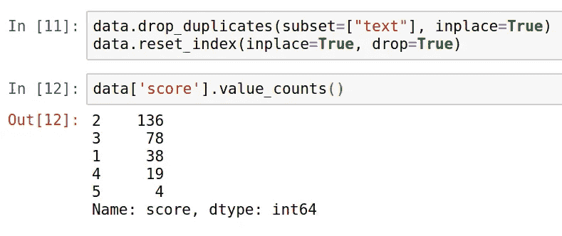
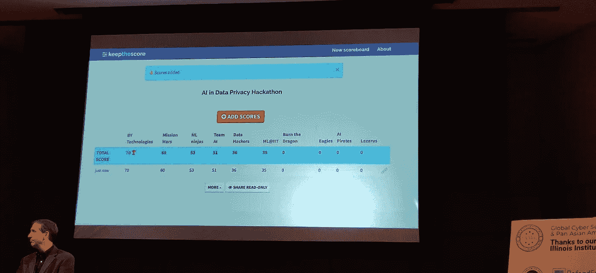

# 数据隐私中的人工智能

> 原文：<https://medium.datadriveninvestor.com/artificial-intelligence-in-data-privacy-f494b374676e?source=collection_archive---------22----------------------->

几周前，我和我的室友 Aman Agarwal 参加了人工智能数据隐私黑客马拉松，这是在一个名为**全球网络安全倡议(GCSI) 2018** 的网络安全国际会议上举行的。

这是我们的第一次黑客马拉松经历，与芝加哥的伟大头脑竞争。他们大多数是研究生和本科生，背景各异，如计算机科学、数学、统计学和数据科学。

给出的问题是一个真实世界的问题，即预测 GDPR 文档的可读性分数，范围为 1 到 5

软件公司制定的隐私政策真的很大，充满了规则和条例，这使得他们很难阅读，因此正常人会忽略阅读它，但如果我们通过人工智能解决这个问题会怎么样？

我们被要求建立一个机器学习模型，在给定一份 GDPR 文件的情况下预测分数。获胜团队的衡量标准是达到预测模型的最高“f1”分。黑客马拉松团队提出了一些功能，我们使用 [spacy](http://spacy.io) 开发了一些我们自己的功能。

因此，我们开始分析给定的训练数据，这些数据包含以“document_id”作为文件名的 GDPR 文档，以及包含文档相应分数的“csv”。

被标记的 GDPR 文档的总数是 434，分数“2”具有最大数量的示例，其次是“3”。

然而，我的队友分析说，一些分数有重复的数据/示例，后来我们使用了一个名为“drop_duplicates”的 pandas 函数来删除数据集中的重复数据。

结果是**令人惊讶的**，从 **434** 个示例的数据集中只有 **275** 个唯一示例，如下图所示:

此外，数据集中存在严重的不平衡，在所有其他得分中，得分“2”更偏向于拥有最多示例的得分。

在用于训练模型之前，我们必须获得正确的数据。我们从 **imblearn** 中找到了一个名为“[**RandomOverSampler**](https://imbalanced-learn.readthedocs.io/en/stable/generated/imblearn.over_sampling.RandomOverSampler.html)**”**的库，用于通过替换随机选取样本对少数类进行过采样。

这过度采样了我们的数据集，数据集现在有 680 个示例，每个类有 136 个示例。这消除了对分数“2”的偏见。

然后，我们在经过处理的数据集上训练了一个随机森林分类器，得到的 F1 值为 0.83567。我们试图通过改变一些参数来改进模型，但由于我们按时拍摄，最后期限又近了，所以没能做到。

我们使用我们训练的随机森林分类器提交了由 Hackathon 团队提供的测试集的预测。

会议以不同的方式宣布了结果。他们开始了 10 秒钟的倒计时，这让我们肾上腺素激增，:D，然后突然结果显示在屏幕上，我们的“**火星任务**获得第二名。

这对我们团队来说是一次很棒的经历，也在我们的第一次黑客马拉松上检验了我们的数据科学/自然语言处理技能。

与我们用来在 Kaggle 上分析数据的预处理数据集相比，我们学到了很多关于预处理真实世界数据集的知识。

这里是代码的回购链接:【https://github.com/jayrodge/Mission-Mars

了解我更多:https://about.me/jayrodge

在 LinkedIn 上和我联系:[杰伊·罗杰](http://linkedin.com/in/jayrodge)