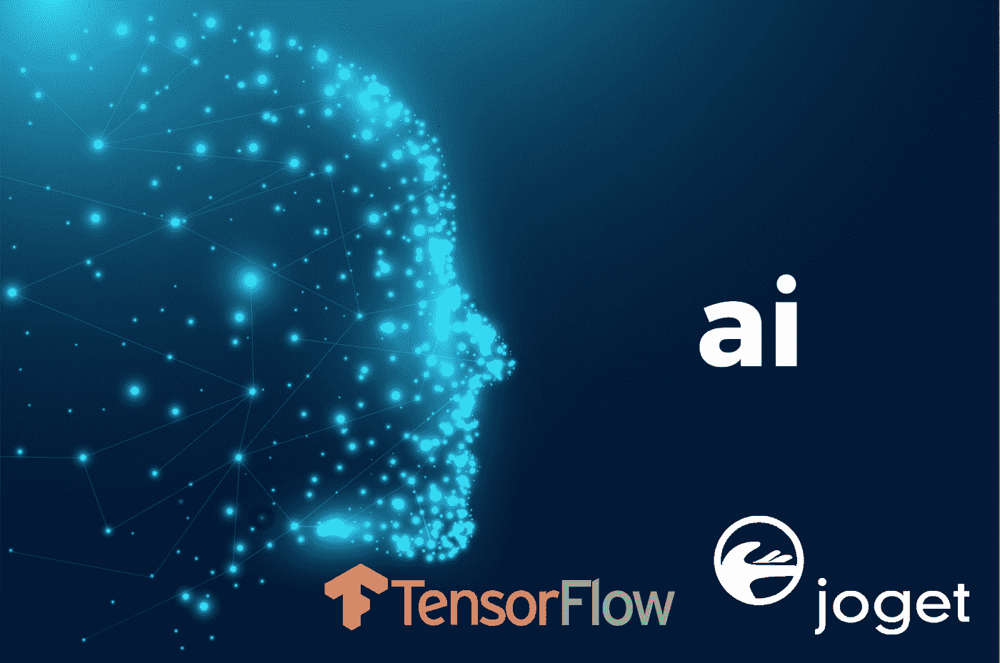
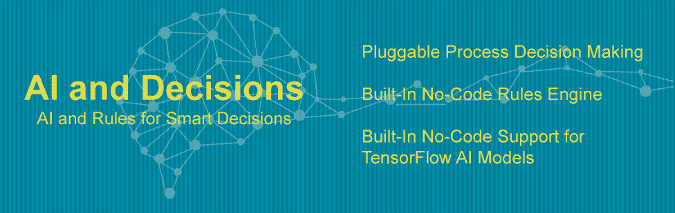
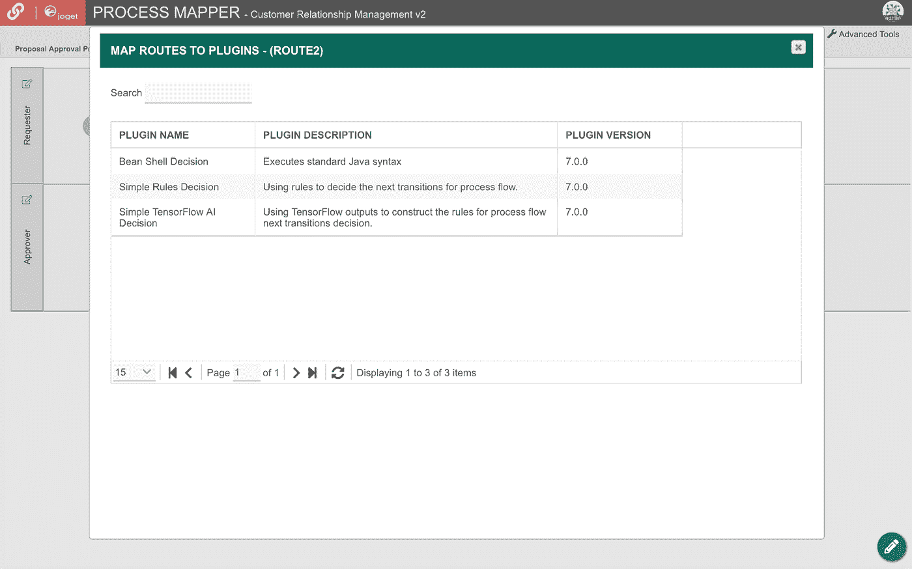
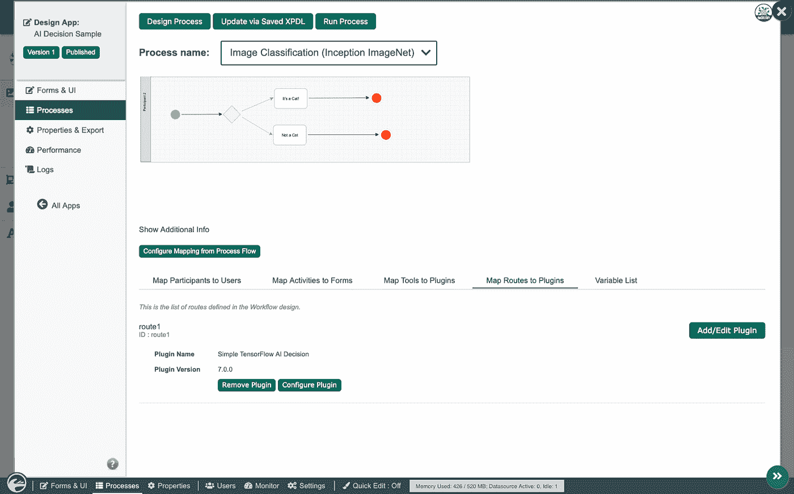
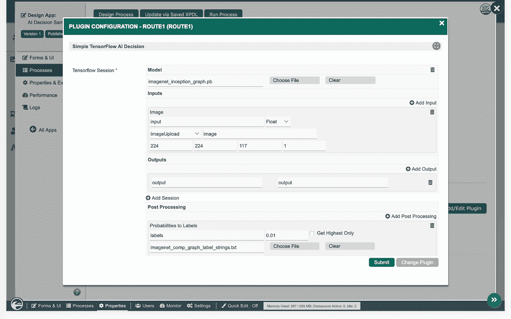
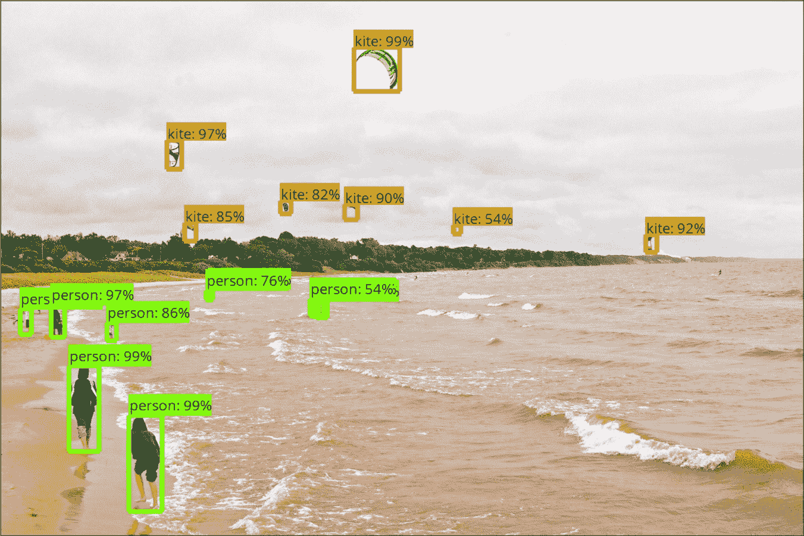
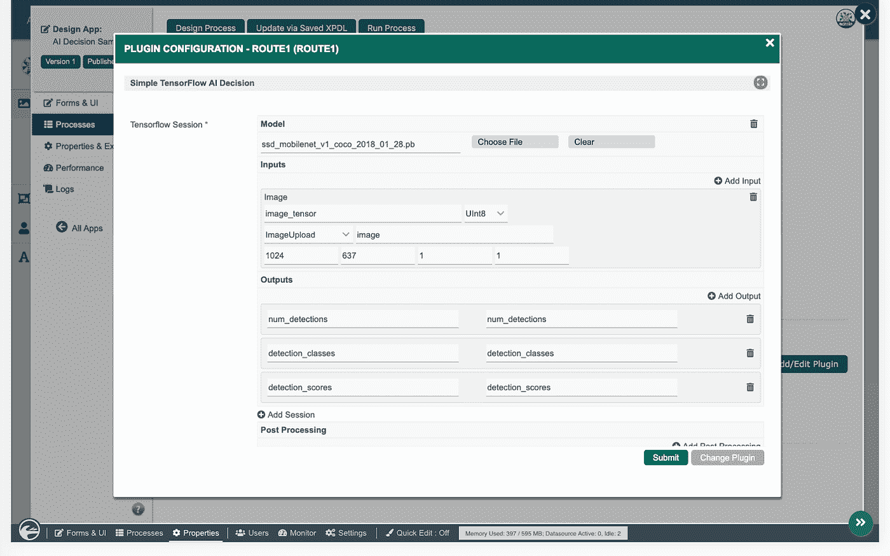
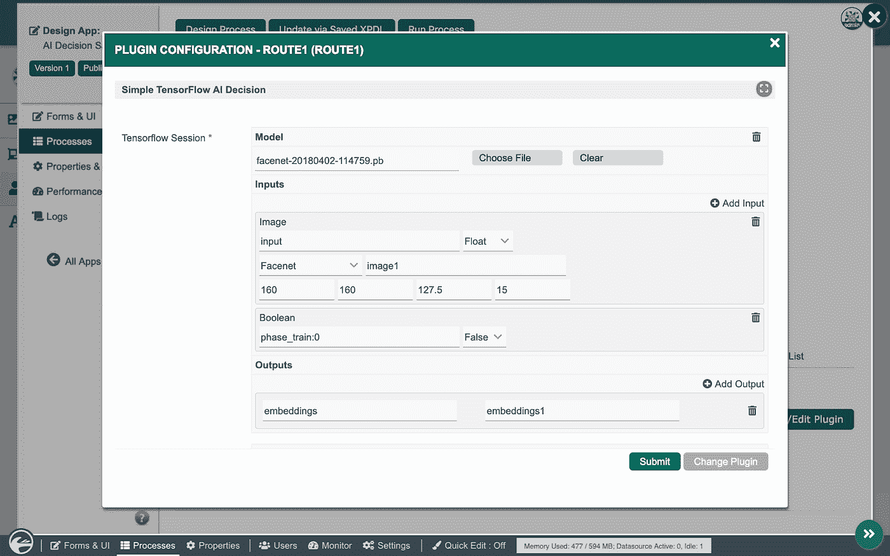
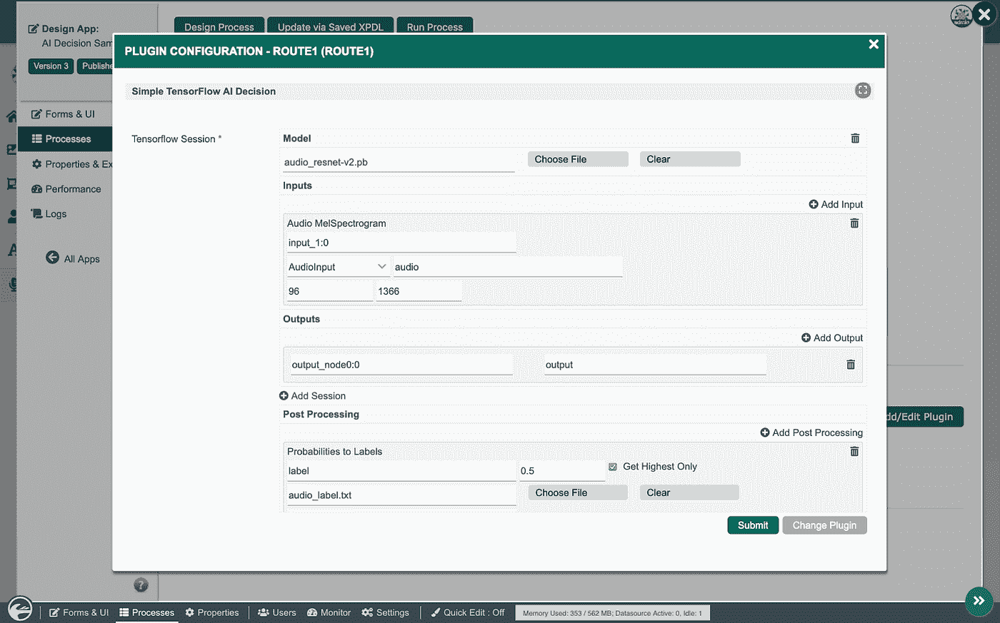
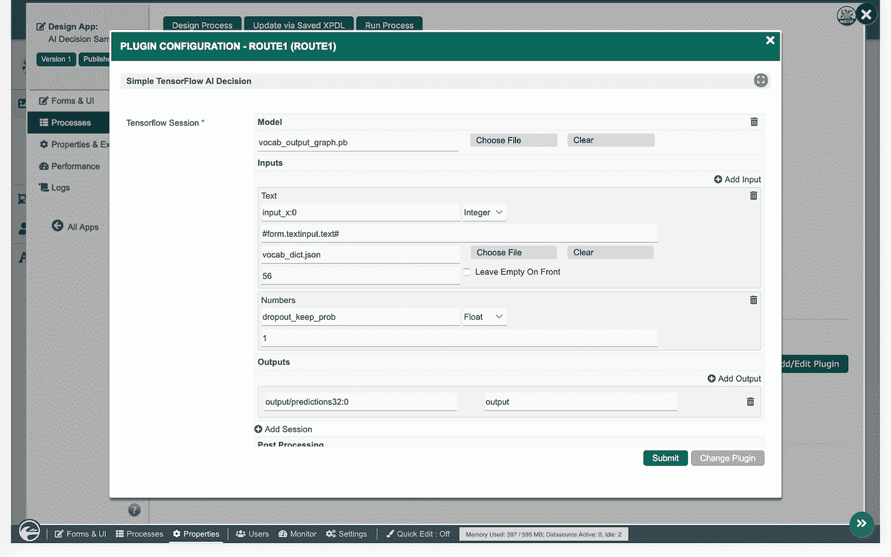

# TensorFlow 和 Joget DX 在企业应用中的人工智能

> 原文：<https://medium.datadriveninvestor.com/artificial-intelligence-in-enterprise-applications-with-tensorflow-and-joget-dx-328f101be78b?source=collection_archive---------3----------------------->

[Joget DX](https://blog.joget.org/2018/12/introducing-joget-dx-next-generation.html) 是一个开源的无代码/低代码应用平台，它引入了一些创新功能，如自动支持[渐进式 web 应用(PWA)](https://blog.joget.org/2019/02/progressive-web-apps-apple-app-store.html) 、集成的[应用性能管理(APM)](https://blog.joget.org/2019/01/application-performance-management.html) 和内置的人工智能(AI)支持。

 [## 挑战你对人工智能和社会的看法的 4 本书——数据驱动的投资者

### 深度学习、像人类一样思考的机器人、人工智能、神经网络——这些技术引发了…

go.datadriveninvestor.com](http://go.datadriveninvestor.com/4AI1) 

在之前的文章[人工智能、机器学习、深度学习和张量流](https://blog.joget.org/2019/03/a-quick-introduction-to-ai.html)的快速介绍中，我们介绍了这些术语背后的概念，以及事情通常是如何工作的。在本文中，我们将了解如何在 Joget 平台上为人工智能用例整合 TensorFlow。

# Joget DX 中的人工智能和决策支持特性

为了简化流程自动化，Joget DX 支持**决策**插件，这些插件可以映射到流程路线以进行决策。捆绑了几个实现，包括一个无代码规则引擎和一个执行预训练模型的无代码 TensorFlow 插件。

Joget DX 中的人工智能重点是简化预先训练的人工智能模型与最终用户应用程序的集成。正如在[上一篇文章](https://blog.joget.org/2019/03/a-quick-introduction-to-ai.html)中合理化的那样，人工智能模型的训练最好留给机器学习专家，因此一旦训练好的模型可用，目标就是让应用程序设计者尽可能容易地使用它。

使用捆绑的 TensorFlow AI 插件，您基本上可以:

1.  上传在 [protobuf(.pb)格式](https://www.tensorflow.org/guide/extend/model_files)
2.  配置输入和输出
3.  配置可选的后处理

以下部分展示了 Joget DX 上的一个示例应用程序如何结合一些常见人工智能用例的一些众所周知的模型:

1.  图像分类
2.  目标检测
3.  人脸识别
4.  音频分类
5.  文本情感分析

# Joget DX 上的无代码人工智能应用示例

# 图像分类

[Inception v3](https://arxiv.org/abs/1512.00567) 是一个广泛使用的图像识别模型，已经被证明在 [ImageNet](http://www.image-net.org/) 数据集上获得了超过 78.1%的准确率。ImageNet 是一个用于图像分类的数据集，包含超过 1400 万个带标签的图像。在示例应用程序中，设计了一个简单的决策过程来演示 TensorFlow AI 决策插件的使用，如下所示:

TensorFlow 插件的配置如下:

1.  在 protobuf 中上传预先训练好的模型。pb)格式
2.  将具有适当尺寸的图像配置为输入
3.  配置存储输出结果的位置
4.  配置附加后处理以将输出结果与特定标签相匹配

从[http://download . tensor flow . org/models/inception _ v3 _ 2016 _ 08 _ 28 . tar . gz](http://download.tensorflow.org/models/inception_v3_2016_08_28.tar.gz)下载模型。更多关于初始模型的信息可以在 https://towardsdatascience . com/a-simple-guide-to-the-versions-of-the-Inception-network-7fc 52 b 863202 找到

# 目标检测

[SSD](https://arxiv.org/abs/1512.02325)[MobileNet](https://ai.googleblog.com/2017/06/mobilenets-open-source-models-for.html)v1 是使用 [COCO](http://cocodataset.org/#home) 数据集训练的对象检测模型。COCO 是一个用于对象检测的大规模数据集，包含 150 万个对象实例。该模型可以检测和识别单个图像中的多个对象，如下图所示。

TensorFlow 插件通过以下方式进行配置:

1.  在 protobuf 中上传预先训练好的模型。pb)格式
2.  将具有适当尺寸的图像配置为输入
3.  配置存储输出结果的位置
4.  配置附加后处理以将输出结果与特定标签相匹配

从[http://download . tensor flow . org/models/object _ detection/SSD _ mobilenet _ v1 _ coco _ 2018 _ 01 _ 28 . tar . gz](http://download.tensorflow.org/models/object_detection/ssd_mobilenet_v1_coco_2018_01_28.tar.gz)下载模型。有关对象检测的更多信息，请访问[https://www . or eilly . com/ideas/object-detection-with-tensor flow](https://www.oreilly.com/ideas/object-detection-with-tensorflow)

# 人脸识别

FaceNet 是谷歌推出的人脸识别模型，它将人脸图像转换成 128 种尺寸，称为“嵌入”。然后将一个嵌入与另一个进行比较，以确定人脸是否匹配。该样品基于 https://github.com/davidsandberg/facenet 的[样品。](https://github.com/davidsandberg/facenet)

TensorFlow 插件通过以下方式进行配置:

1.  在 protobuf 中上传预先训练好的模型。pb)格式
2.  配置一对具有适当尺寸的图像作为输入
3.  配置存储输出结果的位置
4.  配置附加的后处理来比较嵌入之间的“距离”以确定匹配

从[https://github . com/davidsandberg/facenet/wiki/Validate-on-lfw](https://github.com/davidsandberg/facenet/wiki/Validate-on-lfw)下载模型。关于人脸识别的更多信息可以在[https://medium . com/@ ageitgey/machine-learning-is-fun-part-4-modern-face-recognition-with-deep-learning-C3 cffc 121d 78](https://medium.com/@ageitgey/machine-learning-is-fun-part-4-modern-face-recognition-with-deep-learning-c3cffc121d78)找到

# 音频分类

[ResNet](https://arxiv.org/abs/1512.03385) 代表残差网络，顾名思义，它利用残差学习来保留神经网络层的良好结果。ResNet 展示了图像识别的良好结果，但也展示了音频分类的前景，例如确定音频样本的音乐流派。此示例基于[https://github . com/Chen 0040/Java-tensor flow-samples/tree/master/audio-classifier](https://github.com/chen0040/java-tensorflow-samples/tree/master/audio-classifier)

TensorFlow 插件通过以下方式进行配置:

1.  在 protobuf 中上传预先训练好的模型。pb)格式
2.  用适当的维度配置音频样本作为输入
3.  配置存储输出结果的位置
4.  配置附加后处理以将输出结果与特定标签相匹配

从[https://github . com/Chen 0040/Java-tensor flow-samples/tree/master/audio-classifier/src/main/resources/TF _ models](https://github.com/chen0040/java-tensorflow-samples/tree/master/audio-classifier/src/main/resources/tf_models)下载模型。关于音频分类的更多信息可以在[https://medium . com/@ CVxTz/audio-classification-a-convolutionary-neural-network-approach-b 0 a4 FCE 8 f 6 c](https://medium.com/@CVxTz/audio-classification-a-convolutional-neural-network-approach-b0a4fce8f6c)找到

# 文本情感分析

[用于句子分类的 CNN](http://arxiv.org/abs/1408.5882)是用于文本分类的模型，例如用于确定客户反馈是正面的还是负面的。该样品基于 https://github.com/ivancruzbht/tf_android[的样品](https://github.com/ivancruzbht/tf_android)

TensorFlow 插件的配置如下:

1.  在 protobuf 中上传预先训练好的模型。pb)格式
2.  用相关词典配置文本作为输入
3.  配置存储输出结果的位置

从[https://github . com/ivancruzbht/TF _ Android/tree/master/app/src/main/assets](https://github.com/ivancruzbht/tf_android/tree/master/app/src/main/assets)下载模型。有关文本分类的更多信息，请访问[https://medium . com/jatana/report-on-text-class ification-using-CNN-rnn-Han-f0e 887214 d5f](https://medium.com/jatana/report-on-text-classification-using-cnn-rnn-han-f0e887214d5f)

# 使用 TensorFlow 和 Joget 开始学习人工智能

**Joget DX** 将于 2019 年晚些时候发布，届时将提供包含这些 AI 用例的样本 Joget app。与此同时，TensorFlow 可以使用一个自定义插件集成到 Joget 应用程序中，如之前的文章[所述。Joget 平台的当前稳定版本 Joget Workflow v6 现在可以从](http://blog.joget.org/2017/05/artificial-intelligence-and-automation.html)[下载](https://www.joget.org/download)或者从[云](https://www.jogetcloud.com/)上下载。