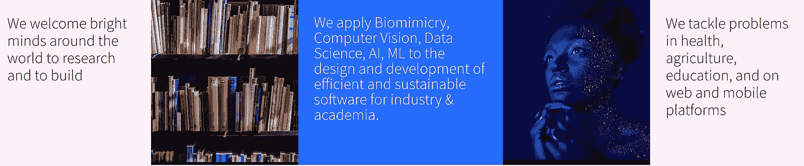
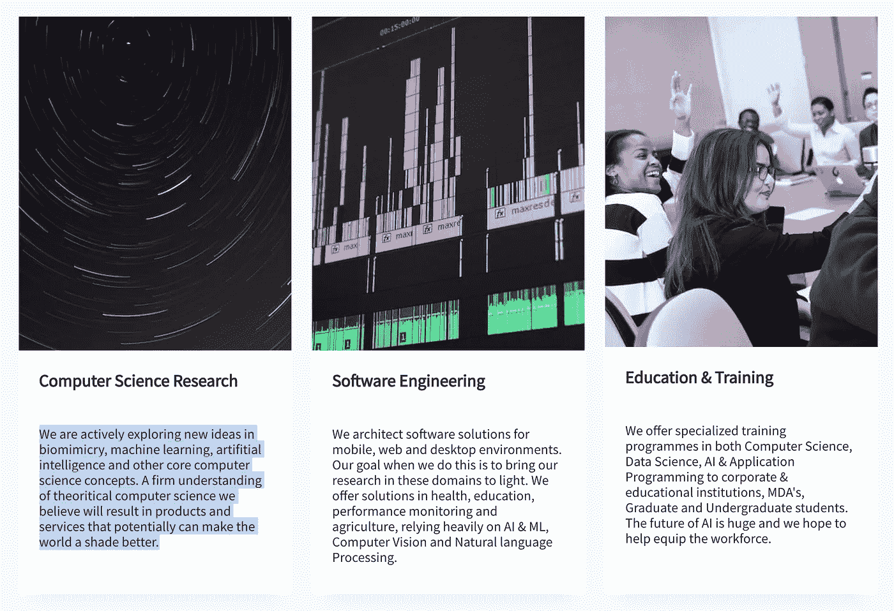

# 加纳和非洲的人工智能

> 原文：<https://medium.datadriveninvestor.com/artificial-intelligence-in-ghana-africa-71de2cddd08d?source=collection_archive---------3----------------------->

source: [www.wearepurpledot.com](http://www.wearepurpledot.com) an AI, ML, CV company influencing Africa and the world

purple dot Limited(http://www . wearepurpledot . com)是一家在阿克拉-加纳乃至整个非洲推动人工智能(AI)、机器学习(ML)、计算机视觉(CV)和生物仿生前沿的公司，正在对世界其他地区产生巨大影响。该公司的使命是利用多学科的集体智慧来解决日常问题。健康、农业、教育、自然语言处理和计算机视觉方面的问题。独特之处在于，该公司是一个非常专注于研究的团队，他们将自己的工作成果用于解决特定领域的一些难题。

> “我们非常重视构建可持续、稳健和智能的系统。我们很早就发现，自然界的生物系统给了我们最好的、研究充分的、最有效的学习范例。”

 [## 挑战你对人工智能和社会的看法的 4 本书——数据驱动的投资者

### 深度学习、像人类一样思考的机器人、人工智能、神经网络——这些技术引发了…

www.datadriveninvestor.com](https://www.datadriveninvestor.com/2019/02/28/4-books-on-ai/) 

主要关注领域是数据科学研究、教育和培训以及软件开发。Purpledot 向来自世界各地的人才开放，正在帮助培养研究人员和开发人员，为非洲本科生和研究生提供利用深度学习和相关领域所需的重要技能，并将知识应用于构建可持续产品。

> 我们的激情是数据科学&人工智能研究、设计、软件工程；寻找高效、创新和可持续的方法解决日常问题。为此，我们汇集了世界各地最聪明的头脑。

该公司坚信，非洲大陆的一些棘手问题可以通过合作投资本地化人才来解决，并将欢迎来自行业、学术界和个人投资者的想法和合作伙伴关系。

网址:[www.wearepurpledot.com](http://www.wearepurpledot.com)
邮箱:hello@wearepurpledot.com