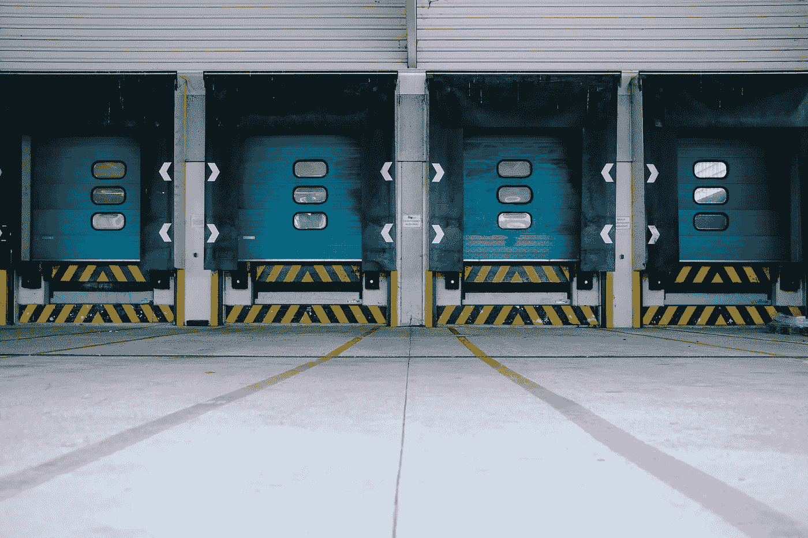

# 物流中的人工智能

> 原文：<https://medium.datadriveninvestor.com/artificial-intelligence-in-logistics-39ca80b21bc8?source=collection_archive---------10----------------------->

人工智能(AI)肯定会一直存在，原因很容易理解。技术和金融等领先行业已经完全接受了人工智能，并使用它来推动现有的解决方案和创新。然而，其他更多的工业部门，如物流，才刚刚开始理解人工智能的重要性以及它可以提供的无限好处。

那么 AI 到底是什么？简单来说，可以定义为机器展示的人类智能。可以近似、模仿、复制和自动化人类思维的系统，最终甚至可以对其进行改进。

尽管毫无疑问，人工智能将带来巨大的变化，就像互联网在 90 年代所做的那样，但它还有很长的路要走。人工智能仍处于起步阶段，其最大的障碍是有许多人根本不完全信任它。这是因为其支持者大肆宣传人工智能将取代人类工作，从而使许多人失业。

由于这个原因，在向公司介绍人工智能时，温和地应用它很重要。一步一步地改变，并帮助人们理解它不是一种替代工具，而是一种提高或提升任何特定工作的手段。

为什么是物流？为什么是现在？

现在是物流拥抱 AI 的最好时机。由于技术的转变，行业前所未有地获得如此多的技术，而且价格也如此低廉。决定不接受人工智能的公司长期来看有被淘汰的风险，因为信不信由你，人工智能将是物流未来的关键组成部分。

物流公司处于独特的地位，通过采用人工智能，几乎在供应链的每个方面都获得了好处。许多公司正在接受数字化转型，更新软件和硬件，为物流 2.0 时代做准备。人工智能可以帮助行业重新定义今天的行为和实践，使它们变得主动而不是被动。我们可以停止计划，开始预测；流程将变得自治，标准服务将变得个性化。

和很多其他行业一样，AI 既可以在公司内部(后台)应用，也可以在外部(前台)应用。

AI 怎么用在后台？

人工智能为节省时间、降低成本、提高生产率和准确性提供了独一无二的机会。这是由于认知自动化，它将执行通常占用员工更紧急工作时间的例行任务。由于 RPA(机器人过程自动化)和 AI 的结合，这些日常任务将由自动化系统执行。这使得员工可以将 100%的时间投入到最重要、最赚钱的工作中。

这些自动化的例行任务可以是:

1.收集财务信息:物流提供商通常依赖多个第三方来运营其业务的核心功能。AI 可以处理所有必要的财务数据，如账单金额和其他类型的账户信息。AI 可以通过处理和提取财务信息来优化时间和金钱。

2.合同处理:通常物流公司需要一次处理多个长期复杂的合同。有了类似于 IBM 的沃森(Watson)的人工智能机器，物流公司可以在几秒钟内解释这些合同，不再浪费时间和金钱在那些通常需要几天甚至几周才能通读合同的高级律师身上。

3.客户信息处理:保持客户信息的更新对任何大公司来说都是一个挑战。在物流方面，确保地址和其他客户信息的准确性对于公司的运营至关重要。美国初创公司 CircleBack 开发了一种人工智能引擎，可以帮助管理任何公司的联系信息。

4.海关处理:对每个人来说，海关往往是一个漫长而令人疲惫的过程。交付正确的数据和文件、申报货物、让海关官员验证信息并计算出每件申报物品的最终海关费用，对于每家物流公司来说都是一个漫长但必要的过程。使用合同中使用的相同平台(Watson)，海关或货运代理可以显著加快流程。机器可以在几秒钟内处理所有的文书工作，而不是让个人检查每一份文件。

预测物流:操作升级

AI 可以帮助物流行业从根本上改变其运营模式，从反应性行动转变为具有预测智能的主动运营。

-预测性网络管理:人工智能可以提高物流运营的绩效。例如，DHL 开发了一种可以预测航空货运中转时间延误的机器。这有助于这家美国公司实现主动缓解，从而防止航班延误。

-智能路线优化:对于任何物流公司来说，了解最高效、最快和最适合每位客户的路线都至关重要。这将降低成本、节省时间并提高客户满意度。这就是为什么在 21 世纪初，德国邮政率先推出了 SmartTruck 系统，为所有卡车运营商和司机开发专有的实时路线算法。这使得他们能够在最短的时间内交付每一个包裹。

-卫星图像:个人交通领域最新、最重要的参与者优步公司使用这一系统来预测每次乘坐的时间和费用。这让顾客在上车前就能准确知道旅程需要多长时间和费用。

人工智能将帮助物流运营者以前所未有的更快、更高效的方式去看世界、理解世界、与世界互动。我们认为 AI 在物流领域的未来非常有前景，潜力无限。人工智能正在成为物流行业日常业务中越来越大的一部分，加速其走向主动、预测、自动化和个性化的未来。

我们相信现在是人工智能应用于物流的时候了…你呢？