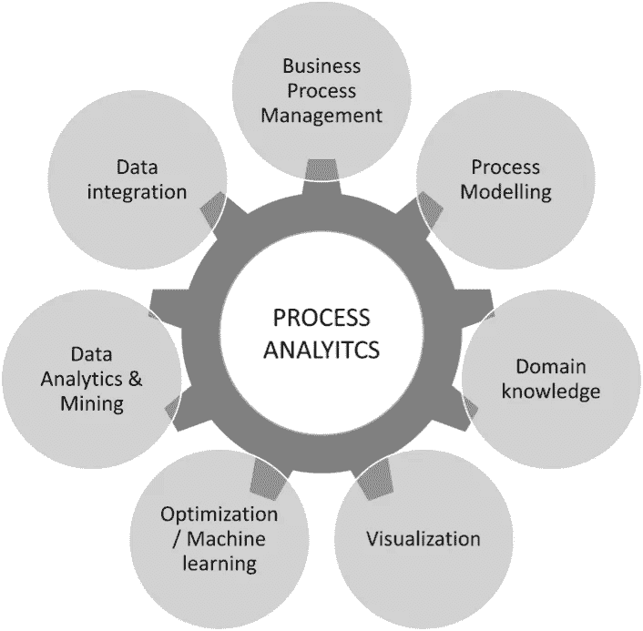

# 人工智能和过程挖掘

> 原文：<https://medium.datadriveninvestor.com/artificial-intelligence-in-process-mining-d8a61c0adfd1?source=collection_archive---------3----------------------->

人工智能如何在流程挖掘技术之上为企业提供可观的利润。

根据 IBM 基于 2017 年 ALGO 第一报告的一项研究，金融行业在操作风险控制事件中损失了 3 亿美元，在异常波动中损失了 541.57 亿美元[1]。

本文的作者[0]认为，这些案例中的许多都可以在之前通过在流程挖掘技术上应用人工智能模型来识别和预测，从而为行业节省数百万美元并创造新的盈利机会。

# ***那么什么是“流程挖掘”呢？***

*流程挖掘*包括一套从任何企业控制系统(客户服务、CRM、ERP、帮助台、数字分析)生成的事件日志中提取洞察力的技术，以便发现、建模、监控和优化这些流程[2]。

过程分析是一个新兴领域，结合了几个学科。从面向业务的案例开始，例如业务流程管理(BPM ),其流程建模能力描述、记录和解释它们。

有几种过程建模技术，其中许多在过去几年已经广为人知，如甘特图的 Petri 网。然而，诸如 UML 或 BPMN 等建模语言的最新进展提供了更大的功能能力，允许复杂结构的建模。[3]

这就是流程挖掘如何超越简单的流程建模。它结合了商业智能和分析(BIA)的各个方面，超越了从事件日志中提取的信息进行抽象流程建模的限制。

在这种情况下，流程分析可以使用数据集成和 ETL(提取、转换和加载)来集成端到端流程中的多个数据源。

以类似的方式，流程挖掘可以使用数据挖掘技术和分析可视化能力，以便创建对业务模型有直接影响的有用见解和预测性的最佳模型。

流程挖掘还与业务活动建模、业务运营管理、业务流程智能和数据挖掘等技术密切相关。

# 流程采矿如何让企业受益？

流程采矿的主要优势包括:

*   **流程图&发现**:从事件日志中，流程挖掘技术允许对公司中正在运行的实际流程进行描述和建模。
*   **符合性检查**:拥有过程执行的精确记录跟踪，可以识别它们与已建立的符合性程序的符合性。
*   **吞吐量时间和瓶颈检测**:不仅可以对任务序列建模，还可以确定执行强度、吞吐量和开销时间，模拟、预测和识别瓶颈

日志分析既可以在流程完成后执行(因此可以分析*事后数据*)，也可以实时执行(因此可以分析*事前数据*)。用于操作支持功能。

通过流程挖掘技术，人们可以:

*   **改进与时间相关的 KPI**:最小化吞吐量时间、开销时间、响应时间，最大化在一个时间间隔内完成的工作量百分比，等等。
*   **改善与成本或质量相关的 KPI**
*   **重新设计(改进)流程**基于洞察力促进流程的结构变化(例如，增加更多控制单元、并行工作任务等)
*   **用非结构性的较小变化调整流程**，例如，在案件数量或工作量出现微小波动的情况下，修改资源数量。
*   **提供运营支持**系统地利用在线预分析数据，例如，推荐能够最大限度减少生产时间的任务。

[4]

source: [https://www.der-bank-blog.de/roboter-backoffice-einsatzfelder/technologie/27476/](https://www.der-bank-blog.de/roboter-backoffice-einsatzfelder/technologie/27476/)

# ***人工智能如何加入流程挖掘？***

应用人工智能技术带来的机会很多，无论是作为机器学习还是在其更深的对应部分神经网络中，并在各种商业案例中提供多种好处。丰富客户和商业智能数据的日志事件为模型提供了更大的数据集，增加了解释变量集和模型的稳定性。

**聚类和分割:**

使用机器学习聚类算法，如“k-means nearest neighbors ”,可以识别客户细分、任务和案例，这些细分、任务和案例可以组合在一起，从而产生可以预测这些细分的特定特征的特定域。

**预测分析:**

*   **摩擦点和瓶颈预测**。有可能建立预测模型，在给定的特定情况下，预测新的摩擦点和/或瓶颈是否会出现，以便预防它们。
*   **下一个任务预测:**接下来执行哪个任务？使用随机森林算法[5]或 LSTM 深度学习网络[6]，模型可以高精度地预测最有可能执行的任务。例如，在电子商务中，客户到达最终结账页面的可能性，根据他/她的行为和以前的访问事先确定客户对购物的真正兴趣(或者他/她是否只是浏览橱窗)
*   **进程最终状态确定**:进程将如何结束？使用分类算法，可以根据流程自身的变量(如任务时间、生产时间、循环、分叉……和/或业务自身的变量(资源、客户、产品、细分、价格、渠道),确定流程将以哪种可能的最终任务/状态结束
*   **资源分配:**流程需要多少资源？由于回归分析，可以确定执行某些任务所需的资源数量，从而将任务和开销时间减少到瓶颈阈值以下。
*   **流程变量依赖性解释。**使用这些程序有助于确定流程中的哪些变量对最终结果有更大的影响，从而使企业能够根据这些变量采取行动，以获得更好的业务成果。

Source: [http://www.jonathankettleborough.com/ld-future-crystal-ball-gazing/](http://www.jonathankettleborough.com/ld-future-crystal-ball-gazing/)

**规定性分析:**

*   **该模型推荐一个流程分支:**给定某个场景和预测，系统可以推荐流程中的一个分支，为最高效的流程执行下一个最佳任务
*   **该模型建议向任务添加/移除资源:**知道何时何地会产生瓶颈，系统可以建议向任务分配新资源(或移除非生产性资源以降低总成本)

# ***直接可衡量的利益***

埃森哲[7]最近公布的一项民意调查表明，机器学习的应用已经初见成效:88%使用机器学习的公司在业务流程的主要关键绩效指标上提高了 200%以上；然而，只有 9%的人发挥了人工智能的全部潜力

正如本次调查所述，参与本次调查的 34%的企业完全同意，他们的新流程在其数据中显示出隐藏的价值，这为他们提供了更好的决策以及新产品和服务。此外，他们中的 82%保证机器学习的过程有助于找到看不见的问题的解决方案，这要感谢在那之前不可用的数据。

我们已经看到，流程挖掘和人工智能这两个学科的协同组合给企业带来了巨大的利益，也带来了巨大的市场机会。尽管两者在投资和增长预期方面都处于蓬勃发展的状态，但迄今为止几乎没有采取任何措施，因此我们预计在不久的将来，会有一批新的初创公司抓住这个高利润的机会

# 学分和参考

[0]本文是 AlphAI 团队(劳尔·阿尔库比耶、伊格纳西奥·恰帕罗、曼努埃尔·古铁雷斯·迪耶戈和作者伊格纳西奥·马蒂·卡雷拉)在西班牙马德里*工业有机学院*为“*人工智能和深度学习执行计划”*进行的硕士最终研究的摘要。

[1]IBM Algo FIRST【https://www.ibm.com/us-en/marketplace/ibm-algo-first 

[2]威斯康辛州范德阿尔斯特。等人(2011):流程挖掘宣言，[http://link . springer . com/chapter/10.1007/978-3-642-28108-2 _ 19](http://link.springer.com/chapter/10.1007/978-3-642-28108-2_19)

[http://www.bpmn.org/](http://www.bpmn.org/)

[4]要了解关于流程挖掘的更多信息，请参考埃因霍温理工大学的 [*“流程挖掘:数据科学在行动”* MOOC](https://www.coursera.org/learn/process-mining) ，本文中描述的关于流程挖掘技术的大部分见解都来自于此。

[5] [" *对一家荷兰金融机构的贷款申请流程进行流程挖掘。2017 年 BPI 挑战赛"*](https://www.win.tue.nl/bpi/lib/exe/fetch.php?media=2017:bpi2017_winner_professional.pdf) Liese Blevi，露西·德尔博特，Julie Robbrecht KPMG 技术咨询，比利时布鲁塞尔 1130 Bourgetlaan 40[5]

[6][*用 LSTM 神经网络预测业务流程*](https://arxiv.org/abs/1612.02130)[尼克税务](https://scholar.google.com.au/citations?user=XkRvCC4AAAAJ&hl=en&oi=ao)[伊利亚韦列尼奇](https://scholar.google.com.au/citations?user=xRa_fyMAAAAJ&hl=en&oi=ao)[马塞拉罗萨](http://www.marcellolarosa.com/)和[马龙杜马斯](http://kodu.ut.ee/~dumas/)

[*【流程再造】*](https://www.accenture.com/es-es/insight-process-reimagined) 埃森哲