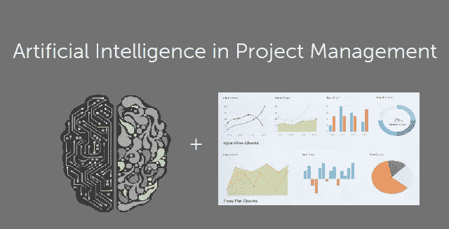

# 项目管理过程中的人工智能

> 原文：<https://medium.datadriveninvestor.com/artificial-intelligence-in-project-management-process-d4cf4177d41f?source=collection_archive---------8----------------------->

项目管理中的人工智能(AI)会让我们的生活变得更轻松还是最糟糕的噩梦？这完全取决于我们如何看待它。如果我们认为人工智能是一种帮助我们做得更好的工具，那么它可以通过管理和验证大量数据来节省我们的时间。在这篇文章中，我们将着眼于人工智能将在项目管理领域带来的重大影响，以及我们如何充分利用它。

# 启动项目

在最后确定项目章程和正式批准项目之前，许多决定必须由领导和赞助人作出。审查初始投资与持续投资、制造与购买、风险与回报、经济趋势和预测等事项可能需要更长的时间。人工智能可以通过提供基于类似过去项目情报的现实数据来提供帮助。此外，它使高层领导能够选择更有可能成功的项目。人工智能可以帮助启动项目的另一个方面是做出更好的预测。银行已经在使用人工智能系统进行信用评分，来计算你按时偿还贷款的可能性。

# 规划项目

人工智能强调预测规划、综合估计和自动资源匹配。这使我们能够简化我们的规划，并做出更好的人工智能数据驱动的决策，而不是依赖我们的直觉。如果我们更进一步，人工智能可以通过充当我们的数字助理来增加更多的价值，增加日常规划活动，如收集利益相关者的需求，跟踪假设，以及归档业务文档和协议。它甚至可以深入研究以前的项目，寻找经验教训，以帮助你提出一个更现实的时间表和预算估计。随着人工智能的发展，它将能够部分或全部接管分配资源、分析风险和规划风险应对的工作。

# 执行项目

AI 可以根据以前的类似项目创建工作流。之后，人工智能可以管理工作流程，根据需要进行更新，并自动监控输出质量。AI 可以通过将资源映射到工作流来优化流程，这意味着它可以为我们的项目找到正确的资源，实时检查它们的可用性，并将它们与正确的角色匹配。人工智能可以在正确的时间向正确的利益相关者发送正确的信息。人工智能需要访问知识库和稳定的数据流，以便从中学习。

# 监测和控制项目

AI assistant 可以找到 KPI 出现偏差的根本原因并指出来。借助更加智能的数据和项目进展的实时视图，我们可以轻松确定哪个 KPI 需要更多关注。AI 进行 24/7 实时监控，并进行预测分析和预测。一旦来自过去项目的这些见解与来自当前项目的信息相结合，早期预警系统就可以发出警告并采取预防措施。

# 关闭项目

AI 可以通过进行 24/7 实时任务关闭而不是定期任务关闭，为关闭过程带来更多结构。AI 可以创建一个遗留问题清单来跟踪项目中没有完成的活动。人工智能可以自动获取文档和经验教训。建立知识管理系统。人工智能可以捕捉闭幕会议的见解，并将反馈添加到存储库中。

> 更多详情和参考，请访问:[https://engmrk . com/artificial-intelligence-in-project-management/](https://engmrk.com/artificial-intelligence-in-project-management/)

## 来自 DDI 的相关故事:

 [## 用 7 个步骤解释深度学习——数据驱动投资者

### 在深度学习的帮助下，自动驾驶汽车、Alexa、医学成像-小工具正在我们周围变得超级智能…

www.datadriveninvestor.com](https://www.datadriveninvestor.com/2019/01/23/deep-learning-explained-in-7-steps/)  [## 数据科学和软件工程哪个更有前途？-数据驱动型投资者

### 大约一个月前，当我坐在咖啡馆里为一个客户开发网站时，我发现了这个女人…

www.datadriveninvestor.com](https://www.datadriveninvestor.com/2019/01/23/which-is-more-promising-data-science-or-software-engineering/)