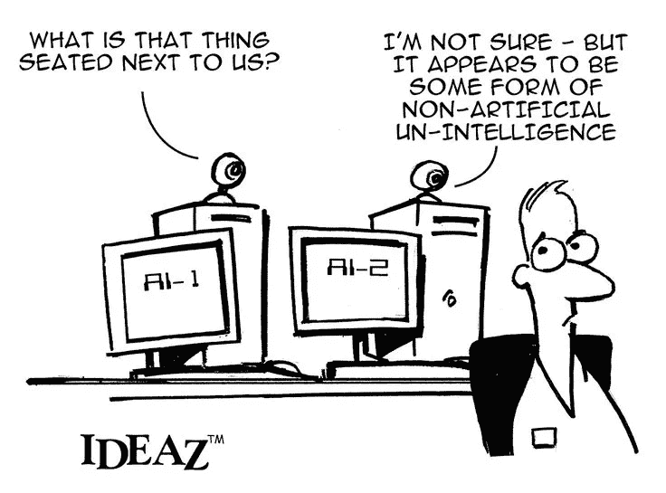

# 津巴布韦的人工智能

> 原文：<https://medium.datadriveninvestor.com/artificial-intelligence-in-zimbabwe-653907dffad4?source=collection_archive---------0----------------------->

2016 年 Gartner 研究显示，到 2020 年，全球至少 30%的公司将在其销售流程的至少一个片段中使用人工智能(AI)。今天，全球各地的企业都在利用人工智能和机器学习(ML)来优化他们的流程。虽然人工智能、大数据和区块链等技术正在世界各地崭露头角，但它们在津巴布韦和第三世界国家的采用要慢得多。在我看来，这主要是因为它们的适用性似乎被稀释了很多。缺乏基础设施、不存在适当的政策、落后的支持框架和人才短缺导致了恶性循环，导致津巴布韦与第一世界技术之间的差距。

然而，这并没有降低这些技术必须提供的价值，或者使它们完全不适用于我们的市场。他们还有很多我们可以提供的东西，我们现在必须好好利用。过去几年，当地组织优先考虑向数字技术迁移，一些组织已经成功利用了人工智能。以 Steward Bank 的 Batsi 为例，这是一个客户服务机器人，可以回答客户的问题，并允许他们通过社交媒体渠道进行银行业务。我是开发 Batsi 的团队的一员，能够亲眼看到人工智能在行动中可以实现什么。它允许该银行利用人工智能，通过一个始终在线的工具来执行数十名客户服务人员的工作，可以同时处理整个客户群，响应速度更快，同时在人员和基础设施投资方面节省大量成本。

在我们试图回答其他公司如何利用人工智能之前，谨慎的做法可能是从人工智能和机器学习的一些基本定义开始。人工智能的定义已经被证明是非常不固定的，这取决于谁在给它下定义，以及他们的议程是什么。为了简单起见，我们会说“人工智能是计算机科学的一个子领域，专注于机器如何模仿人类智能”。这意味着人工智能可以应用于任何地方，只要计算机可以用来代替人类决策或执行通常与智能生物相关的任务。机器学习也是另一个定义的潘多拉盒子。在其基本形式中，机器学习算法使用一组教学数据来做出决定，每次它根据已知的知识做出正确的决定，它都会将这些知识添加到教学集中，从而随着时间的推移变得越来越聪明。

有了对人工智能和人工智能的基本理解，下一个问题就变成了“今天人工智能可以在津巴布韦的哪些领域应用？”我们没有自动驾驶汽车，总体上没有太多的机械化或数字化，但我们有许多人工智能和人工智能的用例。以下是组织可以应用人工智能来提高流程效率的一些领域。

# 1.NLP 和聊天机器人

人工智能最明显的应用是自然语言处理和聊天机器人。NLP 是人工智能用于理解自由言论的地方，从而创建能够用自然语言与客户交谈的应用程序，就像你在与另一个人交谈一样。聊天机器人在短时间内已经成为非常主流的，并将继续受到欢迎。他们的魅力在于，任何公司都可以从拥有聊天机器人中受益，无论他们是将它用于客户服务、销售、客户反馈还是营销。像 Google 的 Dialogflow 和 Amazon 的 Lex 这样的 NLP 引擎使公司更容易实现聊天机器人。

# 2.电子商务

虽然津巴布韦的电子商务领域仍处于起步阶段，但现有的参与者可以通过利用人工智能获得很多好处。例如，人工智能允许顾客容易地发现相似的产品(按品牌、尺寸、颜色等)。)电子商务的一大挑战是，首先给购物者提供与他们最相关的产品，而不是简单地按受欢迎程度排列产品。人工智能允许电子商务零售商通过学习特定用户的偏好和口味来为他们挑选内容。

# 3.卫生保健

医疗保健是受到人工智能严重干扰的行业之一。两年前，我遇到了一家当地的初创公司 CADX 博士，它使用人工智能来分析诊断图像，准确率达到了 82%，这令人印象深刻。英国的巴比伦利用 AI 给病人进行数字化会诊。Sense.ly 开发了一个名为 Molly 的虚拟护士，可以监控病人的状况并进行随访。Qardio 拥有一个人工智能平台(QuardioMD ),该平台可以审查来自可穿戴设备的数据，识别需要更多关注的患者，并将这些信息传递给医生。

# 4.营销

公司越了解客户，就能更好地为他们服务，销售也就越多。除了依靠广告牌和其他大规模营销技术，公司还可以从针对客户需求的定向营销中获益。人工智能可以用来根据客户以前的行为来描述他们，这些信息可以用来促进销售。

# 5.物流和供应链

DHL 已经与 IBM 合作，探索他们如何使用人工智能来优化他们的物流。他们将能够从大数据中产生见解，并使用人工智能来实现后台自动化、预测性运营、智能物流资产和新的客户体验模式。当地物流公司可以借鉴他们的做法，使用人工智能来重新设计他们的流程，并实现更高的效率。

# 6.体育博彩

如今，体育博彩已经成为津巴布韦一个非常有利可图的行业。博彩公司完全可以利用人工智能来提高收入。想象一下，一个人工智能可以告诉一个客户“我认为皇家马德里今天会赢巴塞罗那，因为巴塞罗那在雨天打得不好。你愿意打个赌吗？”这肯定会增加赌注的数量。人工智能可以用来锁定客户，根据他们的个人资料，他们更有可能下注。

# 7.零售

在零售领域，人工智能可以用来识别购物者的偏好、购物习惯和首选渠道。零售是开始应用人工智能的最佳场所之一，因为其中的数据量非常大。每天，成千上万的购物者从零售商那里购买商品，统计模型可以用来预测行为，并获得关于个人购物习惯和偏好的情报。

成功和成长的公司是那些能够超越当前局限并看到未来走向的公司。人工智能不是一种时尚，它会一直存在，聪明的企业家今天就会开始投资它。

