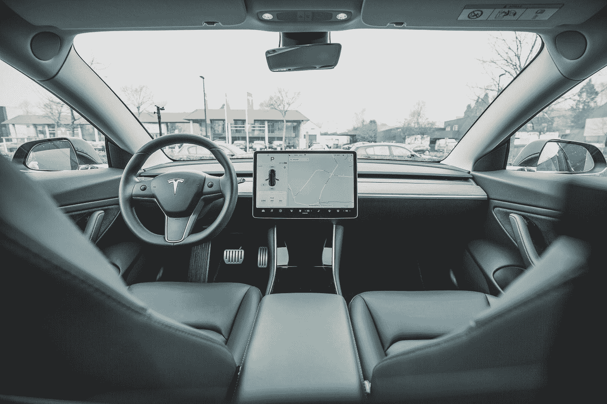

# 人工智能:融入社会

> 原文：<https://medium.datadriveninvestor.com/artificial-intelligence-integrating-with-society-49cf3c8b1c3f?source=collection_archive---------7----------------------->

Photo by [NordWood Themes](https://unsplash.com/@nordwood?utm_source=medium&utm_medium=referral) on [Unsplash](https://unsplash.com?utm_source=medium&utm_medium=referral)

> *“电脑是不会说话的机器”*

这是我五年级课本教给我的。计算机是一种带有输入系统的设备，它对数据进行一些处理以输出一些信息。

当时，我对计算机和技术感兴趣是因为。我记忆犹新的第一件科技产品是我父亲在 2002 年拥有的一台 IBM 台式机。，不允许我用。它花了他 1500 美元，我爸爸显然不相信我是个笨手笨脚的白痴。

当时这句话对我来说是如此的荒谬。电脑怎么会是哑巴？他们的代数不是比我好吗？以为 11 岁的我。随着时间的推移，当我打开报价，我意识到它的意思。简单地说，计算机除了快速准确地加减运算之外，实际上没做什么。这就是他们所做的一切。电脑添加。

 [## 今年值得关注的 5 大人工智能趋势|数据驱动的投资者

### 预计 2019 年人工智能将取得广泛的重大进展。从谷歌搜索到处理复杂的工作，如…

www.datadriveninvestor.com](https://www.datadriveninvestor.com/2019/02/19/artificial-intelligence-trends-to-watch-this-year/) 

早在 20 世纪 40 年代的第二次世界大战期间，艾伦·图灵设计了一种可以破解德国密码机“谜”的装置。(如果你对战争、计算机、数学或工程感兴趣。查一下)。我们现在有技术可以教自己走路，打败中国最好的棋手，走。

Photo by [Hitesh Choudhary](https://unsplash.com/@hiteshchoudhary?utm_source=medium&utm_medium=referral) on [Unsplash](https://unsplash.com?utm_source=medium&utm_medium=referral)

# 人工智能:下一次数字革命

人工智能的发展，尤其是在过去的 10 年里，已经呈指数增长。即便如此，公众对人工智能的看法是非常扭曲的。我在这篇文章中的目标是简单地给出一个人工智能的简要描述和它可能产生的社会影响。这不是预测，这取决于我们如何使用技术，就像使用其他任何东西一样，未来可能非常美好，也可能非常暗淡。

那么什么是人工智能呢？人工智能在 1950 年奠定了基础。人工智能被理论化为能够模仿人类智能并从经验(数据)中学习的机器。显然，我们已经研究这个领域超过 70 年了，我们在这个领域取得了巨大的成功。尤其是在机器学习领域。人工智能的子集

假设你给计算机输入足够的行走数据，几个小时之内它就会学会如何行走。从提供的数据中学习的能力是机器学习的本质。但仅此而已。机器从数据中学到的东西不一定转化为技能的转移。在我们之前的例子中，程序只知道如何行走。不慢跑，不跑步，不踱步。只是走路。总之。给一个程序一组数据。该程序将分析数据并产生一个输出。在我们的例子中，行走的动作。

机器学习的想法非常有影响力，你可以把这个标签贴在你的产品上，看着它一夜成名。机器学习作为一个领域是计算机科学中发展最快的领域之一。这个领域非常有前途，它将影响到地球上的每一个工人。

没有一份工作是一样的。已经有大量利用机器学习的应用程序可用。像 AILIRA 这样做基本律师助理工作的应用程序。IBM 的 Watson 诊断患者的医疗问题，并根据情况推荐适当的治疗方法。

# **自驾:你连特斯拉都有吗？**

Photo by [Bram Van Oost](https://unsplash.com/@ort?utm_source=medium&utm_medium=referral) on [Unsplash](https://unsplash.com?utm_source=medium&utm_medium=referral)

目前最大的转变是自动驾驶汽车，它们正在彻底改变现代交通。所有这些创新听起来都不错。这股浪潮带来的变化是巨大的。随着这项技术变得更加高效，很大一部分劳动力将被取代。随着时间的推移，这项技术的改进将带来一些好处，包括节省燃料、降低劳动力成本和提高供应链效率等。

对于那些生计依赖于这类工作的人来说，这意味着什么？显然，这种转变并不容易。上路 30 多年的人或者刚加入服务行业的人。这种颠覆将要求他们适应这些变化。没有立即可用的正确解决方案。尽管有一些不成熟的解决方案，比如全民基本收入，但这种提议更像是一个更大问题的创可贴。

# 人性问题

每当我们进步到更高的技术变革，我们内心就会有一种内在的变化，这种变化改变了人类的意义。与机器人相比，人类天生效率低下。目前技术的缺点是它没有感知能力，也没有能力在人类层面上学习数据并将其转化为知识。还没有。一旦我们达到一个水平，机器人可以玩出数以百万计的场景，并计算出适当的解决方案，我们将不再是最聪明的物种。我们会变得次要。

目前，我们做出自己的选择。50 年后，这些选择可能会为我们做出。这些选择将根据设备从您那里收集的数据做出。比如说。当你饿的时候。你“感觉”喜欢吃的东西不会是答案。答案可能取决于你的身体指标，体重，你的整体健康水平。那时“人为因素”可能就不存在了。关于这项技术的发展方向，有很多理论在流传。关于人工智能“接管”的理论，或者我们对这项技术的依赖将如何使我们无法独立思考。

虽然听起来很黑暗，但有一种方法可以完全缓解这个问题。就像所有的设备一样。人工智能是一种工具。如果你想要一个输出，你必须给出正确的输入。基于逻辑做决定只在一定程度上是好的。像哪条路到目的地更近这样的决定是基于逻辑的，这样我可以节省时间和燃料。但像伊拉克政治危机这样的复杂问题不会基于逻辑。

如果我们正在走向一个机器接管我们多余工作的未来，我们所要做的就是学习如何管理和维护它们，同时仍然保持“人类”的活力，那么我们需要确保提供的数据点包括道德、道德和哲学等主题。

对我们人类来说，把我们的意识和智能灌输给机器是一项巨大的成就。这样做的影响将高度依赖于老年哲学问题。作为人类意味着什么？