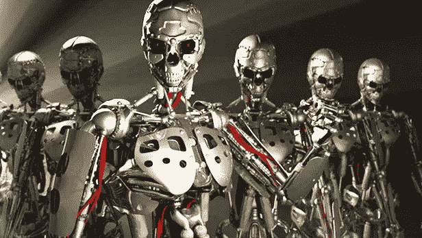

# 人工智能意味着黑仔机器人或智能伙伴

> 原文：<https://medium.datadriveninvestor.com/artificial-intelligence-meaning-killer-robots-or-intelligent-partners-3c686553c726?source=collection_archive---------4----------------------->

如此多的“人工智能”只是想办法将工作外包给随机的陌生人。虽然这听起来很有趣，但这实际上是我们的社会目前面临的一个非常棘手的问题。

> 如果有人试图向你出售一个用于医疗决策支持的黑盒系统，而你不知道它是如何工作的，也不知道用什么数据来训练它，那么我不会信任它。****——谷歌人工智能首席执行官约翰·詹南德雷亚如是说。****

*今天的机器学习系统中有很大一部分是通过我们人类产生的数据来训练的。我们有影响它的偏见。作为一个例子，一个叫做 COMPAS 的系统可以预测被告再次犯罪的可能性。法官用它来决定囚犯是否被准予假释。你猜怎么着，一家研究公司的调查发现证据表明，该系统可能对少数民族有偏见。*

*毕竟，我们目前正处于由自动化、人工智能和机器人技术驱动的“第二个机器时代”的尖端。这是一个重大行为变化的开始，它受到我们周围智能机器存在的影响。我们必须做好准备。这比每个人都害怕的机器人杀手重要得多。这意味着杀手机器人在与智能伙伴相处时非常有效，这些智能伙伴能够将尊重和信任结合到人类生活中。*

***相关:** [**人工智能如何自动撰写财务报告的个性化通讯**](https://titantwister.com/financial-reports/)*

# *人工智能是工作杀手吗？*

*我们在过去看到过这种情况，电梯操作员和电话总机操作员被淘汰，装配线工人被机器人取代。今天，大多数工作都要求你一步一步，一遍又一遍地执行同样的任务，你的工作是算法。如果你作为我的老板在我面前说这句话，你认为这会对我的生产力、创造力和整体工作满意度产生什么影响？*

***相关:** [**人工智能中使用的最佳机器学习算法**](https://titantwister.com/machine-learning-algorithms/)*

# *更聪明的机器对更聪明的人*

*有很多人怀疑人工智能会取代人类的工作，让人类变得多余等等。这类似于几年前计算机问世时的想法，计算机并没有消除人类劳动力，反而增加了就业。这是因为，我们人类有能力进化我们的思维和发现新的机会。类似地，人工智能将被用来“协助”人类在更短的时间内生成大型数据库或完成日常手工活动。人们将能够专注于高质量的工作，而不是重复性和低技能的任务。这可能会导致工人在整个职业生涯中越来越频繁地需要接受再培训，并降低雇主、雇员、政府、市场、家庭等的稳定性。*

***相关:***

*偏见是人工智能的真正问题，而不是杀手机器人的问题*

*每当我们的舒适区发生变化，我们就会担心工作。我们的祖先使用他们的手和脚来耕作，当工具被发明时，他们会担心失业。比如工匠和工匠受到大规模生产的影响。90 年代，印度左翼政党曾多次抗议担心电脑会导致失业。但同样的计算机和信息技术只是把印度从不发达的许可证国家变成了现在的国家。*

*人工智能不是工作杀手。人们将转向艺术和人类智能的更精细的方面，这是人工智能难以做到的，或者即使人工智能做到了，也没有像绘画一样的价值。照相机拍摄的照片无法与油画中的肖像相媲美。此外，如果许多人失业，那么经济不稳定将导致公司失去买家。现在，人工智能不会购买你的产品，我们该担心与人工智能而非自动化相关的信任和尊重因素了。*

***相关:** [**商业智能涉及伦理和成熟度**](https://titantwister.com/business-intelligence/)*

*同样地，当某个道德信仰阻碍你去完成使命召唤的任务时，也会出现这种情况。机器可以做应该做的事情。*

*我们需要明白的是，我们出生并成长在这样一个环境中，在那里我们学会了一定的技能来实现我们所能达到的最好的生活。我们害怕这些技能过时，而世界需要其他技能来生存。这就是为什么人们在过完一生后死去，把世界留给下一代，他们将更有能力在变化了的环境和情况下竞争。未来的工作可能是[构建机器人](https://www.wired.com/2014/08/heres-a-terrible-idea-robot-cars-with-adjustable-ethics-settings/)或者行使“决定性”权力，从机器人提供的各种选项中选择合适的解决方案。*

***相关:** [**【高级自然语言生成(NLG)**](https://titantwister.com/natural-language-generation/)*

# *人们需要银行，但他们不需要银行*

*人工智能取代了需要大量技术技能的工作，因为它们是例行的和可预测的。需要大量软技能的工作更难被人工智能取代。十年来，数字是就业杀手，熊彼特的理论是否仍然适用是争论的核心。数字革命有一些新的东西，其中人工智能只是一个单一但重要的部分是数字是可扩展的。*

*是的，有了人工智能，一切都变得可扩展，这意味着一个团队可以设计一个无人驾驶系统，使数百万辆卡车自动化。当然，这将产生新的工作，比如控制卡车的安全。但是我们需要一个只有几个人的团队来设计一个软件来控制数百万辆卡车。这个世界真正的问题是人类对物质的欲望是否是无限的。*

***相关:** [**人工智能等新兴技术有助于提高商业智能**](https://titantwister.com/emerging-technology/)*

# *基于人工智能的机器人的局限性*

*人工智能可以重复复杂但(可重复)的过程。在随机思考或自发性方面有许多尝试，但它仍然归结为加权过程和随机选择给定选择中的最佳选择。模式和面部识别只是增加了人工智能可以匹配模式的水平。人工智能没有能力去违背逻辑，选择一个“可能”努力工作的选择，它将总是基于逻辑进行选择。*

***相关:** [**创新你的商业分析产品 2018**](https://titantwister.com/business-analytics-products/)*

*当被赋予决定如何从战争和人类中拯救世界的工作时，它总是选择严厉的解决方案来消除等式中的中心问题“人类”，这就是由来已久的天网笑话的来源。这是解决问题最合理的方法，但不是每个人都喜欢的方法。所以，是的，如果你有一个完全合乎逻辑的工作，可以被编码成一套基于模式的确定的解决方案和结果，那么你最终会看到你的工作被人工智能取代。*

# *人工智能将智能伙伴与更智能的机器区分开来*

*只要人类政策适当改变，任何推动人类走向后匮乏社会的东西都将永远是更可取的。曾经有一段时间，我们的大部分工作都是在田间用手工和动物完成的。现在，我们有了设备和技术，解放了许多人，他们可以接受培训，从事其他工作。低技能制造和管理任务也会发生同样的情况。自动化将解放人类劳动力从事其他工作，而不是将其视为“取代工作”。任何破坏性的事情当然会造成一些困难，但是从长远来看，我们的物种将会受益匪浅。对于许多不愿或不能适应的人来说，更智能的机器将成为工作杀手。*

# *人工智能是给人类文明的礼物*

*与之前的场景一样，银行职员忙于文书工作，如铸造、张贴、报告准备等。但是计算机的引入改变了工作，让人类的智慧应用于其他方面，比如引入新的银行产品和服务。人工智能是由于人脑而出现的，所以当我们到达更高的高度时，我们将在更高的高度上决定我们的下一个目标。人工智能和机器学习可能是人类进化的下一步。世界顶级未来学家担心，随着人工智能目前的进展，“人类”可能在另一个世纪掉下悬崖。斯蒂芬·霍金、埃隆·马斯克和比尔·盖茨已经对人工智能的潜在威胁发出了警告。*

# *结论*

*技术改变了工作的要求或描述。任何为了比人或任何其他动物更有效率而创造出来的东西，肯定会使人或动物变得多余。当量子计算机普及时，智能建筑将提供令人印象深刻的可能性，我们的生活肯定会真正改变。问题只是:那些无法接触到这些技术的人会怎么样？*