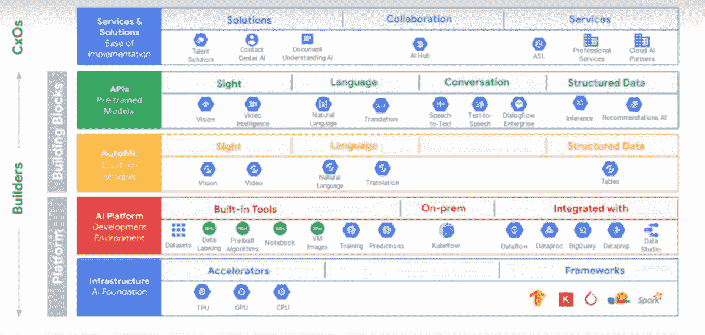
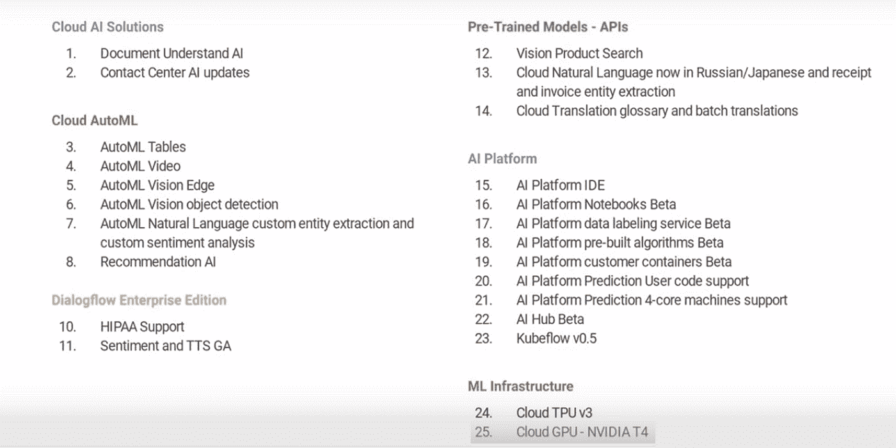
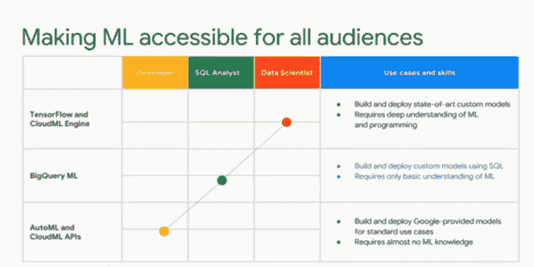
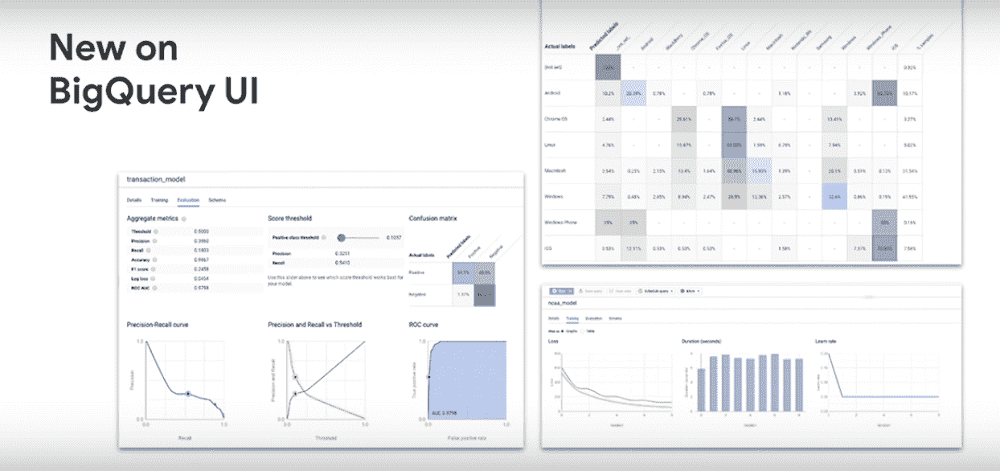
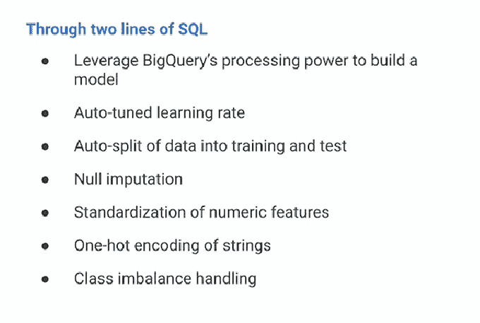
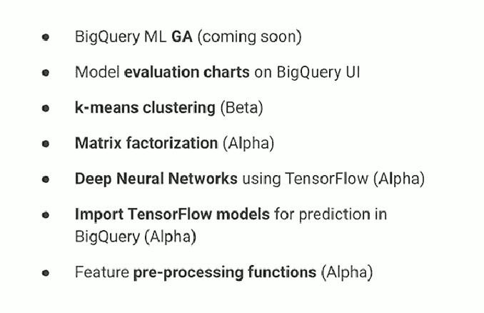
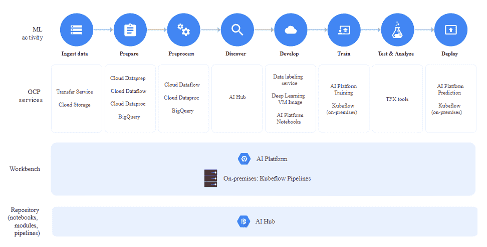
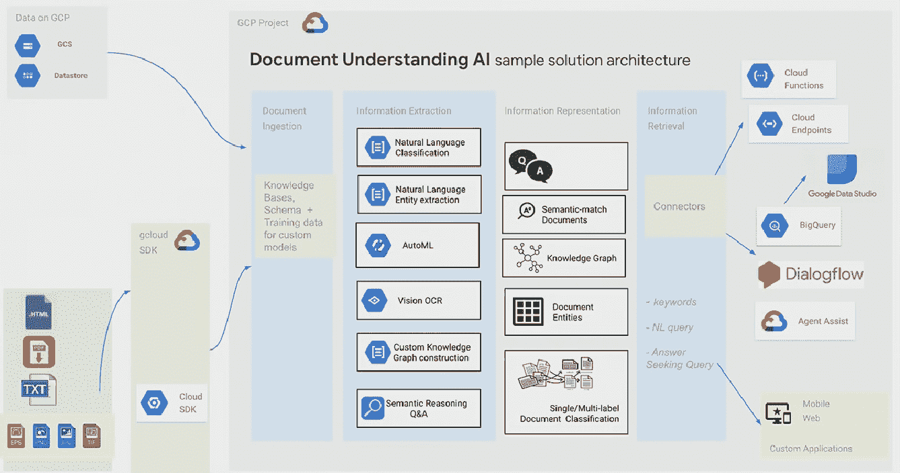
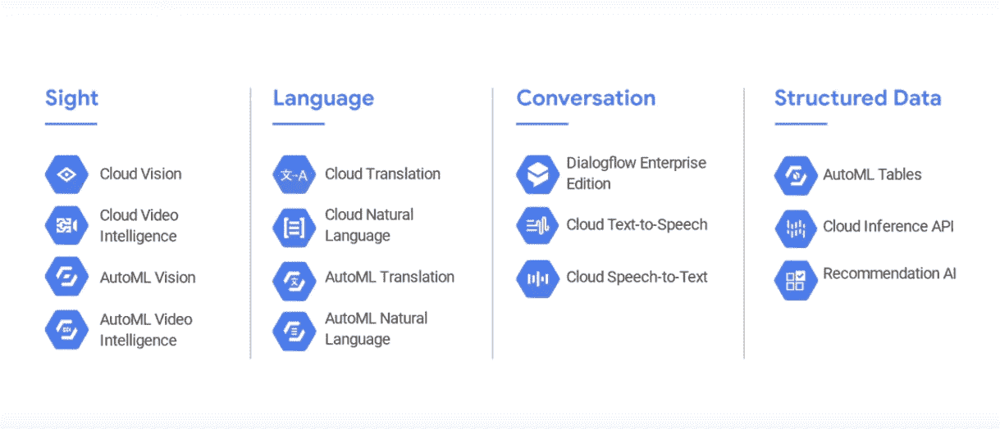

# 谷歌云平台上的人工智能

> 原文：<https://medium.datadriveninvestor.com/artificial-intelligence-on-google-cloud-platform-e25c70b921e4?source=collection_archive---------0----------------------->

[](http://www.track.datadriveninvestor.com/1B9E)

毫无疑问，人工智能的未来在云上。云以及推动业务知识的数据为人工智能技术带来了新的可访问性

**云将军为何为艾？**

[](https://www.datadriveninvestor.com/2018/09/22/infographic-journey-to-the-clouds/) [## 信息图:云之旅——数据驱动的投资者

### 聪明的企业领导者了解利用云的价值。随着数据存储需求的增长，他们已经…

www.datadriveninvestor.com](https://www.datadriveninvestor.com/2018/09/22/infographic-journey-to-the-clouds/) 

**扩展** —即时访问数百个计算实例

**速度** —容易获得专门的设备，如(GPU/TPU)，可以帮助加速人工智能的开发。

**云人工智能 API 的** —快速进入复杂的活动，而不是从零开始构建。对于语音到文本或语言翻译这样的情况，企业也可能缺乏数据来构建云中可用的高精度模型

**Cloud AutoML** —与公民数据科学家甚至业务用户一起，针对业务需求培训高质量的模型

**云爆发** —随着混合云的发展，从本地数据中心的小规模开始，使用云来扩展人工智能计算

在这篇文章中，我们将重点关注谷歌云平台提供的人工智能和相关服务。让我们先来看看谷歌云人工智能构建模块在 2019 年发布的最新公告



谷歌云平台人工智能功能的一些关键新功能是引入人工智能平台，该平台能够无缝创建端到端的机器学习管道，AutoML 表可以在结构化数据上自动构建和部署机器学习模型，并支持新的 ML 算法 Big Query ML 的一部分

下面是作为 Google next 19 公告的一部分而添加或增强的人工智能功能的摘要



> 如果说数据科学家是当今数据驱动型企业的血液，那么数据工程师就是为机器学习算法提供有用血液的血管

人工智能开发和培训是整个端到端机器学习生命周期中相对较小的一部分。数据接收、数据工程、特征工程、数据分析和验证、特征工程、模型性能监控和部署模型是典型的数据工程师+数据科学家花费 90%以上时间的地方。

虽然这篇文章关注的是人工智能能力，但是让我们快速检查一下不同的但是集成的 Google 服务是如何使端到端的 ML 成为可能的


这些服务的一个有趣的方面是它们如何相互集成以创建无缝管道。一个例子是 Tensorflow Transform，它在模型训练期间对输入数据使用全通，并在服务期间导出为 Tensorflow 图来对单个实例进行预测。这可防止训练发球倾斜，因为在两个阶段都应用了相同的变换

现在让我们来讨论一下 GCP 最近在 google NEXT 中宣布的关键功能

**AutoML 表格**

AutoML Tables 使整个数据科学家、分析师和开发人员团队能够以大幅提高的速度和规模，在结构化数据上自动构建和部署最先进的机器学习模型。ML 的每个方面都是真正自动化的，从

*   检测模式和类分布
*   帮助检测缺失值和异常值
*   无代码界面，让各种各样的角色更容易建立模型，而不仅仅是数据科学家
*   机器学习模型的无缝部署
*   使用模型输出和特征重要性图实现模型解释

下图总结了 AutoML 表的简单性。一旦你有了你的模型数据集，大部分的活动都是用户界面引导的，只需要很少或者不需要编码


AutoML 表还支持大多数数据类型的自动化特征工程


目前，它根据选定的配置参数对输入数据集运行以下算法的模型

*   物流和线性回归
*   前馈深度神经网络
*   宽深神经网络
*   梯度推进决策树(GBDT)
*   DNN + GBDT 树

基于数据的复杂性，它也可以运行神经+树结构搜索

**BigQuery ML**

BigQuery ML 将 ML 带到数据中。使用 SQL 在 BigQuery 中训练和访问模型。BigQuery ML 通过授权数据分析师(主要的数据仓库用户)使用现有的商业智能工具和电子表格来构建和运行模型，从而使 ML 的使用民主化。

在使用 AutoML 表时，BigQuery ML 不需要 ML 知识，对 ML 的基本理解是必不可少的。

不同的 ML 功能和用户角色的一个很好的例子。注意云 ML 引擎现在叫 AI 平台训练



在 BigQuery ML 中构建模型是一个简单的 3 步过程

步骤 1:创建一个模型

```
CREATE MODEL `bqml_tutorial.sample_model`
OPTIONS(model_type='logistic_reg') AS
SELECT
  IF(totals.transactions IS NULL, 0, 1) AS label,
  IFNULL(device.operatingSystem, "") AS os,
  device.isMobile AS is_mobile,
  IFNULL(geoNetwork.country, "") AS country,
  IFNULL(totals.pageviews, 0) AS pageviews
FROM
  `bigquery-public-data.google_analytics_sample.ga_sessions_*`
WHERE _TABLE_SUFFIX BETWEEN '20160801' AND '20170630'
```

步骤 2:评估创建的模型

```
SELECT
  *
FROM
  ML.EVALUATE(MODEL `bqml_tutorial.sample_model`, (
SELECT
  IF(totals.transactions IS NULL, 0, 1) AS label,
  IFNULL(device.operatingSystem, "") AS os,
  device.isMobile AS is_mobile,
  IFNULL(geoNetwork.country, "") AS country,
  IFNULL(totals.pageviews, 0) AS pageviews
FROM
  `bigquery-public-data.google_analytics_sample.ga_sessions_*`
WHERE _TABLE_SUFFIX BETWEEN '20170701' AND '20170801'))
```

步骤 3:使用最终模型进行预测

```
SELECT
  country,
  SUM(predicted_label) as total_predicted_purchases
FROM
  ML.PREDICT(MODEL `bqml_tutorial.sample_model`, (
SELECT
  IFNULL(device.operatingSystem, "") AS os,
  device.isMobile AS is_mobile,
  IFNULL(totals.pageviews, 0) AS pageviews,
  IFNULL(geoNetwork.country, "") AS country
FROM
  `bigquery-public-data.google_analytics_sample.ga_sessions_*`
WHERE
  _TABLE_SUFFIX BETWEEN '20170701' AND '20170801'))
GROUP BY country
ORDER BY total_predicted_purchases DESC LIMIT 10
```

可以使用 BigQuery UI 跟踪模型性能和指标。UI 提供了混淆矩阵、ROC 曲线、精确度/召回矩阵等的详细信息



最后，下面的大部分都发生在 3 步模型创建的幕后



下面是 Google Next’19 中强调的算法支持和路线图



**AI 平台**

人工智能平台提供了从摄取数据到准备、发现、训练和部署 ML 模型的端到端 ML 管道的无缝创建。下图总结了人工智能平台的端到端流程

AI 平台附带了托管笔记本实例，该实例与 BigQuery、Cloud Dataproc 和 Cloud Dataflow 集成在一起，可以轻松地从数据摄取到预处理和探索，并最终进行模型培训和部署

人工智能平台支持 Kubeflow，这让您可以构建可移植的 ML 管道，您可以在内部或谷歌云上运行，而无需重大的代码更改。以下是作为人工智能平台的一部分提供的服务，有助于建立端到端的机器学习管道



当您将人工智能应用程序部署到生产中时，您还可以访问人工智能技术，如 TensorFlow 和 Tensorflow Extended (TFX)工具。如果你想知道更多关于 TFX 的细节，请查看我关于这个主题的多部分系列

[](https://medium.com/datadriveninvestor/tensorflow-extended-tfx-towards-end-to-end-machine-learning-pipeline-part-1-aee6868c4cad) [## Tensorflow Extended (TFX) —走向端到端机器学习管道—第 1 部分

### 这是 Tensorflow Extended 系列文章的第一部分。这篇文章给你一个关于…的概述

medium.com](https://medium.com/datadriveninvestor/tensorflow-extended-tfx-towards-end-to-end-machine-learning-pipeline-part-1-aee6868c4cad) [](https://medium.com/datadriveninvestor/tensorflow-extended-tfx-data-analysis-validation-and-drift-detection-part-2-6a9c5f8c6210) [## Tensorflow Extended (TFX) —数据分析、验证和漂移检测—第 2 部分

### 在上一篇文章中，我们详细介绍了 Tensorflow 和 Tensorflow Extended (TFX)如何为…提供功能

medium.com](https://medium.com/datadriveninvestor/tensorflow-extended-tfx-data-analysis-validation-and-drift-detection-part-2-6a9c5f8c6210) 

继续关注 TFX 的未来系列...

人工智能领域几乎没有其他公告。我将简要介绍一下主要公告

**AutoML 自然语言** —自定义实体提取允许您从输入文本中识别自定义字段

**AutoML Vision** —目标检测，检测多个目标并提供边界框坐标

**云解决方案人工智能** —引入推荐和文档理解人工智能

文档理解人工智能使公司能够数字化、分类和提取知识。它还有助于组织和存储知识图表和其他提取的数据，以便于搜索、查询、消费和可操作的见解

文档理解人工智能解决方案架构的良好表示如下



下面重点介绍了其他一些具有新增强功能的产品。您可以查看下面的参考资料部分，以获得有关新添加特性的更多信息



**参考文献**

[](https://cloud.google.com/ai-platform/) [## 人工智能平台|谷歌云

### 一个开发平台，用于构建在 GCP 和内部运行的人工智能应用程序。将您的 ML 项目投入生产…

cloud.google.com](https://cloud.google.com/ai-platform/)  [## 使用 web UI | BigQuery | Google Cloud 开始使用 BigQuery ML

### 无论您的企业是刚刚踏上数字化转型之旅，还是已经走上数字化转型之路，谷歌云的解决方案…

cloud.google.com](https://cloud.google.com/bigquery/docs/bigqueryml-web-ui-start) [](https://cloud.google.com/automl-tables/) [## AutoML 表格|谷歌云

### AutoML 表使数据团队能够在结构化数据上自动构建和部署最先进的 ML 模型

cloud.google.com](https://cloud.google.com/automl-tables/) [](https://cloud.google.com/blog/topics/inside-google-cloud/100-plus-announcements-from-google-cloud-next19) [## 值得关注的新闻:来自 Google Cloud Next’19 | Google Cloud 博客的 122+条公告

### 我们希望你和我们一样喜欢接下来的 2019 年！过去几天，我们的谷歌云社区聚集在一起，学习…

cloud.google.com](https://cloud.google.com/blog/topics/inside-google-cloud/100-plus-announcements-from-google-cloud-next19) 

*在 7 月 24 日于新加坡举行的世界人工智能展上，国际人工智能专家将讨论像谷歌这样的大型组织如何通过云计算采用人工智能来改善数据支持业务的决策。*

[*使用优惠券代码 DDI-AI10 登记*](http://bit.ly/2HZbW16) *您的座位，即可享受九折优惠。*