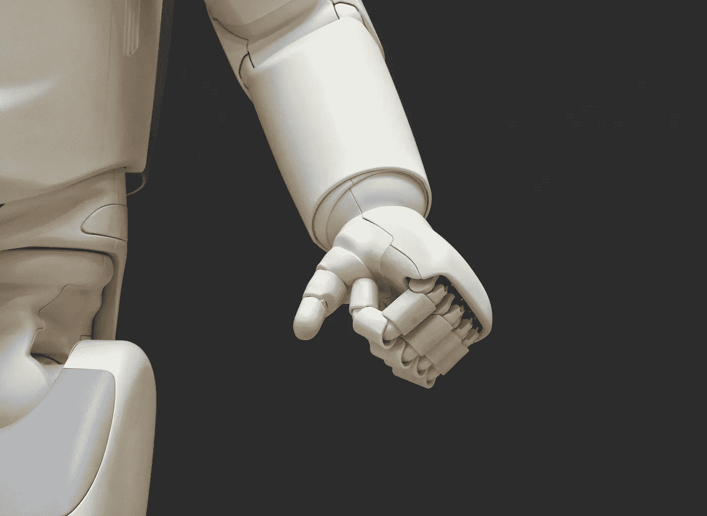

# 人工智能驱动的应用将增强您的业务

> 原文：<https://medium.datadriveninvestor.com/artificial-intelligence-powered-apps-that-will-strengthen-your-business-4767746b2361?source=collection_archive---------16----------------------->

人工智能的想法是基于让机器假装人类智能和逻辑的概念。在商业上，越来越多的组织转向人工智能，因为它提供了更智能、更快、更有效的解决方案。这并不奇怪，因为人工智能有能力处理海量数据并执行复杂的学习模块，有时需要人类的解释。由 R-Style 实验室高级内容经理 Andrew Klubnikin 撰写的关于媒体的摘录列出了人工智能专业化的主要领域，即:

*   专家系统
*   赌博
*   机器人学
*   机器语言
*   语音识别

研究表明，今天使用的大多数人工智能技术都是由机器学习和深度学习驱动的。根据极具洞察力的 Chatbots 杂志，人工智能极大地改变了关键行业，如信息技术、营销、金融、零售和会计以及客户服务。在信息技术领域，[许多公司使用人工智能](https://yalantis.com/blog/five-best-ai-powered-chatbot-apps/)来检测和应对安全入侵，找到最终用户技术问题的解决方案，并通过系统自动化减少生产管理挑战。

另一方面，营销实体热衷于部署人工智能来促进未来的客户购买，监控社交媒体评论，改善媒体购买和针对最终用户的促销。金融和会计公司正在对冲高频交易的人工智能赌注，而客户服务部门则热衷于探索自动化呼叫分配的好处。引领人工智能发展的企业集团包括 Alphabet、福特、苹果、亚马逊、通用电气和脸书。例如，通用电气公司在生产工厂和机器上安装传感器来监控性能。

**人工智能应用**

已经推出了许多人工智能应用程序，以帮助企业实现人工智能的全部潜力。据[tech emergency](https://www.techemergence.com/ai-in-business-intelligence-applications/)报道，针对初创公司、企业主和开发者，他们求助于这些强大的商业智能应用:

1.哈娜

SAP 推出了这款人工智能应用，以帮助企业将数据库转化为实用、更有用的智能工具。该解决方案运行在云平台上，通过复制和吸收客户信息和销售交易等结构化绘图数据来工作。这些信息可以从关系数据库和应用程序以及其他来源获得。这个强大的解决方案还能够访问从各种业务访问点收集的信息，如金融交易和台式或移动计算机。希望利用 HANA 的企业可以通过云或公司服务器在内部安装该平台。

2.阿普图斯

Apptus eSales 应用程序是一个销售支持平台。该解决方案通过为公司提供各种行动的关键建议，包括那些旨在促进销售的行动，来增强应用程序。这款应用引以为豪的是，它弥合了不同的客户购买直觉和公司通过销售增加收入的需求之间的差距。为了增强其功能，该应用程序将机器学习与大数据相结合，以找到对潜在买家有吸引力的产品，这些潜在买家正在寻找推荐或在线搜索特定产品。

3.多莫

DOMO 是另一个强大的商业仪表盘人工智能解决方案。由一家快速发展的业务管理软件公司开发的基于云的仪表板可以根据不同的公司规模合理扩展，非常适合大中型企业。许多本地软件连接器已经允许 Domo Inc .从各种第三方应用程序收集数据。然后，企业可以利用这些信息获得关键的洞察力。在其最新发布的版本中，Domo 添加了从人工智能、预测分析和机器学习中借鉴的几项功能。通过增加这些功能，该应用将能够发送关于新数据模式和异常的通知。

4.埃维诺

这种人工智能商业见解(BI)解决方案是由埃森哲和总部位于华盛顿州的微软公司合作开发的。它通过利用数据分析见解、预测分析和流行的 Cortana 智能套件来工作。埃维诺还巧妙地利用客户和政策信息来推动增长。它通过分析投保人的行为和趋势来做到这一点。包括平定专业在内的许多公司都采用了该解决方案，以帮助他们建立一个分析解决方案，提供更好的业务洞察力。

**使用个人购物助理**

小型零售企业在人工智能解决方案竞赛中并没有落后。根据 [Medium](https://medium.com/master-of-code-global/how-to-develop-a-personal-shopper-app-powered-by-data-intelligence-and-humans-4dc8787a957) 2 平台的说法，许多购物助手的设计主要是帮助企业留住客户、促进销售和提升整体用户体验。除了个人购物服务之外，这些应用程序还被广泛应用于票务、预订和保留以及提供奖金和礼物选择等应用程序中。[人工智能在个人购物中的整合](https://yalantis.com/blog/developing-a-personal-shopping-assistant-app-what-you-need-to-know/)通常通过以下方式完成:

*   图像识别
*   自然语言处理
*   价格预测算法
*   个性化推荐

图像识别只是文本搜索的一种形式。视觉搜索的工作原理是处理上传的照片，将它们与相似描述的项目进行匹配。另一方面，机器语言支持个性化推荐。通过视觉搜索，该应用程序可以帮助用户找到想要的或匹配的产品。价格预测算法是一个快速的学习者，能够捕捉价格的涨跌。这有助于用户找到市场上最好的交易。个人购物助理提供的不仅仅是个性化服务。

这些应用程序还能节省时间和金钱，并能很好地跟踪订单。对于有眼光的开发者来说，这些应用可以通过广告、付费请求、会员费和购买佣金来赚钱。许多购物应用程序都由人工智能和人类元素以及数据智能提供支持。对于使用 AI 的 app，通常会使用专门开发的算法。该算法利用从用户行为中获得的数据来提出建议。购物应用中一些最有用的工具包括最佳价格比较、安全提醒、购物历史和折扣。

Mona 和 Mezi 是当今市场上使用最广泛的个人购物助理。 [Mona 结合了人类的专业知识、人工智能和大数据。](https://techcrunch.com/2015/06/24/ex-amazon-team-launches-mona-an-app-that-puts-a-personal-shopper-in-your-pocket/)该应用程序分析消费者的风格和偏好品牌，然后确定价格合适或最划算的商品。另一方面，Mezi 是一个旅游应用程序，也提供个人购物服务。该应用程序分析用户的请求，然后使用自然语言处理来捕捉线索和信息。例如，该应用程序研究客户偏好，并使用这些信息来完成未来的任务。