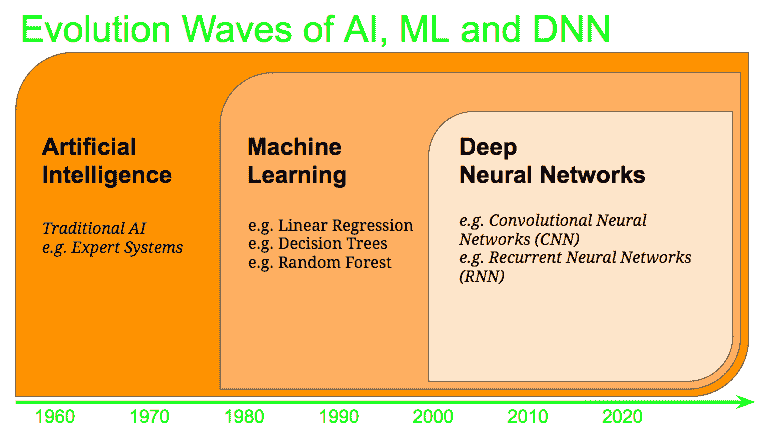
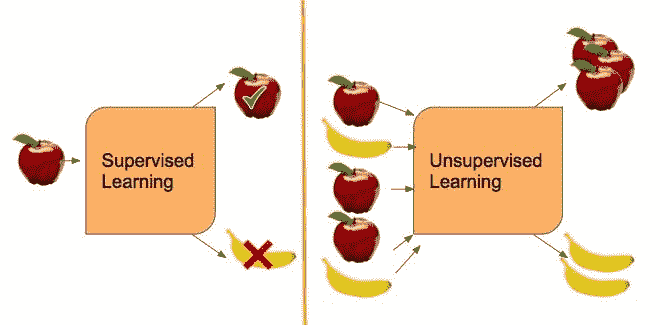

# 商业领袖的人工智能总理

> 原文：<https://medium.datadriveninvestor.com/artificial-intelligence-premier-for-business-leaders-b44bf7772bd8?source=collection_archive---------20----------------------->

过去几周，我与商业领袖就人工智能和机器学习(ML)进行了几次对话。众所周知，ML 将为各行各业的许多商业竞争优势奠定基础。因此，商业领袖渴望了解 ML 在各自行业中的能力和局限性。为了实现这一点，需要理解人工智能和人工智能的拓扑结构，以便更深入地了解其应用。在这篇文章中，我总结了这个领域的高级拓扑结构，概述了常用术语如人工智能，ML，DNN，监督和非监督学习，以及 AGI 和 ANI 的区别。

# 人工智能

AI 是 1956 年左右开始的计算机科学领域，其前提是将人类的智能带入计算机。人工智能，作为一个领域，在过去的几十年里已经经历了许多发展浪潮，并且已经成为一个活跃的研究领域。例如，传统的 AI 子领域之一是*专家系统，*大约在 1965 年从斯坦福大学引入计算机科学。另一方面，机器学习是人工智能领域中一个更近的子领域。

*那么，专家系统和机器学习之间有什么区别呢？*

# 专家系统

在专家系统中，作为传统人工智能的一个例子，人类专家以规则(if … then … else …)的形式传递他们的专业知识，这些规则稍后被计算机用来推断输出。例如，一个专家系统规则可能是这样的:“如果它是一个苹果，那么它是红色的”。专家系统的输入将是“苹果是什么颜色？”输出将是“它是红色的。”在这些系统中，所有的专家规则都保存在一个“*知识库*中，同时还有一个附带的“*推理机*”，可以根据规则提取结论。

当第一次引入时，专家系统是人工智能中的一大步，但由于其有限的能力，它们并没有走得很远。

# 机器学习

相反，人工智能的另一个子领域 ML 在 20 世纪 80 年代和 90 年代显示出很大的前景。与专家系统相比，ML 依赖于基于呈现给它的*数据*的“学习”。例如，你会给一个 ML 模型喂 1000+个红苹果的图片(*即训练数据*，它会学习苹果是红的。ML 模型可以“学习”的方式是通过建立数学模型，当呈现新数据时(即*测试数据*)或在推断时间期间，它可以使用该数学模型。使用这个数学模型，ML 可以做出预测和决策，而不需要编程显式的规则。在这点上，ML 不仅学习苹果是红色的，而且它还学习苹果的形状，其形状的略微不同的变化以及苹果颜色红色的不同深浅。因此，ML 是比传统 AI 和专家系统更强大的 AI 形式。

# 人工神经网络(ANN)和深度神经网络(DNN)

DNN 是人工智能的一个子领域，在过去的十年里，它使人工智能领域现代化并发生了革命性的变化。安和 DNN 这两个术语通常可以互换使用，它们是模仿人脑设计的。

人脑由大量巨大的神经元网络组成，其中一个神经元就是一个脑细胞。也就是说，人脑是由神经网络组成的。人工神经网络(ANN 或 DNN)以神经科学为基础，通过构建数学模型网络来模仿人脑，以提高模型的学习能力。由于其多层结构，它也被称为深度神经网络(DNN)。在 DNN 内部，同样的人脑类比也适用于创造许多子领域。例如，模仿人类视觉皮层的模型被称为卷积神经网络(CNN)，用于视觉识别任务(在我们的例子中，识别图片中的苹果)。其他子领域在某种程度上偏离了生物学类比，例如通常用于文本到语音(TTS)转换模型的 RNN(递归神经网络)。

# ML:有监督的 vs 无监督的 vs 强化学习？

到目前为止，我们一直在讨论 ML 内部的监督学习。然而，什么是无监督学习和强化学习，它们有什么不同？

*监督学习*专注于标注的训练数据。换句话说，在上面的 1000 多张苹果图片的例子中，我们会在将它们提供给 ML 模型之前将每张图片标记为一个苹果。然后，机器会学习苹果的样子，这样，当它看到一张香蕉的照片时，它就能知道这不是苹果。

另一方面，无监督学习是无标签的。例如，在这种学习模式中，我们将向模型 1000s 提供苹果图片和一些香蕉图片。该模型会自动将图片分为两组:苹果和香蕉，并在数据中找到模式，而无需我们为模型提供标签。

强化学习(RL)是机器学习的一个不同领域，然而，不同于监督和非监督学习。在 RL 中，该模型是面向目标的，因为它试图通过各种行动来实现一个复杂的目标，以便最大化某种累积回报的概念。它通过一系列的试验和错误来指导它的学习。虽然 RE 的目标类似于运筹学和动态编程，但它已被证明在资源管理和游戏(如 AlphaGo)中更有用，这只是举几个例子。

# 人工狭义智能(ANI) vs 人工通用智能(AGI)？

我们总是听说人工智能的下一个前沿是人工通用智能(AGI)。然而，到目前为止，我们在本文中描述的所有形式的 ML 和 AI 都被称为 ANI。

那么，阿尼和 AGI 有什么不同呢？

ANI 通常指的是 ML 模型，它只在预先定义的范围内或在一个任务上起作用。他们的学习不能推广到其他任务。人工智能通常需要大量的数据来进行训练，并需要大量的计算资源来进行学习。在上面的例子中，如果我们训练一个模型来识别苹果，我们可以将其推广到识别所有水果。

另一方面，AGI 通常是指在计算资源有限的困难环境中实现复杂目标的能力。这通常也需要将学习从一个领域转移到另一个领域的能力。今天，AGI 领域落后，从阿尼到 AGI 的道路并不清晰。一些研究人员指出，我们还需要十年甚至更长的时间才能建立 AGI 模型。

# 结束语

理解人工智能的高级拓扑结构将使企业领导者能够在他们的行业、公司和产品中引入 ML 集成的方法，从而建立一个比他们的竞争对手更强的差异化因素。由于最近在云、计算资源和训练数据可用性方面的进步，DNN 在过去十年中推动了人工智能领域的发展。DNN 继续承诺在各行各业推出激动人心的新应用。