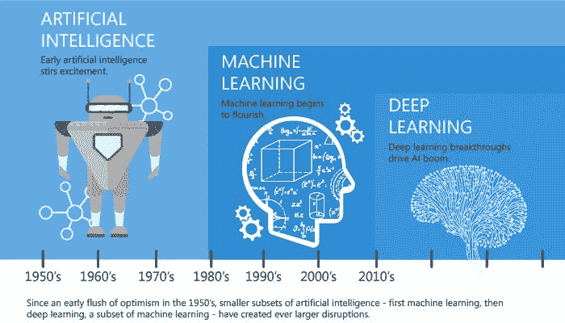
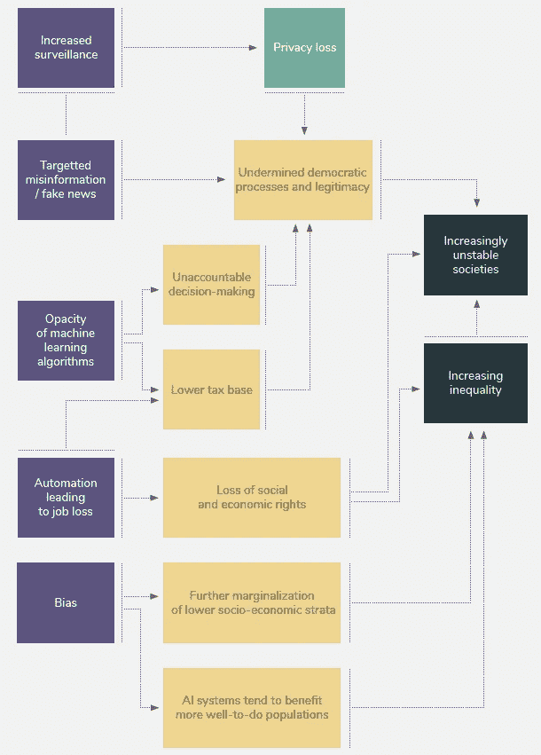

# 人工智能——救世主还是奴役者？

> 原文：<https://medium.datadriveninvestor.com/artificial-intelligence-savior-or-enslaver-3f3b67ccf841?source=collection_archive---------3----------------------->

过去半个世纪技术的指数级进步深刻地重塑了人类，并将继续如此。曾经看起来像科幻小说的概念，通过好莱坞热门电影如*《终结者》* (1984 年)和*《鹰眼》* (2008 年)可视化，已经稳步而不明显地成为我们现实的一部分。最近，在网飞播出的未来派秀*黑镜* (2011)让我们一瞥未来会发生什么。所有这些节目的一个共同点是描绘了计算机技术进步的可能性——无论是高度智能、自主、复杂的机器人，如终结者(具有巨大的破坏能力)还是超级计算机 ARIIA，它能够操纵几乎所有连接的设备，并命令其受害者完成其议程。

人工智能(AI)被视为科技领域当前趋势的核心驱动力，自 20 世纪 50 年代该术语首次被创造出来以来，它已经得到了巨大的发展。它以在线聊天机器人的形式嵌入到我们的手机中，并作为电话运营商，这是当代的几个使用案例。

与我们的生物结构相比，人工智能本质上可以被理解为我们的大脑，它处理信息并为我们提供分析能力。我们的大脑通过视觉、听觉、嗅觉、触觉和味觉以信号的形式从我们的五种感官获得信息，就像人工智能接收数据点一样。随着时间的推移，随着我们的成熟，我们的大脑能够在更深的层次上理解、领会和分析。类似地，人工智能基于机器学习(ML)来经历类似的过程。最近，深度学习(DL)在很大程度上模仿了我们大脑中的神经网络，正在推动人工智能的复杂性取得指数级进步，使其越来越接近人类智能。

[Underneath the AI Revolution](https://www.linkedin.com/pulse/ai-machine-learning-evolution-differences-connections-kapil-tandon/)

解释这些革命性发展的复杂性不在我的范围之内，相反，我的目的是通过将它们与我们的生物自我进行比较，以了解其潜在的力量和能力，来展示这些过程是如何发生的。在我看来，我们这个物种学习、思考和实施的能力(*“我思故我在”*)一直是人类和机器之间的区别因素，但这些界限正变得模糊不清，久而久之。话语相当两极分化；[埃隆·马斯克](https://www.cnbc.com/2018/04/06/elon-musk-warns-ai-could-create-immortal-dictator-in-documentary.html)和[马云](https://www.theguardian.com/technology/2017/apr/24/alibaba-jack-ma-artificial-intelligence-more-pain-than-happiness)声称，随着人工智能的崛起，我们将进入一个反乌托邦式的未来，尽管它的非致命形式表达了极大的谨慎，而其他人则认为，正如该领域一位有影响力的学者和创新者所倡导的那样，人工智能将对社会产生全面的积极影响，[雷·库兹韦尔](https://futurism.com/ray-kurzweil-ai-displace-humans-going-enhance/) ( *《奇点将至》的作者*)

正如之前无数次宣称的那样，技术本身就是一把双刃剑。技术进步本身在历史上是价值中立的，但我们的使用使它们变得“好”或“坏”。原子能是最恰当的例子。同样，人工智能带来了前所未有的威胁，但同时也带来了前所未有的机遇。我们的使用定义了它的遗产，因此我们有责任了解、领会和理解“如果”,这样我们就可以在防止破坏的同时推动积极的创新。该领域的领导人已经采取措施，在一封致联合国的公开信中倡导限制自主武器的制造。

人工智能已经以多种方式影响着世界，而这些方式在很大程度上是看不见的。海量的数字数据让机器能够学习，让人工智能变得比人类聪明得多。这允许更大的洞察力，因为机器能够利用超出人类理解的数据集中的关系，从而允许更高的效率和优化。在制造业的供应链管理和产品优化中广泛使用是显而易见的。人工智能打开了高度个性化教育的大门，允许根据每个人的学习进度调整定制的课程。此外，机器能够预测干旱和疾病，同时以更高的效率和更低的成本帮助管理水和作物。人工智能还扩大了医疗领域的机会，因为它能够比传统方法更早地诊断健康状况。

[The Down Side (International Development Research Center)](https://www.idrc.ca/sites/default/files/ai_en.pdf)

或者，人工智能通过数据学习的能力突显了数据中隐含的潜在复杂性。数据中的两个突出问题是它的不完整性和偏差，这是人工智能的基础构件。然而，重要的是要考虑到数据中固有的偏见也是我们数字社会的反映。机器在瞬间收集、分类和分析大量信息的能力在政治中产生了与教育中类似的效果；定制内容。这在最近的美国总统选举中表现得很明显，因为机器软件能够通过分析用户的在线数据，根据对用户的理解来单独决定内容，从而允许定制广告推送独特的信息，以影响选民。这很像一场国际象棋比赛，每个人在做决定时都试图比对手先想几步(*机器已经赢了那场比赛*)。因此，人工智能彻底改变了欺骗和误导的手段。除了这些潜流之外，普通人很大程度上担心即将到来的失业威胁，特别是在较低技能水平上，因为人工智能和自动机器正在逐步取代它们，或者在某些情况下已经取代了它们。

[美国法院](https://www.wired.com/2017/04/courts-using-ai-sentence-criminals-must-stop-now/)正在使用人工智能进行决策，涉及假释和罪犯风险评估等领域。算法正在为对个人产生巨大影响的决策提供信息，有趣(或不太有趣)的是，这些算法是从私营公司外包的。这意味着驱动决策的潜在代码隐藏在专有专利之下，有效地使决策过程变得不可解释。在[监狱私有化](https://www.cnn.com/2017/08/18/politics/private-prison-department-of-justice/index.html)之后，我们现在正走向一个世界，在这个世界中，通过软件渗透司法处理，改变生活的决定也将由私营企业做出。

另一方面，中国的政治光谱正在使用人工智能和公民的数字身份相结合的方式，给他们分配一个[分数](https://www.wired.co.uk/article/china-social-credit)，这将产生现实世界的后果，积极的和消极的。该系统于 2014 年实施，预计到 2020 年覆盖全国，让人们得以一窥潜在的老大哥未来。这种虚拟信贷系统影响了人们对医疗保健等重要资源的获取，同时也对约会、租赁、金融服务、交通和社交聚会领域产生了影响。[中国的社会信用体系](https://www.wired.co.uk/article/chinese-government-social-credit-score-privacy-invasion)可能是人工智能更极端的使用案例之一，但占世界人口的 20%以上。或许这是一种共产主义现象，但考虑到大规模的破坏，经济、社会和政治每天都在发生，这难道不是“维持稳定”的有效工具吗？

俄罗斯总统弗拉基米尔·普京警告说，无论谁成为人工智能的领导者，都将成为世界的统治者。但是事实胜于雄辩，没有什么比俄国决定将具有驾驶汽车和射击能力的人形机器人作为宇航员送上太空更有说服力了。在太空探索领域，人工智能可能会带来巨大的进步，但也可能是殖民太空的致命竞赛的前兆。令人惊讶的是(或者不是)，一些有权势的人已经计划建立一个[太空殖民地](https://asgardia.space/en/),拥有由俄罗斯科学家 Igor Ashurbeyli 领导的正常运转的官僚机构。

当我沉浸在这个话题的深处时，我开始意识到智能和智慧之间的一个关键区别，我觉得这是人工智能和人类之间最重要的区别。当然，机器可以比人类以更快的速度学习和执行信息领域的一切，但它们没有能力去体验。随着时间的推移，记住这一点很重要，因为当代话语在很大程度上是由效率而非同理心塑造的。

> “知识来源于学习。智慧来自生活。”安东尼·道格拉斯·威廉姆斯

随着人工智能领域的重大发展，无论是积极的还是消极的，可能性都是无穷无尽的。随着国家和企业竞相巩固对权力的控制，竞争带来的威胁也在增加，这使得未来要么被破坏，要么被集体繁荣所定义。但是，如果我们连未来的方向或其潜在力量都不知道，我们怎么能引导未来呢？

最重要的是，我们要用指导人类的知识武装自己，这样我们就可以在必要的时候进行辩论、倡导和抗议，从而共同塑造未来。监视、控制和战争是人工智能发展的本质所带来的主要威胁，这项技术可能在有和没有之间造成的巨大鸿沟也是如此。埃隆·马斯克正致力于创造工具，帮助人类与人工智能融合，以避免其过时，而道格拉斯·拉什科夫则倡导学习驱动当今社会的底层技术。我们的立场是什么？

在我们被不安的现实弄得措手不及之前，让我们好好想一想。这是我们的世界，我们有能力塑造它，无论是好是坏。